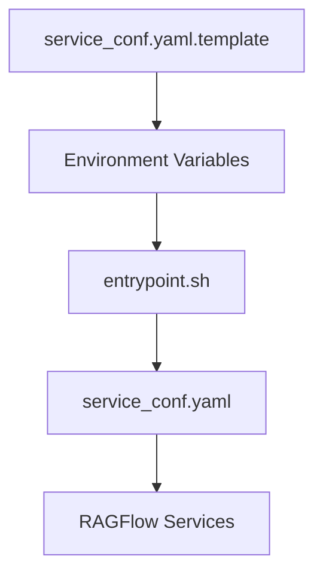
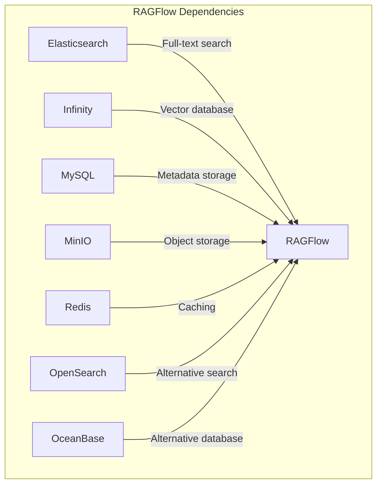
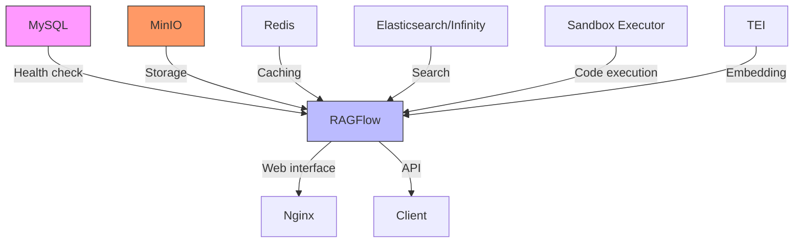

# Docker Compose Deployment

<cite>
**Referenced Files in This Document**   
- [docker-compose.yml](file://docker/docker-compose.yml)
- [docker-compose-base.yml](file://docker/docker-compose-base.yml)
- [docker-compose-macos.yml](file://docker/docker-compose-macos.yml)
- [docker-compose-CN-oc9.yml](file://docker/docker-compose-CN-oc9.yml)
- [service_conf.yaml.template](file://docker/service_conf.yaml.template)
- [.env](file://docker/.env)
- [entrypoint.sh](file://docker/entrypoint.sh)
- [init.sql](file://docker/init.sql)
- [launch_backend_service.sh](file://docker/launch_backend_service.sh)
- [nginx/ragflow.conf](file://docker/nginx/ragflow.conf)
- [nginx/ragflow.https.conf](file://docker/nginx/ragflow.https.conf)
- [infinity_conf.toml](file://docker/infinity_conf.toml)
- [README.md](file://docker/README.md)
</cite>

## Table of Contents
1. [Introduction](#introduction)
2. [Environment Preparation](#environment-preparation)
3. [Configuration Setup](#configuration-setup)
4. [Docker Compose File Variants](#docker-compose-file-variants)
5. [Service Dependencies and Startup Order](#service-dependencies-and-startup-order)
6. [Startup Commands and Network Configuration](#startup-commands-and-network-configuration)
7. [Volume Mounting and Persistent Storage](#volume-mounting-and-persistent-storage)
8. [Common Issues and Troubleshooting](#common-issues-and-troubleshooting)
9. [Post-Deployment Verification](#post-deployment-verification)
10. [Production Deployment Best Practices](#production-deployment-best-practices)

## Introduction

RAGFlow is an open-source Retrieval-Augmented Generation (RAG) engine that combines advanced RAG capabilities with Agent functionality to create a superior context layer for Large Language Models (LLMs). This document provides comprehensive guidance for deploying RAGFlow using Docker Compose, covering all aspects from environment preparation to production deployment best practices.

The Docker Compose deployment strategy for RAGFlow consists of multiple configuration files that work together to set up the application and its dependencies. The deployment architecture includes RAGFlow itself along with essential services such as MySQL, MinIO, Redis, and optional components like Elasticsearch, Infinity, or OceanBase for document storage and retrieval.

**Section sources**
- [README.md](file://README.md#L73-L75)
- [docker/README.md](file://docker/README.md#L1-L12)

## Environment Preparation

Before deploying RAGFlow with Docker Compose, ensure your system meets the prerequisites and has the necessary tools installed.

### System Requirements
- CPU: 4 cores or more
- RAM: 16 GB or more
- Disk: 50 GB or more
- Docker: Version 24.0.0 or higher
- Docker Compose: Version v2.26.1 or higher
- gVisor: Required only if using the code executor (sandbox) feature

### Prerequisite Installation
First, verify and install Docker and Docker Compose:

```bash
# Check Docker version
docker --version

# Check Docker Compose version
docker compose version

# Install Docker if not present (Ubuntu/Debian)
sudo apt update && sudo apt install docker.io docker-compose

# Install Docker if not present (CentOS/RHEL)
sudo yum install docker docker-compose
```

### System Configuration
Ensure the system parameter `vm.max_map_count` is set to at least 262144:

```bash
# Check current value
sysctl vm.max_map_count

# Set temporary value
sudo sysctl -w vm.max_map_count=262144

# Make permanent by adding to /etc/sysctl.conf
echo "vm.max_map_count=262144" | sudo tee -a /etc/sysctl.conf
```

### Repository Setup
Clone the RAGFlow repository and navigate to the docker directory:

```bash
git clone https://github.com/infiniflow/ragflow.git
cd ragflow/docker
```

**Section sources**
- [README.md](file://README.md#L144-L180)
- [docker/README.md](file://docker/README.md#L25-L49)

## Configuration Setup

Proper configuration is essential for a successful RAGFlow deployment. This section covers the key configuration files and their parameters.

### Environment Variables (.env file)
The `.env` file contains critical environment variables for Docker. Key parameters include:

- **RAGFLOW_IMAGE**: Docker image edition (default: `infiniflow/ragflow:v0.22.1`)
- **SVR_HTTP_PORT**: HTTP API service port (default: `9380`)
- **SVR_WEB_HTTP_PORT**: Web interface HTTP port (default: `80`)
- **SVR_WEB_HTTPS_PORT**: Web interface HTTPS port (default: `443`)
- **MYSQL_PASSWORD**: MySQL database password
- **MYSQL_PORT**: MySQL service port (default: `5455`)
- **MINIO_USER**: MinIO username
- **MINIO_PASSWORD**: MinIO password
- **MINIO_PORT**: MinIO API port (default: `9000`)
- **MINIO_CONSOLE_PORT**: MinIO console port (default: `9001`)
- **REDIS_PASSWORD**: Redis password
- **REDIS_PORT**: Redis service port (default: `6379`)
- **ES_PORT**: Elasticsearch service port (default: `1200`)
- **KIBANA_PORT**: Kibana service port (default: `6601`)
- **MEM_LIMIT**: Memory limit for containers (default: `8073741824` bytes)
- **TZ**: Timezone (default: `Asia/Shanghai`)

### Service Configuration (service_conf.yaml.template)
The `service_conf.yaml.template` file defines system-level configuration for RAGFlow services. During startup, environment variables are substituted to create the final `service_conf.yaml` configuration.

Key configuration sections include:

- **ragflow**: API server host and port
- **mysql**: Database connection parameters
- **minio**: Object storage configuration
- **es**: Elasticsearch connection settings
- **os**: OpenSearch connection settings
- **infinity**: Infinity vector database configuration
- **oceanbase**: OceanBase database configuration
- **redis**: Redis cache configuration
- **user_default_llm**: Default LLM provider settings

The entrypoint.sh script processes this template file, replacing environment variables with their values to generate the runtime configuration.



**Diagram sources**
- [service_conf.yaml.template](file://docker/service_conf.yaml.template#L1-L154)
- [entrypoint.sh](file://docker/entrypoint.sh#L154-L162)

**Section sources**
- [service_conf.yaml.template](file://docker/service_conf.yaml.template#L1-L154)
- [entrypoint.sh](file://docker/entrypoint.sh#L154-L162)
- [docker/README.md](file://docker/README.md#L121-L196)

## Docker Compose File Variants

RAGFlow provides multiple Docker Compose configuration files for different deployment scenarios. Understanding these variants is crucial for selecting the appropriate configuration.

### Base Configuration (docker-compose-base.yml)
The base configuration sets up all RAGFlow dependencies:



**Diagram sources**
- [docker-compose-base.yml](file://docker/docker-compose-base.yml#L1-L300)

This file defines services for:
- Elasticsearch (profile: elasticsearch)
- OpenSearch (profile: opensearch)
- Infinity (profile: infinity)
- OceanBase (profile: oceanbase)
- MySQL (required)
- MinIO (required)
- Redis (required)
- TEI (Text Embedding Inference) services
- Kibana (profile: kibana)

### Main Configuration (docker-compose.yml)
The main configuration extends the base configuration and adds the RAGFlow service:

```yaml
include:
  - ./docker-compose-base.yml

services:
  ragflow-cpu:
    depends_on:
      mysql:
        condition: service_healthy
    profiles:
      - cpu
    image: ${RAGFLOW_IMAGE}
    ports:
      - ${SVR_WEB_HTTP_PORT}:80
      - ${SVR_WEB_HTTPS_PORT}:443
      - ${SVR_HTTP_PORT}:9380
      - ${ADMIN_SVR_HTTP_PORT}:9381
      - ${SVR_MCP_PORT}:9382
    volumes:
      - ./ragflow-logs:/ragflow/logs
      - ./nginx/ragflow.conf:/etc/nginx/conf.d/ragflow.conf
      - ./nginx/proxy.conf:/etc/nginx/proxy.conf
      - ./nginx/nginx.conf:/etc/nginx/nginx.conf
      - ../history_data_agent:/ragflow/history_data_agent
      - ./service_conf.yaml.template:/ragflow/conf/service_conf.yaml.template
      - ./entrypoint.sh:/ragflow/entrypoint.sh
    env_file: .env
    networks:
      - ragflow
    restart: on-failure
```

This configuration supports both CPU and GPU deployments through profiles and includes optional MCP server and Admin server configurations.

### macOS Configuration (docker-compose-macos.yml)
For macOS users, a specialized configuration is provided:

```yaml
include:
  - ./docker-compose-base.yml

services:
  ragflow:
    platform: linux/amd64
    depends_on:
      mysql:
        condition: service_healthy
    build:
      context: ../
      dockerfile: Dockerfile
    ports:
      - ${SVR_HTTP_PORT}:9380
      - 80:80
      - 443:443
    volumes:
      - ./ragflow-logs:/ragflow/logs
      - ./nginx/ragflow.conf:/etc/nginx/conf.d/ragflow.conf
      - ./nginx/proxy.conf:/etc/nginx/proxy.conf
      - ./nginx/nginx.conf:/etc/nginx/nginx.conf
    env_file: .env
    networks:
      - ragflow
    restart: on-failure
    extra_hosts:
      - "host.docker.internal:host-gateway"
```

Key differences for macOS:
- Platform specification for Linux AMD64
- Build directive to create image from local context
- Extra host configuration for Docker Desktop

### China/OC9 Configuration (docker-compose-CN-oc9.yml)
A community-maintained configuration for specific deployment scenarios:

```yaml
include:
  - ./docker-compose-base.yml

services:
  ragflow-cpu:
    depends_on:
      mysql:
        condition: service_healthy
    profiles:
      - cpu
    image: edwardelric233/ragflow:oc9
    ports:
      - ${SVR_HTTP_PORT}:9380
      - 80:80
      - 443:443
    volumes:
      - ./ragflow-logs:/ragflow/logs
      - ./nginx/ragflow.conf:/etc/nginx/conf.d/ragflow.conf
      - ./nginx/proxy.conf:/etc/nginx/proxy.conf
      - ./nginx/nginx.conf:/etc/nginx/nginx.conf
    env_file: .env
    networks:
      - ragflow
    restart: on-failure
    extra_hosts:
      - "host.docker.internal:host-gateway"
```

Note: This configuration is not actively maintained by the RAGFlow team and should be used at your own risk.

**Section sources**
- [docker-compose.yml](file://docker/docker-compose.yml#L1-L135)
- [docker-compose-base.yml](file://docker/docker-compose-base.yml#L1-L300)
- [docker-compose-macos.yml](file://docker/docker-compose-macos.yml#L1-L47)
- [docker-compose-CN-oc9.yml](file://docker/docker-compose-CN-oc9.yml#L1-L63)
- [docker/README.md](file://docker/README.md#L15-L21)

## Service Dependencies and Startup Order

Understanding the service dependencies and startup order is critical for a successful deployment.

### Dependency Graph


**Diagram sources**
- [docker-compose.yml](file://docker/docker-compose.yml#L6-L8)
- [docker-compose-base.yml](file://docker/docker-compose-base.yml#L152-L178)

### Startup Sequence
The services start in the following order:

1. **Database Services**: MySQL, OceanBase
2. **Storage Services**: MinIO
3. **Cache Services**: Redis
4. **Search Services**: Elasticsearch, OpenSearch, Infinity
5. **Application Services**: RAGFlow (CPU/GPU)
6. **Management Services**: Kibana, Admin server (optional)
7. **Integration Services**: MCP server (optional), Sandbox executor

### Health Checks
Each service includes health checks to ensure proper startup:

- **MySQL**: `mysqladmin ping` command
- **Elasticsearch**: HTTP curl to port 9200
- **OpenSearch**: HTTP curl to port 9201
- **Infinity**: HTTP curl to admin endpoint
- **MinIO**: HTTP curl to health endpoint
- **Redis**: Redis CLI ping command
- **RAGFlow**: Depends on MySQL health

The RAGFlow service specifically waits for MySQL to be healthy before starting, as defined in the `depends_on` condition.

**Section sources**
- [docker-compose-base.yml](file://docker/docker-compose-base.yml#L173-L177)
- [docker-compose.yml](file://docker/docker-compose.yml#L6-L8)
- [docker-compose-base.yml](file://docker/docker-compose-base.yml#L27-L31)

## Startup Commands and Network Configuration

This section provides practical examples of startup commands and network configuration for RAGFlow deployment.

### Basic Startup Commands
Start all services defined in docker-compose.yml:

```bash
# Start all services in detached mode
docker compose -f docker-compose.yml up -d

# Start specific profile (e.g., CPU only)
docker compose -f docker-compose.yml --profile cpu up -d

# Start with GPU support
docker compose -f docker-compose.yml --profile gpu up -d

# Stop all services
docker compose -f docker-compose.yml down

# Stop and remove containers, networks, volumes
docker compose -f docker-compose.yml down -v
```

### Network Configuration
The Docker Compose configuration creates a custom bridge network named "ragflow":

```yaml
networks:
  ragflow:
    driver: bridge
```

Key network settings:
- All services connect to the same bridge network
- Internal service communication uses service names as hostnames
- External access through port mappings defined in each service
- Extra hosts configuration for Docker Desktop environments

### Advanced Startup Scenarios
Start RAGFlow with specific configurations:

```bash
# Start with MCP server enabled
docker compose -f docker-compose.yml up -d --command \
  "--enable-mcpserver --mcp-host=0.0.0.0 --mcp-port=9382"

# Start with Admin server enabled
docker compose -f docker-compose.yml up -d --command \
  "--enable-adminserver"

# Start with custom environment variables
RAGFLOW_IMAGE=infiniflow/ragflow:nightly \
SVR_HTTP_PORT=9380 \
docker compose -f docker-compose.yml up -d
```

### macOS Specific Commands
For macOS deployments:

```bash
# Build and start with macOS configuration
docker compose -f docker-compose-macos.yml up -d

# Rebuild image if needed
docker compose -f docker-compose-macos.yml up -d --build
```

**Section sources**
- [docker-compose.yml](file://docker/docker-compose.yml#L31-L36)
- [docker-compose-base.yml](file://docker/docker-compose-base.yml#L297-L300)
- [docker-compose-macos.yml](file://docker/docker-compose-macos.yml#L4-L29)

## Volume Mounting and Persistent Storage

Proper volume configuration ensures data persistence and proper service operation.

### Volume Configuration
The Docker Compose files define several volumes for persistent storage:

```yaml
volumes:
  esdata01:
    driver: local
  osdata01:
    driver: local
  infinity_data:
    driver: local
  mysql_data:
    driver: local
  minio_data:
    driver: local
  redis_data:
    driver: local
  kibana_data:
    driver: local
```

### Key Volume Mounts
The following volumes are mounted to ensure data persistence and configuration:

- **./ragflow-logs:/ragflow/logs**: Application logs
- **./nginx/ragflow.conf:/etc/nginx/conf.d/ragflow.conf**: Nginx configuration
- **./nginx/proxy.conf:/etc/nginx/proxy.conf**: Nginx proxy settings
- **./nginx/nginx.conf:/etc/nginx/nginx.conf**: Main Nginx configuration
- **../history_data_agent:/ragflow/history_data_agent**: Agent history data
- **./service_conf.yaml.template:/ragflow/conf/service_conf.yaml.template**: Service configuration template
- **./entrypoint.sh:/ragflow/entrypoint.sh**: Startup script
- **./init.sql:/data/application/init.sql**: Database initialization script

### Data Persistence Strategy
The volume configuration ensures that critical data persists across container restarts:

- **Database data**: MySQL data stored in mysql_data volume
- **Object storage**: MinIO data stored in minio_data volume
- **Search indexes**: Elasticsearch/OpenSearch/Infinity data in dedicated volumes
- **Application logs**: RAGFlow logs in local ragflow-logs directory
- **Configuration**: Service configuration template mounted from host

This approach allows for container recreation without data loss, supporting maintenance and updates.

**Section sources**
- [docker-compose.yml](file://docker/docker-compose.yml#L38-L43)
- [docker-compose-base.yml](file://docker/docker-compose-base.yml#L277-L295)

## Common Issues and Troubleshooting

This section addresses common deployment issues and provides troubleshooting guidance.

### Port Conflicts
Common port conflicts and solutions:

| Service | Default Port | Alternative Port | Resolution |
|--------|-------------|-----------------|-----------|
| MySQL | 3306 | 5455 | Change MYSQL_PORT in .env |
| MinIO | 9000 | 9000 | Change MINIO_PORT in .env |
| Redis | 6379 | 6379 | Change REDIS_PORT in .env |
| Elasticsearch | 9200 | 1200 | Change ES_PORT in .env |
| Web HTTP | 80 | Custom | Change SVR_WEB_HTTP_PORT in .env |
| Web HTTPS | 443 | Custom | Change SVR_WEB_HTTPS_PORT in .env |

To check for port conflicts:
```bash
# Check if port is in use
lsof -i :80
netstat -tulpn | grep :80

# Change port in .env file
SVR_WEB_HTTP_PORT=8080
```

### Resource Limitations
Address memory and CPU constraints:

```bash
# Check current resource limits
docker system info | grep -i memory

# Adjust MEM_LIMIT in .env file
MEM_LIMIT=16106127360  # 15GB

# For GPU deployments, ensure NVIDIA Docker is installed
docker run --rm --gpus all nvidia/cuda:11.0-base nvidia-smi
```

### Container Health Checks
Monitor container health and troubleshoot issues:

```bash
# Check container status
docker compose -f docker-compose.yml ps

# View container logs
docker compose -f docker-compose.yml logs
docker compose -f docker-compose.yml logs mysql
docker compose -f docker-compose.yml logs ragflow-cpu

# Check specific container health
docker inspect <container_id> | grep -i health

# Restart unhealthy containers
docker compose -f docker-compose.yml restart mysql
```

### Common Error Scenarios
**MySQL initialization failure**:
- Ensure init.sql is properly mounted
- Verify MYSQL_PASSWORD is set in .env
- Check mysql_data volume permissions

**Nginx configuration errors**:
- Verify ragflow.conf is properly mounted
- Check for syntax errors in Nginx configuration
- Ensure web content is available at /ragflow/web/dist

**Service startup dependencies**:
- Ensure MySQL is healthy before RAGFlow starts
- Verify network connectivity between services
- Check DNS resolution within the Docker network

**Section sources**
- [docker-compose.yml](file://docker/docker-compose.yml#L32-L36)
- [docker-compose-base.yml](file://docker/docker-compose-base.yml#L173-L177)
- [init.sql](file://docker/init.sql#L1-L2)
- [nginx/ragflow.conf](file://docker/nginx/ragflow.conf#L1-L35)

## Post-Deployment Verification

After deployment, verify that all services are functioning correctly.

### Accessing the Web Interface
Once services are running, access the RAGFlow web interface:

```bash
# Verify services are running
docker compose -f docker-compose.yml ps

# Check if ports are listening
curl -I http://localhost:80
curl -I http://localhost:9380/health

# Access web interface
# Open browser to http://localhost
# Or use custom port: http://localhost:<SVR_WEB_HTTP_PORT>
```

### Testing API Connectivity
Verify API functionality with basic health checks:

```bash
# Test API health endpoint
curl -X GET http://localhost:9380/health

# Expected response
{"status":"ok","version":"x.x.x"}

# Test authentication endpoint
curl -X GET http://localhost:9380/v1/user/account

# Should return 401 Unauthorized (expected for unauthenticated request)
```

### Service Status Verification
Check the status of individual services:

```bash
# MySQL connectivity
docker exec <mysql_container> mysql -u root -p${MYSQL_PASSWORD} -e "SHOW DATABASES;"

# MinIO connectivity
curl http://localhost:9000/minio/health/live

# Redis connectivity
docker exec <redis_container> redis-cli -a ${REDIS_PASSWORD} ping

# Elasticsearch connectivity
curl http://localhost:9200
```

### Log Analysis
Monitor logs for any errors or warnings:

```bash
# Follow logs in real-time
docker compose -f docker-compose.yml logs -f

# Check specific service logs
docker compose -f docker-compose.yml logs ragflow-cpu
docker compose -f docker-compose.yml logs mysql

# Check for error patterns
docker compose -f docker-compose.yml logs | grep -i error
docker compose -f docker-compose.yml logs | grep -i exception
```

**Section sources**
- [docker-compose.yml](file://docker/docker-compose.yml#L31-L35)
- [nginx/ragflow.conf](file://docker/nginx/ragflow.conf#L1-L35)
- [entrypoint.sh](file://docker/entrypoint.sh#L244-L253)

## Production Deployment Best Practices

For production deployments, follow these best practices to ensure reliability, security, and performance.

### Resource Allocation
Optimize resource allocation based on workload:

```bash
# In .env file
MEM_LIMIT=16106127360  # 15GB RAM
MYSQL_PORT=3306        # Standard MySQL port
SVR_HTTP_PORT=9380     # Standard RAGFlow API port

# For high-traffic deployments, consider:
# - Increasing MySQL connection limits
# - Scaling Redis memory allocation
# - Adding multiple RAGFlow instances behind a load balancer
```

### Persistent Storage
Ensure data persistence and backup strategies:

```bash
# Regular backups of critical volumes
docker run --rm -v mysql_data:/volume -v /host/backup:/backup alpine tar czf /backup/mysql-backup.tar.gz -C /volume .

# Backup strategy:
# 1. Daily backups of MySQL data
# 2. Weekly backups of MinIO object storage
# 3. Regular backups of configuration files
```

### Security Considerations
Implement security best practices:

```bash
# In .env file, use strong passwords
MYSQL_PASSWORD=generate_strong_password_here
MINIO_PASSWORD=generate_strong_password_here
REDIS_PASSWORD=generate_strong_password_here
ELASTIC_PASSWORD=generate_strong_password_here

# HTTPS Configuration
# 1. Obtain SSL certificates (Let's Encrypt or commercial)
# 2. Update docker-compose.yml with certificate volumes
# 3. Use ragflow.https.conf for Nginx configuration

# Environment hardening:
# - Restrict access to management ports
# - Implement firewall rules
# - Regular security updates
# - Monitoring and alerting
```

### Monitoring and Maintenance
Set up monitoring for production environments:

```bash
# Enable Kibana for Elasticsearch monitoring
# Add to docker-compose.yml
#   - kibana
#   - kibana_data volume

# Regular maintenance tasks:
# - Monitor disk space usage
# - Check container resource utilization
# - Update to stable RAGFlow versions
# - Regular security patching
# - Log rotation and retention
```

### High Availability Considerations
For mission-critical deployments:

- Consider multi-node Docker Swarm or Kubernetes deployment
- Implement load balancing for web and API endpoints
- Set up database replication for MySQL
- Use external object storage (S3, etc.) instead of MinIO
- Implement automated failover and disaster recovery

**Section sources**
- [.env](file://docker/.env)
- [docker-compose.yml](file://docker/docker-compose.yml)
- [docker/README.md](file://docker/README.md#L200-L269)
- [nginx/ragflow.https.conf](file://docker/nginx/ragflow.https.conf#L1-L47)