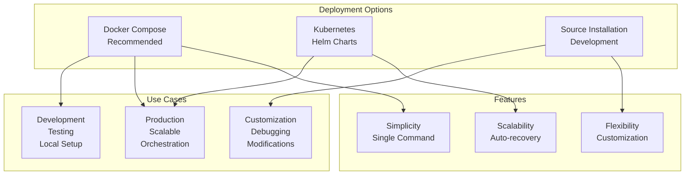
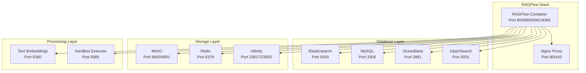
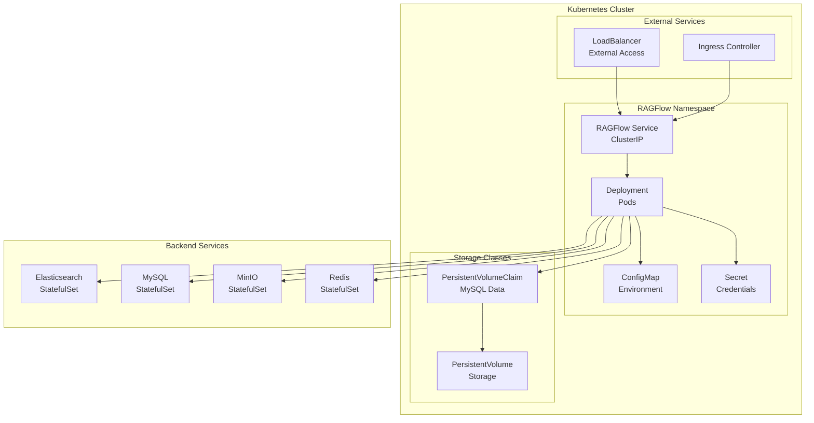
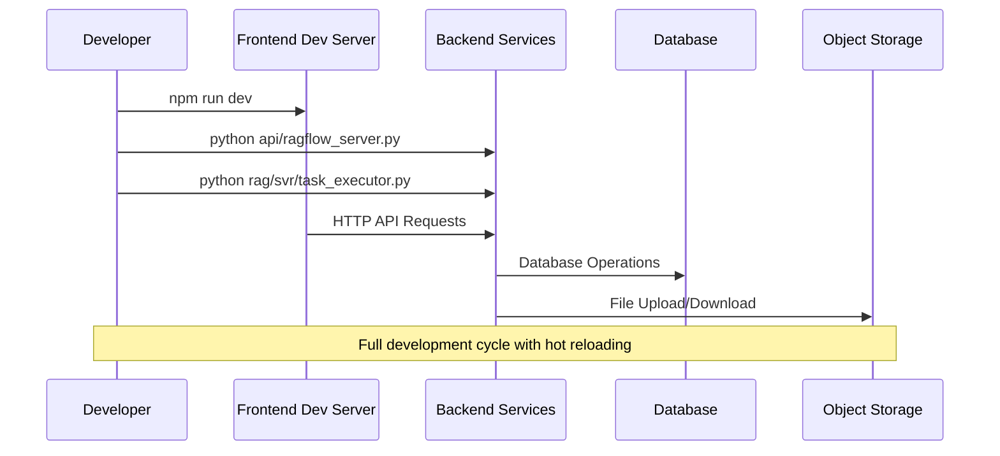
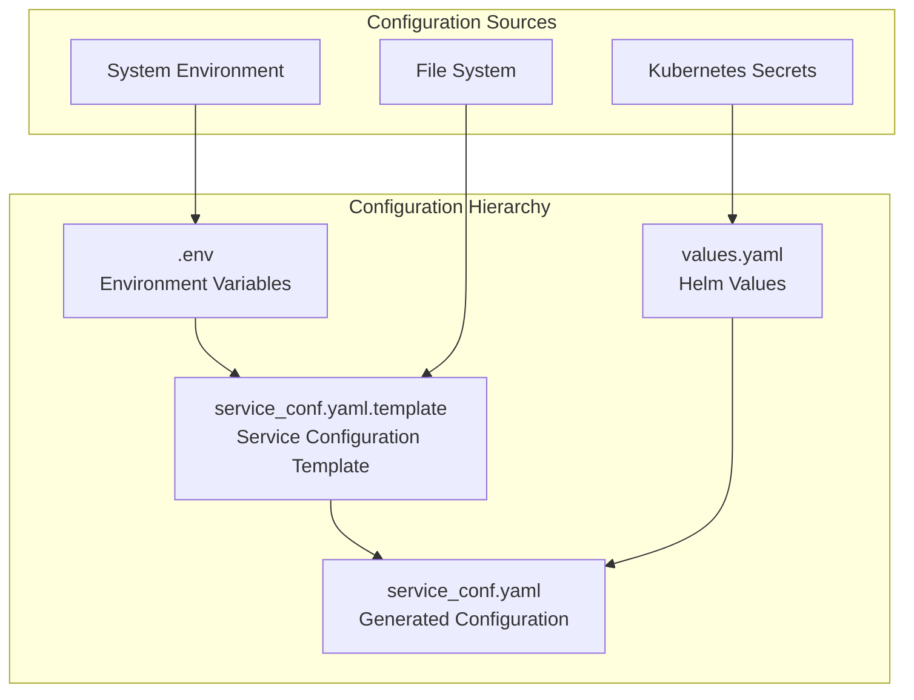
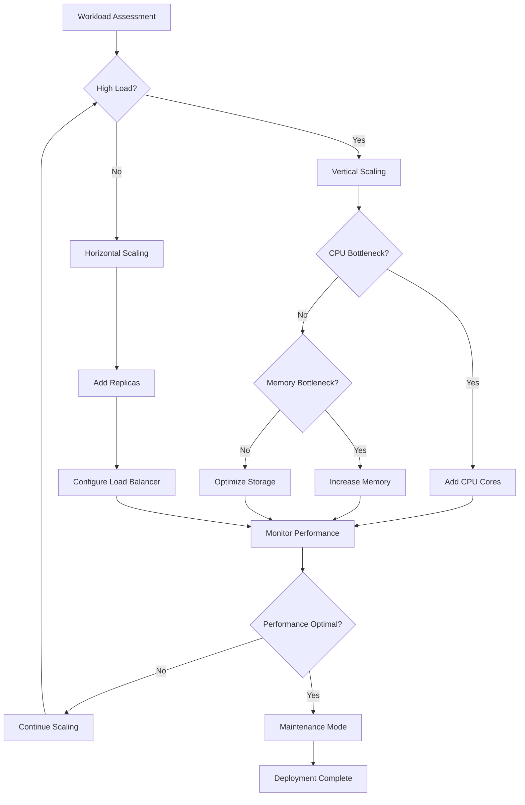

# Installation & Deployment

<cite>
**Referenced Files in This Document**
- [docker/docker-compose.yml](file://docker/docker-compose.yml)
- [docker/docker-compose-base.yml](file://docker/docker-compose-base.yml)
- [docker/service_conf.yaml.template](file://docker/service_conf.yaml.template)
- [docker/.env](file://docker/.env)
- [docker/entrypoint.sh](file://docker/entrypoint.sh)
- [docker/launch_backend_service.sh](file://docker/launch_backend_service.sh)
- [helm/values.yaml](file://helm/values.yaml)
- [helm/templates/ragflow.yaml](file://helm/templates/ragflow.yaml)
- [helm/Chart.yaml](file://helm/Chart.yaml)
- [conf/service_conf.yaml](file://conf/service_conf.yaml)
- [README.md](file://README.md)
- [docs/quickstart.mdx](file://docs/quickstart.mdx)
- [docs/configurations.md](file://docs/configurations.md)
- [docs/develop/launch_ragflow_from_source.md](file://docs/develop/launch_ragflow_from_source.md)
- [docker/README.md](file://docker/README.md)
</cite>

## Table of Contents
1. [Introduction](#introduction)
2. [Prerequisites](#prerequisites)
3. [Deployment Options Overview](#deployment-options-overview)
4. [Recommended Docker Compose Deployment](#recommended-docker-compose-deployment)
5. [Kubernetes Deployment with Helm](#kubernetes-deployment-with-helm)
6. [Source Code Deployment](#source-code-deployment)
7. [Environment Configuration](#environment-configuration)
8. [Post-Deployment Verification](#post-deployment-verification)
9. [Scaling Considerations](#scaling-considerations)
10. [Common Issues and Solutions](#common-issues-and-solutions)
11. [Production Deployment Best Practices](#production-deployment-best-practices)

## Introduction

RAGFlow offers multiple deployment options to suit different environments and requirements. Whether you're setting up a development environment, deploying to production, or integrating with Kubernetes, RAGFlow provides flexible deployment solutions with comprehensive configuration options.

This guide covers the three primary deployment methods:
- **Docker Compose**: Recommended for most users, providing simplicity and reliability
- **Kubernetes (Helm)**: Ideal for production environments requiring scalability and orchestration
- **Source Installation**: For development and customization scenarios

## Prerequisites

Before deploying RAGFlow, ensure your environment meets the following requirements:

### System Requirements
- **CPU**: Minimum 4 cores (x86 architecture)
- **RAM**: Minimum 16 GB
- **Storage**: Minimum 50 GB free space
- **Network**: Ports 80 (HTTP), 443 (HTTPS), and 9380-9382 (RAGFlow services)

### Software Dependencies
- **Docker**: Version 24.0.0 or higher
- **Docker Compose**: Version v2.26.1 or higher
- **Git**: For cloning the repository
- **gVisor**: Required only for sandbox/code executor features

### Platform Support
- **x86 Platforms**: Officially supported (primary deployment target)
- **ARM64 Platforms**: Experimental support - requires custom Docker image building
- **Operating Systems**: Linux, macOS, Windows (with Docker Desktop)

**Section sources**
- [README.md](file://README.md#L144-L155)
- [docs/quickstart.mdx](file://docs/quickstart.mdx#L26-L36)

## Deployment Options Overview

RAGFlow provides three main deployment approaches, each suited for different use cases:



### Deployment Method Comparison

| Feature | Docker Compose | Kubernetes | Source Installation |
|---------|----------------|------------|-------------------|
| **Ease of Use** | ✅ Very Easy | ⚠️ Moderate | ❌ Advanced |
| **Scalability** | ✅ Good | ✅ Excellent | ⚠️ Limited |
| **Resource Management** | ✅ Basic | ✅ Advanced | ⚠️ Manual |
| **Production Ready** | ✅ Yes | ✅ Yes | ⚠️ No |
| **Customization** | ⚠️ Limited | ⚠️ Limited | ✅ Excellent |
| **Maintenance** | ✅ Low | ⚠️ Medium | ❌ High |

## Recommended Docker Compose Deployment

Docker Compose is the recommended deployment method for most users due to its simplicity and reliability. This approach provides a complete RAGFlow stack with minimal configuration.

### Step 1: System Preparation

Ensure your system meets the requirements and prepare the environment:

```bash
# Check vm.max_map_count requirement
sysctl vm.max_map_count

# Set required value (Linux)
sudo sysctl -w vm.max_map_count=262144

# Make permanent (add to /etc/sysctl.conf)
echo "vm.max_map_count=262144" | sudo tee -a /etc/sysctl.conf
```

### Step 2: Clone and Prepare Repository

```bash
# Clone the repository
git clone https://github.com/infiniflow/ragflow.git
cd ragflow/docker

# Checkout specific version (recommended)
git checkout v0.22.1
```

### Step 3: Configure Environment Variables

Edit the `.env` file to customize your deployment:

```bash
# Basic configuration
RAGFLOW_IMAGE=infiniflow/ragflow:v0.22.1
SVR_WEB_HTTP_PORT=80
SVR_HTTP_PORT=9380
MYSQL_PASSWORD=your_secure_password
MINIO_PASSWORD=your_secure_password
REDIS_PASSWORD=your_secure_password
```

### Step 4: Choose Deployment Profile

Select the appropriate deployment profile based on your requirements:

```bash
# Standard CPU deployment (default)
docker compose -f docker-compose.yml up -d

# GPU acceleration for document processing
sed -i '1i DEVICE=gpu' .env
docker compose -f docker-compose.yml up -d

# With embedding service
COMPOSE_PROFILES=${COMPOSE_PROFILES},tei-cpu
docker compose -f docker-compose.yml up -d

# With sandbox (code execution)
COMPOSE_PROFILES=${COMPOSE_PROFILES},sandbox
docker compose -f docker-compose.yml up -d
```

### Step 5: Verify Deployment

Monitor the deployment status and verify all services are running:

```bash
# Check container status
docker ps

# Monitor logs
docker logs -f docker-ragflow-cpu-1

# Expected output pattern:
#        ____   ___    ______ ______ __
#       / __ \ /   |  / ____// ____// /____  _      __
#      / /_/ // /| | / / __ / /_   / // __ \| | /| / /
#     / _, _// ___ |/ /_/ // __/  / // /_/ /| |/ |/ /
#    /_/ |_|/_/  |_|\____//_/    /_/ \____/ |__/|__/
#    * Running on all addresses (0.0.0.0)
```

### Docker Compose Architecture



**Diagram sources**
- [docker/docker-compose.yml](file://docker/docker-compose.yml#L4-L135)
- [docker/docker-compose-base.yml](file://docker/docker-compose-base.yml#L1-L300)

**Section sources**
- [docker/docker-compose.yml](file://docker/docker-compose.yml#L1-L135)
- [docker/.env](file://docker/.env#L1-L245)
- [docs/quickstart.mdx](file://docs/quickstart.mdx#L183-L242)

## Kubernetes Deployment with Helm

For production environments requiring scalability, high availability, and advanced orchestration, Kubernetes deployment using Helm charts provides enterprise-grade capabilities.

### Prerequisites for Kubernetes Deployment

- **Kubernetes Cluster**: Version 1.20 or higher
- **kubectl**: Configured to access your cluster
- **Helm**: Version 3.0 or higher
- **Persistent Volume**: For data persistence
- **Ingress Controller**: For external access

### Step 1: Install Helm Chart

```bash
# Add RAGFlow Helm repository
helm repo add ragflow https://infiniflow.github.io/ragflow-helm-charts
helm repo update

# Create namespace
kubectl create namespace ragflow

# Deploy with default values
helm install ragflow ragflow/ragflow \
  --namespace ragflow \
  --values helm/values.yaml
```

### Step 2: Customize Configuration

Create a custom values file for production deployment:

```yaml
# custom-values.yaml
env:
  MYSQL_PASSWORD: "your_production_password"
  MINIO_PASSWORD: "your_production_password"
  REDIS_PASSWORD: "your_production_password"
  ELASTIC_PASSWORD: "your_elastic_password"
  OPENSEARCH_PASSWORD: "your_opensearch_password"

ragflow:
  deployment:
    resources:
      requests:
        cpu: "4"
        memory: "16Gi"
      limits:
        cpu: "8"
        memory: "32Gi"
  
  service:
    type: LoadBalancer

elasticsearch:
  deployment:
    resources:
      requests:
        cpu: "4"
        memory: "16Gi"
      limits:
        cpu: "8"
        memory: "32Gi"

mysql:
  deployment:
    resources:
      requests:
        cpu: "2"
        memory: "4Gi"
      limits:
        cpu: "4"
        memory: "8Gi"
```

### Step 3: Deploy with Custom Configuration

```bash
helm install ragflow ragflow/ragflow \
  --namespace ragflow \
  --values custom-values.yaml
```

### Step 4: Configure Ingress

Set up ingress for external access:

```yaml
# ingress.yaml
apiVersion: networking.k8s.io/v1
kind: Ingress
metadata:
  name: ragflow-ingress
  namespace: ragflow
  annotations:
    nginx.ingress.kubernetes.io/rewrite-target: /
    nginx.ingress.kubernetes.io/ssl-redirect: "true"
spec:
  tls:
  - hosts:
    - ragflow.yourdomain.com
    secretName: ragflow-tls
  rules:
  - host: ragflow.yourdomain.com
    http:
      paths:
      - path: /
        pathType: Prefix
        backend:
          service:
            name: ragflow
            port:
              number: 80
```

### Kubernetes Architecture



**Diagram sources**
- [helm/templates/ragflow.yaml](file://helm/templates/ragflow.yaml#L1-L120)
- [helm/values.yaml](file://helm/values.yaml#L1-L235)

**Section sources**
- [helm/values.yaml](file://helm/values.yaml#L1-L235)
- [helm/templates/ragflow.yaml](file://helm/templates/ragflow.yaml#L1-L120)
- [helm/Chart.yaml](file://helm/Chart.yaml#L1-L25)

## Source Code Deployment

For development, debugging, or extensive customization scenarios, deploying from source code provides maximum flexibility and control.

### Prerequisites

- **Python 3.10**: Required for backend services
- **Node.js**: For frontend development
- **uv**: Package manager for Python dependencies
- **npm**: For frontend dependencies

### Step 1: Clone and Setup

```bash
# Clone repository
git clone https://github.com/infiniflow/ragflow.git
cd ragflow/

# Install uv package manager
pipx install uv

# Install Python dependencies
uv sync --python 3.10
uv run download_deps.py

# Install pre-commit hooks
pre-commit install
```

### Step 2: Launch Backend Services

```bash
# Start dependent services
docker compose -f docker/docker-compose-base.yml up -d

# Update /etc/hosts for local resolution
echo "127.0.0.1       es01 infinity mysql minio redis" | sudo tee -a /etc/hosts

# Launch backend services
source .venv/bin/activate
export PYTHONPATH=$(pwd)
bash docker/launch_backend_service.sh
```

### Step 3: Launch Frontend Services

```bash
# Navigate to frontend directory
cd web

# Install dependencies
npm install

# Start development server
npm run dev
```

### Development Architecture



**Diagram sources**
- [docker/launch_backend_service.sh](file://docker/launch_backend_service.sh#L1-L130)
- [docs/develop/launch_ragflow_from_source.md](file://docs/develop/launch_ragflow_from_source.md#L1-L142)

**Section sources**
- [docs/develop/launch_ragflow_from_source.md](file://docs/develop/launch_ragflow_from_source.md#L1-L142)
- [docker/launch_backend_service.sh](file://docker/launch_backend_service.sh#L1-L130)

## Environment Configuration

Proper environment configuration is crucial for successful RAGFlow deployment. The configuration system uses multiple files and environment variables to provide flexibility and security.

### Configuration Files Overview



### Environment Variables (.env)

The `.env` file contains all essential environment variables for Docker deployment:

#### Core Service Configuration
```bash
# RAGFlow Core
RAGFLOW_IMAGE=infiniflow/ragflow:v0.22.1
SVR_WEB_HTTP_PORT=80
SVR_HTTP_PORT=9380
ADMIN_SVR_HTTP_PORT=9381
SVR_MCP_PORT=9382

# Database Configuration
MYSQL_PASSWORD=your_secure_password
MYSQL_DBNAME=rag_flow
MYSQL_PORT=5455

# Object Storage
MINIO_USER=rag_flow
MINIO_PASSWORD=your_secure_password
MINIO_PORT=9000

# Search Engine
DOC_ENGINE=elasticsearch  # or infinity, opensearch, oceanbase
ES_PORT=1200
ELASTIC_PASSWORD=your_elastic_password
```

#### Resource Management
```bash
# Memory and Performance
MEM_LIMIT=8073741824  # 8GB
DOC_BULK_SIZE=4
EMBEDDING_BATCH_SIZE=16

# Timezone
TZ=Asia/Shanghai

# File Upload Limits
MAX_CONTENT_LENGTH=134217728  # 128MB
```

#### Optional Features
```bash
# Embedding Service
TEI_MODEL=Qwen/Qwen3-Embedding-0.6B
TEI_PORT=6380

# Sandbox (Code Execution)
SANDBOX_ENABLED=1
SANDBOX_MAX_MEMORY=256m
SANDBOX_TIMEOUT=10s

# User Registration
REGISTER_ENABLED=1
```

### Service Configuration (service_conf.yaml)

The service configuration defines how RAGFlow connects to and communicates with its dependencies:

#### Basic Configuration
```yaml
ragflow:
  host: 0.0.0.0
  http_port: 9380

admin:
  host: 0.0.0.0
  http_port: 9381
```

#### Database Connections
```yaml
mysql:
  name: 'rag_flow'
  user: 'root'
  password: 'infini_rag_flow'
  host: 'mysql'
  port: 3306
  max_connections: 900
  stale_timeout: 300
  max_allowed_packet: 1073741824

minio:
  user: 'rag_flow'
  password: 'infini_rag_flow'
  host: 'minio:9000'
```

#### Search Engine Configuration
```yaml
# Elasticsearch
es:
  hosts: 'http://es01:9200'
  username: 'elastic'
  password: 'infini_rag_flow'

# Infinity
infinity:
  uri: 'infinity:23817'
  db_name: 'default_db'

# OpenSearch
os:
  hosts: 'http://opensearch01:9201'
  username: 'admin'
  password: 'infini_rag_flow_OS_01'
```

### Production Configuration Checklist

| Component | Development | Staging | Production |
|-----------|-------------|---------|------------|
| **Database** | Local MySQL | Remote MySQL | Managed RDS |
| **Object Storage** | Local MinIO | Cloud Storage | CDN + Storage |
| **Search Engine** | Local ES | Remote ES | Managed Search |
| **SSL/TLS** | Disabled | Self-signed | Let's Encrypt |
| **Authentication** | Disabled | Basic Auth | OAuth2/SAML |
| **Monitoring** | None | Basic Logs | Full Monitoring |
| **Backup** | None | Daily Backup | Automated Backup |

**Section sources**
- [docker/.env](file://docker/.env#L1-L245)
- [docker/service_conf.yaml.template](file://docker/service_conf.yaml.template#L1-L154)
- [conf/service_conf.yaml](file://conf/service_conf.yaml#L1-L151)

## Post-Deployment Verification

After deployment, thorough verification ensures RAGFlow is functioning correctly and all components are communicating properly.

### Health Check Procedures

#### 1. Container Status Verification

```bash
# Docker Compose
docker ps --format "table {{.Names}}\t{{.Status}}\t{{.Ports}}"

# Kubernetes
kubectl get pods -n ragflow
kubectl get services -n ragflow
kubectl get deployments -n ragflow
```

#### 2. Service Connectivity Tests

```bash
# Test RAGFlow API
curl -X POST http://localhost:9380/v1/health \
  -H "Content-Type: application/json" \
  -d '{"key": "value"}'

# Test Database connectivity
docker exec -it docker-mysql-1 mysql -uroot -p \
  -e "SELECT 1;"

# Test Object Storage
curl -X PUT http://localhost:9000/health \
  -H "Authorization: Bearer YOUR_TOKEN"
```

#### 3. Log Monitoring

```bash
# Monitor RAGFlow logs
docker logs -f docker-ragflow-cpu-1

# Check for errors
docker logs docker-ragflow-cpu-1 2>&1 | grep -i error

# Monitor resource usage
docker stats docker-ragflow-cpu-1
```

### Functional Testing

#### API Endpoint Validation
```bash
# Authentication test
curl -X POST http://localhost:9380/v1/user/login \
  -H "Content-Type: application/json" \
  -d '{"email": "admin@example.com", "password": "password"}'

# Dataset creation test
curl -X POST http://localhost:9380/v1/dataset/create \
  -H "Authorization: Bearer YOUR_TOKEN" \
  -H "Content-Type: application/json" \
  -d '{"name": "test-dataset"}'
```

#### Document Processing Test
```bash
# Upload test file
curl -X POST http://localhost:9380/v1/file/upload \
  -H "Authorization: Bearer YOUR_TOKEN" \
  -F "file=@test.pdf"

# Trigger processing
curl -X POST http://localhost:9380/v1/document/process \
  -H "Authorization: Bearer YOUR_TOKEN" \
  -H "Content-Type: application/json" \
  -d '{"document_id": "DOCUMENT_ID"}'
```

### Performance Benchmarking

#### Resource Utilization Monitoring
```bash
# Memory usage
docker stats --no-stream docker-ragflow-cpu-1 | grep -E "(MEM USAGE|ragflow)"

# CPU utilization
docker stats --no-stream docker-ragflow-cpu-1 | grep -E "(CPU %|ragflow)"

# Network I/O
docker stats --no-stream docker-ragflow-cpu-1 | grep -E "(NET I/O|ragflow)"
```

#### Throughput Testing
```bash
# Concurrent API requests
ab -n 100 -c 10 http://localhost:9380/v1/health

# Load testing with Apache Bench
wrk -t12 -c400 -d30s http://localhost:9380/v1/chat/completions
```

**Section sources**
- [docker/entrypoint.sh](file://docker/entrypoint.sh#L244-L297)
- [docs/quickstart.mdx](file://docs/quickstart.mdx#L216-L242)

## Scaling Considerations

RAGFlow supports horizontal and vertical scaling depending on your workload requirements and deployment scenario.

### Horizontal Scaling

Horizontal scaling involves adding more instances of RAGFlow services to distribute load:

#### Worker Pool Configuration
```bash
# Docker Compose scaling
docker compose -f docker-compose.yml up --scale ragflow-cpu=3 -d

# Kubernetes HPA (Horizontal Pod Autoscaler)
kubectl autoscale deployment ragflow --cpu-percent=70 --min=2 --max=10
```

#### Task Executor Scaling
```bash
# Range-based worker assignment
docker compose -f docker-compose.yml up -d \
  --scale ragflow-cpu=3 \
  --scale ragflow-cpu=0-1 \
  --scale ragflow-cpu=2-3
```

### Vertical Scaling

Vertical scaling involves increasing resources allocated to existing instances:

#### Resource Allocation Matrix

| Workload Type | CPU Cores | Memory | Storage | Network |
|---------------|-----------|--------|---------|---------|
| **Small Deployment** | 4 cores | 16GB | 50GB | 1Gbps |
| **Medium Deployment** | 8 cores | 32GB | 200GB | 10Gbps |
| **Large Deployment** | 16+ cores | 64GB+ | 1TB+ | 100Gbps+ |
| **GPU Acceleration** | 8+ cores | 32GB+ | 100GB+ | 10Gbps+ |

#### Memory Optimization
```yaml
# Memory configuration for high-load scenarios
env:
  MEM_LIMIT: "16106127360"  # 15GB
  JAVA_OPTS: "-Xmx12g -Xms12g"
  PYTHONOPTIMIZE: "1"
```

### Auto-scaling Strategies

#### Kubernetes HPA Configuration
```yaml
apiVersion: autoscaling/v2
kind: HorizontalPodAutoscaler
metadata:
  name: ragflow-hpa
  namespace: ragflow
spec:
  scaleTargetRef:
    apiVersion: apps/v1
    kind: Deployment
    name: ragflow
  minReplicas: 2
  maxReplicas: 10
  metrics:
  - type: Resource
    resource:
      name: cpu
      target:
        type: Utilization
        averageUtilization: 70
  - type: Resource
    resource:
      name: memory
      target:
        type: Utilization
        averageUtilization: 80
```

#### Load Balancing Configuration
```yaml
# Load balancer for distributed traffic
apiVersion: v1
kind: Service
metadata:
  name: ragflow-lb
  annotations:
    service.beta.kubernetes.io/aws-load-balancer-type: nlb
spec:
  type: LoadBalancer
  ports:
  - port: 80
    targetPort: 80
    protocol: TCP
  selector:
    app: ragflow
```

### Scaling Decision Matrix



**Section sources**
- [docker/docker-compose.yml](file://docker/docker-compose.yml#L280-L293)
- [helm/values.yaml](file://helm/values.yaml#L85-L95)

## Common Issues and Solutions

This section addresses frequently encountered deployment issues and provides practical solutions.

### Docker Deployment Issues

#### Issue 1: vm.max_map_count Too Low
**Symptoms**: Elasticsearch/OpenSearch fails to start with memory mapping errors
**Solution**:
```bash
# Temporary fix
sudo sysctl -w vm.max_map_count=262144

# Permanent fix
echo "vm.max_map_count=262144" | sudo tee -a /etc/sysctl.conf
sudo sysctl -p
```

#### Issue 2: Port Conflicts
**Symptoms**: Containers fail to start due to port binding conflicts
**Solution**:
```bash
# Check port usage
netstat -tulpn | grep :80
netstat -tulpn | grep :9380

# Modify .env file
SVR_WEB_HTTP_PORT=8080
SVR_HTTP_PORT=9381
```

#### Issue 3: Insufficient Memory
**Symptoms**: Containers crash with OutOfMemory errors
**Solution**:
```bash
# Reduce memory limits
MEM_LIMIT=4294967296  # 4GB

# Or increase system memory
# (Hardware requirement: minimum 16GB RAM)
```

### Kubernetes Deployment Issues

#### Issue 1: Persistent Volume Claims Failed
**Symptoms**: Pods remain in Pending state
**Solution**:
```bash
# Check storage class
kubectl get storageclass

# Create persistent volume claim manually
kubectl apply -f pv-claim.yaml
```

#### Issue 2: Service Discovery Problems
**Symptoms**: RAGFlow cannot connect to database or storage
**Solution**:
```bash
# Check service endpoints
kubectl get endpoints -n ragflow

# Verify DNS resolution
kubectl exec -it POD_NAME -n ragflow -- nslookup mysql
```

### Configuration Issues

#### Issue 1: Incorrect Database Credentials
**Symptoms**: Authentication failures in logs
**Solution**:
```bash
# Verify credentials in service_conf.yaml
mysql:
  user: 'root'
  password: 'correct_password'

# Regenerate configuration
docker restart docker-ragflow-cpu-1
```

#### Issue 2: SSL/TLS Certificate Problems
**Symptoms**: HTTPS connections failing
**Solution**:
```bash
# Generate self-signed certificate
openssl req -x509 -newkey rsa:4096 -keyout key.pem -out cert.pem -days 365 -nodes

# Update Docker Compose
volumes:
  - ./cert.pem:/etc/nginx/ssl/cert.pem:ro
  - ./key.pem:/etc/nginx/ssl/key.pem:ro
```

### Performance Issues

#### Issue 1: Slow Document Processing
**Symptoms**: Long processing times for documents
**Solution**:
```bash
# Increase batch sizes
DOC_BULK_SIZE=8
EMBEDDING_BATCH_SIZE=32

# Enable GPU acceleration
DEVICE=gpu
```

#### Issue 2: High Memory Usage
**Symptoms**: Memory exhaustion during processing
**Solution**:
```bash
# Reduce concurrent workers
WS=2

# Limit document processing queue
MAX_QUEUE_SIZE=10
```

### Troubleshooting Commands

#### Comprehensive Health Check Script
```bash
#!/bin/bash
echo "=== RAGFlow Deployment Health Check ==="

# Check system requirements
echo "Checking vm.max_map_count..."
current_value=$(sysctl -n vm.max_map_count)
if [ $current_value -lt 262144 ]; then
    echo "WARNING: vm.max_map_count is too low ($current_value)"
else
    echo "✓ vm.max_map_count is adequate ($current_value)"
fi

# Check Docker containers
echo "Checking Docker containers..."
docker ps --format "table {{.Names}}\t{{.Status}}"

# Check Kubernetes pods
echo "Checking Kubernetes pods..."
kubectl get pods -n ragflow

# Check service connectivity
echo "Testing service connectivity..."
curl -f http://localhost:9380/v1/health && echo "✓ RAGFlow API accessible" || echo "✗ RAGFlow API inaccessible"

echo "=== Health Check Complete ==="
```

**Section sources**
- [docs/quickstart.mdx](file://docs/quickstart.mdx#L42-L182)
- [docker/README.md](file://docker/README.md#L200-L269)

## Production Deployment Best Practices

Deploying RAGFlow in production requires careful consideration of security, reliability, and performance factors.

### Security Hardening

#### 1. Network Security
```yaml
# Network policies for Kubernetes
apiVersion: networking.k8s.io/v1
kind: NetworkPolicy
metadata:
  name: ragflow-network-policy
  namespace: ragflow
spec:
  podSelector:
    matchLabels:
      app: ragflow
  policyTypes:
  - Ingress
  - Egress
  ingress:
  - from:
    - podSelector:
        matchLabels:
          app: frontend
    ports:
    - protocol: TCP
      port: 80
  egress:
  - to: []
    ports:
    - protocol: TCP
      port: 5432  # MySQL
    - protocol: TCP
      port: 9200  # Elasticsearch
```

#### 2. Secret Management
```bash
# Use Kubernetes secrets for sensitive data
kubectl create secret generic ragflow-secrets \
  --from-literal=mysql-password='secure_password' \
  --from-literal=minio-secret-key='secret_key' \
  --from-literal=redis-password='redis_password'

# Reference in Helm values
env:
  MYSQL_PASSWORD: "{{ .Values.env.MYSQL_PASSWORD }}"
```

#### 3. TLS/SSL Configuration
```yaml
# HTTPS ingress configuration
apiVersion: networking.k8s.io/v1
kind: Ingress
metadata:
  name: ragflow-https
  annotations:
    nginx.ingress.kubernetes.io/ssl-redirect: "true"
    nginx.ingress.kubernetes.io/backend-protocol: "HTTP"
    cert-manager.io/cluster-issuer: "letsencrypt-prod"
spec:
  tls:
  - hosts:
    - ragflow.yourdomain.com
    secretName: ragflow-tls
  rules:
  - host: ragflow.yourdomain.com
    http:
      paths:
      - path: /
        pathType: Prefix
        backend:
          service:
            name: ragflow
            port:
              number: 80
```

### Monitoring and Observability

#### 1. Logging Configuration
```yaml
# Centralized logging setup
apiVersion: v1
kind: ConfigMap
metadata:
  name: ragflow-logging
data:
  fluent-bit.conf: |
    [SERVICE]
        Flush         1
        Log_Level     info
        Daemon        off
        Parsers_File  parsers.conf
    
    [INPUT]
        Name              tail
        Path              /var/log/containers/*ragflow*.log
        Parser            docker
        Tag               ragflow.*
        Refresh_Interval  5
    
    [OUTPUT]
        Name  es
        Match ragflow.*
        Host  elasticsearch.logging.svc.cluster.local
        Index ragflow-logs
```

#### 2. Metrics Collection
```yaml
# Prometheus monitoring
apiVersion: v1
kind: ServiceMonitor
metadata:
  name: ragflow-metrics
  labels:
    app: ragflow
spec:
  selector:
    matchLabels:
      app: ragflow
  endpoints:
  - port: metrics
    path: /metrics
```

### Backup and Disaster Recovery

#### 1. Database Backup Strategy
```bash
#!/bin/bash
# Automated backup script
DATE=$(date +%Y%m%d_%H%M%S)
BACKUP_DIR="/backups/ragflow"

# MySQL backup
docker exec docker-mysql-1 mysqldump \
  -u root --password=$MYSQL_PASSWORD \
  rag_flow > $BACKUP_DIR/mysql_$DATE.sql

# MinIO backup (using mc client)
mc mirror minio/ragflow-backup $BACKUP_DIR/minio_backup_$DATE/
```

#### 2. Kubernetes Backup
```bash
# Backup RAGFlow configuration
kubectl get configmap,secret,deployment,pvc -n ragflow -o yaml > ragflow-backup-$(date +%Y%m%d).yaml

# Backup persistent volumes
velero backup create ragflow-backup --include-namespaces ragflow
```

### Performance Optimization

#### 1. Caching Strategy
```yaml
# Redis caching configuration
redis:
  deployment:
    resources:
      requests:
        cpu: "1"
        memory: "2Gi"
      limits:
        cpu: "2"
        memory: "4Gi"
  config:
    maxmemory: "1gb"
    maxmemory-policy: "allkeys-lru"
```

#### 2. CDN Integration
```yaml
# CDN configuration for static assets
apiVersion: v1
kind: ConfigMap
metadata:
  name: ragflow-cdn
data:
  nginx.conf: |
    upstream backend {
        server ragflow:80;
    }
    
    server {
        listen 80;
        server_name _;
        
        location /static/ {
            proxy_pass http://backend/static/;
            expires 1y;
            add_header Cache-Control "public";
        }
        
        location / {
            proxy_pass http://backend;
        }
    }
```

### Maintenance Procedures

#### 1. Rolling Updates
```bash
# Safe rolling update procedure
kubectl set image deployment/ragflow ragflow=infiniflow/ragflow:v0.22.2 -n ragflow
kubectl rollout status deployment/ragflow -n ragflow

# Verify before proceeding
kubectl get pods -n ragflow
```

#### 2. Blue-Green Deployment
```bash
# Deploy new version in separate namespace
kubectl create namespace ragflow-v2
helm install ragflow-v2 ragflow/ragflow \
  --namespace ragflow-v2 \
  --values v2-values.yaml

# Test new version
# Switch traffic to new version
kubectl patch service ragflow -p '{"spec":{"selector":{"version":"v2"}}}'
```

### Compliance and Governance

#### 1. Audit Logging
```yaml
# Audit logging configuration
apiVersion: v1
kind: ConfigMap
metadata:
  name: ragflow-audit
data:
  audit.conf: |
    AUDIT_ENABLED=true
    AUDIT_LOG_PATH=/var/log/ragflow/audit.log
    AUDIT_RETENTION_DAYS=90
    AUDIT_COMPRESS=true
```

#### 2. Access Control
```yaml
# RBAC configuration
apiVersion: rbac.authorization.k8s.io/v1
kind: Role
metadata:
  name: ragflow-admin
  namespace: ragflow
rules:
- apiGroups: [""]
  resources: ["pods", "services", "configmaps"]
  verbs: ["get", "list", "watch", "update", "patch"]
```

**Section sources**
- [helm/values.yaml](file://helm/values.yaml#L218-L235)
- [docker/.env](file://docker/.env#L200-L245)
- [docs/configurations.md](file://docs/configurations.md#L1-L241)