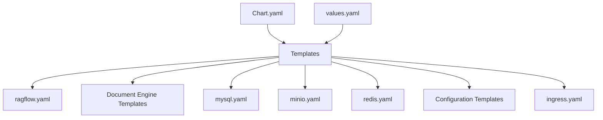
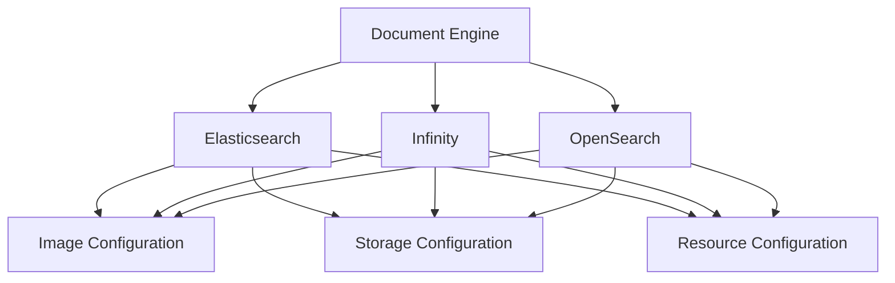
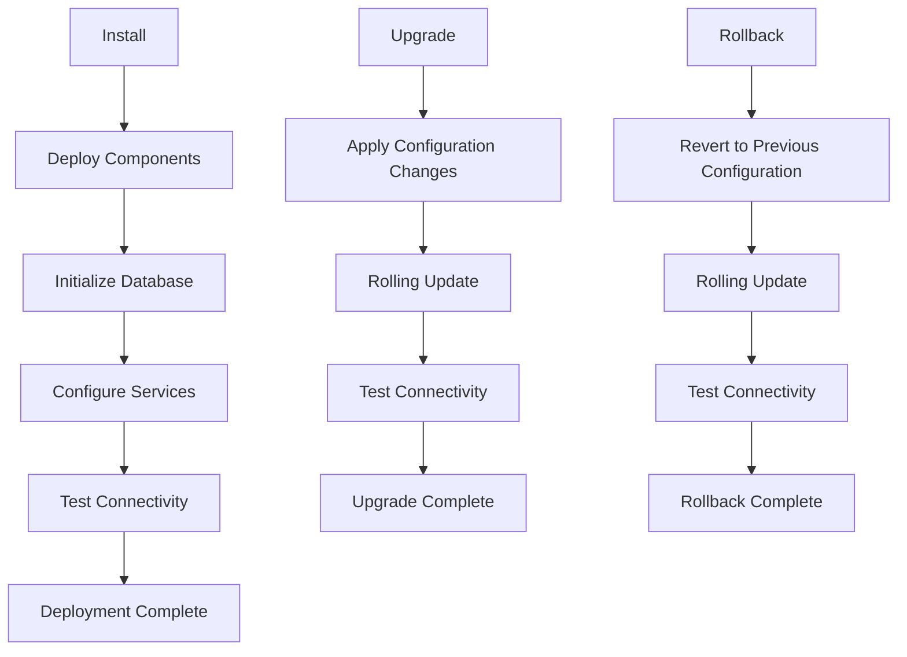
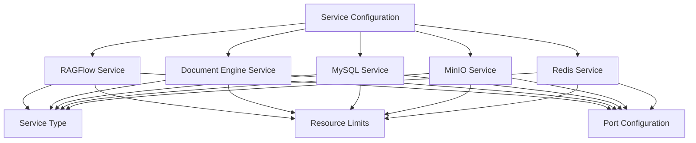
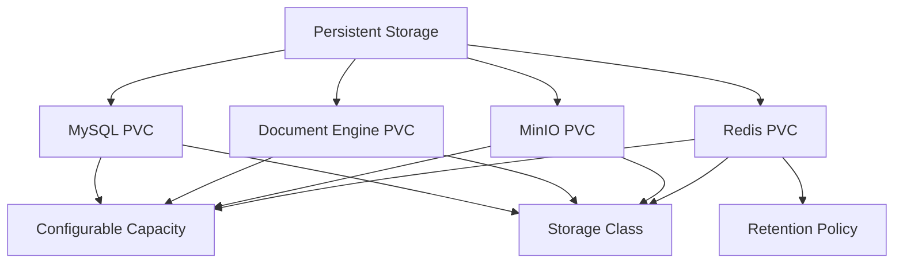

# Kubernetes & Helm Deployment

<cite>
**Referenced Files in This Document**   
- [helm/Chart.yaml](file://helm/Chart.yaml)
- [helm/values.yaml](file://helm/values.yaml)
- [helm/templates/ragflow.yaml](file://helm/templates/ragflow.yaml)
- [helm/templates/elasticsearch.yaml](file://helm/templates/elasticsearch.yaml)
- [helm/templates/mysql.yaml](file://helm/templates/mysql.yaml)
- [helm/templates/redis.yaml](file://helm/templates/redis.yaml)
- [helm/templates/env.yaml](file://helm/templates/env.yaml)
- [helm/templates/ingress.yaml](file://helm/templates/ingress.yaml)
- [helm/templates/ragflow_config.yaml](file://helm/templates/ragflow_config.yaml)
- [helm/templates/infinity.yaml](file://helm/templates/infinity.yaml)
- [helm/templates/minio.yaml](file://helm/templates/minio.yaml)
</cite>

## Table of Contents
1. [Introduction](#introduction)
2. [Prerequisites](#prerequisites)
3. [Helm Chart Structure](#helm-chart-structure)
4. [Configuration Options](#configuration-options)
5. [Deployment Process](#deployment-process)
6. [Service Configuration](#service-configuration)
7. [Ingress Configuration](#ingress-configuration)
8. [Persistent Storage](#persistent-storage)
9. [External Database Configuration](#external-database-configuration)
10. [Monitoring and Troubleshooting](#monitoring-and-troubleshooting)
11. [Production Best Practices](#production-best-practices)

## Introduction
This document provides comprehensive guidance for deploying RAGFlow on Kubernetes using the provided Helm chart. RAGFlow is a Retrieval-Augmented Generation (RAG) framework that enables building AI-powered applications with document retrieval capabilities. The Helm chart simplifies deployment by packaging all necessary components and configurations into a single, reusable unit that can be easily customized for different environments.

The Helm chart deploys RAGFlow with all its dependencies, including a document engine (Elasticsearch, Infinity, or OpenSearch), MySQL for data storage, MinIO for object storage, and Redis for caching. The deployment is designed to be highly configurable, allowing users to customize resource allocations, storage settings, and service configurations according to their specific requirements.

**Section sources**
- [helm/Chart.yaml](file://helm/Chart.yaml#L1-L25)
- [helm/values.yaml](file://helm/values.yaml#L1-L235)

## Prerequisites
Before deploying RAGFlow using the Helm chart, ensure that the following prerequisites are met:

1. **Kubernetes Cluster**: A functioning Kubernetes cluster with version 1.19 or higher. The cluster should have sufficient resources to accommodate the RAGFlow deployment and its dependencies.

2. **Helm**: Helm 3.8.0 or later installed on the client machine. Helm is the package manager for Kubernetes that allows for easy installation and management of applications.

3. **kubectl**: The Kubernetes command-line tool installed and configured to connect to the target cluster.

4. **Storage Provisioner**: A storage provisioner configured in the Kubernetes cluster to dynamically provision PersistentVolumeClaims (PVCs) for the various components.

5. **Network Policies**: Appropriate network policies in place to allow communication between the RAGFlow components and external clients.

6. **Image Registry Access**: If using private image registries, ensure that the necessary image pull secrets are configured in the Kubernetes cluster.

These prerequisites ensure that the Kubernetes environment is properly prepared for the RAGFlow deployment, minimizing potential issues during installation and operation.

**Section sources**
- [helm/values.yaml](file://helm/values.yaml#L4-L235)

## Helm Chart Structure
The RAGFlow Helm chart follows a standard structure with the following key components:

- **Chart.yaml**: Contains metadata about the chart, including its name, version, description, and type. The chart is classified as an "application" type, indicating it's a deployable collection of templates.

- **values.yaml**: The default configuration file that defines all configurable parameters for the deployment. This includes image repositories and tags, resource allocations, storage settings, and environment variables.

- **templates/**: Directory containing Kubernetes manifest templates that are rendered during deployment. The templates use Helm's templating language to inject configuration values.

- **.helmignore**: Specifies files and directories to be ignored when packaging the chart.

The chart is designed to be modular, with separate templates for each component (RAGFlow, document engine, database, object storage, cache). This modular approach allows for independent configuration and scaling of each component based on specific requirements.



**Diagram sources**
- [helm/Chart.yaml](file://helm/Chart.yaml#L1-L25)
- [helm/values.yaml](file://helm/values.yaml#L1-L235)
- [helm/.helmignore](file://helm/.helmignore#L1-L24)

## Configuration Options
The RAGFlow Helm chart provides extensive configuration options through the values.yaml file, allowing customization for different environments and requirements.

### Document Engine Configuration
The chart supports three document engines: Elasticsearch, Infinity, and OpenSearch. The engine is selected via the `env.DOC_ENGINE` parameter in values.yaml. By default, Infinity is configured as the document engine. Each engine has specific configuration options including image repository and tag, storage capacity, resource requests, and service type.



**Diagram sources**
- [helm/values.yaml](file://helm/values.yaml#L6-L14)
- [helm/templates/elasticsearch.yaml](file://helm/templates/elasticsearch.yaml#L1-L132)
- [helm/templates/infinity.yaml](file://helm/templates/infinity.yaml#L1-L123)
- [helm/templates/opensearch.yaml](file://helm/templates/opensearch.yaml#L1-L132)

### Core Service Configuration
The RAGFlow service configuration includes:

- **Image Configuration**: Repository, tag, and pull policy for the RAGFlow container image.
- **Resource Allocation**: CPU and memory requests and limits for the RAGFlow deployment.
- **Service Configuration**: Service type (ClusterIP, NodePort, LoadBalancer) for exposing the RAGFlow web interface.
- **API Service**: Optional API service configuration with separate service type.

Additional configuration options include:
- Environment variables for timezone, file size limits, and processing batch sizes
- Image pull secrets for private registries
- Custom service configuration via the `service_conf` parameter
- LLM factories configuration via the `llm_factories` parameter

These configuration options allow for fine-tuning the deployment to meet specific performance, security, and operational requirements.

**Section sources**
- [helm/values.yaml](file://helm/values.yaml#L56-L84)
- [helm/templates/ragflow.yaml](file://helm/templates/ragflow.yaml#L1-L120)

## Deployment Process
The deployment process for RAGFlow using the Helm chart involves several steps:

### Installation
To install RAGFlow, use the following Helm command:

```bash
helm install ragflow ./helm
```

This command deploys RAGFlow with the default configuration specified in values.yaml. To customize the deployment, create a custom values file and reference it during installation:

```bash
helm install ragflow ./helm -f custom-values.yaml
```

### Upgrade
To upgrade an existing deployment, use the upgrade command:

```bash
helm upgrade ragflow ./helm -f custom-values.yaml
```

This command applies configuration changes while preserving existing data and state.

### Rollback
If an upgrade causes issues, roll back to a previous version:

```bash
helm rollback ragflow <revision-number>
```

Replace `<revision-number>` with the target revision number from the deployment history.

### Uninstallation
To remove the RAGFlow deployment:

```bash
helm uninstall ragflow
```

This command removes all components deployed by the chart, including pods, services, and persistent volume claims.

The Helm chart includes a test hook that verifies connectivity after deployment, ensuring that the services are properly configured and accessible.



**Diagram sources**
- [helm/templates/ragflow.yaml](file://helm/templates/ragflow.yaml#L1-L120)
- [helm/templates/tests/test-connection.yaml](file://helm/templates/tests/test-connection.yaml#L1-L18)

## Service Configuration
The RAGFlow Helm chart provides flexible service configuration options to accommodate different deployment scenarios.

### Service Types
Each component in the deployment can be configured with different service types:

- **ClusterIP**: Exposes the service on a cluster-internal IP (default for most components)
- **NodePort**: Exposes the service on each node's IP at a static port
- **LoadBalancer**: Creates an external load balancer in supported environments
- **ExternalName**: Maps the service to a DNS name

The service type is configurable for RAGFlow, the document engine, MySQL, MinIO, and Redis through their respective configuration sections in values.yaml.

### Network Configuration
The chart automatically configures the necessary network connections between components using Kubernetes internal DNS. Environment variables are injected into containers to specify hostnames for dependent services:

- REDIS_HOST: Points to the Redis service
- MYSQL_HOST: Points to the MySQL service
- MINIO_HOST: Points to the MinIO service
- Document engine host: Points to the selected document engine service

These hostnames follow the Kubernetes DNS convention: `<service-name>.<namespace>.svc`.

### Resource Configuration
Resource limits and requests can be configured for each component to ensure optimal performance and prevent resource exhaustion. The configuration includes CPU and memory specifications for both requests (minimum guaranteed) and limits (maximum allowed).



**Diagram sources**
- [helm/values.yaml](file://helm/values.yaml#L85-L215)
- [helm/templates/ragflow.yaml](file://helm/templates/ragflow.yaml#L83-L119)
- [helm/templates/elasticsearch.yaml](file://helm/templates/elasticsearch.yaml#L115-L131)
- [helm/templates/mysql.yaml](file://helm/templates/mysql.yaml#L95-L110)
- [helm/templates/minio.yaml](file://helm/templates/minio.yaml#L85-L105)
- [helm/templates/redis.yaml](file://helm/templates/redis.yaml#L105-L119)

## Ingress Configuration
The Helm chart includes optional ingress configuration to expose RAGFlow externally through an ingress controller.

### Enabling Ingress
To enable ingress, set `ingress.enabled` to `true` in values.yaml and configure the necessary parameters:

```yaml
ingress:
  enabled: true
  className: ""
  annotations: {}
  hosts:
    - host: ragflow.example.com
      paths:
        - path: /
          pathType: ImplementationSpecific
  tls: []
```

### Annotations
Ingress annotations can be used to configure specific behaviors for the ingress controller, such as:

- SSL/TLS termination
- Load balancing algorithms
- Rate limiting
- Authentication
- Custom headers

### TLS Configuration
For secure HTTPS access, configure TLS by specifying certificate secrets:

```yaml
ingress:
  enabled: true
  tls:
    - secretName: ragflow-tls
      hosts:
        - ragflow.example.com
```

This configuration requires a TLS secret to be created in the namespace containing the certificate and private key.

The ingress configuration allows for flexible exposure of RAGFlow to external users while maintaining security and performance.

**Section sources**
- [helm/values.yaml](file://helm/values.yaml#L218-L235)
- [helm/templates/ingress.yaml](file://helm/templates/ingress.yaml#L1-L44)

## Persistent Storage
The RAGFlow Helm chart configures persistent storage for all stateful components to ensure data durability across pod restarts and upgrades.

### Storage Configuration
Each stateful component has its own PersistentVolumeClaim (PVC) with configurable storage capacity:

- **MySQL**: Stores application data and metadata
- **Document Engine**: Stores indexed documents and search data
- **MinIO**: Stores uploaded files and objects
- **Redis**: Optional persistence for cached data

The storage capacity for each component is configurable in values.yaml through the `storage.capacity` parameter. Additionally, a storage class can be specified using `storage.className` to use specific storage types (e.g., SSD, HDD) if available in the cluster.

### Data Persistence Strategy
The chart uses StatefulSets for stateful components (MySQL, document engine, MinIO, Redis) to ensure stable network identities and persistent storage. This approach provides:

- Stable pod identities (ordinal numbering)
- Persistent storage that survives pod restarts
- Ordered deployment and scaling
- Graceful shutdown and termination

For Redis, persistence is optional and can be enabled or disabled through the `persistence.enabled` parameter. When enabled, Redis data is stored on persistent volumes with configurable retention policies.



**Diagram sources**
- [helm/values.yaml](file://helm/values.yaml#L102-L207)
- [helm/templates/mysql.yaml](file://helm/templates/mysql.yaml#L1-L20)
- [helm/templates/elasticsearch.yaml](file://helm/templates/elasticsearch.yaml#L1-L20)
- [helm/templates/infinity.yaml](file://helm/templates/infinity.yaml#L1-L20)
- [helm/templates/minio.yaml](file://helm/templates/minio.yaml#L1-L20)
- [helm/templates/redis.yaml](file://helm/templates/redis.yaml#L78-L103)

## External Database Configuration
While the Helm chart includes MySQL as a dependency, it also supports configuration with external databases for production deployments.

### External Database Connection
To use an external database, modify the MySQL configuration in values.yaml:

```yaml
mysql:
  enabled: false
```

Then configure the database connection parameters in the environment variables:

```yaml
env:
  MYSQL_HOST: external-mysql.example.com
  MYSQL_PORT: 3306
  MYSQL_DBNAME: rag_flow
  MYSQL_USER: ragflow_user
  MYSQL_PASSWORD: secure_password
```

### External Object Storage
Similarly, external MinIO or S3-compatible storage can be configured:

```yaml
minio:
  enabled: false
```

With external storage configuration:

```yaml
env:
  MINIO_HOST: external-storage.example.com
  MINIO_PORT: 9000
  MINIO_ROOT_USER: storage_user
  MINIO_ROOT_PASSWORD: storage_password
  MINIO_BUCKET: ragflow-data
```

### External Cache
For Redis, external instances can be used:

```yaml
redis:
  enabled: false
```

With connection details:

```yaml
env:
  REDIS_HOST: external-redis.example.com
  REDIS_PORT: 6379
  REDIS_PASSWORD: cache_password
  REDIS_DB: 0
```

This flexibility allows organizations to leverage existing infrastructure and meet specific compliance or performance requirements.

**Section sources**
- [helm/values.yaml](file://helm/values.yaml#L180-L215)
- [helm/templates/env.yaml](file://helm/templates/env.yaml#L19-L21)

## Monitoring and Troubleshooting
Effective monitoring and troubleshooting are essential for maintaining a healthy RAGFlow deployment.

### Pod Status and Logs
Monitor pod status using kubectl:

```bash
kubectl get pods
kubectl describe pod <pod-name>
```

Access logs for troubleshooting:

```bash
kubectl logs <pod-name>
kubectl logs <pod-name> --follow
```

### Health Checks
The Helm chart includes liveness and readiness probes for critical components:

- **RAGFlow**: HTTP probes on the application endpoints
- **Document Engine**: HTTP probes on the health endpoint
- **MySQL**: TCP probes on the database port
- **Redis**: Command probes using Redis CLI

These probes ensure that unhealthy pods are automatically restarted.

### Common Issues and Solutions
**Database Connection Issues**
- Verify MySQL pod is running
- Check database credentials in the environment secret
- Ensure network connectivity between RAGFlow and MySQL pods

**Document Engine Performance**
- Verify sufficient memory allocation
- Check disk space on the persistent volume
- Monitor indexing queue length

**Storage Issues**
- Verify MinIO pod is running
- Check bucket creation and permissions
- Monitor storage capacity

**Scaling Issues**
- Adjust resource requests and limits
- Increase replica counts for stateless components
- Optimize database connection pool settings

Regular monitoring and proactive troubleshooting help maintain optimal performance and availability.

**Section sources**
- [helm/templates/ragflow.yaml](file://helm/templates/ragflow.yaml#L1-L120)
- [helm/templates/elasticsearch.yaml](file://helm/templates/elasticsearch.yaml#L79-L94)
- [helm/templates/infinity.yaml](file://helm/templates/infinity.yaml#L84-L91)

## Production Best Practices
For production deployments of RAGFlow, follow these best practices to ensure reliability, security, and performance.

### High Availability
Configure multiple replicas for stateless components:

```yaml
ragflow:
  deployment:
    replicas: 3
```

Use external, highly available databases and storage systems rather than the bundled dependencies for critical production workloads.

### Resource Management
Set appropriate resource requests and limits:

```yaml
ragflow:
  deployment:
    resources:
      requests:
        memory: "4Gi"
        cpu: "2"
      limits:
        memory: "8Gi"
        cpu: "4"
```

Monitor resource usage and adjust based on actual workload patterns.

### Backup and Recovery
Implement regular backups for all persistent data:

- Database backups using mysqldump or similar tools
- Document engine snapshots
- Object storage backups
- Configuration backups

Test recovery procedures regularly to ensure data integrity.

### Security
Implement security best practices:

- Use network policies to restrict traffic
- Enable TLS for external access
- Regularly update container images
- Use role-based access control (RBAC)
- Implement pod security policies

### Scaling Strategies
Plan for horizontal and vertical scaling:

- Horizontal scaling: Increase replica counts for stateless components
- Vertical scaling: Increase resource allocations for stateful components
- Auto-scaling: Implement horizontal pod autoscalers based on metrics

These best practices help ensure a robust, secure, and scalable production deployment of RAGFlow.

**Section sources**
- [helm/values.yaml](file://helm/values.yaml#L85-L215)
- [helm/templates/ragflow.yaml](file://helm/templates/ragflow.yaml#L1-L120)