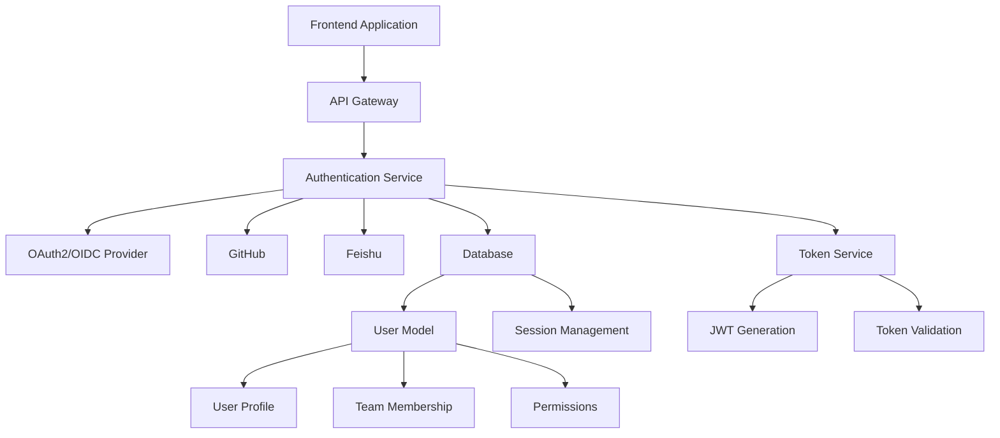
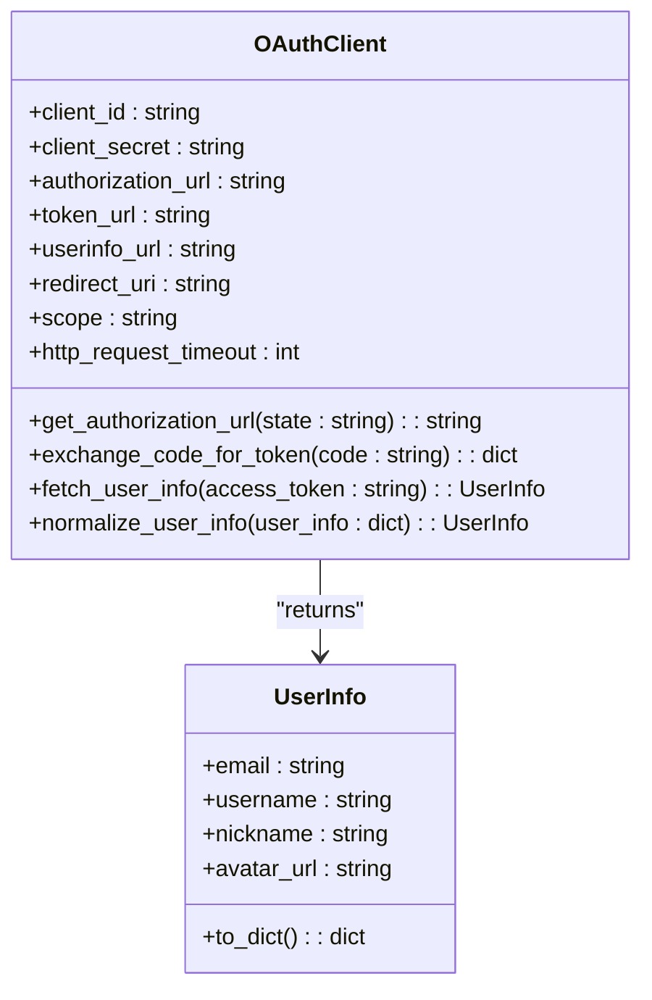
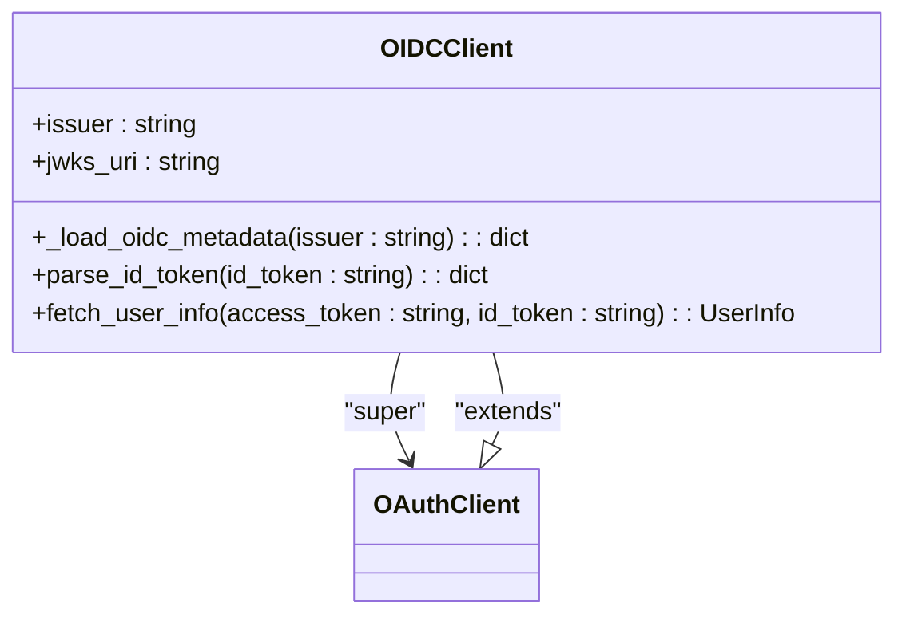
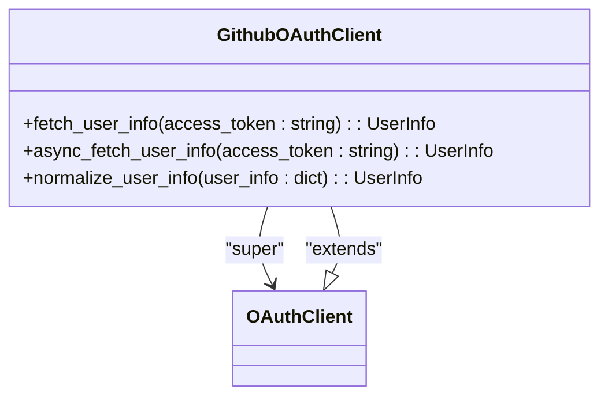
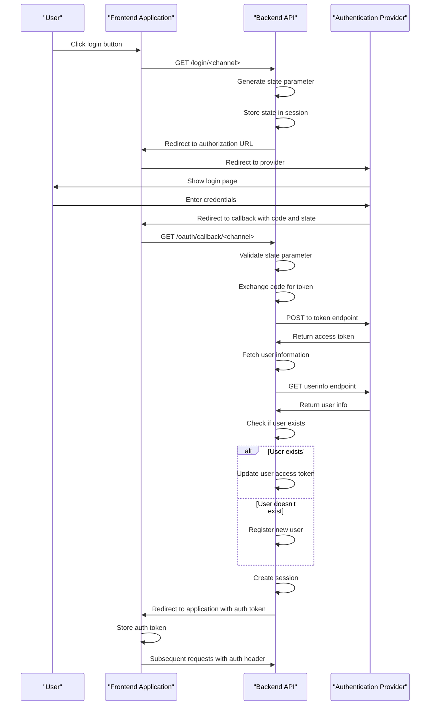
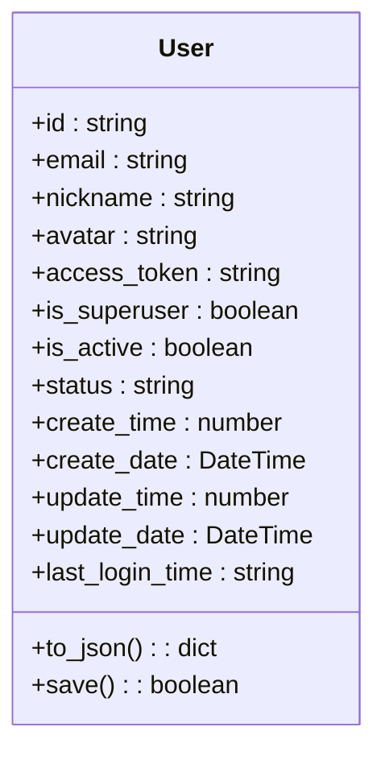
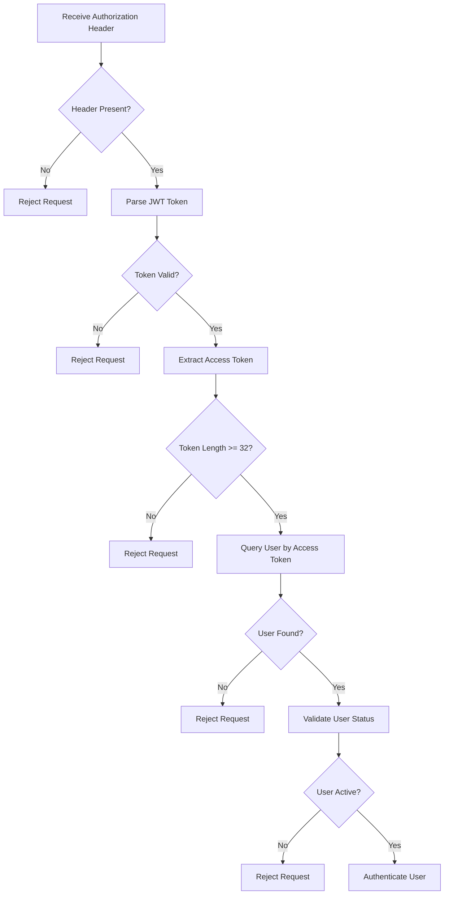

# Authentication Integrations

<cite>
**Referenced Files in This Document**   
- [oauth.py](file://api/apps/auth/oauth.py)
- [oidc.py](file://api/apps/auth/oidc.py)
- [github.py](file://api/apps/auth/github.py)
- [__init__.py](file://api/apps/auth/__init__.py)
- [user_app.py](file://api/apps/user_app.py)
- [settings.py](file://common/settings.py)
- [auth.py](file://admin/server/auth.py)
- [authorization-util.ts](file://web/src/utils/authorization-util.ts)
- [use-login-request.ts](file://web/src/hooks/use-login-request.ts)
- [db_models.py](file://api/db/db_models.py)
- [service_conf.yaml](file://conf/service_conf.yaml)
</cite>

## Table of Contents
1. [Introduction](#introduction)
2. [Authentication Architecture](#authentication-architecture)
3. [OAuth and OIDC Integration](#oauth-and-oidc-integration)
4. [GitHub Authentication](#github-authentication)
5. [Authentication Flow](#authentication-flow)
6. [Configuration and Setup](#configuration-and-setup)
7. [Frontend Authentication Utilities](#frontend-authentication-utilities)
8. [User Management and Team Collaboration](#user-management-and-team-collaboration)
9. [Security Considerations](#security-considerations)
10. [Troubleshooting Common Issues](#troubleshooting-common-issues)

## Introduction

RAGFlow provides a comprehensive authentication system that supports multiple identity providers through OAuth2, OpenID Connect (OIDC), and GitHub-specific authentication. This documentation details the implementation and integration of these authentication methods, focusing on secure user access, token management, and seamless integration with the platform's user management and team collaboration features. The system is designed to be flexible, allowing administrators to configure various authentication providers while maintaining a consistent user experience and security posture.

## Authentication Architecture

The RAGFlow authentication architecture is built around a modular design that supports multiple authentication protocols through a unified interface. The core components are organized in a hierarchical structure that separates protocol-specific implementations from the common authentication logic.



**Diagram sources**
- [user_app.py](file://api/apps/user_app.py#L161-L308)
- [auth.py](file://admin/server/auth.py#L38-L189)
- [db_models.py](file://api/db/db_models.py#L134-L200)

The architecture follows a clear separation of concerns:
- The frontend application handles user interface and session management
- The API gateway routes authentication requests to the appropriate service
- The authentication service implements protocol-specific logic for OAuth2, OIDC, and GitHub
- The database stores user information, session data, and team memberships
- The token service manages JWT generation and validation

This design allows for easy extension to support additional authentication providers while maintaining a consistent interface for user management and authorization.

**Section sources**
- [user_app.py](file://api/apps/user_app.py#L161-L308)
- [auth.py](file://admin/server/auth.py#L38-L189)

## OAuth and OIDC Integration

RAGFlow supports both OAuth2 and OpenID Connect (OIDC) authentication protocols, providing flexibility for integrating with various identity providers. The implementation follows industry standards while adding specific features for seamless integration with the platform.

### OAuth2 Implementation

The OAuth2 implementation in RAGFlow follows the authorization code grant flow, which is the most secure OAuth2 flow for web applications. The `OAuthClient` class provides the core functionality for OAuth2 authentication:



**Diagram sources**
- [oauth.py](file://api/apps/auth/oauth.py#L32-L152)

The OAuth2 client handles the complete authentication flow:
1. Generating the authorization URL with appropriate parameters
2. Exchanging the authorization code for an access token
3. Fetching user information from the userinfo endpoint
4. Normalizing the user information into a consistent format

Key features of the OAuth2 implementation include:
- Support for both synchronous and asynchronous token exchange
- Configurable HTTP request timeout
- Automatic scope handling
- State parameter validation to prevent CSRF attacks

### OIDC Implementation

The OIDC implementation extends the OAuth2 client with additional features specific to the OpenID Connect protocol. The `OIDCClient` class adds support for automatic configuration discovery and JWT token validation:



**Diagram sources**
- [oidc.py](file://api/apps/auth/oidc.py#L22-L108)

The OIDC client provides the following key features:
- Automatic discovery of OIDC configuration via `/.well-known/openid-configuration`
- JWT token parsing and validation with signature verification
- Support for ID tokens in addition to access tokens
- Integration with JWKS (JSON Web Key Set) for public key discovery

The automatic configuration discovery feature allows administrators to configure OIDC providers with minimal settings - typically just the issuer URL, client ID, and client secret. The client automatically retrieves the authorization URL, token URL, and userinfo URL from the provider's discovery document.

**Section sources**
- [oauth.py](file://api/apps/auth/oauth.py#L32-L152)
- [oidc.py](file://api/apps/auth/oidc.py#L22-L108)

## GitHub Authentication

RAGFlow provides specialized support for GitHub authentication, which extends the base OAuth2 implementation with GitHub-specific features and requirements.

### GitHub OAuth Client

The `GithubOAuthClient` class extends the `OAuthClient` with GitHub-specific configuration and user information handling:



**Diagram sources**
- [github.py](file://api/apps/auth/github.py#L21-L89)

The GitHub client automatically configures the following endpoints:
- Authorization URL: `https://github.com/login/oauth/authorize`
- Token URL: `https://github.com/login/oauth/access_token`
- Userinfo URL: `https://api.github.com/user`
- Scope: `user:email`

### GitHub-Specific Features

The GitHub authentication implementation includes several features specific to the GitHub API:

1. **Email Retrieval**: Unlike many OAuth providers, GitHub requires a separate API call to retrieve the user's email address. The implementation makes an additional request to the `/user/emails` endpoint to obtain the primary email address.

2. **User Information Normalization**: The GitHub API returns user information in a different format than standard OAuth providers. The `normalize_user_info` method maps GitHub-specific fields to the standard user model:
   - `login` field is used as the username
   - `name` field is used as the nickname
   - `avatar_url` field is used for the avatar

3. **Team-Based Access Control**: While not explicitly implemented in the authentication client, GitHub authentication can be integrated with RAGFlow's team-based collaboration features by mapping GitHub organizations and teams to RAGFlow teams.

**Section sources**
- [github.py](file://api/apps/auth/github.py#L21-L89)

## Authentication Flow

The authentication flow in RAGFlow follows a standard OAuth2/OIDC pattern with additional steps for user registration and session management.

### Complete Authentication Sequence



**Diagram sources**
- [user_app.py](file://api/apps/user_app.py#L161-L308)
- [auth.py](file://admin/server/auth.py#L38-L189)

### Key Flow Components

1. **State Parameter**: The authentication flow uses a state parameter to prevent CSRF attacks. The state is generated as a UUID and stored in the user's session before redirecting to the authentication provider. When the user returns from the provider, the state parameter is validated against the stored value.

2. **Token Exchange**: The authorization code is exchanged for an access token using the token endpoint of the authentication provider. This step is performed server-side to protect the client secret.

3. **User Information Retrieval**: After obtaining the access token, the system fetches user information from the userinfo endpoint. For OIDC providers, the ID token is also parsed to extract user claims.

4. **User Registration/Login**: The system checks if a user with the retrieved email address already exists. If not, a new user is created. If the user exists, their access token is updated.

5. **Session Management**: The user is logged in using Flask-Login, and a new access token is generated and stored in the database. The access token is returned to the frontend as a URL parameter.

**Section sources**
- [user_app.py](file://api/apps/user_app.py#L161-L308)

## Configuration and Setup

Configuring authentication providers in RAGFlow involves setting up the appropriate configuration in the `service_conf.yaml` file and ensuring the application is properly configured to handle authentication requests.

### Configuration File Structure

The authentication configuration is defined in the `service_conf.yaml` file under the `oauth` section:

```yaml
oauth:
  oauth2:
    display_name: "OAuth2"
    client_id: "your_client_id"
    client_secret: "your_client_secret"
    authorization_url: "https://your-oauth-provider.com/oauth/authorize"
    token_url: "https://your-oauth-provider.com/oauth/token"
    userinfo_url: "https://your-oauth-provider.com/oauth/userinfo"
    redirect_uri: "https://your-app.com/v1/user/oauth/callback/oauth2"
  oidc:
    display_name: "OIDC"
    client_id: "your_client_id"
    client_secret: "your_client_secret"
    issuer: "https://your-oauth-provider.com/oidc"
    scope: "openid email profile"
    redirect_uri: "https://your-app.com/v1/user/oauth/callback/oidc"
  github:
    type: "github"
    icon: "github"
    display_name: "Github"
    client_id: "your_client_id"
    client_secret: "your_client_secret"
    redirect_uri: "https://your-app.com/v1/user/oauth/callback/github"
```

### Configuration Options

Each authentication provider supports the following configuration options:

#### OAuth2 Configuration
- `type`: Authentication type (defaults to "oauth2" if not specified)
- `client_id`: Client ID provided by the authentication provider
- `client_secret`: Client secret provided by the authentication provider
- `authorization_url`: URL for the authorization endpoint
- `token_url`: URL for the token endpoint
- `userinfo_url`: URL for the userinfo endpoint
- `redirect_uri`: Redirect URI registered with the authentication provider
- `scope`: OAuth scopes to request (optional)
- `display_name`: Display name for the login button
- `icon`: Icon to display for the login button

#### OIDC Configuration
- `type`: Must be "oidc"
- `client_id`: Client ID provided by the authentication provider
- `client_secret`: Client secret provided by the authentication provider
- `issuer`: OIDC issuer URL (used for automatic configuration discovery)
- `redirect_uri`: Redirect URI registered with the authentication provider
- `scope`: OIDC scopes to request (defaults to "openid email profile")
- `display_name`: Display name for the login button
- `icon`: Icon to display for the login button

#### GitHub Configuration
- `type`: Must be "github"
- `client_id`: Client ID provided by GitHub
- `client_secret`: Client secret provided by GitHub
- `redirect_uri`: Redirect URI registered with GitHub
- `display_name`: Display name for the login button
- `icon`: Icon to display for the login button

Note that the GitHub client automatically configures the authorization URL, token URL, userinfo URL, and scope, so these do not need to be specified in the configuration.

### Real-World Configuration Examples

#### Google OAuth2 Configuration
```yaml
oauth:
  google:
    display_name: "Google"
    client_id: "your_google_client_id"
    client_secret: "your_google_client_secret"
    authorization_url: "https://accounts.google.com/o/oauth2/v2/auth"
    token_url: "https://oauth2.googleapis.com/token"
    userinfo_url: "https://www.googleapis.com/oauth2/v3/userinfo"
    redirect_uri: "https://your-app.com/v1/user/oauth/callback/google"
    scope: "openid email profile"
```

#### Azure AD OIDC Configuration
```yaml
oauth:
  azure:
    type: "oidc"
    display_name: "Azure AD"
    client_id: "your_azure_client_id"
    client_secret: "your_azure_client_secret"
    issuer: "https://login.microsoftonline.com/your-tenant-id/v2.0"
    redirect_uri: "https://your-app.com/v1/user/oauth/callback/azure"
    scope: "openid email profile"
```

#### GitHub Enterprise Configuration
```yaml
oauth:
  github_enterprise:
    type: "github"
    display_name: "GitHub Enterprise"
    client_id: "your_github_enterprise_client_id"
    client_secret: "your_github_enterprise_client_secret"
    redirect_uri: "https://your-app.com/v1/user/oauth/callback/github_enterprise"
```

**Section sources**
- [service_conf.yaml](file://conf/service_conf.yaml#L102-L124)
- [settings.py](file://common/settings.py#L73-L75)

## Frontend Authentication Utilities

The frontend authentication utilities in RAGFlow provide a seamless user experience for authentication and session management.

### Authorization Utilities

The `authorization-util.ts` file contains utilities for managing authentication state in the frontend:

```typescript
export const getAuthorization = () => {
  const auth = getSearchValue('auth');
  const authorization = auth
    ? 'Bearer ' + auth
    : storage.getAuthorization() || '';

  return authorization;
};

export function redirectToLogin() {
  window.location.href = location.origin + `/login`;
}
```

These utilities handle:
- Retrieving the authorization token from URL parameters or local storage
- Formatting the authorization header
- Redirecting to the login page

### Login Request Hooks

The `use-login-request.ts` file provides React hooks for handling authentication requests:

```typescript
export const useLoginChannels = () => {
  const { data, isLoading } = useQuery({
    queryKey: ['loginChannels'],
    queryFn: async () => {
      const { data: res = {} } = await getLoginChannels();
      return res.data || [];
    },
  });

  return { channels: data as ILoginChannel[], loading: isLoading };
};

export const useLoginWithChannel = () => {
  const { isPending: loading, mutateAsync } = useMutation({
    mutationKey: ['loginWithChannel'],
    mutationFn: async (channel: string) => {
      loginWithChannel(channel);
      return Promise.resolve();
    },
  });

  return { loading, login: mutateAsync };
};
```

These hooks provide:
- Retrieving the list of available authentication channels
- Handling login with a specific channel
- Managing login state and loading indicators

### Session Management

The frontend handles session management by:
1. Storing the authorization token in local storage
2. Including the authorization header in all API requests
3. Redirecting to the login page when authentication is required
4. Providing logout functionality that clears the local storage and redirects to the login page

The session management is integrated with React Query for automatic refetching of data when the authentication state changes.

**Section sources**
- [authorization-util.ts](file://web/src/utils/authorization-util.ts#L49-L63)
- [use-login-request.ts](file://web/src/hooks/use-login-request.ts#L26-L48)

## User Management and Team Collaboration

RAGFlow's authentication system is tightly integrated with its user management and team collaboration features, enabling secure access control and collaboration.

### User Model

The user model in RAGFlow stores essential user information and authentication data:



**Diagram sources**
- [db_models.py](file://api/db/db_models.py#L134-L200)

Key fields in the user model include:
- `access_token`: A UUID used for session management and API authentication
- `is_superuser`: Indicates whether the user has administrative privileges
- `is_active`: Indicates whether the user account is active
- `status`: User status (e.g., valid, invalid)

### Team-Based Collaboration

RAGFlow supports team-based collaboration through its permission system. The frontend defines permission roles:

```typescript
export enum PermissionRole {
  Me = 'me',
  Team = 'team',
}
```

Teams can be managed through the frontend interface, allowing users to:
- Create and manage teams
- Add and remove team members
- Assign roles and permissions
- Share resources with team members

The team-based collaboration features are integrated with the authentication system, ensuring that users can only access resources they have permission to view or modify.

### User Registration and Management

The authentication system handles user registration and management through the following process:
1. When a user authenticates for the first time, a new user account is created
2. The user's email, nickname, and avatar are populated from the authentication provider
3. A new access token is generated and stored in the database
4. The user is logged in and redirected to the application

Administrators can manage users through the admin interface, including:
- Activating or deactivating user accounts
- Assigning administrative privileges
- Viewing user activity and login history

**Section sources**
- [db_models.py](file://api/db/db_models.py#L134-L200)
- [permission.ts](file://web/src/constants/permission.ts#L1-L4)

## Security Considerations

RAGFlow's authentication system incorporates several security measures to protect user data and prevent common vulnerabilities.

### Token Security

The system uses UUIDs as access tokens, which are cryptographically secure and difficult to guess. Access tokens are validated with the following checks:
- Length validation (must be at least 32 characters)
- Format validation (must be a valid UUID)
- Database lookup to ensure the token is associated with an active user



**Diagram sources**
- [auth.py](file://admin/server/auth.py#L40-L66)
- [user_service.py](file://api/db/services/user_service.py#L46-L62)

### CSRF Protection

The authentication flow includes CSRF protection through the use of state parameters:
- A random state parameter is generated for each authentication request
- The state parameter is stored in the user's session
- When the user returns from the authentication provider, the state parameter is validated against the stored value
- If the state parameters don't match, the request is rejected

### Secure Configuration

The system enforces secure configuration practices:
- Client secrets are stored in environment variables or configuration files, not in code
- Redirect URIs are validated to prevent open redirect vulnerabilities
- HTTPS is required for production deployments
- Secret keys are automatically generated if not configured

### Input Validation

All user input is validated to prevent injection attacks:
- Email addresses are validated for proper format
- Usernames and nicknames are sanitized to prevent XSS attacks
- URLs are validated to prevent SSRF attacks

**Section sources**
- [auth.py](file://admin/server/auth.py#L40-L66)
- [user_service.py](file://api/db/services/user_service.py#L46-L62)

## Troubleshooting Common Issues

This section addresses common issues that may occur when configuring and using RAGFlow's authentication system.

### Callback URL Mismatches

**Issue**: Users are redirected back to the application, but authentication fails with an error about an invalid redirect URI.

**Solution**: Ensure that the `redirect_uri` in the configuration matches exactly with the redirect URI registered with the authentication provider. This includes:
- Protocol (http vs https)
- Hostname
- Port number
- Path

For example, if the application is running on `https://example.com`, the redirect URI should be `https://example.com/v1/user/oauth/callback/<channel>`, not `http://example.com/v1/user/oauth/callback/<channel>`.

### Insufficient Scopes

**Issue**: Authentication succeeds, but the application cannot retrieve the user's email address.

**Solution**: Ensure that the required scopes are included in the configuration. For OAuth2 and OIDC providers, include `email` in the scope. For GitHub, ensure that `user:email` is included in the scope (this is automatic in RAGFlow's GitHub client).

### Token Expiration Handling

**Issue**: Users are logged out unexpectedly, or API requests fail with authentication errors.

**Solution**: Implement proper token refresh logic. While RAGFlow's current implementation uses long-lived access tokens, some providers issue short-lived tokens that require refresh. Consider implementing a token refresh mechanism that:
- Stores the refresh token securely
- Automatically refreshes the access token before it expires
- Handles token refresh failures gracefully

### State Parameter Validation Failures

**Issue**: Authentication fails with an "invalid state" error.

**Solution**: This typically occurs when the user's session is lost between the initial login request and the callback. Ensure that:
- Session storage is configured correctly
- The application is not running in multiple instances without shared session storage
- Load balancers are configured for session affinity if using multiple application instances

### User Registration Disabled

**Issue**: New users cannot register, even though they can authenticate with their identity provider.

**Solution**: Check the `REGISTER_ENABLED` setting in the environment variables. If set to 0, user registration is disabled. Set it to 1 to enable registration:
```bash
export REGISTER_ENABLED=1
```

### Database Connection Issues

**Issue**: Authentication succeeds, but user information cannot be saved to the database.

**Solution**: Verify that the database connection is configured correctly in the `service_conf.yaml` file and that the database is accessible from the application server. Check the database logs for connection errors.

**Section sources**
- [user_app.py](file://api/apps/user_app.py#L186-L188)
- [settings.py](file://common/settings.py#L86-L87)