# Data Source Connectors

<cite>
**Referenced Files in This Document**   
- [interfaces.py](file://common/data_source/interfaces.py)
- [models.py](file://common/data_source/models.py)
- [blob_connector.py](file://common/data_source/blob_connector.py)
- [google_drive/connector.py](file://common/data_source/google_drive/connector.py)
- [jira/connector.py](file://common/data_source/jira/connector.py)
- [confluence_connector.py](file://common/data_source/confluence_connector.py)
- [discord_connector.py](file://common/data_source/discord_connector.py)
- [gmail_connector.py](file://common/data_source/gmail_connector.py)
- [notion_connector.py](file://common/data_source/notion_connector.py)
- [sharepoint_connector.py](file://common/data_source/sharepoint_connector.py)
- [slack_connector.py](file://common/data_source/slack_connector.py)
- [teams_connector.py](file://common/data_source/teams_connector.py)
- [webdav_connector.py](file://common/data_source/webdav_connector.py)
</cite>

## Table of Contents
1. [Introduction](#introduction)
2. [Architecture Overview](#architecture-overview)
3. [Core Components](#core-components)
4. [Common Interfaces and Base Classes](#common-interfaces-and-base-classes)
5. [Connector Implementation Details](#connector-implementation-details)
    - [Google Drive](#google-drive)
    - [Jira](#jira)
    - [Confluence](#confluence)
    - [Discord](#discord)
    - [Dropbox](#dropbox)
    - [Gmail](#gmail)
    - [Moodle](#moodle)
    - [Notion](#notion)
    - [SharePoint](#sharepoint)
    - [Slack](#slack)
    - [Teams](#teams)
    - [WebDAV](#webdav)
6. [Authentication Mechanisms](#authentication-mechanisms)
7. [Data Retrieval Patterns](#data-retrieval-patterns)
8. [Error Handling Strategies](#error-handling-strategies)
9. [Token Management and Rate Limiting](#token-management-and-rate-limiting)
10. [Data Synchronization](#data-synchronization)
11. [Troubleshooting Guide](#troubleshooting-guide)
12. [Extensibility Model](#extensibility-model)
13. [Conclusion](#conclusion)

## Introduction
RAGFlow's data source connector system provides a robust framework for integrating with various external platforms to ingest and process data. This document comprehensively details the architecture, implementation, and usage of these connectors, which enable seamless integration with platforms such as Google Drive, Jira, Confluence, Discord, Dropbox, Gmail, Moodle, Notion, SharePoint, Slack, Teams, and WebDAV. The connectors are designed to handle authentication, data retrieval, error handling, token management, rate limiting, and data synchronization, ensuring reliable and efficient data ingestion. This documentation serves as a guide for developers and administrators to understand, configure, and extend the connector system.

## Architecture Overview
The data source connector system in RAGFlow is built on a modular architecture that promotes consistency and extensibility across different external platforms. The system is designed to handle various data sources through a set of common interfaces and base classes, ensuring a uniform approach to authentication, data retrieval, and error handling. Each connector implements specific interfaces to interact with its respective platform, while adhering to the overall architectural principles of the system. The architecture supports both polling and checkpointed data retrieval mechanisms, allowing for efficient and incremental data ingestion. The system also includes mechanisms for token management, rate limiting, and data synchronization, ensuring reliable and secure data integration.

```mermaid
graph TD
A[External Data Sources] --> B[Data Source Connectors]
B --> C[Common Interfaces]
B --> D[Base Classes]
C --> E[LoadConnector]
C --> F[PollConnector]
C --> G[CredentialsConnector]
C --> H[SlimConnectorWithPermSync]
C --> I[CheckpointedConnectorWithPermSync]
D --> J[BaseConnector]
D --> K[LoadFunction]
D --> L[CheckpointOutputWrapper]
B --> M[Google Drive Connector]
B --> N[Jira Connector]
B --> O[Confluence Connector]
B --> P[Discord Connector]
B --> Q[Dropbox Connector]
B --> R[Gmail Connector]
B --> S[Moodle Connector]
B --> T[Notion Connector]
B --> U[SharePoint Connector]
B --> V[Slack Connector]
B --> W[Teams Connector]
B --> X[WebDAV Connector]
M --> Y[Google Drive API]
N --> Z[Jira API]
O --> AA[Confluence API]
P --> AB[Discord API]
Q --> AC[Dropbox API]
R --> AD[Gmail API]
S --> AE[Moodle API]
T --> AF[Notion API]
U --> AG[SharePoint API]
V --> AH[Slack API]
W --> AI[Teams API]
X --> AJ[WebDAV Protocol]
```

**Diagram sources**
- [interfaces.py](file://common/data_source/interfaces.py)
- [models.py](file://common/data_source/models.py)

## Core Components
The core components of the data source connector system include the common interfaces, base classes, and individual connector implementations. The common interfaces define the contract for data retrieval, authentication, and permission synchronization, ensuring a consistent approach across all connectors. The base classes provide shared functionality and default implementations, reducing code duplication and promoting maintainability. Each connector implementation is responsible for interacting with its respective external platform, handling authentication, data retrieval, and error handling. The system also includes utilities for token management, rate limiting, and data synchronization, ensuring reliable and efficient data ingestion.

**Section sources**
- [interfaces.py](file://common/data_source/interfaces.py)
- [models.py](file://common/data_source/models.py)
- [blob_connector.py](file://common/data_source/blob_connector.py)

## Common Interfaces and Base Classes
The data source connector system defines a set of common interfaces and base classes that provide a consistent foundation for all connector implementations. These interfaces and classes ensure that each connector adheres to a uniform approach for data retrieval, authentication, and error handling.

### Interfaces
The system defines several interfaces that connectors must implement:

- **LoadConnector**: Defines the contract for loading documents from a data source.
- **PollConnector**: Defines the contract for polling a data source for recent documents.
- **CredentialsConnector**: Defines the contract for loading and managing credentials.
- **SlimConnectorWithPermSync**: Defines the contract for retrieving simplified documents with permission synchronization.
- **CheckpointedConnectorWithPermSync**: Defines the contract for loading documents from a checkpoint with permission synchronization.

### Base Classes
The system provides base classes that offer shared functionality and default implementations:

- **BaseConnector**: Provides common functionality for all connectors, including credential loading and metadata parsing.
- **LoadFunction**: Defines the function signature for loading documents from a checkpoint.
- **CheckpointOutputWrapper**: Wraps the checkpoint output generator to provide a more digestible format for document outputs.

```mermaid
classDiagram
class LoadConnector {
+load_credentials(credentials : Dict[str, Any]) Dict[str, Any] | None
+load_from_state() Generator[list[Document], None, None]
+validate_connector_settings() None
}
class PollConnector {
+poll_source(start : SecondsSinceUnixEpoch, end : SecondsSinceUnixEpoch) Generator[list[Document], None, None]
}
class CredentialsConnector {
+load_credentials(credentials : Dict[str, Any]) Dict[str, Any] | None
}
class SlimConnectorWithPermSync {
+retrieve_all_slim_docs_perm_sync(start : SecondsSinceUnixEpoch | None, end : SecondsSinceUnixEpoch | None, callback : Any) Generator[list[SlimDocument], None, None]
}
class CheckpointedConnectorWithPermSync {
+load_from_checkpoint(start : SecondsSinceUnixEpoch, end : SecondsSinceUnixEpoch, checkpoint : ConnectorCheckpoint) Generator[Document | ConnectorFailure, None, ConnectorCheckpoint]
+load_from_checkpoint_with_perm_sync(start : SecondsSinceUnixEpoch, end : SecondsSinceUnixEpoch, checkpoint : ConnectorCheckpoint) Generator[Document | ConnectorFailure, None, ConnectorCheckpoint]
+build_dummy_checkpoint() ConnectorCheckpoint
+validate_checkpoint_json(checkpoint_json : str) ConnectorCheckpoint
}
class BaseConnector {
+load_credentials(credentials : dict[str, Any]) dict[str, Any] | None
+parse_metadata(metadata : dict[str, Any]) list[str]
+validate_connector_settings() None
+validate_perm_sync() None
+set_allow_images(value : bool) None
+build_dummy_checkpoint() CT
}
LoadConnector <|-- BaseConnector
PollConnector <|-- BaseConnector
CredentialsConnector <|-- BaseConnector
SlimConnectorWithPermSync <|-- BaseConnector
CheckpointedConnectorWithPermSync <|-- BaseConnector
```

**Diagram sources**
- [interfaces.py](file://common/data_source/interfaces.py)
- [models.py](file://common/data_source/models.py)

## Connector Implementation Details
This section details the implementation of each connector, including authentication mechanisms, API interactions, data retrieval patterns, and error handling strategies.

### Google Drive
The Google Drive connector enables integration with Google Drive to ingest documents. It supports both OAuth and service account authentication, allowing for flexible deployment scenarios.

**Authentication Mechanisms**
The connector supports two authentication methods:
- **OAuth**: Uses OAuth 2.0 for user-based authentication.
- **Service Account**: Uses a service account for server-to-server authentication.

**API Interactions**
The connector interacts with the Google Drive API to retrieve files and folders. It uses the `drive.files.list` and `drive.files.get` endpoints to list and retrieve files, respectively.

**Data Retrieval Patterns**
The connector retrieves files in batches, using pagination to handle large datasets. It supports both full and incremental data retrieval, using checkpoints to track progress.

**Error Handling Strategies**
The connector handles common errors such as authentication failures, permission errors, and rate limiting. It includes retry logic for transient errors and provides detailed error messages for troubleshooting.

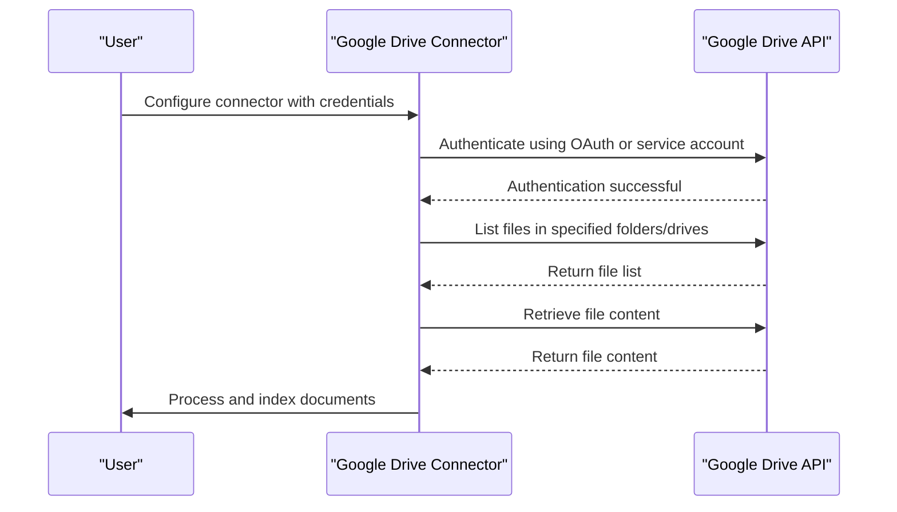

**Diagram sources**
- [google_drive/connector.py](file://common/data_source/google_drive/connector.py)
- [google_drive/file_retrieval.py](file://common/data_source/google_drive/file_retrieval.py)

### Jira
The Jira connector enables integration with Jira to ingest issues and comments. It supports both API token and username/password authentication.

**Authentication Mechanisms**
The connector supports two authentication methods:
- **API Token**: Uses an API token for authentication.
- **Username/Password**: Uses a username and password for authentication.

**API Interactions**
The connector interacts with the Jira REST API to retrieve issues and comments. It uses the `/rest/api/2/search` endpoint to query issues and the `/rest/api/2/issue/{issueIdOrKey}` endpoint to retrieve issue details.

**Data Retrieval Patterns**
The connector retrieves issues in batches, using pagination to handle large datasets. It supports both full and incremental data retrieval, using JQL queries to filter issues.

**Error Handling Strategies**
The connector handles common errors such as authentication failures, permission errors, and rate limiting. It includes retry logic for transient errors and provides detailed error messages for troubleshooting.

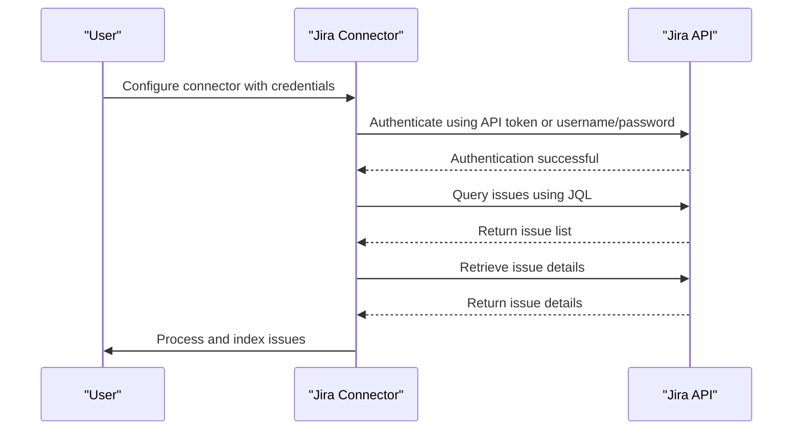

**Diagram sources**
- [jira/connector.py](file://common/data_source/jira/connector.py)
- [jira/utils.py](file://common/data_source/jira/utils.py)

### Confluence
The Confluence connector enables integration with Confluence to ingest pages and attachments. It supports both OAuth and personal access token authentication.

**Authentication Mechanisms**
The connector supports two authentication methods:
- **OAuth**: Uses OAuth 2.0 for user-based authentication.
- **Personal Access Token**: Uses a personal access token for authentication.

**API Interactions**
The connector interacts with the Confluence REST API to retrieve pages and attachments. It uses the `/rest/api/content` endpoint to query pages and the `/rest/api/content/{id}/child/attachment` endpoint to retrieve attachments.

**Data Retrieval Patterns**
The connector retrieves pages in batches, using pagination to handle large datasets. It supports both full and incremental data retrieval, using CQL queries to filter pages.

**Error Handling Strategies**
The connector handles common errors such as authentication failures, permission errors, and rate limiting. It includes retry logic for transient errors and provides detailed error messages for troubleshooting.

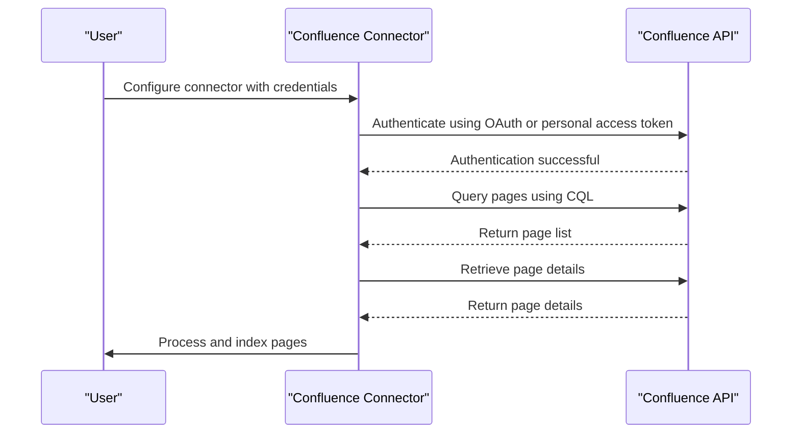

**Diagram sources**
- [confluence_connector.py](file://common/data_source/confluence_connector.py)
- [html_utils.py](file://common/data_source/html_utils.py)

### Discord
The Discord connector enables integration with Discord to ingest messages and threads. It uses a bot token for authentication.

**Authentication Mechanisms**
The connector uses a bot token for authentication, which is provided by the Discord developer portal.

**API Interactions**
The connector interacts with the Discord API to retrieve messages and threads. It uses the `/channels/{channel.id}/messages` endpoint to retrieve messages and the `/channels/{channel.id}/threads` endpoint to retrieve threads.

**Data Retrieval Patterns**
The connector retrieves messages in batches, using pagination to handle large datasets. It supports both full and incremental data retrieval, using timestamps to filter messages.

**Error Handling Strategies**
The connector handles common errors such as authentication failures, permission errors, and rate limiting. It includes retry logic for transient errors and provides detailed error messages for troubleshooting.

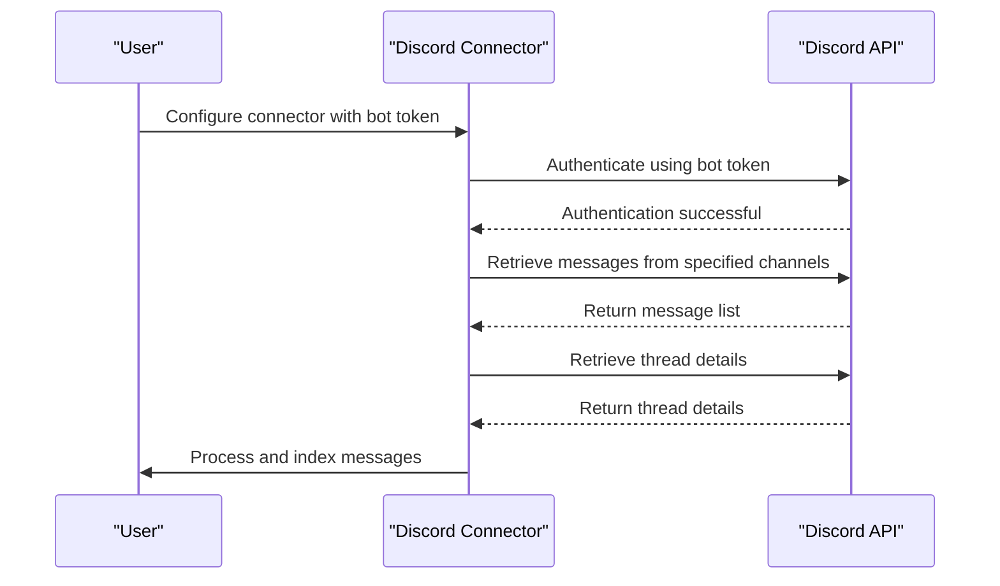

**Diagram sources**
- [discord_connector.py](file://common/data_source/discord_connector.py)

### Dropbox
The Dropbox connector enables integration with Dropbox to ingest files. It uses an access token for authentication.

**Authentication Mechanisms**
The connector uses an access token for authentication, which is provided by the Dropbox developer portal.

**API Interactions**
The connector interacts with the Dropbox API to retrieve files. It uses the `/files/list_folder` endpoint to list files and the `/files/download` endpoint to retrieve file content.

**Data Retrieval Patterns**
The connector retrieves files in batches, using pagination to handle large datasets. It supports both full and incremental data retrieval, using checkpoints to track progress.

**Error Handling Strategies**
The connector handles common errors such as authentication failures, permission errors, and rate limiting. It includes retry logic for transient errors and provides detailed error messages for troubleshooting.

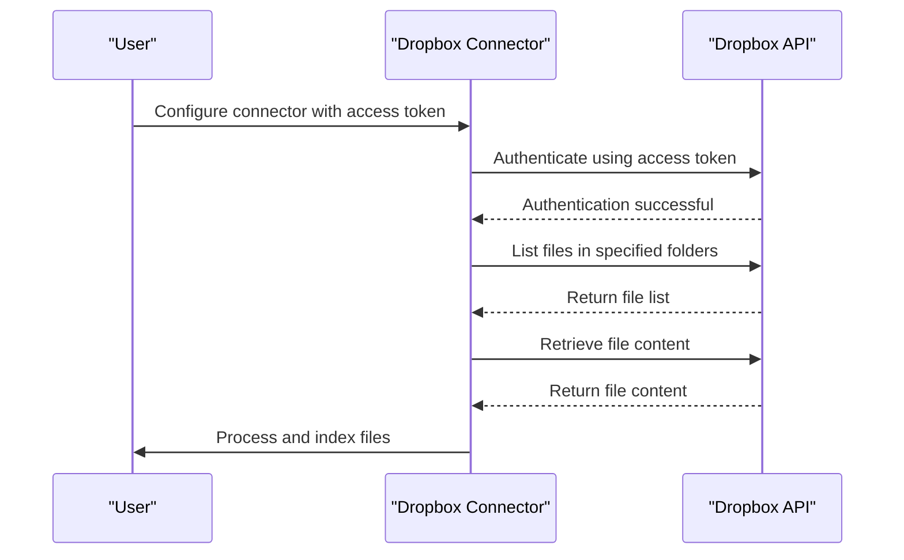

**Diagram sources**
- [dropbox_connector.py](file://common/data_source/dropbox_connector.py)

### Gmail
The Gmail connector enables integration with Gmail to ingest emails. It supports both OAuth and service account authentication.

**Authentication Mechanisms**
The connector supports two authentication methods:
- **OAuth**: Uses OAuth 2.0 for user-based authentication.
- **Service Account**: Uses a service account for server-to-server authentication.

**API Interactions**
The connector interacts with the Gmail API to retrieve emails. It uses the `/users/{userId}/messages` endpoint to list messages and the `/users/{userId}/messages/{id}` endpoint to retrieve message details.

**Data Retrieval Patterns**
The connector retrieves emails in batches, using pagination to handle large datasets. It supports both full and incremental data retrieval, using timestamps to filter messages.

**Error Handling Strategies**
The connector handles common errors such as authentication failures, permission errors, and rate limiting. It includes retry logic for transient errors and provides detailed error messages for troubleshooting.

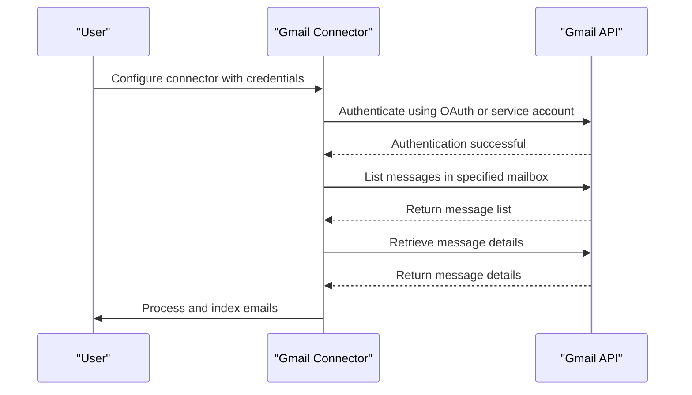

**Diagram sources**
- [gmail_connector.py](file://common/data_source/gmail_connector.py)

### Moodle
The Moodle connector enables integration with Moodle to ingest course content. It uses an API token for authentication.

**Authentication Mechanisms**
The connector uses an API token for authentication, which is provided by the Moodle administrator.

**API Interactions**
The connector interacts with the Moodle Web Services API to retrieve course content. It uses the `core_course_get_courses` endpoint to list courses and the `mod_resource_get_resources_by_courses` endpoint to retrieve resources.

**Data Retrieval Patterns**
The connector retrieves course content in batches, using pagination to handle large datasets. It supports both full and incremental data retrieval, using course IDs to filter content.

**Error Handling Strategies**
The connector handles common errors such as authentication failures, permission errors, and rate limiting. It includes retry logic for transient errors and provides detailed error messages for troubleshooting.

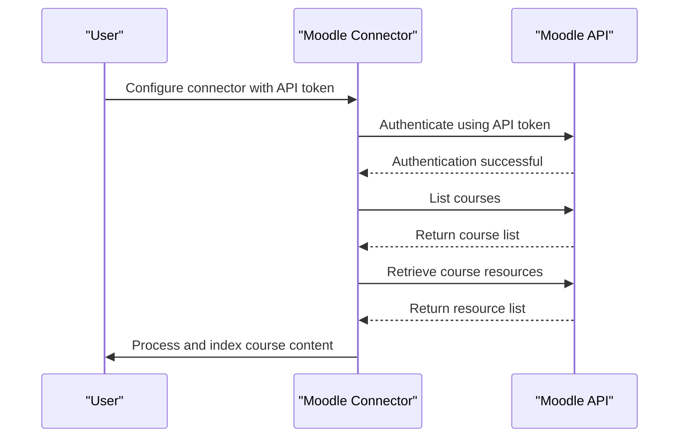

**Diagram sources**
- [moodle_connector.py](file://common/data_source/moodle_connector.py)

### Notion
The Notion connector enables integration with Notion to ingest pages and databases. It uses an integration token for authentication.

**Authentication Mechanisms**
The connector uses an integration token for authentication, which is provided by the Notion developer portal.

**API Interactions**
The connector interacts with the Notion API to retrieve pages and databases. It uses the `/v1/search` endpoint to query pages and the `/v1/pages/{page_id}` endpoint to retrieve page details.

**Data Retrieval Patterns**
The connector retrieves pages in batches, using pagination to handle large datasets. It supports both full and incremental data retrieval, using timestamps to filter pages.

**Error Handling Strategies**
The connector handles common errors such as authentication failures, permission errors, and rate limiting. It includes retry logic for transient errors and provides detailed error messages for troubleshooting.

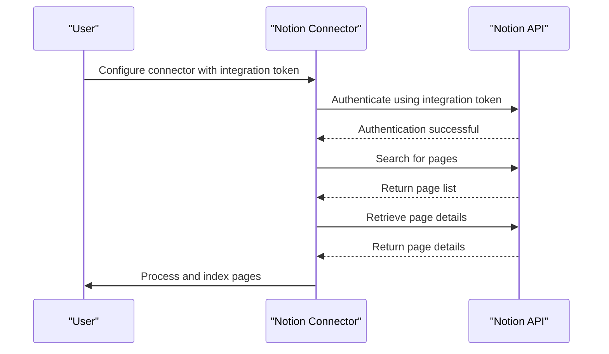

**Diagram sources**
- [notion_connector.py](file://common/data_source/notion_connector.py)

### SharePoint
The SharePoint connector enables integration with SharePoint to ingest documents. It uses Azure AD application credentials for authentication.

**Authentication Mechanisms**
The connector uses Azure AD application credentials, including tenant ID, client ID, and client secret, for authentication.

**API Interactions**
The connector interacts with the Microsoft Graph API to retrieve documents. It uses the `/sites/{site-id}/drive/root` endpoint to access the document library and the `/drive/items` endpoint to list and retrieve files.

**Data Retrieval Patterns**
The connector retrieves documents in batches, using pagination to handle large datasets. It supports both full and incremental data retrieval, using checkpoints to track progress.

**Error Handling Strategies**
The connector handles common errors such as authentication failures, permission errors, and rate limiting. It includes retry logic for transient errors and provides detailed error messages for troubleshooting.

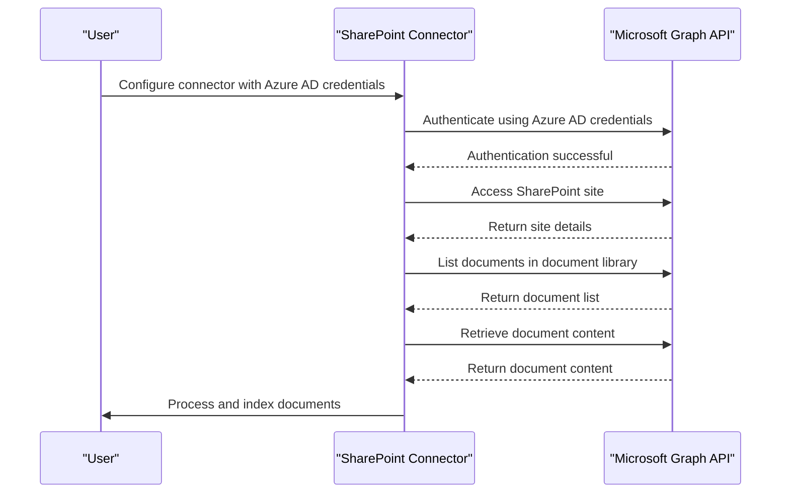

**Diagram sources**
- [sharepoint_connector.py](file://common/data_source/sharepoint_connector.py)

### Slack
The Slack connector enables integration with Slack to ingest messages and threads. It uses a bot token for authentication.

**Authentication Mechanisms**
The connector uses a bot token for authentication, which is provided by the Slack developer portal.

**API Interactions**
The connector interacts with the Slack API to retrieve messages and threads. It uses the `/conversations.list` endpoint to list channels and the `/conversations.history` endpoint to retrieve messages.

**Data Retrieval Patterns**
The connector retrieves messages in batches, using pagination to handle large datasets. It supports both full and incremental data retrieval, using timestamps to filter messages.

**Error Handling Strategies**
The connector handles common errors such as authentication failures, permission errors, and rate limiting. It includes retry logic for transient errors and provides detailed error messages for troubleshooting.

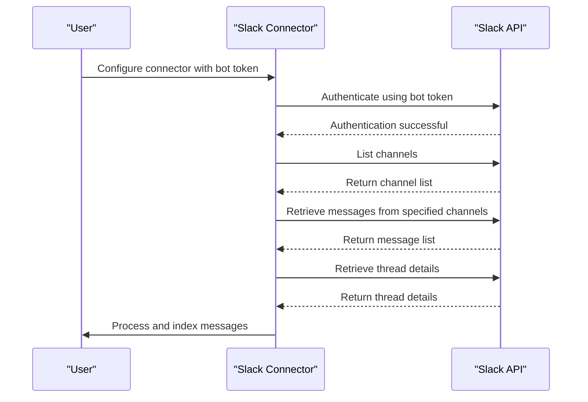

**Diagram sources**
- [slack_connector.py](file://common/data_source/slack_connector.py)

### Teams
The Teams connector enables integration with Microsoft Teams to ingest messages and files. It uses Azure AD application credentials for authentication.

**Authentication Mechanisms**
The connector uses Azure AD application credentials, including tenant ID, client ID, and client secret, for authentication.

**API Interactions**
The connector interacts with the Microsoft Graph API to retrieve messages and files. It uses the `/teams/{team-id}/channels` endpoint to list channels and the `/teams/{team-id}/channels/{channel-id}/messages` endpoint to retrieve messages.

**Data Retrieval Patterns**
The connector retrieves messages and files in batches, using pagination to handle large datasets. It supports both full and incremental data retrieval, using timestamps to filter messages.

**Error Handling Strategies**
The connector handles common errors such as authentication failures, permission errors, and rate limiting. It includes retry logic for transient errors and provides detailed error messages for troubleshooting.

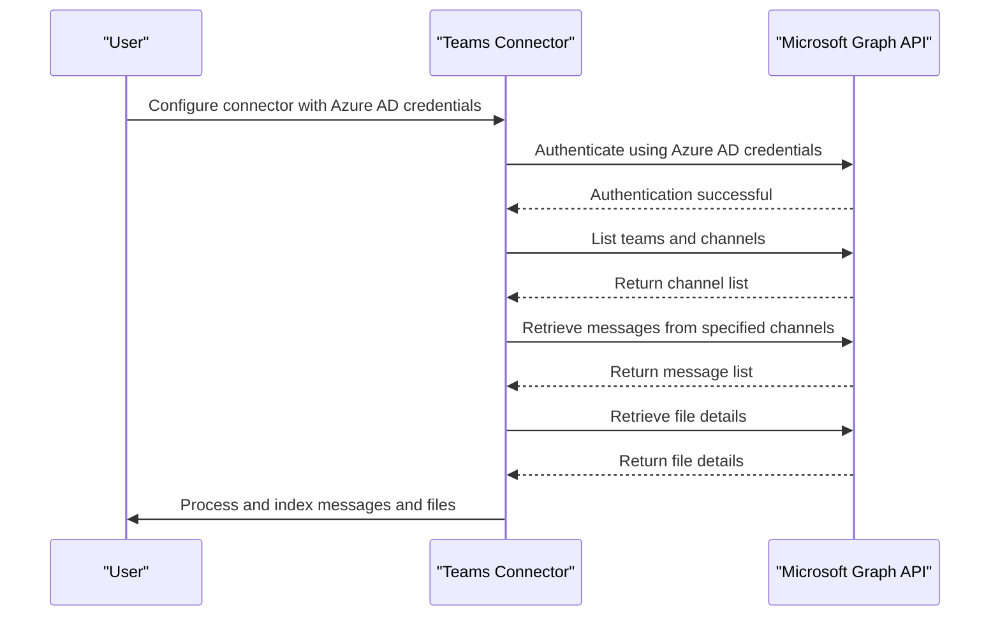

**Diagram sources**
- [teams_connector.py](file://common/data_source/teams_connector.py)

### WebDAV
The WebDAV connector enables integration with WebDAV servers to ingest files. It uses basic authentication for authentication.

**Authentication Mechanisms**
The connector uses basic authentication, requiring a username and password, to authenticate with the WebDAV server.

**API Interactions**
The connector interacts with the WebDAV protocol to retrieve files. It uses the `PROPFIND` method to list files and the `GET` method to retrieve file content.

**Data Retrieval Patterns**
The connector retrieves files in batches, using pagination to handle large datasets. It supports both full and incremental data retrieval, using checkpoints to track progress.

**Error Handling Strategies**
The connector handles common errors such as authentication failures, permission errors, and network issues. It includes retry logic for transient errors and provides detailed error messages for troubleshooting.

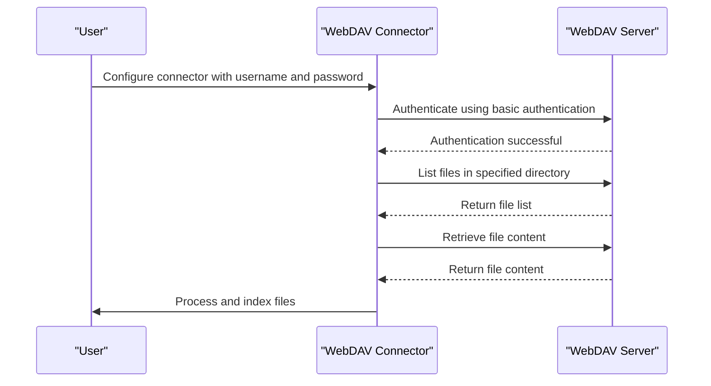

**Diagram sources**
- [webdav_connector.py](file://common/data_source/webdav_connector.py)

## Authentication Mechanisms
The data source connectors in RAGFlow support various authentication mechanisms to ensure secure access to external platforms. These mechanisms include OAuth, service accounts, API tokens, and basic authentication, depending on the platform's requirements.

### OAuth
OAuth is used for user-based authentication with platforms such as Google Drive, Gmail, and Confluence. The connector obtains an access token through the OAuth 2.0 flow, which is then used to authenticate API requests.

### Service Account
Service account authentication is used for server-to-server communication with platforms such as Google Drive and Gmail. The connector uses a service account key to obtain an access token, which is then used to authenticate API requests.

### API Token
API tokens are used for authentication with platforms such as Jira, Notion, and Discord. The connector includes the API token in the request headers to authenticate API requests.

### Basic Authentication
Basic authentication is used for platforms such as WebDAV. The connector includes the username and password in the request headers to authenticate API requests.

### Azure AD Application Credentials
Azure AD application credentials are used for authentication with Microsoft platforms such as SharePoint and Teams. The connector uses the tenant ID, client ID, and client secret to obtain an access token, which is then used to authenticate API requests.

**Section sources**
- [google_drive/connector.py](file://common/data_source/google_drive/connector.py)
- [jira/connector.py](file://common/data_source/jira/connector.py)
- [confluence_connector.py](file://common/data_source/confluence_connector.py)
- [discord_connector.py](file://common/data_source/discord_connector.py)
- [dropbox_connector.py](file://common/data_source/dropbox_connector.py)
- [gmail_connector.py](file://common/data_source/gmail_connector.py)
- [moodle_connector.py](file://common/data_source/moodle_connector.py)
- [notion_connector.py](file://common/data_source/notion_connector.py)
- [sharepoint_connector.py](file://common/data_source/sharepoint_connector.py)
- [slack_connector.py](file://common/data_source/slack_connector.py)
- [teams_connector.py](file://common/data_source/teams_connector.py)
- [webdav_connector.py](file://common/data_source/webdav_connector.py)

## Data Retrieval Patterns
The data source connectors in RAGFlow employ various data retrieval patterns to efficiently ingest data from external platforms. These patterns include polling, checkpointed retrieval, and batch processing.

### Polling
Polling is used to retrieve recent data from a data source within a specified time range. The connector queries the data source for documents updated between a start and end timestamp, ensuring incremental data ingestion.

### Checkpointed Retrieval
Checkpointed retrieval is used to track progress and resume data ingestion from a specific point. The connector maintains a checkpoint that records the last processed document, allowing it to resume from that point in subsequent runs.

### Batch Processing
Batch processing is used to handle large datasets by retrieving and processing documents in batches. The connector retrieves a batch of documents, processes them, and then retrieves the next batch, ensuring efficient memory usage and processing.

**Section sources**
- [interfaces.py](file://common/data_source/interfaces.py)
- [models.py](file://common/data_source/models.py)
- [blob_connector.py](file://common/data_source/blob_connector.py)

## Error Handling Strategies
The data source connectors in RAGFlow implement robust error handling strategies to ensure reliable data ingestion. These strategies include retry logic, detailed error logging, and graceful degradation.

### Retry Logic
Retry logic is implemented to handle transient errors such as network issues and rate limiting. The connector retries failed requests with exponential backoff, increasing the delay between retries to avoid overwhelming the data source.

### Detailed Error Logging
Detailed error logging is used to provide insights into the cause of failures. The connector logs error messages, stack traces, and relevant context, enabling administrators to diagnose and resolve issues.

### Graceful Degradation
Graceful degradation is implemented to handle permanent errors such as authentication failures and permission errors. The connector skips problematic documents and continues processing the remaining data, ensuring that partial data ingestion is still possible.

**Section sources**
- [exceptions.py](file://common/data_source/exceptions.py)
- [utils.py](file://common/data_source/utils.py)
- [blob_connector.py](file://common/data_source/blob_connector.py)

## Token Management and Rate Limiting
The data source connectors in RAGFlow include mechanisms for token management and rate limiting to ensure secure and efficient data ingestion.

### Token Management
Token management is handled by the connector to ensure that access tokens are valid and up-to-date. The connector refreshes expired tokens and stores them securely, preventing unauthorized access.

### Rate Limiting
Rate limiting is implemented to prevent the connector from exceeding the API rate limits of the data source. The connector monitors the rate limit headers and adjusts its request frequency accordingly, ensuring compliance with the data source's rate limits.

**Section sources**
- [google_util/auth.py](file://common/data_source/google_util/auth.py)
- [utils.py](file://common/data_source/utils.py)
- [blob_connector.py](file://common/data_source/blob_connector.py)

## Data Synchronization
The data source connectors in RAGFlow support data synchronization to ensure that the ingested data is up-to-date. This is achieved through incremental data retrieval and checkpointing.

### Incremental Data Retrieval
Incremental data retrieval is used to fetch only the documents that have been updated since the last ingestion. The connector queries the data source for documents updated within a specified time range, ensuring efficient data ingestion.

### Checkpointing
Checkpointing is used to track the progress of data ingestion and resume from the last processed document. The connector maintains a checkpoint that records the last processed document, allowing it to resume from that point in subsequent runs.

**Section sources**
- [interfaces.py](file://common/data_source/interfaces.py)
- [models.py](file://common/data_source/models.py)
- [blob_connector.py](file://common/data_source/blob_connector.py)

## Troubleshooting Guide
This section provides guidance on troubleshooting common issues with the data source connectors, such as authentication failures, permission errors, and data extraction problems.

### Authentication Failures
Authentication failures can occur due to invalid credentials or expired tokens. To resolve this issue, verify that the credentials are correct and, if necessary, refresh the access token.

### Permission Errors
Permission errors can occur if the connector does not have sufficient permissions to access the data source. To resolve this issue, ensure that the connector has the necessary permissions and, if necessary, update the permissions in the data source.

### Data Extraction Problems
Data extraction problems can occur due to network issues or API errors. To resolve this issue, check the network connection and, if necessary, retry the data extraction process.

**Section sources**
- [exceptions.py](file://common/data_source/exceptions.py)
- [utils.py](file://common/data_source/utils.py)
- [blob_connector.py](file://common/data_source/blob_connector.py)

## Extensibility Model
The data source connector system in RAGFlow is designed to be extensible, allowing developers to create custom connectors by extending the base connector classes. This section provides guidance on creating custom connectors.

### Creating Custom Connectors
To create a custom connector, extend the `BaseConnector` class and implement the required interfaces. The custom connector should handle authentication, data retrieval, and error handling, following the patterns established by the existing connectors.

### Implementing Interfaces
The custom connector must implement the required interfaces, such as `LoadConnector`, `PollConnector`, and `CredentialsConnector`. These interfaces define the contract for data retrieval and authentication, ensuring consistency across all connectors.

### Testing Custom Connectors
Custom connectors should be thoroughly tested to ensure they function correctly. This includes testing authentication, data retrieval, and error handling, as well as verifying that the connector integrates seamlessly with the rest of the system.

**Section sources**
- [interfaces.py](file://common/data_source/interfaces.py)
- [models.py](file://common/data_source/models.py)
- [blob_connector.py](file://common/data_source/blob_connector.py)

## Conclusion
The data source connector system in RAGFlow provides a robust and extensible framework for integrating with various external platforms to ingest and process data. By following the architectural principles and implementation patterns outlined in this document, developers and administrators can effectively configure, use, and extend the connector system to meet their specific needs. The system's support for various authentication mechanisms, data retrieval patterns, and error handling strategies ensures reliable and efficient data ingestion, enabling seamless integration with external platforms.