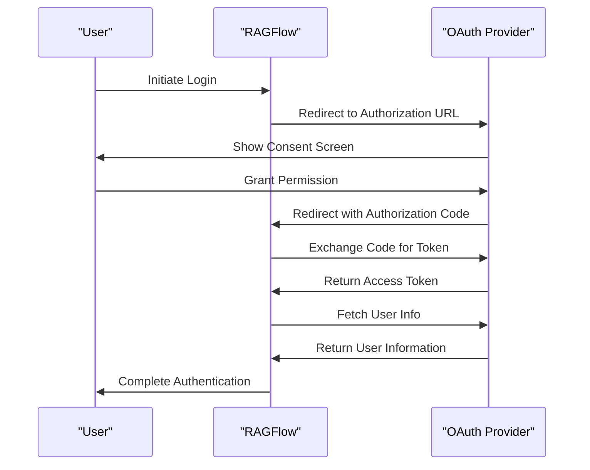
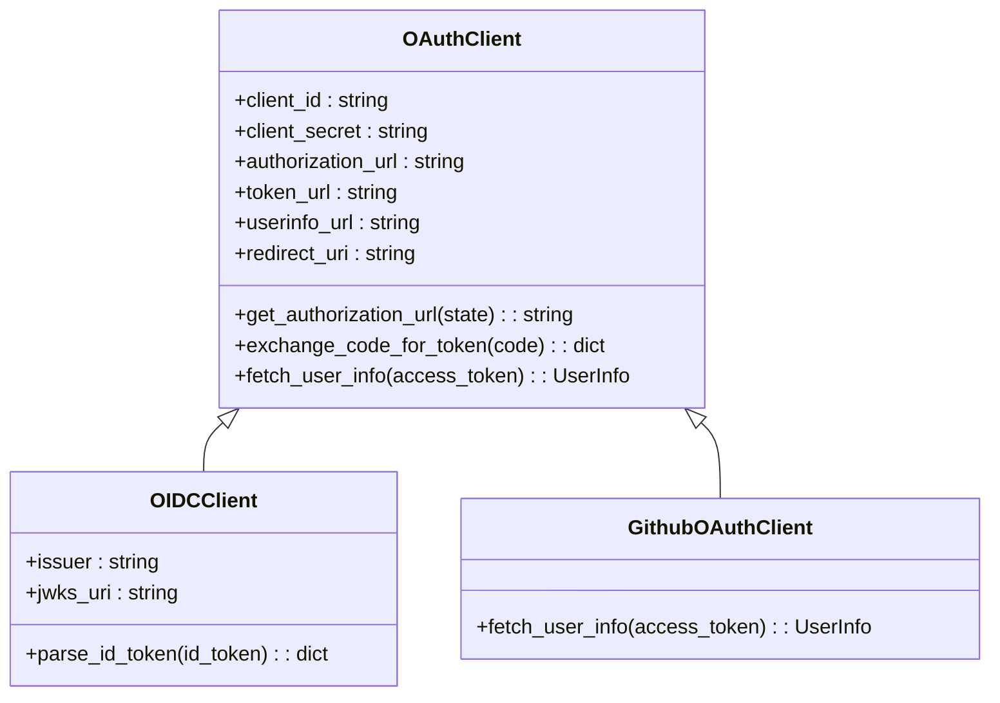
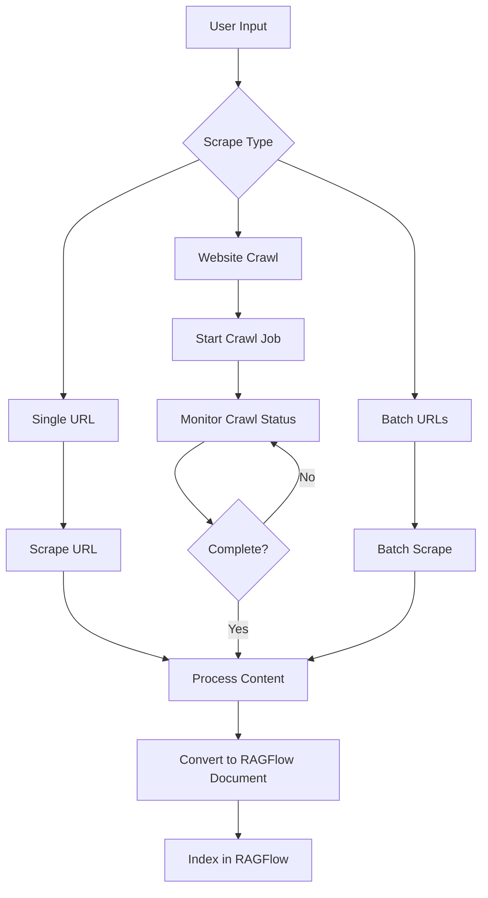

# Integrations

<cite>
**Referenced Files in This Document**   
- [google_drive/connector.py](file://common/data_source/google_drive/connector.py)
- [jira/connector.py](file://common/data_source/jira/connector.py)
- [confluence_connector.py](file://common/data_source/confluence_connector.py)
- [oauth.py](file://api/apps/auth/oauth.py)
- [oidc.py](file://api/apps/auth/oidc.py)
- [github.py](file://api/apps/auth/github.py)
- [firecrawl_connector.py](file://intergrations/firecrawl/firecrawl_connector.py)
- [firecrawl_processor.py](file://intergrations/firecrawl/firecrawl_processor.py)
- [firecrawl_ui.py](file://intergrations/firecrawl/firecrawl_ui.py)
- [extension_chrome/manifest.json](file://intergrations/extension_chrome/manifest.json)
- [extension_chrome/popup.js](file://intergrations/extension_chrome/popup.js)
- [chatgpt-on-wechat/plugins/ragflow_chat.py](file://intergrations/chatgpt-on-wechat/plugins/ragflow_chat.py)
- [interfaces.py](file://common/data_source/interfaces.py)
- [plugin_manager.py](file://plugin/plugin_manager.py)
</cite>

## Table of Contents
1. [Introduction](#introduction)
2. [Data Source Connectors](#data-source-connectors)
   - [Google Drive](#google-drive)
   - [Jira](#jira)
   - [Confluence](#confluence)
   - [Other Data Sources](#other-data-sources)
3. [Authentication Providers](#authentication-providers)
   - [OAuth2](#oauth2)
   - [OpenID Connect (OIDC)](#openid-connect-oidc)
   - [GitHub Integration](#github-integration)
4. [Third-Party Extensions](#third-party-extensions)
   - [Browser Extension](#browser-extension)
   - [WeChat Plugin](#wechat-plugin)
   - [Firecrawl Integration](#firecrawl-integration)
5. [Extensibility Model](#extensibility-model)
6. [Configuration and Usage](#configuration-and-usage)
7. [Conclusion](#conclusion)

## Introduction
RAGFlow provides a comprehensive integration framework that enables seamless connectivity with various external systems and platforms. The integration architecture is designed to support three primary extension points: data source connectors, authentication providers, and third-party extensions. This document details the implementation and usage patterns for each integration type, providing practical examples and configuration guidance. The system follows a modular design that allows for easy extensibility and customization to meet diverse enterprise requirements.

## Data Source Connectors
RAGFlow supports a wide range of data source connectors that enable the ingestion of content from various platforms into the knowledge retrieval system. These connectors follow a standardized interface defined in the `interfaces.py` file, ensuring consistency across different implementations. Each connector is responsible for authenticating with the external system, retrieving content, and converting it into a format suitable for RAG processing.

### Google Drive
The Google Drive connector enables RAGFlow to access and index documents stored in Google Drive. It supports various authentication methods including OAuth2 and service account credentials, allowing for both user-level and organization-wide access. The connector can index content from My Drive, shared drives, and files shared with specific users.

The implementation in `google_drive/connector.py` provides several configuration options:
- **include_shared_drives**: Whether to include shared drives in the indexing process
- **include_my_drives**: Whether to include personal drives in the indexing process
- **shared_drive_urls**: Specific shared drive URLs to index
- **my_drive_emails**: Specific user emails whose drives should be indexed
- **shared_folder_urls**: Specific folder URLs to index

The connector handles complex scenarios such as permission synchronization, incremental indexing through checkpoints, and efficient retrieval of large volumes of documents. It also manages rate limiting and error handling to ensure reliable operation.

**Section sources**
- [google_drive/connector.py](file://common/data_source/google_drive/connector.py#L113-L147)

### Jira
The Jira connector retrieves issues and related content from Jira instances, converting them into markdown documents for RAG processing. It supports both Jira Cloud and Server instances through the Atlassian REST API. The connector can be configured to retrieve issues based on project keys, JQL queries, or specific issue labels.

Key features of the Jira connector include:
- Support for comments and attachments
- Configurable field retrieval to optimize performance
- Label-based filtering to exclude certain issues
- Timezone handling for accurate timestamp processing
- Attachment size limits to prevent indexing of large files

The connector implements checkpointed retrieval to support incremental updates, ensuring that only newly created or modified issues are processed in subsequent runs. It also includes comprehensive error handling for scenarios such as authentication failures, permission issues, and rate limiting.

**Section sources**
- [jira/connector.py](file://common/data_source/jira/connector.py#L85-L98)

### Confluence
The Confluence connector indexes pages, blog posts, and attachments from Confluence spaces. It supports both Confluence Cloud and Server/Data Center instances, with appropriate authentication mechanisms for each. The connector handles the conversion of Confluence's storage format to markdown, preserving document structure and metadata.

Configuration options for the Confluence connector include:
- Base URL of the Confluence instance
- Space keys to index
- Page labels to exclude
- User profile overrides for improved metadata
- OAuth2 client credentials for cloud instances

The implementation includes sophisticated error handling and retry logic to deal with the various error conditions that can occur when interacting with the Confluence API. It also manages pagination and rate limiting to ensure efficient retrieval of large amounts of content.

**Section sources**
- [confluence_connector.py](file://common/data_source/confluence_connector.py#L83-L88)

### Other Data Sources
RAGFlow supports a variety of additional data sources through dedicated connectors:

- **Gmail**: Retrieves emails and attachments from Gmail accounts
- **Notion**: Indexes pages and databases from Notion workspaces
- **Slack**: Imports messages and files from Slack channels
- **Discord**: Retrieves messages and media from Discord servers
- **Dropbox**: Accesses files from Dropbox accounts
- **SharePoint**: Integrates with Microsoft SharePoint sites
- **Teams**: Connects to Microsoft Teams channels and files
- **WebDAV**: Supports WebDAV-compatible file storage systems
- **Moodle**: Integrates with Moodle learning management systems

These connectors follow the same interface patterns as the primary connectors, ensuring a consistent experience for administrators and developers. They can be enabled and configured through the RAGFlow administration interface.

## Authentication Providers
RAGFlow supports multiple authentication providers to enable secure access to the system and its integrations. The authentication framework is designed to be extensible, allowing for the addition of new providers as needed.

### OAuth2
The OAuth2 authentication provider enables integration with any OAuth2-compliant identity provider. The implementation in `oauth.py` provides a flexible framework for configuring OAuth2 clients with various providers.

Key components of the OAuth2 implementation:
- **OAuthClient class**: Base class for OAuth2 authentication
- **UserInfo class**: Represents user information retrieved from the identity provider
- **Configuration options**: Client ID, client secret, authorization URL, token URL, userinfo URL, and redirect URI

The OAuth2 client supports both synchronous and asynchronous operations, allowing for efficient handling of authentication flows. It includes methods for generating authorization URLs, exchanging authorization codes for access tokens, and retrieving user information.

**Diagram sources**
- [oauth.py](file://api/apps/auth/oauth.py#L32-L151)

**Section sources**
- [oauth.py](file://api/apps/auth/oauth.py#L32-L151)

### OpenID Connect (OIDC)
The OpenID Connect provider extends the OAuth2 implementation to support the OIDC standard. The `oidc.py` file contains the OIDCClient class, which inherits from OAuthClient and adds OIDC-specific functionality.

Key features of the OIDC implementation:
- Automatic discovery of OIDC metadata from the issuer URL
- JWT token parsing and validation
- Support for signature verification using JWKS
- Claims extraction from ID tokens

The OIDC client uses the issuer URL to automatically discover the necessary endpoints and configuration parameters, reducing the configuration burden for administrators. It validates ID tokens by verifying their signature against the provider's public keys and checking standard claims such as audience and issuer.

**Section sources**
- [oidc.py](file://api/apps/auth/oidc.py#L22-L107)

### GitHub Integration
The GitHub authentication provider enables users to sign in to RAGFlow using their GitHub credentials. The implementation in `github.py` extends the OAuthClient class with GitHub-specific configuration.

Key aspects of the GitHub integration:
- Pre-configured endpoints for GitHub's OAuth2 service
- Request for the "user:email" scope to access user email addresses
- Special handling for retrieving primary email addresses from GitHub's API
- User information normalization to extract display names and profile pictures

The GitHub client automatically configures the necessary URLs and scopes, simplifying setup for administrators. It handles the retrieval of user information, including the primary email address, which requires a separate API call to GitHub's email endpoint.

**Diagram sources**
- [oauth.py](file://api/apps/auth/oauth.py#L32-L151)
- [oidc.py](file://api/apps/auth/oidc.py#L22-L107)
- [github.py](file://api/apps/auth/github.py#L21-L88)

**Section sources**
- [github.py](file://api/apps/auth/github.py#L21-L88)

## Third-Party Extensions
RAGFlow supports various third-party extensions that enhance its functionality and enable integration with popular platforms.

### Browser Extension
The browser extension, located in the `extension_chrome` directory, provides a Chrome extension that integrates RAGFlow with web browsing. The extension allows users to interact with web pages and leverage RAGFlow's capabilities directly from their browser.

Key components of the browser extension:
- **manifest.json**: Defines the extension's metadata, permissions, and entry points
- **popup.html/popup.js**: Creates the user interface that appears when clicking the extension icon
- **background.js**: Runs in the background to handle logic and browser events
- **content.js**: Injects code into web pages to interact with their content

The extension follows Chrome's extension development guidelines and can be loaded in developer mode for testing. It provides a foundation for interacting with web content and could be extended to support additional features such as page summarization or content extraction.

**Section sources**
- [extension_chrome/manifest.json](file://intergrations/extension_chrome/manifest.json)
- [extension_chrome/popup.js](file://intergrations/extension_chrome/popup.js)

### WeChat Plugin
The WeChat plugin, located in the `chatgpt-on-wechat/plugins` directory, enables integration between RAGFlow and the ChatGPT-on-WeChat project. This allows WeChat users to leverage RAGFlow's knowledge retrieval capabilities in their conversations.

Key aspects of the WeChat plugin:
- Integration with the ChatGPT-on-WeChat framework
- Configuration through a dedicated config.json file
- Support for multiple WeChat platforms including personal WeChat, WeChat Public Accounts, and WeCom
- RAGFlow-specific configuration including API key and host

The plugin requires configuration of both the ChatGPT-on-WeChat core project and the RAGFlow plugin itself. Users must set up their RAGFlow instance and obtain an API key before configuring the plugin.

**Section sources**
- [chatgpt-on-wechat/plugins/ragflow_chat.py](file://intergrations/chatgpt-on-wechat/plugins/ragflow_chat.py)

### Firecrawl Integration
The Firecrawl integration adds web scraping capabilities to RAGFlow, enabling the import of web content directly into the knowledge retrieval system. Located in the `intergrations/firecrawl` directory, this integration implements a comprehensive web scraping solution.

Key components of the Firecrawl integration:
- **firecrawl_connector.py**: Handles communication with the Firecrawl API
- **firecrawl_config.py**: Manages configuration settings
- **firecrawl_processor.py**: Processes scraped content for RAGFlow
- **firecrawl_ui.py**: Provides UI components for RAGFlow
- **ragflow_integration.py**: Main integration class

The integration supports multiple scraping modes:
- **Single URL Scraping**: Retrieve content from individual web pages
- **Website Crawling**: Crawl entire websites with job management
- **Batch Processing**: Process multiple URLs simultaneously

It includes robust error handling, rate limiting, and content processing features to ensure reliable operation. The integration converts scraped content into RAGFlow document format, making it ready for retrieval-augmented generation.

**Diagram sources**
- [firecrawl_connector.py](file://intergrations/firecrawl/firecrawl_connector.py#L41-L262)
- [firecrawl_processor.py](file://intergrations/firecrawl/firecrawl_processor.py)
- [firecrawl_ui.py](file://intergrations/firecrawl/firecrawl_ui.py)

**Section sources**
- [firecrawl_connector.py](file://intergrations/firecrawl/firecrawl_connector.py#L41-L262)

## Extensibility Model
RAGFlow's extensibility model is designed to make it easy to add new integrations and extend existing functionality. The system follows several key principles to ensure a consistent and maintainable architecture.

### Interface-Based Design
The integration framework is built around well-defined interfaces that ensure consistency across different implementations. The `interfaces.py` file defines the core interfaces for connectors, including:

- **CheckpointedConnectorWithPermSync**: For connectors that support incremental updates and permission synchronization
- **SlimConnectorWithPermSync**: For connectors that can provide lightweight document references
- **CredentialsConnector**: For connectors that require authentication credentials

These interfaces define the methods that all connectors must implement, ensuring a consistent API for the rest of the system.

### Plugin Architecture
The plugin system, implemented in `plugin_manager.py`, provides a framework for loading and managing plugins. The PluginManager class discovers plugins in specified directories and makes them available to the system.

Key aspects of the plugin architecture:
- Support for different plugin types through the PLUGIN_TYPE_LLM_TOOLS constant
- Dynamic loading of plugins from embedded directories
- Registration of plugins by name for easy access
- Version tracking for loaded plugins

The plugin system enables the addition of new functionality without modifying the core codebase, promoting modularity and maintainability.

### Configuration and Validation
Each integration type follows a consistent pattern for configuration and validation. Configuration options are typically defined in dedicated configuration classes or files, with clear documentation of available options and their default values.

The system includes validation mechanisms to ensure that configurations are correct before attempting to use them. This includes:
- Validation of required fields
- Verification of API keys and credentials
- Testing of connectivity to external systems
- Schema validation for complex configuration objects

### Error Handling and Logging
The integration framework includes comprehensive error handling and logging to ensure reliable operation and facilitate troubleshooting. Each connector implements appropriate error handling for the specific external system it integrates with, while following common patterns for error reporting.

Key error handling features:
- Specific exception types for different error conditions
- Retry logic with exponential backoff for transient failures
- Detailed logging of operations and errors
- Graceful degradation when parts of a system are unavailable

## Configuration and Usage
Configuring and using RAGFlow integrations involves several common steps that apply across different integration types.

### Data Source Configuration
To configure a data source connector:
1. Navigate to the Data Sources section in the RAGFlow administration interface
2. Select the desired data source type
3. Enter the required configuration parameters
4. Test the connection to verify settings
5. Save the configuration and initiate indexing

Each data source has specific configuration requirements, but they generally include:
- Authentication credentials (API keys, OAuth tokens, etc.)
- Target URLs or identifiers
- Scope and filtering options
- Scheduling parameters for periodic indexing

### Authentication Provider Setup
To configure an authentication provider:
1. Access the Authentication section in the administration interface
2. Select the desired provider type (OAuth2, OIDC, GitHub)
3. Enter the provider-specific configuration
4. Test the authentication flow
5. Enable the provider for user access

The configuration typically includes:
- Client credentials (ID and secret)
- Provider endpoints (authorization, token, userinfo)
- Redirect URIs
- Scopes and claims to request

### Extension Installation
To install third-party extensions:
1. Download or clone the extension code
2. Configure any required settings
3. Install the extension according to its specific instructions
4. Test the integration with RAGFlow

For browser extensions, this typically involves loading the extension in developer mode. For plugins like the WeChat integration, it involves configuring both the host application and the RAGFlow plugin.

## Conclusion
RAGFlow's integration framework provides a comprehensive set of tools for connecting with external systems and extending the platform's capabilities. The system supports a wide range of data source connectors, authentication providers, and third-party extensions, all built on a consistent and extensible architecture.

The key strengths of the integration framework include:
- Standardized interfaces that ensure consistency across different implementations
- Comprehensive error handling and logging for reliable operation
- Flexible configuration options to meet diverse requirements
- Extensible architecture that makes it easy to add new integrations

By leveraging these integration points, organizations can connect RAGFlow to their existing systems and workflows, creating a powerful knowledge retrieval solution that meets their specific needs.