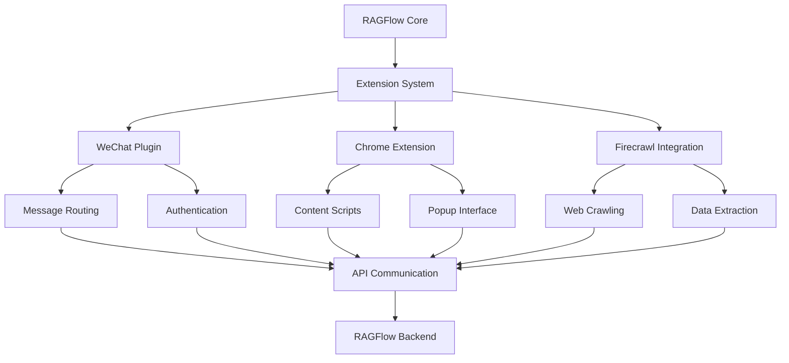
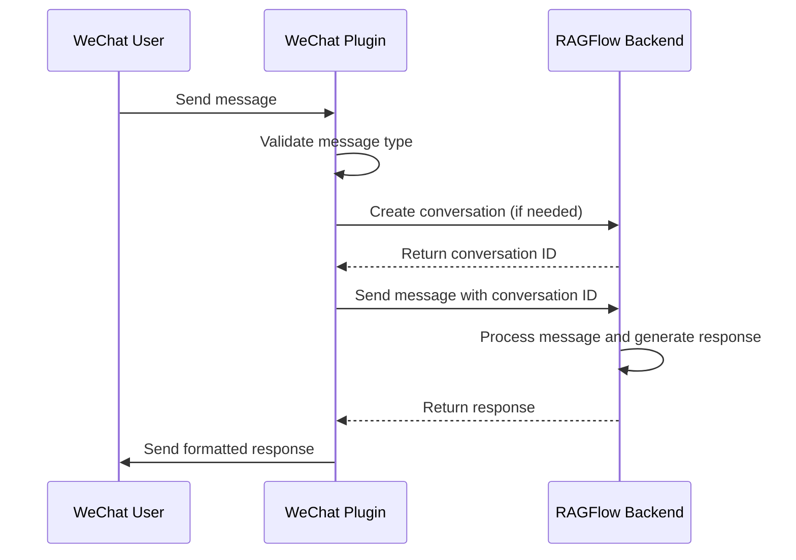
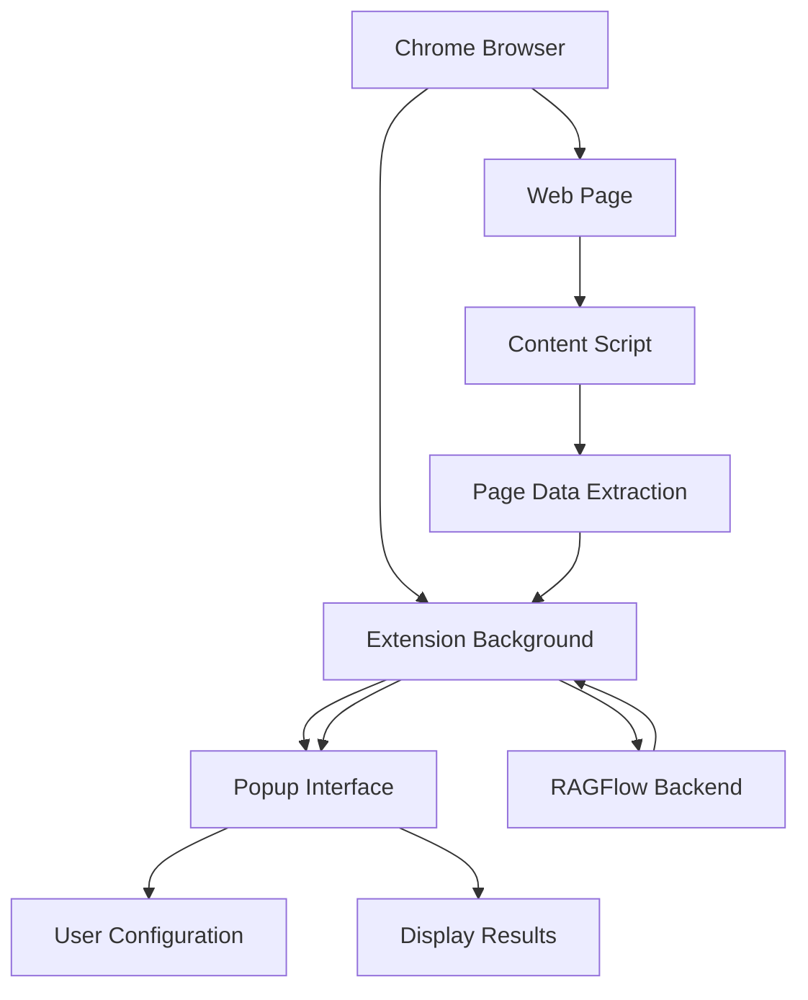
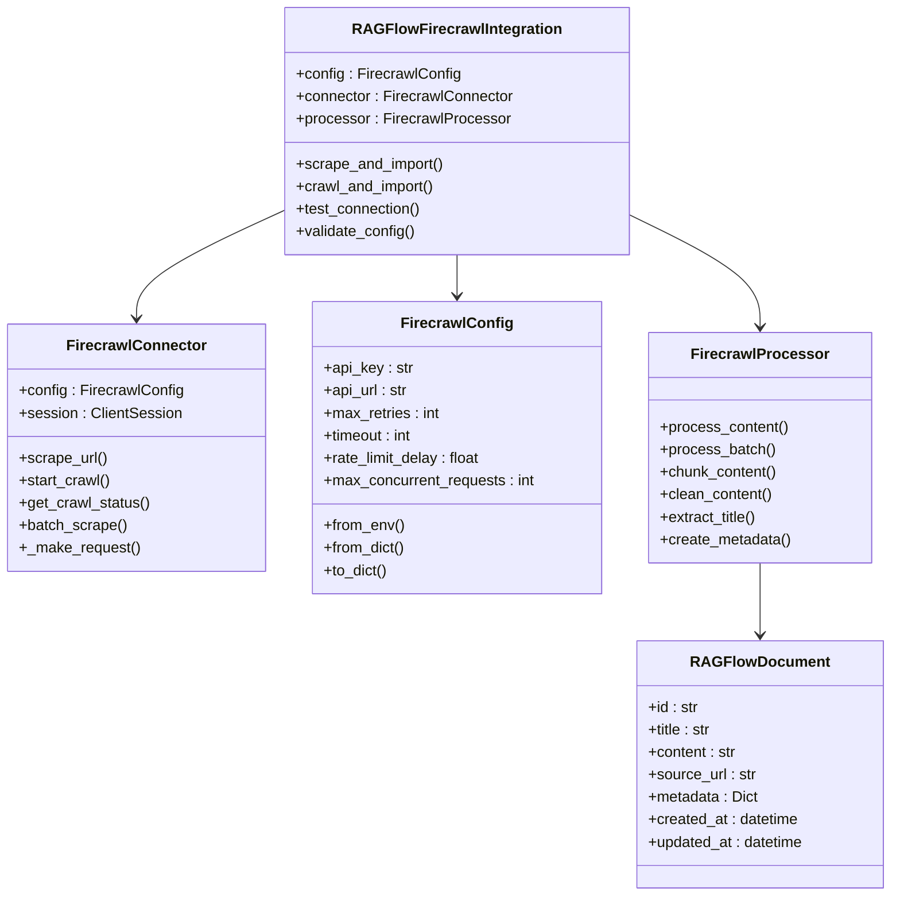

# Third-Party Extensions

<cite>
**Referenced Files in This Document**   
- [ragflow_chat.py](file://intergrations/chatgpt-on-wechat/plugins/ragflow_chat.py)
- [config.json](file://intergrations/chatgpt-on-wechat/plugins/config.json)
- [manifest.json](file://intergrations/extension_chrome/manifest.json)
- [background.js](file://intergrations/extension_chrome/background.js)
- [content.js](file://intergrations/extension_chrome/content.js)
- [popup.js](file://intergrations/extension_chrome/popup.js)
- [options.js](file://intergrations/extension_chrome/options.js)
- [integration.py](file://intergrations/firecrawl/integration.py)
- [ragflow_integration.py](file://intergrations/firecrawl/ragflow_integration.py)
- [firecrawl_connector.py](file://intergrations/firecrawl/firecrawl_connector.py)
- [firecrawl_config.py](file://intergrations/firecrawl/firecrawl_config.py)
- [firecrawl_processor.py](file://intergrations/firecrawl/firecrawl_processor.py)
- [firecrawl_ui.py](file://intergrations/firecrawl/firecrawl_ui.py)
- [README.md](file://intergrations/firecrawl/README.md)
- [example_usage.py](file://intergrations/firecrawl/example_usage.py)
</cite>

## Table of Contents
1. [Introduction](#introduction)
2. [Extension Architecture](#extension-architecture)
3. [WeChat Plugin](#wechat-plugin)
4. [Chrome Extension](#chrome-extension)
5. [Firecrawl Integration](#firecrawl-integration)
6. [Security Considerations](#security-considerations)
7. [Troubleshooting Guide](#troubleshooting-guide)
8. [Extensibility Model](#extensibility-model)
9. [Conclusion](#conclusion)

## Introduction

RAGFlow's ecosystem supports third-party extensions that enable integration with external platforms and services, expanding its capabilities for real-time information retrieval and user interaction. The extension system is designed to connect RAGFlow with various external services through well-defined APIs and integration patterns. This document details the architecture and implementation of three key extensions: the WeChat plugin for chat interactions, the Chrome extension for web browsing enhancement, and the Firecrawl integration for web crawling and data extraction. These extensions demonstrate how RAGFlow can be extended to support diverse use cases while maintaining security and reliability.

**Section sources**
- [README.md](file://intergrations/firecrawl/README.md#L1-L216)

## Extension Architecture

RAGFlow's extension system follows a modular architecture that enables seamless integration with external platforms through standardized interfaces. The architecture consists of three main components: the core integration layer, the communication layer, and the user interface layer. The core integration layer handles the business logic and data processing for each extension, implementing the specific functionality required by the external service. The communication layer manages authentication and data exchange between RAGFlow and external services using secure API calls with bearer token authentication. The user interface layer provides configuration options and interaction points for users to manage their extensions. Each extension follows a plugin pattern with registration mechanisms that allow it to be discovered and loaded by the RAGFlow system. The architecture supports both synchronous and asynchronous operations, with error handling and retry mechanisms to ensure reliability in network communications.

**Diagram sources**
- [ragflow_chat.py](file://intergrations/chatgpt-on-wechat/plugins/ragflow_chat.py#L25-L128)
- [integration.py](file://intergrations/firecrawl/integration.py#L18-L150)
- [background.js](file://intergrations/extension_chrome/background.js#L1-L17)

## WeChat Plugin

The WeChat plugin enables chat interactions through the WeChat platform by integrating RAGFlow's AI capabilities with WeChat's messaging system. The plugin operates as a registered extension that intercepts text messages and routes them to the RAGFlow backend for processing. When a user sends a message through WeChat, the plugin captures the message content and session information, then forwards it to the RAGFlow API for analysis and response generation. The plugin handles authentication using an API key stored in its configuration, ensuring secure communication with the RAGFlow backend. After receiving a response from RAGFlow, the plugin formats the reply appropriately and sends it back through the WeChat platform, creating a seamless conversational experience. The plugin maintains conversation state by storing conversation IDs for each user session, allowing for context-aware interactions across multiple messages.

**Diagram sources**
- [ragflow_chat.py](file://intergrations/chatgpt-on-wechat/plugins/ragflow_chat.py#L25-L128)

**Section sources**
- [ragflow_chat.py](file://intergrations/chatgpt-on-wechat/plugins/ragflow_chat.py#L25-L128)
- [config.json](file://intergrations/chatgpt-on-wechat/plugins/config.json#L1-L5)

## Chrome Extension

The Chrome extension enhances web browsing with RAGFlow capabilities through a content script architecture and popup interface. The extension's architecture consists of three main components: the background service worker, content scripts, and popup interface. The background service worker manages the extension's lifecycle and handles communication between different components. Content scripts are injected into web pages to extract relevant information such as form inputs, headers, and text content, which is then processed and sent to the RAGFlow backend. The popup interface provides a user-friendly way to configure the extension and view RAGFlow-powered insights. The extension uses Chrome's storage API to persist configuration settings such as the RAGFlow base URL, authentication tokens, and shared IDs. When activated, the extension collects page information through content scripts, sends it to the RAGFlow backend for processing, and displays the results in the popup interface, enabling users to leverage RAGFlow's AI capabilities directly from their browser.

**Diagram sources**
- [manifest.json](file://intergrations/extension_chrome/manifest.json#L1-L35)
- [background.js](file://intergrations/extension_chrome/background.js#L1-L17)
- [content.js](file://intergrations/extension_chrome/content.js#L1-L69)
- [popup.js](file://intergrations/extension_chrome/popup.js#L1-L25)

**Section sources**
- [manifest.json](file://intergrations/extension_chrome/manifest.json#L1-L35)
- [background.js](file://intergrations/extension_chrome/background.js#L1-L17)
- [content.js](file://intergrations/extension_chrome/content.js#L1-L69)
- [popup.js](file://intergrations/extension_chrome/popup.js#L1-L25)
- [options.js](file://intergrations/extension_chrome/options.js#L1-L37)

## Firecrawl Integration

The Firecrawl integration enables real-time information retrieval by connecting RAGFlow with Firecrawl's web crawling and data extraction capabilities. This integration implements a comprehensive system for scraping web content and converting it into a format suitable for RAGFlow's processing pipeline. The integration consists of several components: a connector for communicating with the Firecrawl API, a configuration manager for handling API keys and settings, a processor for transforming scraped content into RAGFlow documents, and UI components for user interaction. The integration supports multiple scraping modes including single URL scraping, website crawling, and batch processing of multiple URLs. It handles various output formats such as markdown, HTML, and links, with intelligent content cleaning and normalization. The integration includes robust error handling with retry logic and rate limiting to ensure reliable operation. Configuration validation ensures that API keys are properly formatted and other settings are within acceptable ranges before initiating scraping operations.

**Diagram sources**
- [ragflow_integration.py](file://intergrations/firecrawl/ragflow_integration.py#L15-L176)
- [firecrawl_connector.py](file://intergrations/firecrawl/firecrawl_connector.py#L41-L263)
- [firecrawl_config.py](file://intergrations/firecrawl/firecrawl_config.py#L11-L80)
- [firecrawl_processor.py](file://intergrations/firecrawl/firecrawl_processor.py#L32-L276)

**Section sources**
- [integration.py](file://intergrations/firecrawl/integration.py#L1-L150)
- [ragflow_integration.py](file://intergrations/firecrawl/ragflow_integration.py#L1-L176)
- [firecrawl_connector.py](file://intergrations/firecrawl/firecrawl_connector.py#L1-L263)
- [firecrawl_config.py](file://intergrations/firecrawl/firecrawl_config.py#L1-L80)
- [firecrawl_processor.py](file://intergrations/firecrawl/firecrawl_processor.py#L1-L276)
- [README.md](file://intergrations/firecrawl/README.md#L1-L216)

## Security Considerations

Security considerations for browser extensions and third-party integrations focus on permission models, data privacy, and secure communication. The Chrome extension follows the principle of least privilege by requesting only the necessary permissions: activeTab for accessing the current tab's content, scripting for injecting content scripts, and storage for persisting configuration data. API keys and authentication tokens are stored using Chrome's secure storage API with appropriate encryption. The WeChat plugin uses bearer token authentication with API keys stored in configuration files, ensuring that all communication with the RAGFlow backend is encrypted. The Firecrawl integration implements comprehensive validation of API keys, requiring them to follow the specific format starting with "fc-". All extensions validate input data and implement proper error handling to prevent information leakage. Configuration settings are validated to ensure they fall within acceptable ranges, preventing potential abuse. The extensions communicate with the RAGFlow backend over HTTPS, ensuring data in transit is protected. Sensitive information such as API keys is never exposed in client-side code or logs.

**Section sources**
- [manifest.json](file://intergrations/extension_chrome/manifest.json#L8-L11)
- [ragflow_chat.py](file://intergrations/chatgpt-on-wechat/plugins/ragflow_chat.py#L58-L69)
- [firecrawl_config.py](file://intergrations/firecrawl/firecrawl_config.py#L24-L38)
- [firecrawl_ui.py](file://intergrations/firecrawl/firecrawl_ui.py#L35-L40)

## Troubleshooting Guide

Common issues with extensions include installation failures, connectivity problems, and permission errors. For installation failures, ensure that the extension files are properly placed in the designated directory and that all dependencies are installed. Connectivity problems may occur due to incorrect API keys or network issues; verify the API key format and ensure the RAGFlow backend is accessible. Permission errors in the Chrome extension can be resolved by ensuring the extension has the necessary permissions granted in the browser settings. For the WeChat plugin, check that the configuration file contains valid API key and host address entries. The Firecrawl integration provides a test connection feature to verify the API key and network connectivity before initiating scraping operations. Error messages are logged with sufficient detail to diagnose issues, and the integration includes retry logic to handle transient network problems. Configuration validation helps prevent issues by checking settings before they are applied. Users should ensure that their API keys have not expired and that they have sufficient permissions to access the required services.

**Section sources**
- [ragflow_chat.py](file://intergrations/chatgpt-on-wechat/plugins/ragflow_chat.py#L62-L95)
- [firecrawl_connector.py](file://intergrations/firecrawl/firecrawl_connector.py#L79-L105)
- [firecrawl_config.py](file://intergrations/firecrawl/firecrawl_config.py#L24-L38)
- [firecrawl_ui.py](file://intergrations/firecrawl/firecrawl_ui.py#L207-L224)

## Extensibility Model

The extensibility model for RAGFlow allows developers to create new extensions using available APIs and SDKs. The model is based on a plugin architecture that supports registration of new extensions through decorators and configuration files. Developers can create extensions by implementing the required interfaces and following the established patterns for authentication, configuration, and communication with the RAGFlow backend. The Firecrawl integration serves as a reference implementation, demonstrating how to structure an extension with proper separation of concerns between configuration, connectivity, and processing components. Extensions communicate with the RAGFlow backend through a well-defined API that supports operations such as creating conversations, sending messages, and retrieving responses. The model supports both synchronous and asynchronous operations, allowing for flexible implementation of different use cases. Configuration is handled through JSON files or environment variables, with validation to ensure correctness. The extensibility model includes comprehensive documentation and example code to help developers get started with creating their own extensions.

**Section sources**
- [ragflow_chat.py](file://intergrations/chatgpt-on-wechat/plugins/ragflow_chat.py#L24-L35)
- [integration.py](file://intergrations/firecrawl/integration.py#L96-L149)
- [example_usage.py](file://intergrations/firecrawl/example_usage.py#L1-L262)

## Conclusion

RAGFlow's third-party extension ecosystem provides a robust framework for integrating with external platforms and services, enhancing its capabilities for real-time information retrieval and user interaction. The WeChat plugin, Chrome extension, and Firecrawl integration demonstrate the flexibility and power of this extensibility model, enabling users to leverage RAGFlow's AI capabilities across different contexts. The architecture emphasizes security, reliability, and ease of use, with comprehensive error handling and configuration validation. These extensions follow established patterns for authentication, communication, and data processing, ensuring consistency across different integration points. The extensibility model provides a solid foundation for developers to create new extensions, expanding the RAGFlow ecosystem with additional capabilities. As the platform continues to evolve, these extensions will play a crucial role in connecting RAGFlow with diverse data sources and user interfaces, making AI-powered information retrieval more accessible and effective.