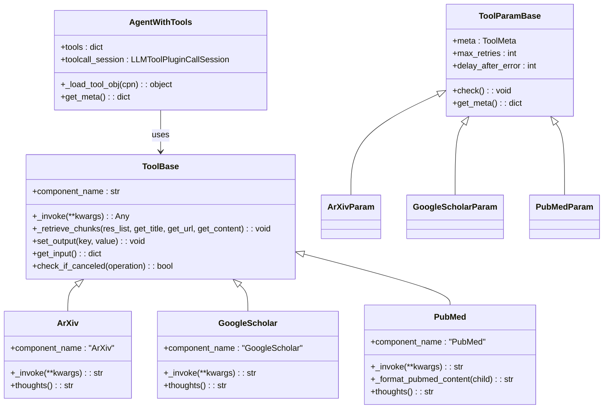
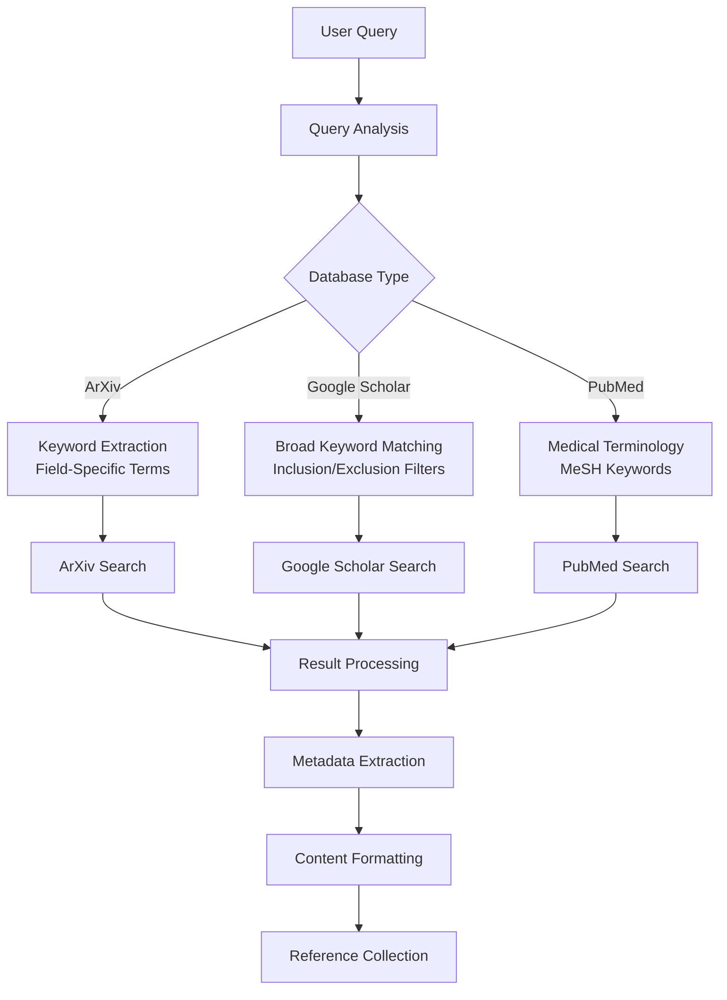
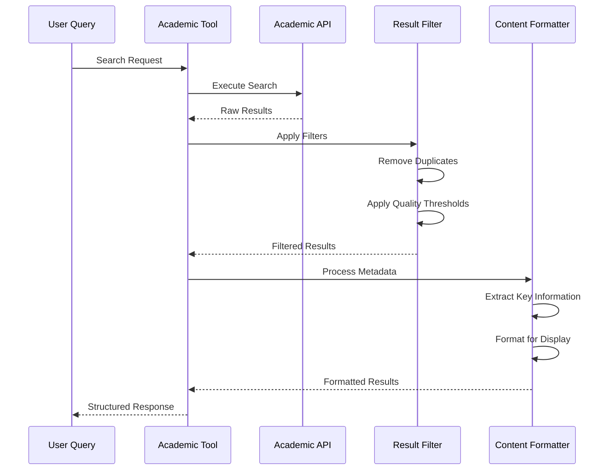
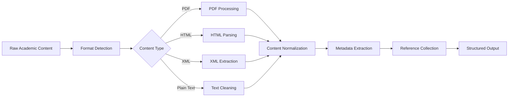
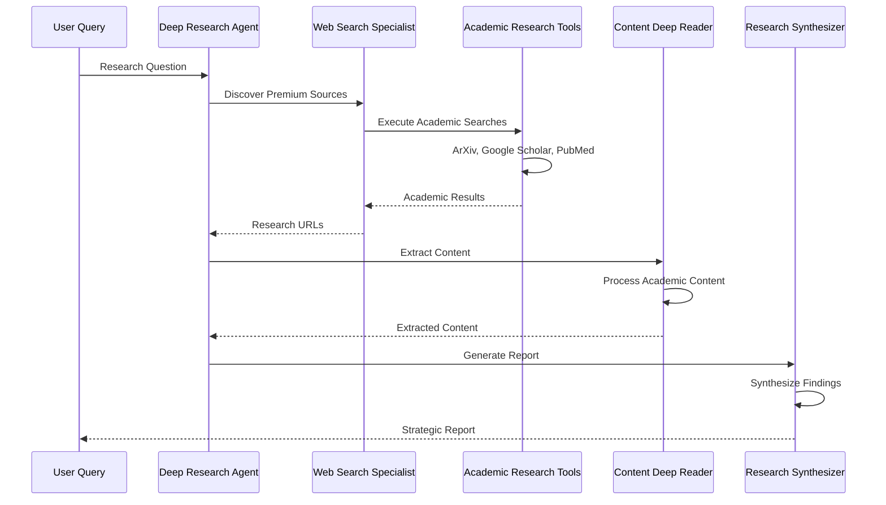
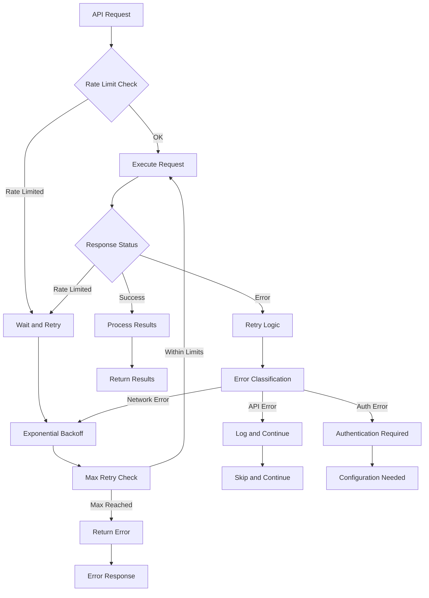
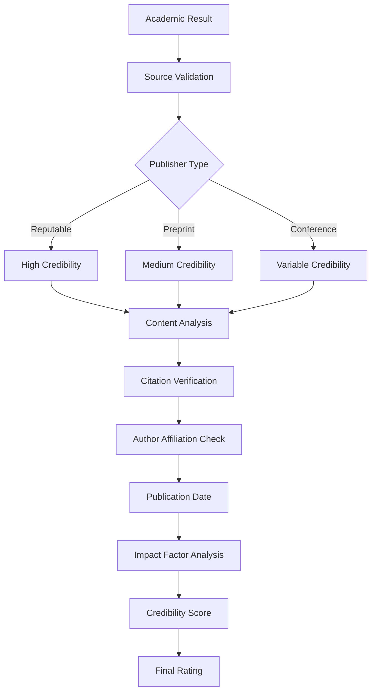

# Academic Research Tools

<cite>
**Referenced Files in This Document**
- [agent/tools/arxiv.py](file://agent/tools/arxiv.py)
- [agent/tools/googlescholar.py](file://agent/tools/googlescholar.py)
- [agent/tools/pubmed.py](file://agent/tools/pubmed.py)
- [agent/tools/base.py](file://agent/tools/base.py)
- [agent/templates/deep_research.json](file://agent/templates/deep_research.json)
- [agent/component/agent_with_tools.py](file://agent/component/agent_with_tools.py)
- [common/data_source/utils.py](file://common/data_source/utils.py)
- [api/db/services/common_service.py](file://api/db/services/common_service.py)
</cite>

## Table of Contents
1. [Introduction](#introduction)
2. [System Architecture](#system-architecture)
3. [Academic Database Integrations](#academic-database-integrations)
4. [Search Capabilities and Metadata Retrieval](#search-capabilities-and-metadata-retrieval)
5. [Full-Text Access Patterns](#full-text-access-patterns)
6. [Agent Workflow Integration](#agent-workflow-integration)
7. [Authentication and Rate Limiting](#authentication-and-rate-limiting)
8. [Best Practices for Academic Queries](#best-practices-for-academic-queries)
9. [Credibility Evaluation Framework](#credibility-evaluation-framework)
10. [Troubleshooting and Error Handling](#troubleshooting-and-error-handling)
11. [Performance Optimization](#performance-optimization)
12. [Conclusion](#conclusion)

## Introduction

RAGFlow's academic research tools provide sophisticated integration with major scholarly databases including ArXiv, Google Scholar, and PubMed. These tools enable researchers, academics, and professionals to conduct comprehensive literature reviews, find relevant research papers, and extract citation information within automated agent workflows. The system combines powerful search capabilities with robust error handling, rate limiting, and credibility evaluation mechanisms to ensure reliable academic research operations.

The academic research toolkit is built on a modular architecture that allows seamless integration with various agent workflows, particularly the Deep Research template designed for comprehensive literature analysis and strategic reporting. Each academic database integration is optimized for specific use cases while maintaining consistent interfaces and error handling patterns.

## System Architecture

The academic research tools follow RAGFlow's component-based architecture, inheriting from the base ToolBase class and implementing standardized interfaces for search operations, metadata extraction, and result formatting.

**Diagram sources**
- [agent/tools/base.py](file://agent/tools/base.py#L114-L176)
- [agent/tools/arxiv.py](file://agent/tools/arxiv.py#L61-L117)
- [agent/tools/googlescholar.py](file://agent/tools/googlescholar.py#L63-L110)
- [agent/tools/pubmed.py](file://agent/tools/pubmed.py#L69-L165)

**Section sources**
- [agent/tools/base.py](file://agent/tools/base.py#L114-L176)
- [agent/component/agent_with_tools.py](file://agent/component/agent_with_tools.py#L81-L120)

## Academic Database Integrations

### ArXiv Integration

ArXiv provides access to nearly 2.4 million scholarly articles across multiple scientific disciplines including physics, mathematics, computer science, quantitative biology, quantitative finance, statistics, electrical engineering, systems science, and economics. The integration focuses on preprint content that hasn't undergone peer review.

**Key Features:**
- **Search Scope**: Preprint articles across STEM disciplines
- **Metadata Fields**: Title, abstract, authors, publication date, PDF URL
- **Sorting Options**: Relevance, submission date, last updated date
- **Result Limit**: Configurable maximum results (default: 12)
- **Access Pattern**: Direct PDF URL access for full-text retrieval

**Implementation Details:**
The ArXiv tool utilizes the official arxiv library with automatic retry mechanisms and timeout handling. Results are processed through the `_retrieve_chunks` method, which formats academic content with structured metadata including title, URL, and abstract content.

**Section sources**
- [agent/tools/arxiv.py](file://agent/tools/arxiv.py#L25-L117)

### Google Scholar Integration

Google Scholar serves as a comprehensive search engine for scholarly literature across disciplines and sources including articles, theses, books, abstracts, and court opinions from academic publishers, professional societies, online repositories, universities, and other web sites.

**Key Features:**
- **Search Scope**: Broad scholarly literature including patents
- **Metadata Fields**: Title, authors, abstract, publication URL
- **Filter Options**: Year range filtering, patent inclusion
- **Sorting Options**: Relevance, publication date
- **Result Limit**: Configurable maximum results (default: 12)

**Implementation Details:**
The Google Scholar integration uses the scholarly library with built-in rate limiting and error handling. The tool supports patent inclusion filtering and year-range constraints for targeted searches. Results are formatted with author information and abstract content.

**Section sources**
- [agent/tools/googlescholar.py](file://agent/tools/googlescholar.py#L25-L110)

### PubMed Integration

PubMed provides access to MEDLINE, the premier bibliographic database of references and abstracts on life sciences and biomedical topics. It includes older references from the print version of Index Medicus and recent entries before MeSH indexing.

**Key Features:**
- **Search Scope**: Biomedical literature and life sciences
- **Metadata Fields**: Title, authors, journal, volume, issue, pages, DOI, abstract
- **Email Requirement**: Required for API access (configured with default email)
- **Result Limit**: Configurable maximum results (default: 12)
- **XML Processing**: Native XML format with structured content extraction

**Implementation Details:**
The PubMed integration uses the Bio.Entrez module for API communication. Results are processed from XML format, extracting structured metadata including author information, journal details, and DOI references. The tool includes comprehensive error handling for XML parsing and network operations.

**Section sources**
- [agent/tools/pubmed.py](file://agent/tools/pubmed.py#L27-L165)

## Search Capabilities and Metadata Retrieval

### Search Query Construction

Each academic database employs different query construction patterns optimized for their respective content types and search algorithms:

**Diagram sources**
- [agent/tools/arxiv.py](file://agent/tools/arxiv.py#L78-L87)
- [agent/tools/googlescholar.py](file://agent/tools/googlescholar.py#L80-L81)
- [agent/tools/pubmed.py](file://agent/tools/pubmed.py#L87-L88)

### Metadata Field Extraction

The system implements standardized metadata extraction patterns across all academic databases:

| Database | Title Field | URL Field | Abstract Field | Additional Metadata |
|----------|-------------|-----------|----------------|-------------------|
| ArXiv | `r.title` | `r.pdf_url` | `r.summary` | Authors, publication date |
| Google Scholar | `r['bib']['title']` | `r["pub_url"]` | `r['bib'].get('abstract', 'no abstract')` | Authors, citation count |
| PubMed | XML parsing | PMID-based URL | `AbstractText` | Journal, volume, issue, DOI |

### Result Ranking and Filtering

The academic research tools implement sophisticated ranking and filtering mechanisms:

**Diagram sources**
- [agent/tools/base.py](file://agent/tools/base.py#L142-L172)

**Section sources**
- [agent/tools/base.py](file://agent/tools/base.py#L142-L172)

## Full-Text Access Patterns

### PDF Access Strategies

Different academic databases provide varying levels of full-text access:

**ArXiv Full-Text Access:**
- Direct PDF URL provision
- Immediate full-text availability
- No authentication required
- Size limitations handled automatically

**Google Scholar Full-Text Access:**
- Publication URL redirection
- Variable access depending on publisher policies
- May require additional access methods for paywalled content
- Citation tracking and related articles

**PubMed Full-Text Access:**
- PMC (PubMed Central) integration
- Free full-text availability for many articles
- DOI-based linking to publisher archives
- XML structure enables comprehensive content extraction

### Content Processing Pipeline

The system implements a standardized content processing pipeline for academic documents:

**Diagram sources**
- [agent/tools/base.py](file://agent/tools/base.py#L142-L172)

**Section sources**
- [agent/tools/base.py](file://agent/tools/base.py#L142-L172)

## Agent Workflow Integration

### Deep Research Template Integration

The academic research tools are seamlessly integrated into the Deep Research agent template, which provides a comprehensive framework for multi-stage academic research:

**Diagram sources**
- [agent/templates/deep_research.json](file://agent/templates/deep_research.json#L1-L504)

### Tool Orchestration Patterns

The agent system supports sophisticated tool orchestration for academic research:

**Parallel Academic Searches:**
- Simultaneous execution across multiple databases
- Consolidated result processing
- Unified metadata formatting

**Sequential Content Processing:**
- Initial academic search phase
- Content extraction and validation
- Final synthesis and reporting

**Fallback Mechanisms:**
- Database-specific error handling
- Automatic retry with exponential backoff
- Alternative search strategies

**Section sources**
- [agent/templates/deep_research.json](file://agent/templates/deep_research.json#L1-L504)
- [agent/component/agent_with_tools.py](file://agent/component/agent_with_tools.py#L81-L120)

## Authentication and Rate Limiting

### API Authentication Requirements

Each academic database has specific authentication and rate limiting requirements:

**ArXiv API:**
- No explicit authentication required
- Rate limiting handled internally
- Built-in retry mechanisms
- Timeout configuration: 12 seconds default

**Google Scholar API:**
- No official API access
- Uses unofficial scholarly library
- Rate limiting through library implementation
- No explicit authentication needed

**PubMed API:**
- Email requirement for API access
- NCBI rate limiting compliance
- Built-in retry with exponential backoff
- Default email: "A.N.Other@example.com"

### Rate Limiting Implementation

The system implements comprehensive rate limiting and retry mechanisms:

**Diagram sources**
- [common/data_source/utils.py](file://common/data_source/utils.py#L113-L149)
- [api/db/services/common_service.py](file://api/db/services/common_service.py#L25-L35)

### Error Handling Patterns

The academic research tools implement robust error handling with multiple retry attempts:

**Retry Configuration:**
- Maximum retries: Configurable per tool
- Delay after errors: Exponential backoff
- Timeout handling: Individual per tool
- Cancellation support: Graceful shutdown

**Error Categories:**
- Network connectivity issues
- API rate limiting
- Authentication failures
- Content processing errors
- Database-specific errors

**Section sources**
- [common/data_source/utils.py](file://common/data_source/utils.py#L113-L149)
- [api/db/services/common_service.py](file://api/db/services/common_service.py#L25-L35)

## Best Practices for Academic Queries

### Query Construction Guidelines

Effective academic search queries require careful consideration of terminology and search strategies:

**Keyword Selection:**
- Use domain-specific terminology
- Include synonyms and related terms
- Employ Boolean operators for complex queries
- Consider MeSH terms for PubMed searches

**Search Strategy Patterns:**

| Query Type | ArXiv Pattern | Google Scholar Pattern | PubMed Pattern |
|------------|---------------|----------------------|----------------|
| Basic Topic | `"machine learning"` | `"machine learning"` | `"machine learning"[All Fields]` |
| Specific Method | `"neural networks"` | `"neural networks"` | `"neural networks"[All Fields]` |
| Temporal Range | `"2020-2024"` | `"2020-2024"` | `"2020/01/01"[PDAT] : "2024/12/31"[PDAT]` |
| Geographic Focus | `"global warming"` | `"global warming"` | `"global warming"[All Fields]` |
| Author/Citation | `"Smith et al"` | `"Smith et al"` | `"Smith"[Author]` |

### Advanced Search Techniques

**Boolean Operators:**
- Use AND, OR, NOT for complex queries
- Parentheses for grouping
- Wildcards for variant terms

**Field-Specific Searches:**
- Title, abstract, author, journal fields
- Publication date ranges
- Subject classification codes

**Citation Tracking:**
- Track cited references
- Monitor recent citations
- Identify influential works

### Query Optimization Strategies

**Iterative Refinement:**
1. Initial broad search
2. Result analysis and refinement
3. Narrowed focused search
4. Final result consolidation

**Cross-Database Validation:**
- Compare results across databases
- Verify citation counts and metrics
- Cross-reference author affiliations

**Temporal Analysis:**
- Track publication trends
- Identify emerging topics
- Analyze citation patterns over time

## Credibility Evaluation Framework

### Source Quality Assessment

The academic research tools implement comprehensive credibility evaluation mechanisms:

**Source Credibility Metrics:**

| Metric | ArXiv | Google Scholar | PubMed |
|--------|-------|----------------|--------|
| Peer Review Status | Preprint (No) | Varies | Yes |
| Publisher Type | Preprint servers | Mixed | Academic publishers |
| Citation Tracking | Limited | Extensive | Comprehensive |
| Author Affiliations | Varied | Varied | Academic institutions |
| Publication Quality | Preprint quality | Varies | High standards |

### Content Validation Patterns

**Diagram sources**
- [agent/tools/base.py](file://agent/tools/base.py#L142-L172)

### Quality Assurance Measures

**Content Verification:**
- Cross-reference with multiple sources
- Verify author credentials
- Check publication history
- Validate citation patterns

**Bias Detection:**
- Identify promotional content
- Detect funding conflicts
- Analyze publication venue
- Review author affiliations

**Accuracy Validation:**
- Verify numerical data
- Cross-check statistical claims
- Validate experimental results
- Check methodological soundness

**Section sources**
- [agent/tools/base.py](file://agent/tools/base.py#L142-L172)

## Troubleshooting and Error Handling

### Common Issues and Solutions

**Network Connectivity Problems:**
- Verify internet connection
- Check firewall settings
- Validate DNS resolution
- Test API endpoints manually

**Authentication Failures:**
- Verify email configuration for PubMed
- Check API key validity
- Validate rate limiting compliance
- Review account status

**Search Result Issues:**
- Verify query syntax
- Check result limits
- Validate search parameters
- Test with simpler queries

**Content Processing Errors:**
- Verify file formats
- Check encoding issues
- Validate XML structure
- Review content size limits

### Diagnostic Procedures

**System Health Checks:**
1. Verify tool initialization
2. Test API connectivity
3. Check parameter validation
4. Validate output formatting

**Performance Monitoring:**
- Monitor response times
- Track error rates
- Analyze success rates
- Review resource utilization

**Debug Information:**
- Enable detailed logging
- Capture API responses
- Validate input parameters
- Trace execution flow

### Recovery Strategies

**Automatic Recovery:**
- Implement exponential backoff
- Use circuit breaker patterns
- Provide fallback alternatives
- Maintain graceful degradation

**Manual Intervention:**
- Configure retry parameters
- Override default timeouts
- Modify search parameters
- Switch to alternative tools

**Section sources**
- [agent/tools/base.py](file://agent/tools/base.py#L142-L172)

## Performance Optimization

### Search Performance Tuning

**Query Optimization:**
- Use specific field searches
- Limit result sets appropriately
- Employ caching for repeated queries
- Batch similar requests

**Resource Management:**
- Monitor memory usage
- Control concurrent requests
- Implement connection pooling
- Optimize data transfer

**Caching Strategies:**
- Cache frequently accessed results
- Implement TTL-based expiration
- Use distributed caching
- Monitor cache hit rates

### Scalability Considerations

**Horizontal Scaling:**
- Distribute search load
- Implement load balancing
- Use multiple API endpoints
- Scale independently per tool

**Vertical Scaling:**
- Increase memory allocation
- Optimize processing algorithms
- Improve network bandwidth
- Enhance storage capacity

**Monitoring and Alerting:**
- Track performance metrics
- Set up alert thresholds
- Monitor resource utilization
- Implement automated scaling

## Conclusion

RAGFlow's academic research tools provide a comprehensive solution for accessing scholarly publications through ArXiv, Google Scholar, and PubMed integrations. The system's modular architecture, robust error handling, and sophisticated agent workflow integration make it an effective platform for conducting academic research and literature reviews.

Key strengths of the academic research toolkit include:

- **Comprehensive Database Coverage**: Access to multiple academic databases with specialized search capabilities
- **Robust Error Handling**: Built-in retry mechanisms, rate limiting, and graceful degradation
- **Flexible Query Support**: Advanced search patterns and query optimization techniques
- **Quality Assurance**: Credibility evaluation and content validation frameworks
- **Seamless Integration**: Native support within agent workflows and research templates

The academic research tools are designed to handle the complexities of scholarly information retrieval while maintaining reliability and performance at scale. Through continuous improvement and community feedback, these tools continue to evolve to meet the growing demands of academic research and professional knowledge management.

Future enhancements may include expanded database integrations, improved natural language query processing, enhanced citation analysis capabilities, and advanced analytics for research trend identification. The modular architecture ensures that new academic databases and research tools can be easily integrated into the existing framework.