# Agent Tools System Documentation

<cite>
**Referenced Files in This Document**
- [agent/tools/__init__.py](file://agent/tools/__init__.py)
- [agent/tools/base.py](file://agent/tools/base.py)
- [agent/tools/tavily.py](file://agent/tools/tavily.py)
- [agent/tools/exesql.py](file://agent/tools/exesql.py)
- [agent/tools/code_exec.py](file://agent/tools/code_exec.py)
- [agent/tools/crawler.py](file://agent/tools/crawler.py)
- [agent/tools/github.py](file://agent/tools/github.py)
- [agent/tools/google.py](file://agent/tools/google.py)
- [agent/tools/retrieval.py](file://agent/tools/retrieval.py)
- [agent/tools/wikipedia.py](file://agent/tools/wikipedia.py)
- [agent/tools/pubmed.py](file://agent/tools/pubmed.py)
- [agent/test/dsl_examples/exesql.json](file://agent/test/dsl_examples/exesql.json)
- [agent/test/dsl_examples/tavily_and_generate.json](file://agent/test/dsl_examples/tavily_and_generate.json)
- [sandbox/executor_manager/core/container.py](file://sandbox/executor_manager/core/container.py)
- [sandbox/executor_manager/services/execution.py](file://sandbox/executor_manager/services/execution.py)
- [sandbox/tests/sandbox_security_tests_full.py](file://sandbox/tests/sandbox_security_tests_full.py)
- [common/data_source/utils.py](file://common/data_source/utils.py)
</cite>

## Table of Contents
1. [Introduction](#introduction)
2. [System Architecture](#system-architecture)
3. [Base Class Architecture](#base-class-architecture)
4. [Core Tool Implementations](#core-tool-implementations)
5. [Security and Safety Mechanisms](#security-and-safety-mechanisms)
6. [Configuration and Authentication](#configuration-and-authentication)
7. [Tool Composition and Workflows](#tool-composition-and-workflows)
8. [Best Practices and Guidelines](#best-practices-and-guidelines)
9. [Extension Patterns](#extension-patterns)
10. [Troubleshooting and Debugging](#troubleshooting-and-debugging)

## Introduction

The Agent Tools System is a comprehensive framework that enables AI agents to interact with external services, databases, and execute code in secure, controlled environments. This system provides a unified interface for various tools including web search, database queries, code execution, and data retrieval, all built around a robust base architecture that ensures security, reliability, and extensibility.

The system supports multiple programming languages, implements sophisticated error handling and retry mechanisms, and provides seamless integration with third-party APIs and services. Each tool follows a standardized pattern while maintaining flexibility for specific use cases.

## System Architecture

The agent tools system follows a modular architecture with clear separation of concerns:

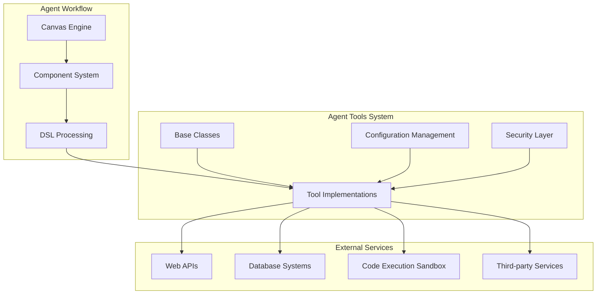

**Diagram sources**
- [agent/tools/base.py](file://agent/tools/base.py#L1-L176)
- [agent/tools/__init__.py](file://agent/tools/__init__.py#L1-L48)

### Key Architectural Principles

1. **Modularity**: Each tool is implemented as a separate module with clear interfaces
2. **Extensibility**: New tools can be added following established patterns
3. **Security**: All external calls are sandboxed and monitored
4. **Reliability**: Built-in retry mechanisms and error handling
5. **Standardization**: Consistent API patterns across all tools

**Section sources**
- [agent/tools/base.py](file://agent/tools/base.py#L1-L176)
- [agent/tools/__init__.py](file://agent/tools/__init__.py#L1-L48)

## Base Class Architecture

The foundation of the agent tools system is built on two primary base classes that provide common functionality and enforce consistent patterns across all tool implementations.

### ToolParamBase Class

The `ToolParamBase` class serves as the parameter definition and validation layer for all tools:

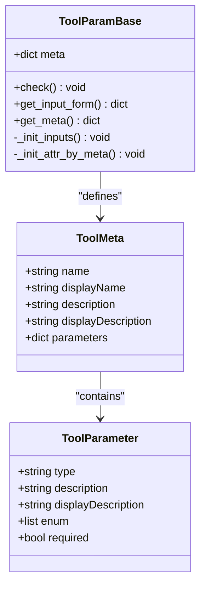

**Diagram sources**
- [agent/tools/base.py](file://agent/tools/base.py#L29-L43)
- [agent/tools/base.py](file://agent/tools/base.py#L65-L111)

### ToolBase Class

The `ToolBase` class provides the execution framework and common functionality:

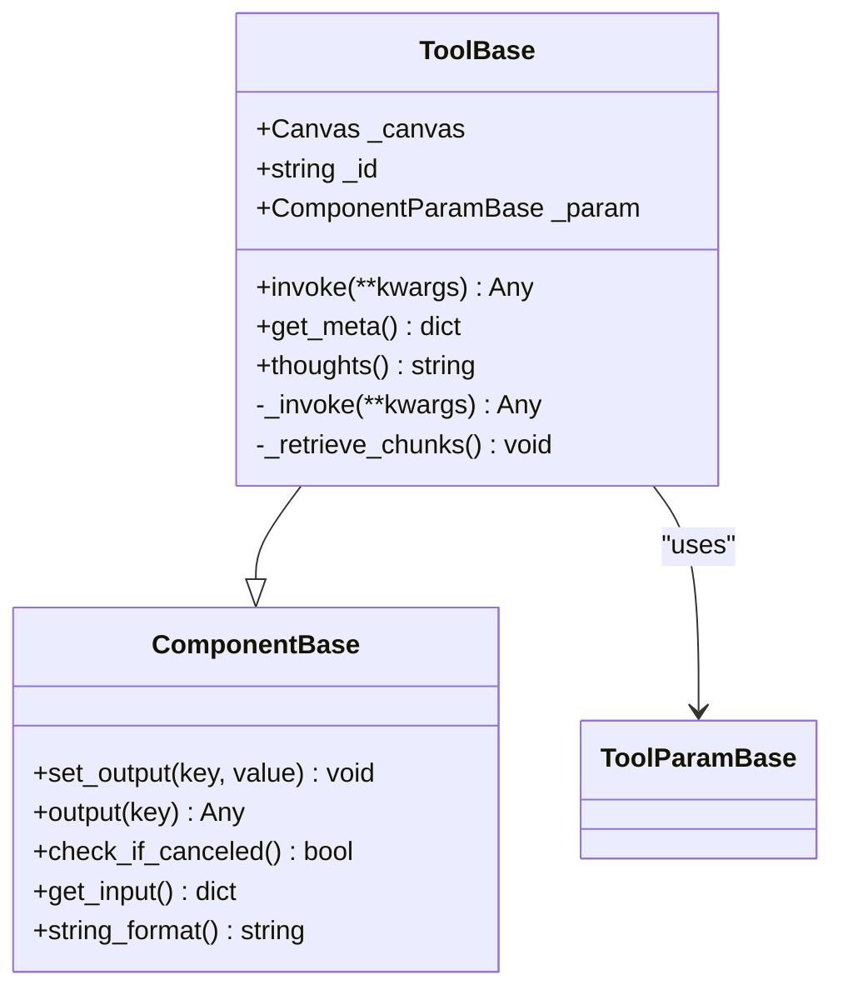

**Diagram sources**
- [agent/tools/base.py](file://agent/tools/base.py#L114-L176)

### Core Features of Base Classes

1. **Parameter Validation**: Automatic validation of input parameters
2. **Output Management**: Standardized output handling and formatting
3. **Error Handling**: Consistent error reporting and logging
4. **Cancellation Support**: Graceful task cancellation
5. **Reference Management**: Automatic reference tracking for knowledge bases

**Section sources**
- [agent/tools/base.py](file://agent/tools/base.py#L114-L176)

## Core Tool Implementations

The system includes numerous specialized tools, each designed for specific use cases while following the common base architecture.

### Web Search Tools

#### Tavily Search Tool

The Tavily tool provides optimized search capabilities for Large Language Models:

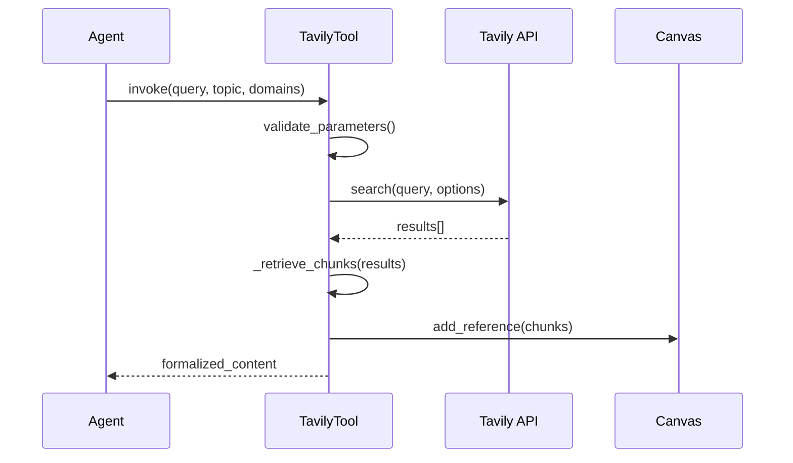

**Diagram sources**
- [agent/tools/tavily.py](file://agent/tools/tavily.py#L101-L154)

Key features:
- Optimized for LLM consumption
- Supports news and general search topics
- Domain filtering and exclusion
- Advanced content extraction
- Built-in retry mechanisms

#### Google Search Tool

Provides comprehensive Google search functionality:

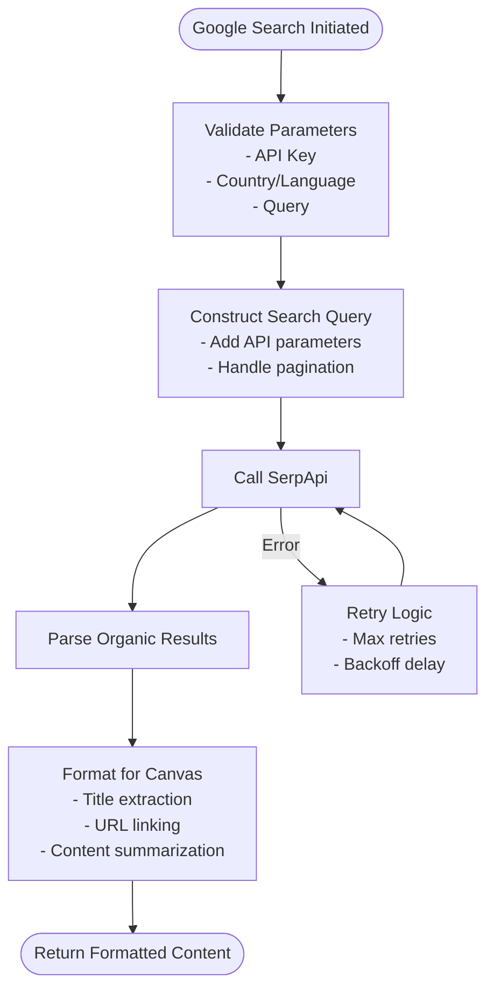

**Diagram sources**
- [agent/tools/google.py](file://agent/tools/google.py#L116-L173)

### Database Tools

#### ExeSQL Tool

The ExeSQL tool provides secure database query execution:

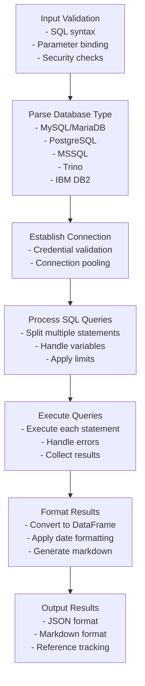

**Diagram sources**
- [agent/tools/exesql.py](file://agent/tools/exesql.py#L79-L276)

Security features:
- Database name and password validation
- Connection string sanitization
- Query result size limits
- Support for multiple database types

**Section sources**
- [agent/tools/tavily.py](file://agent/tools/tavily.py#L1-L252)
- [agent/tools/google.py](file://agent/tools/google.py#L1-L173)
- [agent/tools/exesql.py](file://agent/tools/exesql.py#L1-L276)

### Code Execution Tools

#### Code Exec Tool

The Code Exec tool provides secure code execution in isolated sandboxes:

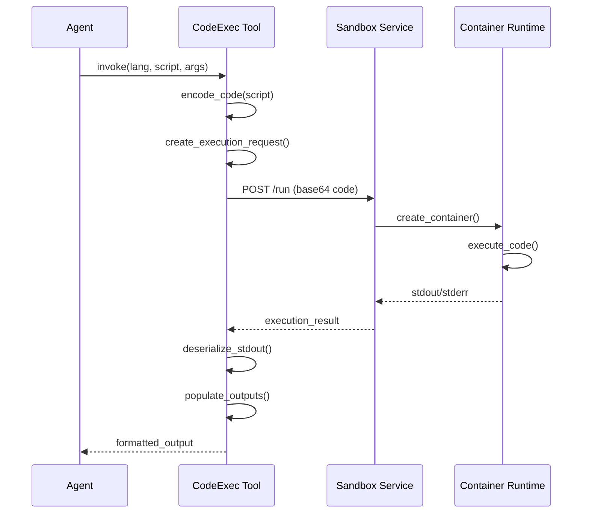

**Diagram sources**
- [agent/tools/code_exec.py](file://agent/tools/code_exec.py#L126-L192)

Security measures:
- Base64 encoding for code transmission
- Isolated container execution
- Resource limits (CPU, memory)
- Seccomp profile enforcement
- Timeout protection

**Section sources**
- [agent/tools/code_exec.py](file://agent/tools/code_exec.py#L1-L344)

### Information Retrieval Tools

#### Retrieval Tool

The Retrieval tool provides access to internal knowledge bases:

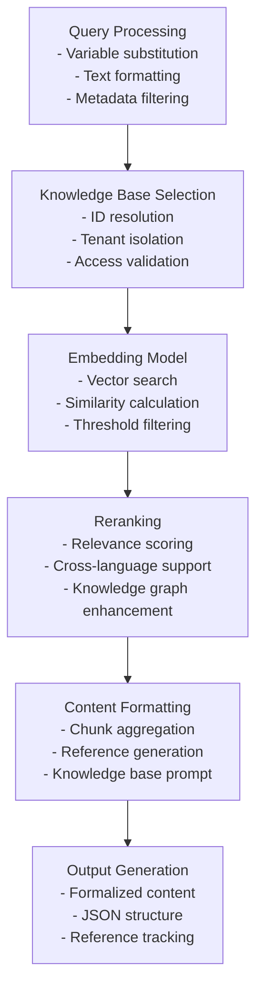

**Diagram sources**
- [agent/tools/retrieval.py](file://agent/tools/retrieval.py#L80-L245)

Advanced features:
- Multi-tenant support
- Cross-language search
- Knowledge graph integration
- Metadata filtering
- Table of contents enhancement

**Section sources**
- [agent/tools/retrieval.py](file://agent/tools/retrieval.py#L1-L251)

## Security and Safety Mechanisms

The agent tools system implements multiple layers of security to protect against malicious code execution and unauthorized access.

### Sandbox Architecture

The code execution sandbox provides isolation through containerization:

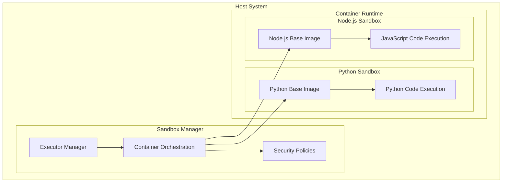

**Diagram sources**
- [sandbox/executor_manager/core/container.py](file://sandbox/executor_manager/core/container.py#L102-L130)

### Security Features

1. **Container Isolation**: Each execution runs in a separate container
2. **Resource Limits**: CPU and memory constraints prevent resource exhaustion
3. **Seccomp Profiles**: System call filtering prevents dangerous operations
4. **Network Isolation**: No outbound network access by default
5. **File System Restrictions**: Read-only filesystem with temporary scratch space

### Code Security Validation

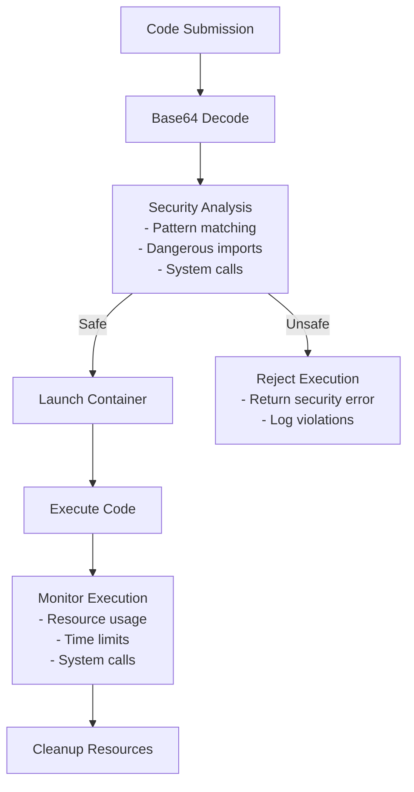

**Diagram sources**
- [sandbox/executor_manager/services/execution.py](file://sandbox/executor_manager/services/execution.py#L236-L265)

**Section sources**
- [sandbox/executor_manager/core/container.py](file://sandbox/executor_manager/core/container.py#L102-L130)
- [sandbox/executor_manager/services/execution.py](file://sandbox/executor_manager/services/execution.py#L236-L265)
- [sandbox/tests/sandbox_security_tests_full.py](file://sandbox/tests/sandbox_security_tests_full.py#L381-L415)

## Configuration and Authentication

Each tool requires specific configuration parameters for authentication and operational settings.

### API Key Management

Most tools require API keys for external service access:

| Tool | Configuration Parameter | Purpose | Security Notes |
|------|------------------------|---------|----------------|
| Tavily | `api_key` | Search API authentication | Store securely, rotate regularly |
| Google | `api_key` | SerpApi authentication | Rate-limited, monitor usage |
| GitHub | None required | Public repository access | No authentication needed |
| PubMed | `email` | Entrez API identification | Must be valid email address |

### Database Configuration

ExeSQL tool requires database connection parameters:

| Parameter | Type | Description | Security Notes |
|-----------|------|-------------|----------------|
| `db_type` | string | Database type (mysql/postgres/mssql/etc.) | Validate against allowed types |
| `host` | string | Database server hostname | Use internal networks when possible |
| `port` | integer | Database server port | Default ports should be configurable |
| `database` | string | Target database name | Validate against allowed databases |
| `username` | string | Database username | Use dedicated service accounts |
| `password` | string | Database password | Encrypt in storage, never log |

### Environment Variables

Critical configuration is managed through environment variables:

- `COMPONENT_EXEC_TIMEOUT`: Default timeout for tool execution (seconds)
- `SANDBOX_HOST`: Host address for code execution sandbox
- `SANDBOX_MAX_MEMORY`: Memory limit for sandbox containers
- `SANDBOX_ENABLE_SECCOMP`: Enable seccomp security policies

**Section sources**
- [agent/tools/tavily.py](file://agent/tools/tavily.py#L78-L86)
- [agent/tools/google.py](file://agent/tools/google.py#L58-L61)
- [agent/tools/exesql.py](file://agent/tools/exesql.py#L47-L54)

## Tool Composition and Workflows

The agent tools system supports complex workflows through tool composition and chaining.

### Basic Tool Chain

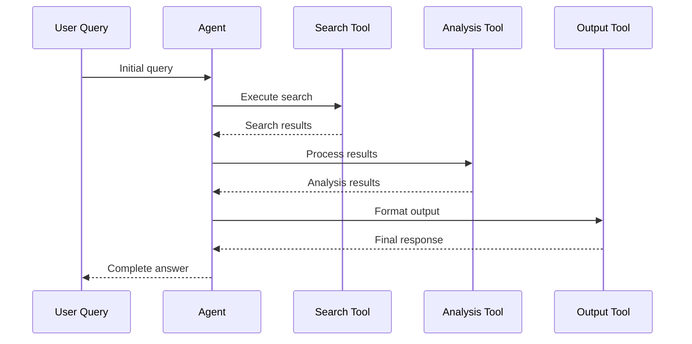

### Multi-Tool Workflows

Complex scenarios often require multiple tools working together:

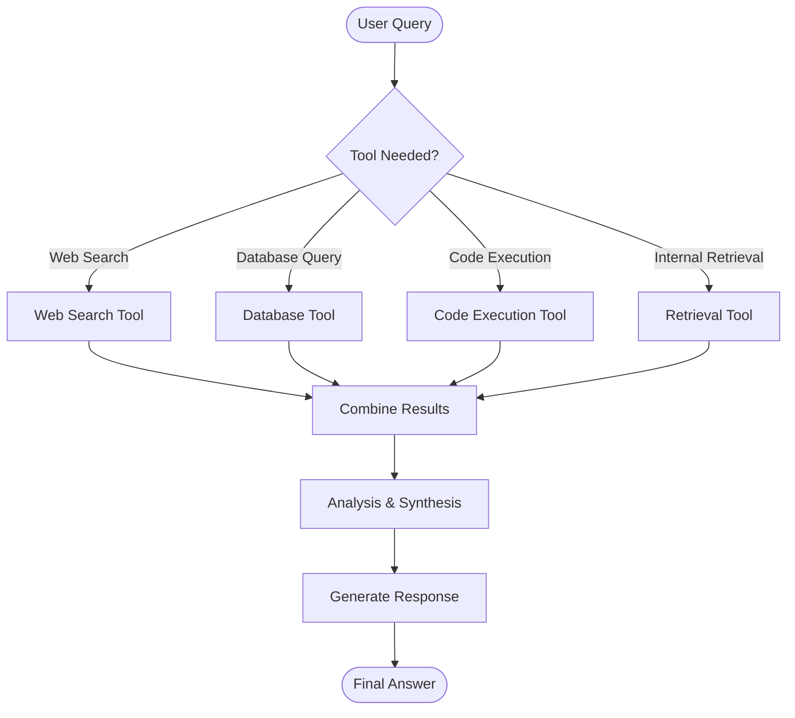

### Template-Based Workflows

The system includes pre-built workflow templates:

1. **Deep Research**: Multi-stage research with multiple search tools
2. **SEO Blog Generation**: Content creation workflow with research and analysis
3. **Market Analysis**: Business intelligence workflow combining data sources
4. **Customer Support**: Multi-channel support with knowledge base integration

**Section sources**
- [agent/test/dsl_examples/tavily_and_generate.json](file://agent/test/dsl_examples/tavily_and_generate.json#L1-L55)
- [agent/test/dsl_examples/exesql.json](file://agent/test/dsl_examples/exesql.json#L1-L44)

## Best Practices and Guidelines

### Error Handling

Implement robust error handling patterns:

1. **Retry Logic**: Use exponential backoff for transient failures
2. **Graceful Degradation**: Provide fallback responses when tools fail
3. **Clear Error Messages**: Human-readable error descriptions
4. **Logging**: Comprehensive logging for debugging and monitoring

### Rate Limiting

Implement appropriate rate limiting:

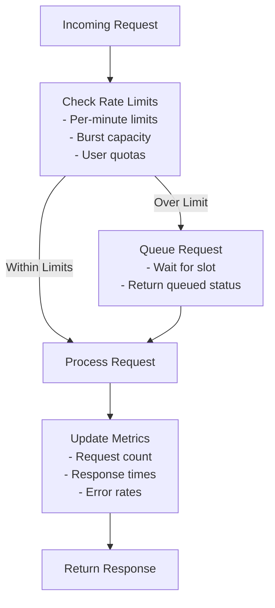

### Performance Optimization

1. **Caching**: Cache frequently accessed data
2. **Connection Pooling**: Reuse database connections
3. **Async Operations**: Use asynchronous processing where possible
4. **Resource Management**: Proper cleanup of resources

### Security Guidelines

1. **Input Validation**: Sanitize all user inputs
2. **Access Control**: Implement proper authorization
3. **Audit Logging**: Log all tool executions
4. **Principle of Least Privilege**: Use minimal required permissions

**Section sources**
- [common/data_source/utils.py](file://common/data_source/utils.py#L113-L250)

## Extension Patterns

Creating new tools follows established patterns that ensure consistency and security.

### Tool Creation Template

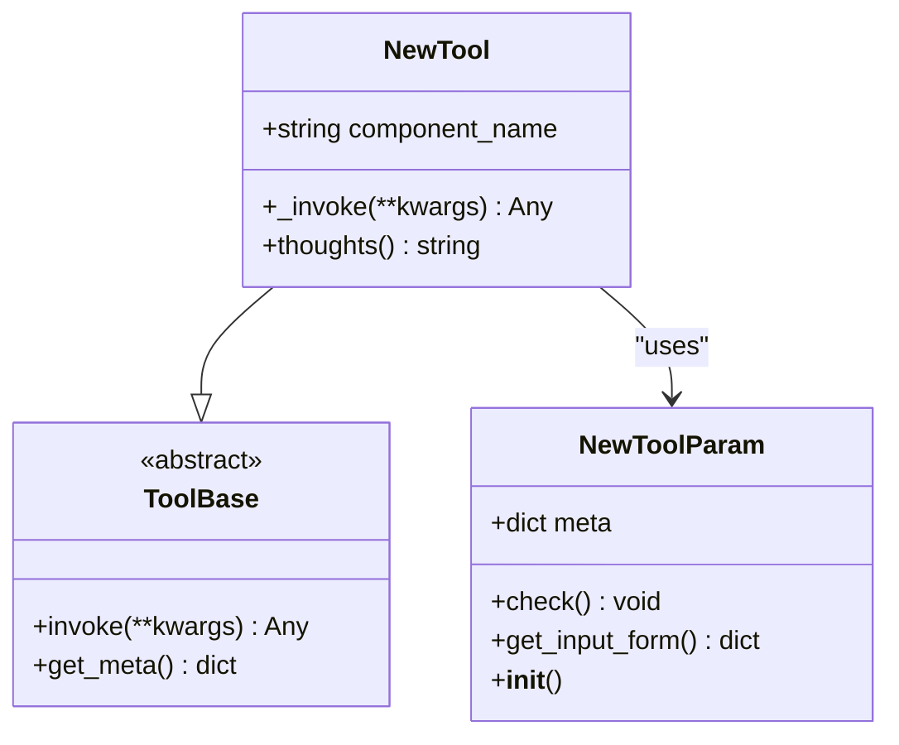

### Implementation Steps

1. **Define Parameters**: Create parameter class inheriting from `ToolParamBase`
2. **Implement Tool**: Create tool class inheriting from `ToolBase`
3. **Add Validation**: Implement `check()` method for parameter validation
4. **Implement Invocation**: Override `_invoke()` method with tool logic
5. **Add Documentation**: Include comprehensive docstrings
6. **Add Tests**: Create unit tests for the new tool

### Integration with Existing Tools

New tools integrate seamlessly with existing infrastructure:

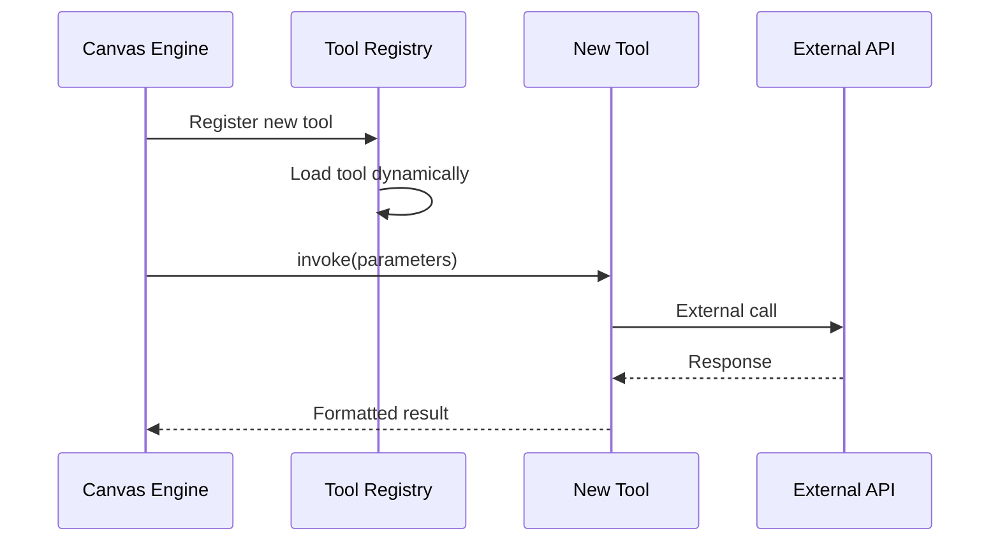

**Section sources**
- [agent/tools/__init__.py](file://agent/tools/__init__.py#L25-L48)

## Troubleshooting and Debugging

### Common Issues and Solutions

#### Authentication Failures

**Problem**: API authentication errors
**Solution**: Verify API keys are correctly configured and not expired

#### Rate Limiting

**Problem**: Requests being throttled
**Solution**: Implement exponential backoff and reduce request frequency

#### Timeout Errors

**Problem**: Long-running operations timing out
**Solution**: Increase timeout values or optimize tool implementation

#### Sandbox Issues

**Problem**: Code execution failing in sandbox
**Solution**: Check container logs and verify security policies

### Debugging Tools

1. **Logging**: Enable debug logging for detailed execution traces
2. **Monitoring**: Use metrics to track tool performance
3. **Testing**: Run security tests to validate sandbox integrity
4. **Validation**: Use parameter validation to catch configuration errors early

### Monitoring and Observability

Key metrics to monitor:

- Tool execution times
- Success/failure rates
- Resource utilization
- Error patterns
- API usage statistics

**Section sources**
- [sandbox/tests/sandbox_security_tests_full.py](file://sandbox/tests/sandbox_security_tests_full.py#L381-L415)