# Code Execution Tools

<cite>
**Referenced Files in This Document**
- [agent/tools/code_exec.py](file://agent/tools/code_exec.py)
- [sandbox/executor_manager/main.py](file://sandbox/executor_manager/main.py)
- [sandbox/executor_manager/services/security.py](file://sandbox/executor_manager/services/security.py)
- [sandbox/executor_manager/services/execution.py](file://sandbox/executor_manager/services/execution.py)
- [sandbox/executor_manager/core/container.py](file://sandbox/executor_manager/core/container.py)
- [sandbox/executor_manager/models/enums.py](file://sandbox/executor_manager/models/enums.py)
- [sandbox/executor_manager/models/schemas.py](file://sandbox/executor_manager/models/schemas.py)
- [sandbox/executor_manager/core/config.py](file://sandbox/executor_manager/core/config.py)
- [sandbox/executor_manager/services/limiter.py](file://sandbox/executor_manager/services/limiter.py)
- [sandbox/executor_manager/api/routes.py](file://sandbox/executor_manager/api/routes.py)
- [sandbox/executor_manager/api/handlers.py](file://sandbox/executor_manager/api/handlers.py)
- [sandbox/executor_manager/util.py](file://sandbox/executor_manager/util.py)
- [sandbox/executor_manager/Dockerfile](file://sandbox/executor_manager/Dockerfile)
- [sandbox/sandbox_base_image/python/Dockerfile](file://sandbox/sandbox_base_image/python/Dockerfile)
- [sandbox/sandbox_base_image/nodejs/Dockerfile](file://sandbox/sandbox_base_image/nodejs/Dockerfile)
</cite>

## Table of Contents
1. [Introduction](#introduction)
2. [System Architecture](#system-architecture)
3. [Code Execution Tool Implementation](#code-execution-tool-implementation)
4. [Security Model](#security-model)
5. [Supported Programming Languages](#supported-programming-languages)
6. [Containerization and Resource Management](#containerization-and-resource-management)
7. [Error Handling and Output Capture](#error-handling-and-output-capture)
8. [Integration with Agent Workflows](#integration-with-agent-workflows)
9. [Best Practices and Security Considerations](#best-practices-and-security-considerations)
10. [Configuration and Deployment](#configuration-and-deployment)
11. [Troubleshooting Guide](#troubleshooting-guide)

## Introduction

The RAGFlow code execution tools provide a secure, sandboxed environment for executing code snippets within agent workflows. This system enables AI agents to perform computational tasks, data processing, and algorithmic operations while maintaining strict security boundaries to prevent malicious code execution.

The code execution framework consists of two primary components:
- **Agent Tool (`code_exec.py`)**: Provides the interface for agents to submit code for execution
- **Sandbox Environment**: A secure, containerized execution environment that isolates code execution from the host system

## System Architecture

The code execution system follows a layered architecture designed for security, scalability, and ease of integration:

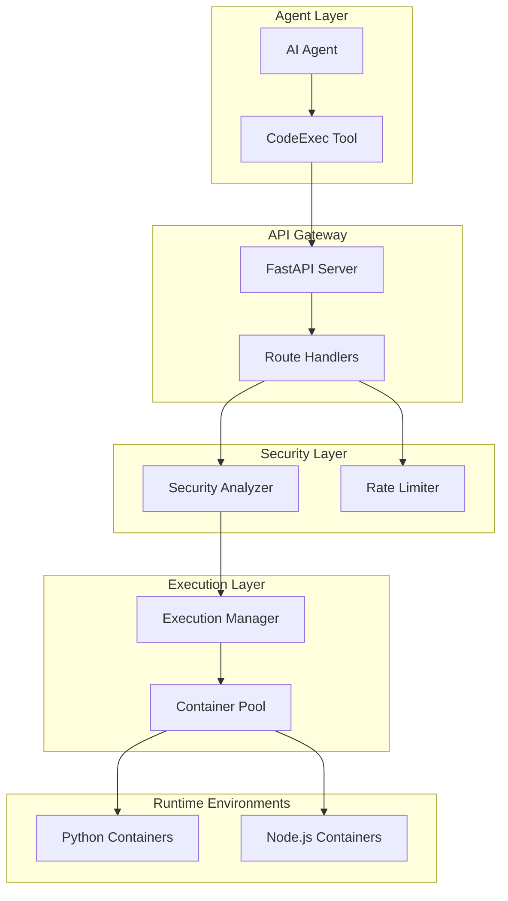

**Diagram sources**
- [agent/tools/code_exec.py](file://agent/tools/code_exec.py#L126-L191)
- [sandbox/executor_manager/main.py](file://sandbox/executor_manager/main.py#L16-L25)
- [sandbox/executor_manager/api/routes.py](file://sandbox/executor_manager/api/routes.py#L16-L24)

**Section sources**
- [agent/tools/code_exec.py](file://agent/tools/code_exec.py#L1-L344)
- [sandbox/executor_manager/main.py](file://sandbox/executor_manager/main.py#L1-L26)

## Code Execution Tool Implementation

### Core Tool Architecture

The `CodeExec` tool serves as the primary interface between AI agents and the sandboxed execution environment. It implements a comprehensive workflow for code submission, validation, and result processing.

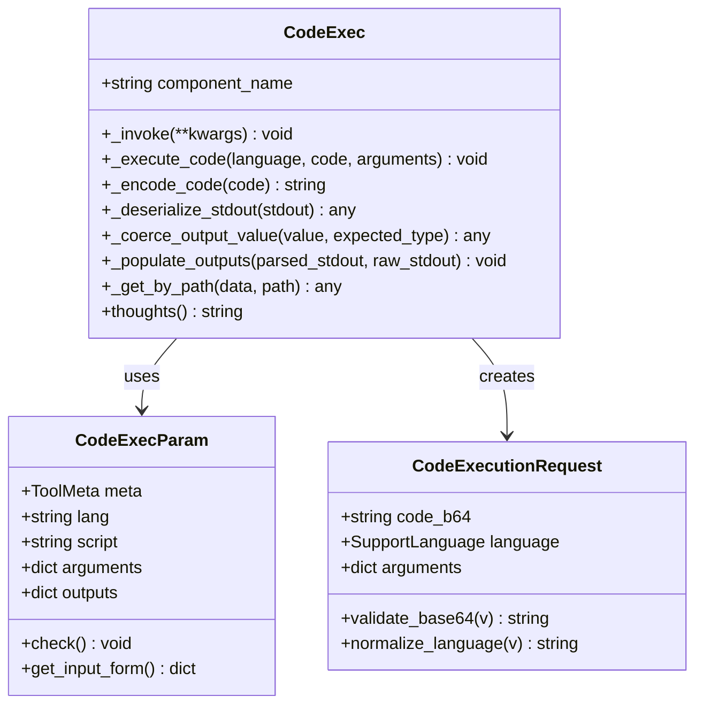

**Diagram sources**
- [agent/tools/code_exec.py](file://agent/tools/code_exec.py#L126-L191)
- [agent/tools/code_exec.py](file://agent/tools/code_exec.py#L63-L114)
- [sandbox/executor_manager/models/schemas.py](file://sandbox/executor_manager/models/schemas.py#L41-L54)

### Tool Parameters and Configuration

The code execution tool supports flexible parameter configuration for different use cases:

| Parameter | Type | Description | Default Value |
|-----------|------|-------------|---------------|
| `lang` | string | Target programming language | "python" |
| `script` | string | Base64-encoded code to execute | Required |
| `arguments` | dict | Runtime arguments passed to main function | {} |

**Section sources**
- [agent/tools/code_exec.py](file://agent/tools/code_exec.py#L63-L114)

### Code Validation and Encoding

The tool implements robust validation mechanisms to ensure code integrity and security:

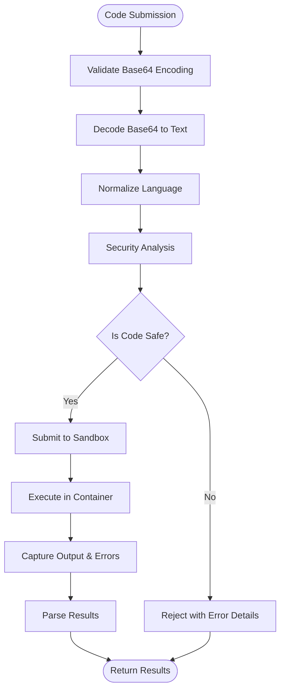

**Diagram sources**
- [sandbox/executor_manager/api/handlers.py](file://sandbox/executor_manager/api/handlers.py#L32-L49)
- [agent/tools/code_exec.py](file://agent/tools/code_exec.py#L145-L191)

**Section sources**
- [agent/tools/code_exec.py](file://agent/tools/code_exec.py#L37-L61)
- [sandbox/executor_manager/api/handlers.py](file://sandbox/executor_manager/api/handlers.py#L32-L49)

## Security Model

### Multi-Layer Security Architecture

The sandbox implements a comprehensive security model with multiple layers of protection:

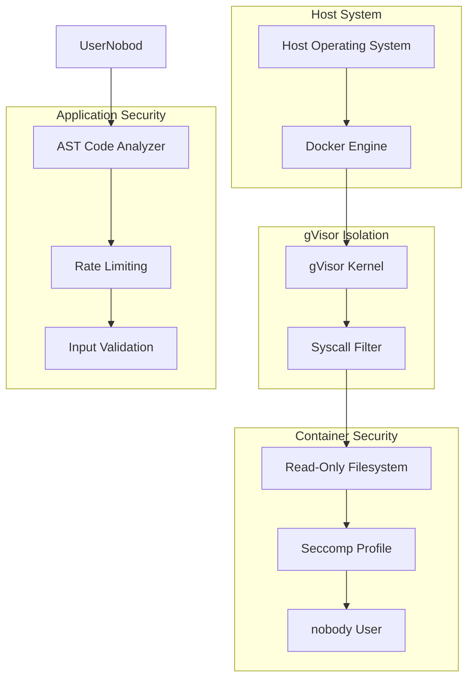

**Diagram sources**
- [sandbox/executor_manager/core/container.py](file://sandbox/executor_manager/core/container.py#L82-L121)
- [sandbox/executor_manager/services/security.py](file://sandbox/executor_manager/services/security.py#L23-L174)

### Dangerous Operations Detection

The security analyzer performs AST-based analysis to detect potentially dangerous code patterns:

| Category | Examples | Detection Method |
|----------|----------|------------------|
| **Dangerous Imports** | `os`, `subprocess`, `sys`, `socket`, `ctypes` | AST Import visitor |
| **Dangerous Functions** | `eval`, `exec`, `open`, `system`, `popen` | AST Call visitor |
| **File Operations** | `shutil.rmtree`, `os.remove`, `os.rename` | Attribute access detection |
| **Network Access** | HTTP clients, socket connections | Module import analysis |
| **Dynamic Code** | String concatenation leading to eval | Binary operation analysis |

**Section sources**
- [sandbox/executor_manager/services/security.py](file://sandbox/executor_manager/services/security.py#L28-L57)

### Container Security Configuration

Each container runs with minimal privileges and restricted access:

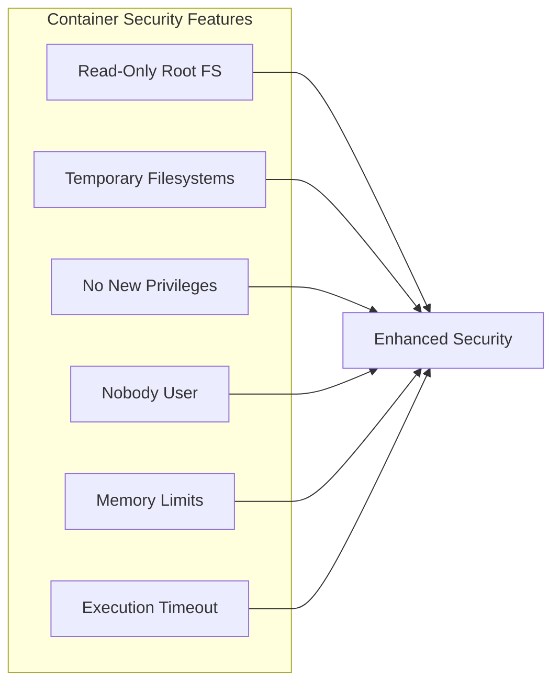

**Diagram sources**
- [sandbox/executor_manager/core/container.py](file://sandbox/executor_manager/core/container.py#L82-L121)

**Section sources**
- [sandbox/executor_manager/core/container.py](file://sandbox/executor_manager/core/container.py#L82-L121)

## Supported Programming Languages

### Python Execution Environment

Python code execution supports modern Python 3.11 with a curated set of libraries:

**Base Image Configuration:**
- Python 3.11 slim bookworm
- Alpine-based package manager (uv)
- Pre-installed security-focused libraries
- Restricted standard library access

**Supported Patterns:**
- Functions with explicit return types
- Standard library modules (safe subset)
- Third-party libraries from requirements.txt
- Async/await patterns for I/O operations

### Node.js Execution Environment

Node.js execution provides JavaScript/TypeScript capabilities:

**Base Image Configuration:**
- Node.js 24 bookworm-slim
- NPM with Chinese mirror registry
- Pre-installed common libraries
- ES module support

**Supported Patterns:**
- Exported main functions
- Async/await with promises
- Standard Node.js modules
- Package.json dependencies

**Section sources**
- [sandbox/sandbox_base_image/python/Dockerfile](file://sandbox/sandbox_base_image/python/Dockerfile#L1-L16)
- [sandbox/sandbox_base_image/nodejs/Dockerfile](file://sandbox/sandbox_base_image/nodejs/Dockerfile#L1-L18)

## Containerization and Resource Management

### Container Pool Architecture

The system maintains a pool of pre-initialized containers for efficient resource utilization:

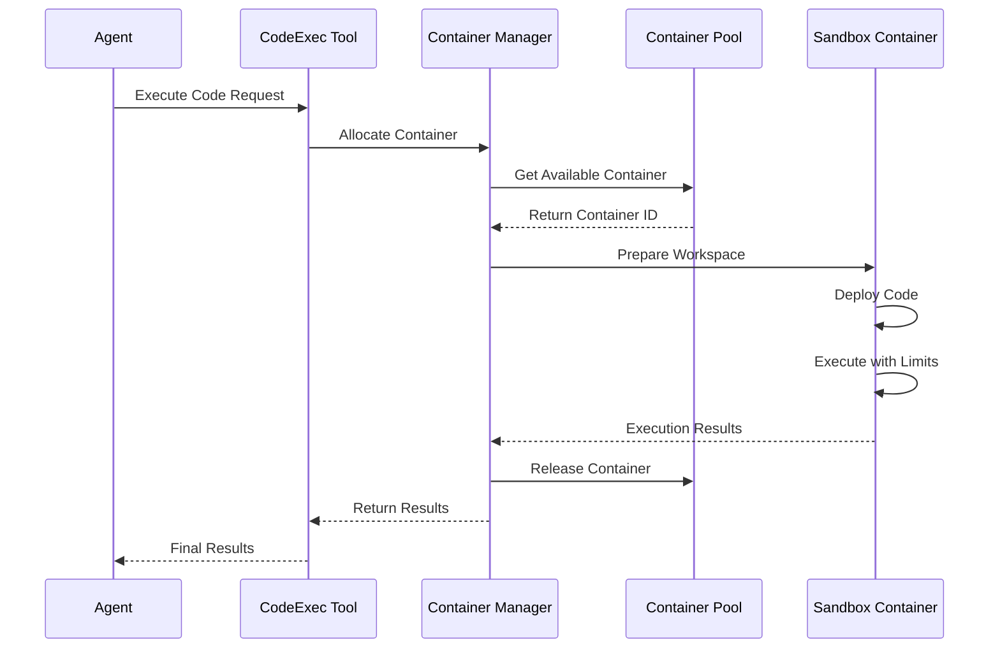

**Diagram sources**
- [sandbox/executor_manager/core/container.py](file://sandbox/executor_manager/core/container.py#L168-L182)
- [sandbox/executor_manager/services/execution.py](file://sandbox/executor_manager/services/execution.py#L31-L230)

### Resource Limitations

The sandbox enforces strict resource controls:

| Resource | Default Limit | Configurable | Purpose |
|----------|---------------|--------------|---------|
| **Memory** | 256MB | Yes | Prevent memory exhaustion |
| **CPU Time** | 10 seconds | Yes | Prevent infinite loops |
| **Disk Space** | 100MB workspace | Yes | Limit temporary file usage |
| **Network Access** | None (disabled) | No | Prevent external communication |
| **File Access** | Read-only filesystem | No | Prevent file system manipulation |

**Section sources**
- [sandbox/executor_manager/core/config.py](file://sandbox/executor_manager/core/config.py#L25-L43)
- [sandbox/executor_manager/core/container.py](file://sandbox/executor_manager/core/container.py#L102-L111)

### Container Lifecycle Management

Containers follow a sophisticated lifecycle with automatic recovery:

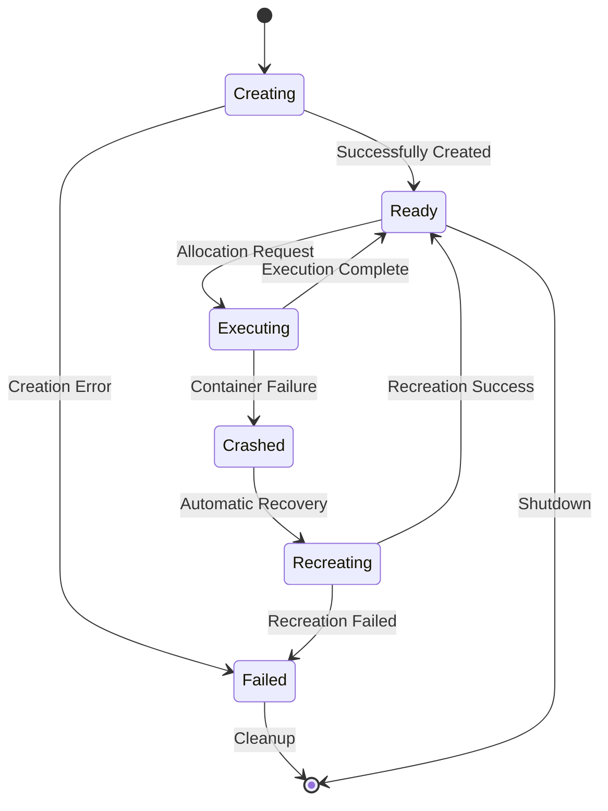

**Diagram sources**
- [sandbox/executor_manager/core/container.py](file://sandbox/executor_manager/core/container.py#L143-L166)

**Section sources**
- [sandbox/executor_manager/core/container.py](file://sandbox/executor_manager/core/container.py#L32-L80)

## Error Handling and Output Capture

### Comprehensive Error Classification

The system provides detailed error classification for different failure scenarios:

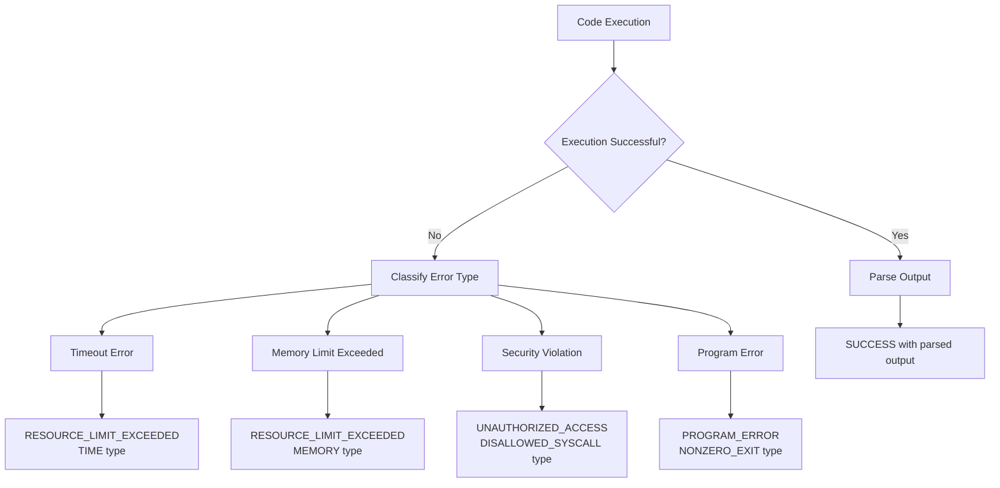

**Diagram sources**
- [sandbox/executor_manager/services/execution.py](file://sandbox/executor_manager/services/execution.py#L232-L266)
- [sandbox/executor_manager/models/enums.py](file://sandbox/executor_manager/models/enums.py#L24-L48)

### Output Processing and Type Coercion

The system implements intelligent output processing with type coercion:

| Output Type | Processing Method | Example |
|-------------|-------------------|---------|
| **JSON Objects** | `json.loads()` parsing | `{"result": 42}` |
| **Lists/Tuples** | AST literal evaluation | `[1, 2, 3]` |
| **Primitive Types** | Type coercion | `"42"` → `42` |
| **Custom Paths** | Dot notation traversal | `data.result.value` |

**Section sources**
- [agent/tools/code_exec.py](file://agent/tools/code_exec.py#L199-L343)
- [sandbox/executor_manager/services/execution.py](file://sandbox/executor_manager/services/execution.py#L232-L266)

## Integration with Agent Workflows

### Agent Tool Integration

The code execution tool integrates seamlessly with RAGFlow's agent workflow system:

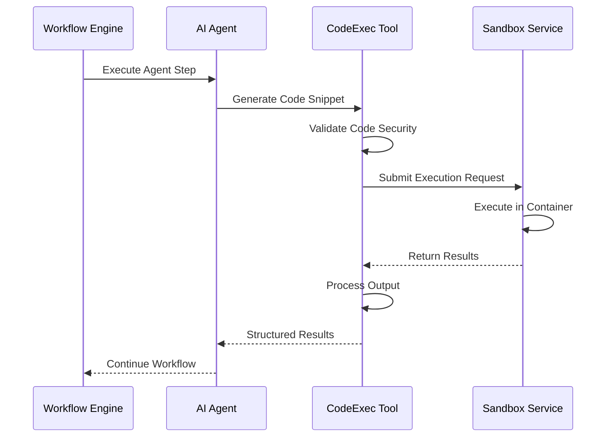

**Diagram sources**
- [agent/tools/code_exec.py](file://agent/tools/code_exec.py#L126-L191)

### Variable Passing and Output Mapping

The tool supports sophisticated variable passing and output mapping:

**Input Variables:**
- Dynamic argument binding from workflow variables
- Type-safe parameter validation
- Default value handling

**Output Mapping:**
- Structured output schema definition
- Automatic type coercion and validation
- Nested object path resolution

**Section sources**
- [agent/tools/code_exec.py](file://agent/tools/code_exec.py#L134-L142)
- [agent/tools/code_exec.py](file://agent/tools/code_exec.py#L287-L343)

## Best Practices and Security Considerations

### Input Validation Strategies

Implement robust input validation to prevent code injection attacks:

1. **Base64 Encoding Validation**: Ensure all code submissions are properly encoded
2. **Language Normalization**: Standardize language identifiers to prevent bypass
3. **AST Analysis**: Perform static analysis before execution
4. **Rate Limiting**: Implement request throttling to prevent abuse

### Code Injection Prevention

The system employs multiple defenses against code injection:

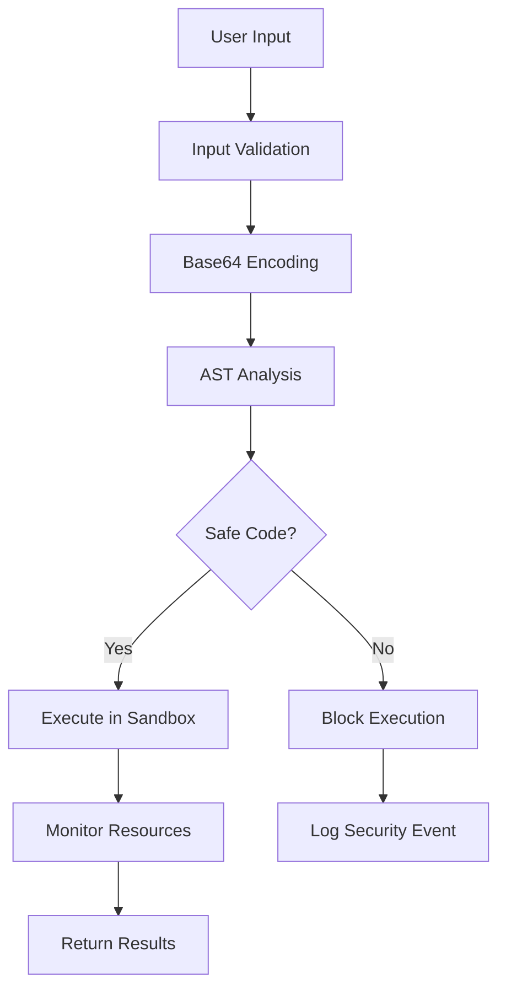

**Diagram sources**
- [sandbox/executor_manager/services/security.py](file://sandbox/executor_manager/services/security.py#L154-L174)
- [sandbox/executor_manager/api/handlers.py](file://sandbox/executor_manager/api/handlers.py#L41-L44)

### Security Hardening Guidelines

1. **Minimal Privileges**: Always run containers with minimal required permissions
2. **Resource Limits**: Set strict limits on CPU, memory, and disk usage
3. **Network Isolation**: Disable network access unless explicitly required
4. **Regular Updates**: Keep base images and dependencies updated
5. **Monitoring**: Implement comprehensive logging and monitoring

**Section sources**
- [sandbox/executor_manager/services/security.py](file://sandbox/executor_manager/services/security.py#L23-L174)
- [sandbox/executor_manager/core/container.py](file://sandbox/executor_manager/core/container.py#L82-L121)

## Configuration and Deployment

### Environment Configuration

Key configuration parameters for production deployment:

| Parameter | Default | Description | Security Impact |
|-----------|---------|-------------|-----------------|
| `SANDBOX_EXECUTOR_MANAGER_POOL_SIZE` | 5 | Container pool size | Performance/Resource |
| `SANDBOX_MAX_MEMORY` | 256m | Memory limit per container | Security/Performance |
| `SANDBOX_TIMEOUT` | 10s | Execution timeout | Security/Responsiveness |
| `SANDBOX_ENABLE_SECCOMP` | false | Enable seccomp filtering | Security Enhancement |
| `SANDBOX_HOST` | localhost | Sandbox service host | Network Security |

### Deployment Architecture

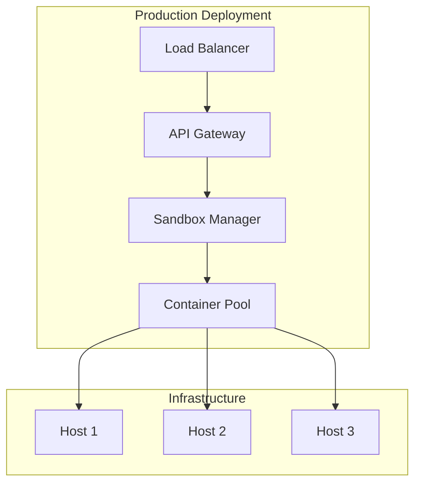

**Diagram sources**
- [sandbox/executor_manager/main.py](file://sandbox/executor_manager/main.py#L16-L25)
- [sandbox/docker-compose.yml](file://sandbox/docker-compose.yml#L1-L32)

**Section sources**
- [sandbox/.env.example](file://sandbox/.env.example#L1-L9)
- [sandbox/executor_manager/core/config.py](file://sandbox/executor_manager/core/config.py#L25-L43)

## Troubleshooting Guide

### Common Issues and Solutions

**Issue: Container Pool Exhaustion**
- **Symptoms**: "Container pool is busy" errors
- **Solution**: Increase `SANDBOX_EXECUTOR_MANAGER_POOL_SIZE` or optimize execution timeouts
- **Prevention**: Monitor container utilization and adjust pool size accordingly

**Issue: Security Violation**
- **Symptoms**: Code rejected with security analysis errors
- **Solution**: Review code for dangerous patterns and simplify if necessary
- **Prevention**: Use safer alternatives to banned operations

**Issue: Memory Limit Exceeded**
- **Symptoms**: Execution terminated with memory error
- **Solution**: Reduce memory-intensive operations or increase `SANDBOX_MAX_MEMORY`
- **Prevention**: Profile code memory usage before deployment

**Issue: Timeout Errors**
- **Symptoms**: Execution terminated due to timeout
- **Solution**: Optimize code algorithms or increase `SANDBOX_TIMEOUT`
- **Prevention**: Implement efficient algorithms and handle large datasets incrementally

### Debugging Techniques

1. **Enable Detailed Logging**: Set appropriate log levels for development
2. **Test in Isolation**: Use the sandbox API directly for testing
3. **Monitor Resource Usage**: Track memory and CPU consumption
4. **Validate Input**: Ensure proper encoding and validation of inputs

**Section sources**
- [sandbox/executor_manager/services/execution.py](file://sandbox/executor_manager/services/execution.py#L36-L42)
- [sandbox/executor_manager/services/execution.py](file://sandbox/executor_manager/services/execution.py#L190-L208)