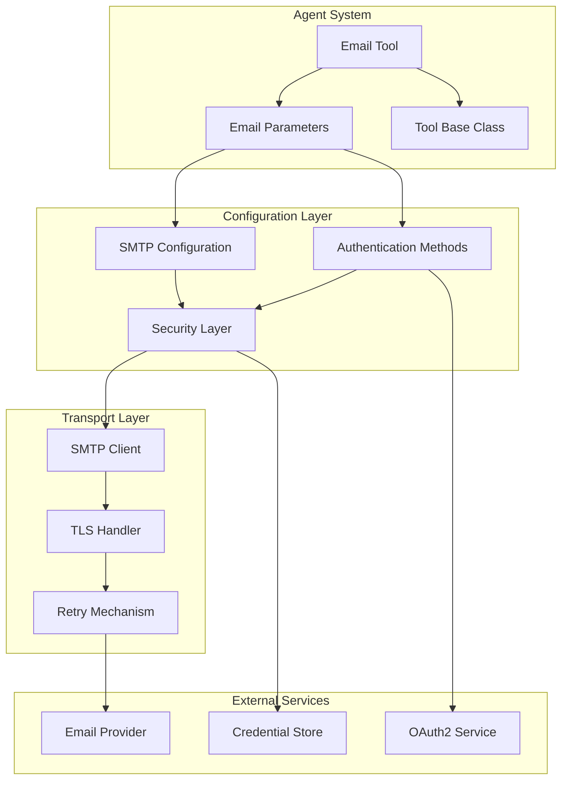
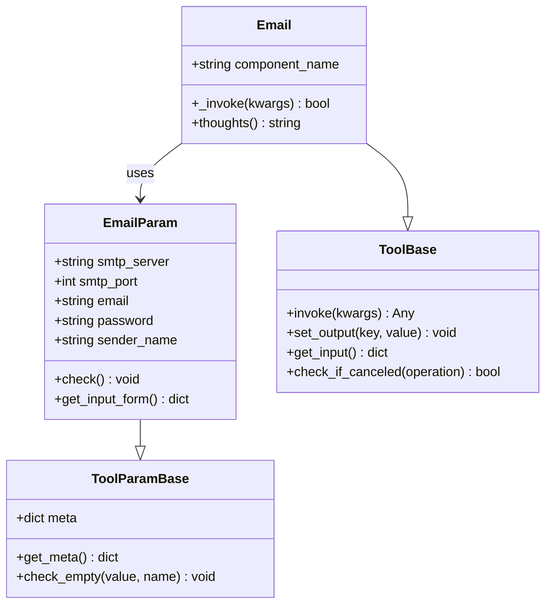
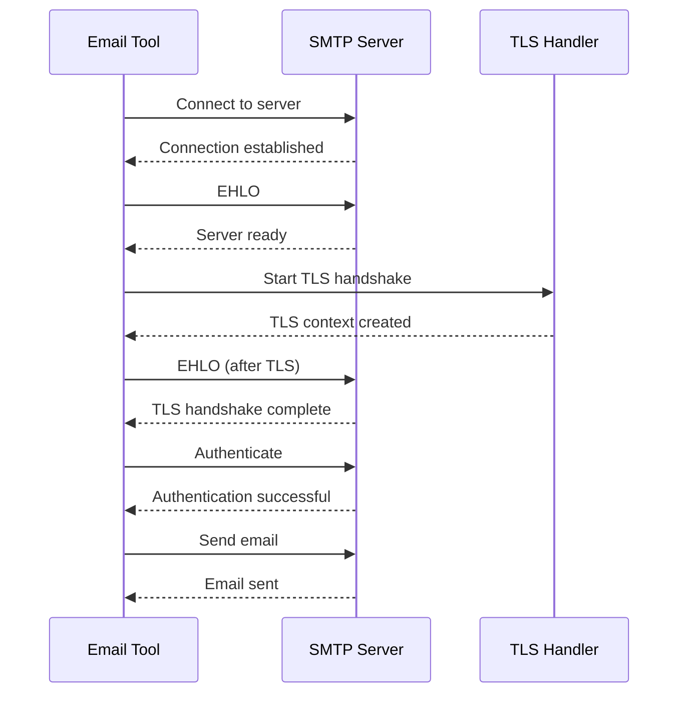
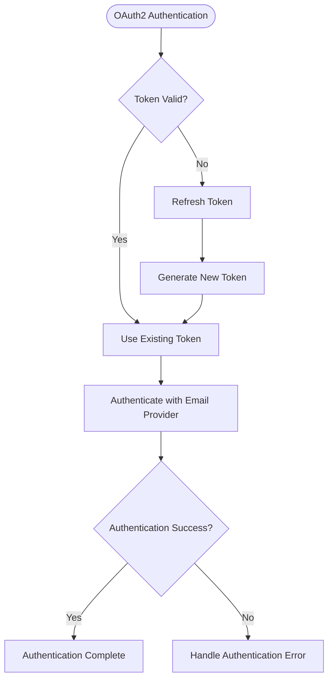
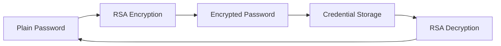
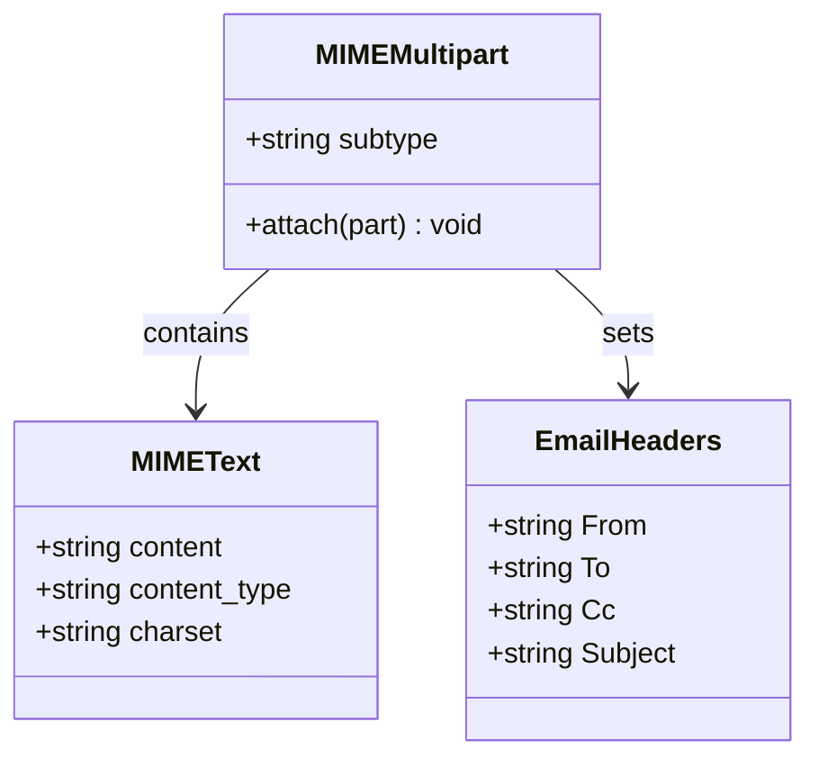
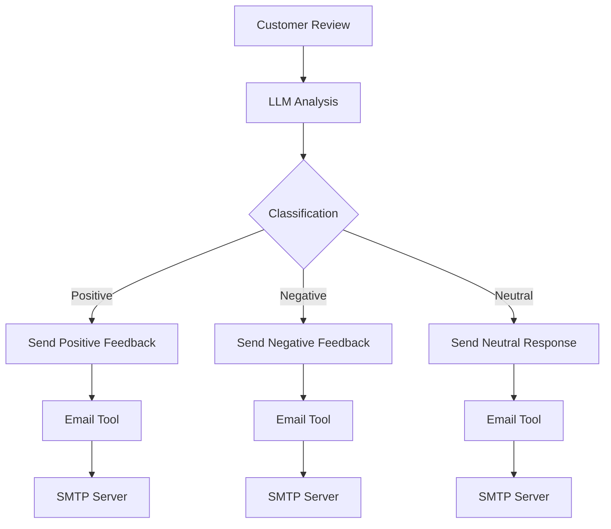
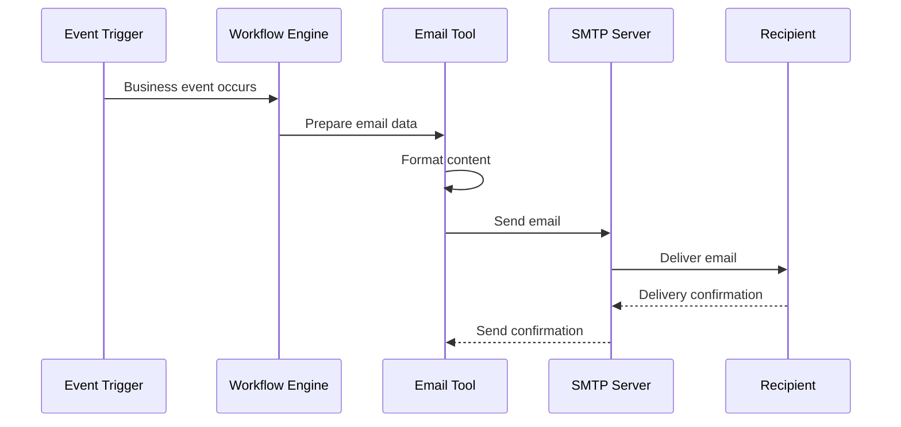
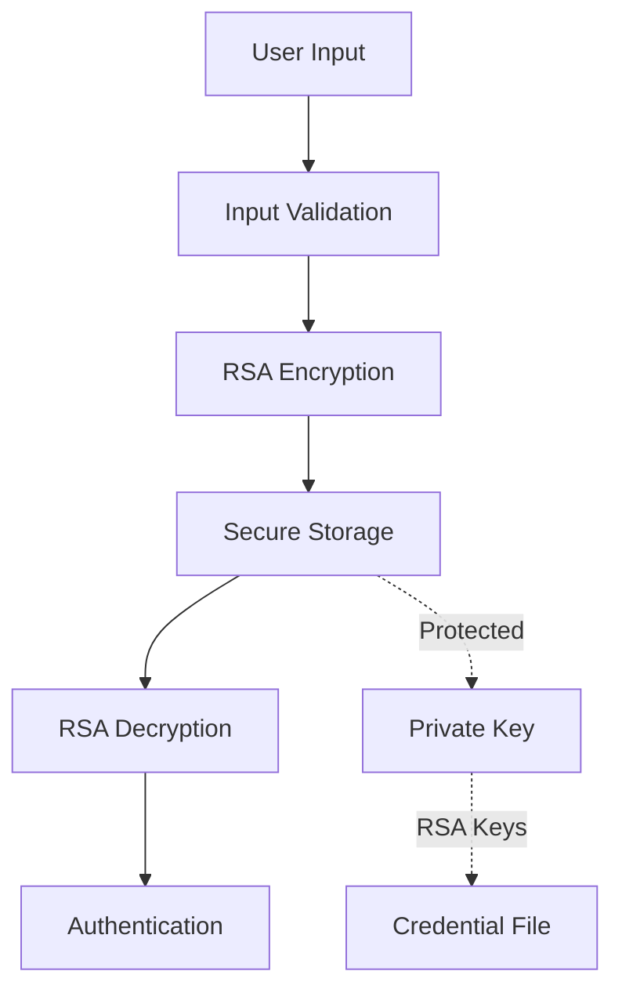
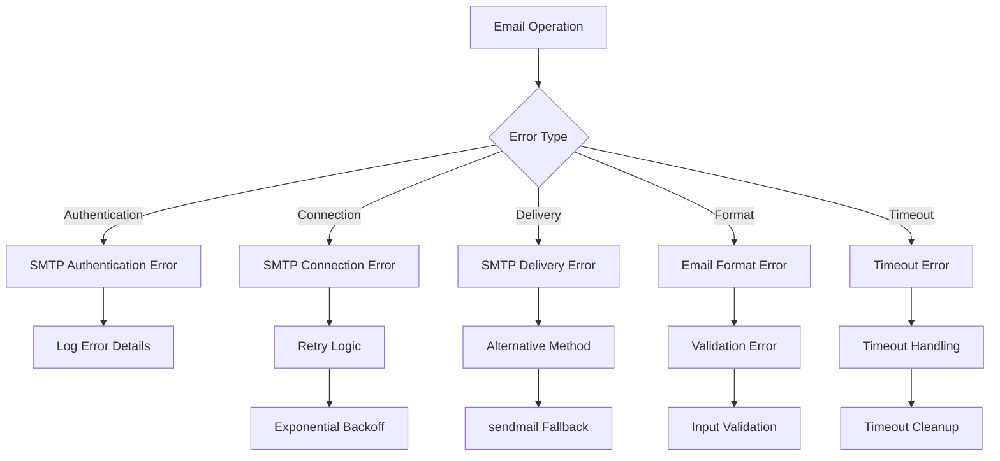

# Communication Tools

<cite>
**Referenced Files in This Document**
- [agent/tools/email.py](file://agent/tools/email.py)
- [common/connection_utils.py](file://common/connection_utils.py)
- [api/utils/email_templates.py](file://api/utils/email_templates.py)
- [api/utils/web_utils.py](file://api/utils/web_utils.py)
- [api/apps/user_app.py](file://api/apps/user_app.py)
- [common/data_source/gmail_connector.py](file://common/data_source/gmail_connector.py)
- [rag/app/email.py](file://rag/app/email.py)
- [rag/flow/parser/parser.py](file://rag/flow/parser/parser.py)
- [agent/tools/base.py](file://agent/tools/base.py)
- [api/utils/crypt.py](file://api/utils/crypt.py)
- [agent/templates/customer_review_analysis.json](file://agent/templates/customer_review_analysis.json)
- [agent/templates/customer_service.json](file://agent/templates/customer_service.json)
- [web/src/pages/agent/canvas/node/email-node.tsx](file://web/src/pages/agent/canvas/node/email-node.tsx)
- [web/src/pages/agent/form/email-form/index.tsx](file://web/src/pages/agent/form/email-form/index.tsx)
</cite>

## Table of Contents
1. [Introduction](#introduction)
2. [System Architecture](#system-architecture)
3. [Email Tool Implementation](#email-tool-implementation)
4. [SMTP Configuration](#smtp-configuration)
5. [Authentication Methods](#authentication-methods)
6. [Email Formatting and Content](#email-formatting-and-content)
7. [Automation Workflows](#automation-workflows)
8. [Security Considerations](#security-considerations)
9. [Error Handling and Rate Limiting](#error-handling-and-rate-limiting)
10. [Best Practices](#best-practices)
11. [Troubleshooting Guide](#troubleshooting-guide)

## Introduction

The RAGFlow communication tools provide comprehensive email integration capabilities for automated workflows within the agent system. This documentation covers the implementation of email functionality, including SMTP/IMAP configurations, authentication methods, security measures, and practical automation examples.

The email system is built around a modular tool architecture that enables seamless integration with various email providers, supports multiple authentication mechanisms, and provides robust error handling for production environments.

## System Architecture

The email communication system follows a layered architecture that separates concerns between tool implementation, configuration management, and security handling.



**Diagram sources**
- [agent/tools/email.py](file://agent/tools/email.py#L31-L100)
- [agent/tools/base.py](file://agent/tools/base.py#L114-L176)

**Section sources**
- [agent/tools/email.py](file://agent/tools/email.py#L1-L231)
- [agent/tools/base.py](file://agent/tools/base.py#L1-L176)

## Email Tool Implementation

The email tool is implemented as a specialized component within the agent system's tool framework, providing comprehensive email sending capabilities with robust error handling and retry mechanisms.

### Core Email Component Structure



**Diagram sources**
- [agent/tools/email.py](file://agent/tools/email.py#L31-L100)
- [agent/tools/base.py](file://agent/tools/base.py#L114-L176)

### Email Parameter Configuration

The email tool accepts several key parameters for configuration:

| Parameter | Type | Description | Required |
|-----------|------|-------------|----------|
| `to_email` | string | Recipient email address | Yes |
| `cc_email` | string | Comma-separated CC recipients | No |
| `subject` | string | Email subject line | No |
| `content` | string | Email content (HTML format) | No |

**Section sources**
- [agent/tools/email.py](file://agent/tools/email.py#L31-L80)

## SMTP Configuration

The SMTP configuration system provides flexible server settings and connection parameters for various email providers.

### Default SMTP Settings

The email tool uses secure SMTP connections with the following default configuration:

- **Default Port**: 465 (SSL/TLS)
- **Connection Method**: STARTTLS with SSL context
- **Timeout Handling**: Configurable via environment variables
- **Retry Logic**: Automatic retry with exponential backoff

### Supported SMTP Providers

The system is compatible with major email providers:

| Provider | SMTP Server | Port | Security |
|----------|-------------|------|----------|
| Gmail | smtp.gmail.com | 465 | SSL |
| Outlook | smtp.office365.com | 587 | TLS |
| Yahoo | smtp.mail.yahoo.com | 465 | SSL |
| Custom | User-defined | 465/587 | SSL/TLS |

### Connection Security



**Diagram sources**
- [agent/tools/email.py](file://agent/tools/email.py#L147-L154)

**Section sources**
- [agent/tools/email.py](file://agent/tools/email.py#L68-L72)
- [common/connection_utils.py](file://common/connection_utils.py#L31-L103)

## Authentication Methods

The system supports multiple authentication mechanisms to accommodate different email provider requirements and security policies.

### Basic Authentication

Standard email authentication using username and password:

```python
# Authentication flow
server.login(self._param.email, self._param.password)
```

### OAuth2 Authentication

For enhanced security, the system supports OAuth2 authentication through the Gmail connector:



**Diagram sources**
- [common/data_source/gmail_connector.py](file://common/data_source/gmail_connector.py#L174-L183)

### Credential Protection

The system implements RSA encryption for credential storage:



**Diagram sources**
- [api/utils/crypt.py](file://api/utils/crypt.py#L34-L64)

**Section sources**
- [agent/tools/email.py](file://agent/tools/email.py#L153-L154)
- [common/data_source/gmail_connector.py](file://common/data_source/gmail_connector.py#L174-L183)
- [api/utils/crypt.py](file://api/utils/crypt.py#L34-L64)

## Email Formatting and Content

The email system supports sophisticated content formatting with HTML rendering and attachment handling capabilities.

### Content Types

The system primarily uses HTML content for modern email compatibility:

```python
# HTML content attachment
msg.attach(MIMEText(email_content, 'html', 'utf-8'))
```

### Email Structure



**Diagram sources**
- [agent/tools/email.py](file://agent/tools/email.py#L127-L140)

### Attachment Processing

The system can process email attachments from various sources:

| Attachment Type | Processing Method | Output Format |
|----------------|-------------------|---------------|
| Text Files | Decode and chunk | Text content |
| Binary Files | Base64 encoding | Encoded payload |
| Documents | Parser integration | Structured content |

**Section sources**
- [agent/tools/email.py](file://agent/tools/email.py#L138-L140)
- [rag/app/email.py](file://rag/app/email.py#L104-L132)
- [rag/flow/parser/parser.py](file://rag/flow/parser/parser.py#L682-L767)

## Automation Workflows

The email system integrates seamlessly with agent workflows for automated customer service and business process automation.

### Customer Review Analysis Workflow



**Diagram sources**
- [agent/templates/customer_review_analysis.json](file://agent/templates/customer_review_analysis.json#L523-L635)

### Customer Support Workflow

The system supports multi-agent customer support scenarios:

| Agent Type | Responsibility | Email Trigger |
|------------|----------------|---------------|
| Lead Agent | Intent classification | User query analysis |
| Product Advisor | Technical support | Product-related queries |
| Casual Chat | General conversation | Non-product queries |
| Mood Support | Emotional support | Frustrated users |

### Notification Automation

The system can trigger email notifications based on various events:



**Diagram sources**
- [agent/templates/customer_service.json](file://agent/templates/customer_service.json#L1-L200)

**Section sources**
- [agent/templates/customer_review_analysis.json](file://agent/templates/customer_review_analysis.json#L523-L800)
- [agent/templates/customer_service.json](file://agent/templates/customer_service.json#L1-L200)

## Security Considerations

The email system implements multiple layers of security to protect sensitive information and prevent unauthorized access.

### Credential Security



**Diagram sources**
- [api/utils/crypt.py](file://api/utils/crypt.py#L34-L64)

### Security Best Practices

| Security Aspect | Implementation | Purpose |
|-----------------|----------------|---------|
| Credential Encryption | RSA with PEM keys | Protect stored passwords |
| TLS/SSL Connections | Automatic context creation | Secure transport |
| Input Validation | Parameter checking | Prevent injection attacks |
| Timeout Handling | Configurable timeouts | Prevent hanging connections |
| Retry Limits | Maximum retry attempts | Manage resource usage |

### Access Control

The system implements role-based access control for email operations:

- **Administrative Access**: Full email configuration and management
- **User Access**: Limited email sending capabilities
- **API Access**: Programmatic email operations with authentication

**Section sources**
- [api/utils/crypt.py](file://api/utils/crypt.py#L34-L64)
- [agent/tools/email.py](file://agent/tools/email.py#L74-L79)

## Error Handling and Rate Limiting

The email system implements comprehensive error handling and rate limiting to ensure reliable operation in production environments.

### Error Categories



**Diagram sources**
- [agent/tools/email.py](file://agent/tools/email.py#L185-L220)

### Retry Mechanism

The system implements automatic retry logic with exponential backoff:

| Error Type | Max Retries | Delay Pattern | Recovery Action |
|------------|-------------|---------------|-----------------|
| Connection | 3 | 1s, 2s, 4s | Re-establish connection |
| Authentication | 1 | Immediate | Check credentials |
| Delivery | 2 | 5s, 10s | Alternative method |
| Format | 0 | N/A | Validation error |

### Rate Limiting

The system includes built-in rate limiting through:

- **Connection Pooling**: Efficient connection reuse
- **Timeout Configuration**: Prevents hanging operations
- **Retry Limits**: Controls retry attempts
- **Queue Management**: Handles concurrent operations

**Section sources**
- [agent/tools/email.py](file://agent/tools/email.py#L103-L220)
- [common/connection_utils.py](file://common/connection_utils.py#L31-L103)

## Best Practices

### Configuration Management

1. **Environment Variables**: Store sensitive configuration in environment variables
2. **Credential Rotation**: Regularly rotate email credentials
3. **Provider Selection**: Choose reliable SMTP providers with good reputation
4. **Monitoring**: Implement logging and monitoring for email operations

### Content Guidelines

1. **HTML Standards**: Use valid HTML for email compatibility
2. **Mobile Optimization**: Design for mobile email clients
3. **Accessibility**: Include alt text for images
4. **Branding**: Maintain consistent brand identity

### Performance Optimization

1. **Connection Reuse**: Maintain persistent connections when possible
2. **Batch Operations**: Group related email operations
3. **Async Processing**: Use asynchronous operations for non-critical emails
4. **Resource Cleanup**: Properly close connections and resources

### Security Hardening

1. **Encryption**: Always use encrypted connections (SSL/TLS)
2. **Validation**: Validate all input data thoroughly
3. **Logging**: Log security-relevant events
4. **Access Control**: Implement least-privilege access

## Troubleshooting Guide

### Common Issues and Solutions

| Issue | Symptoms | Solution |
|-------|----------|----------|
| Authentication Failure | SMTPAuthenticationError | Verify credentials and enable less secure access |
| Connection Timeout | TimeoutError | Increase timeout values, check network connectivity |
| SSL/TLS Errors | Certificate errors | Update certificate store, check date/time |
| Delivery Failures | Email not received | Check spam filters, verify recipient address |
| Content Rendering | Poor formatting | Test with multiple email clients |

### Debugging Steps

1. **Enable Logging**: Set appropriate log levels for email operations
2. **Test Connectivity**: Verify SMTP server accessibility
3. **Validate Configuration**: Check all configuration parameters
4. **Monitor Retries**: Track retry attempts and delays
5. **Review Logs**: Analyze error logs for patterns

### Performance Monitoring

Monitor these key metrics:

- **Delivery Success Rate**: Percentage of successful deliveries
- **Average Response Time**: Time taken for email operations
- **Error Rates**: Frequency of different error types
- **Retry Success Rate**: Effectiveness of retry mechanisms

**Section sources**
- [agent/tools/email.py](file://agent/tools/email.py#L185-L220)
- [common/connection_utils.py](file://common/connection_utils.py#L31-L103)