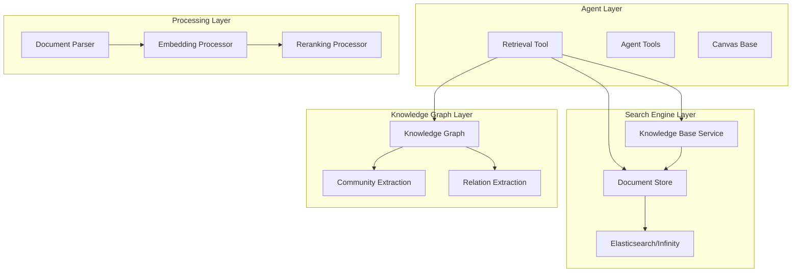
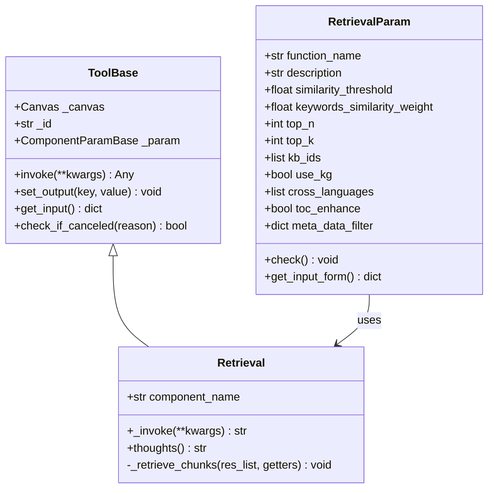
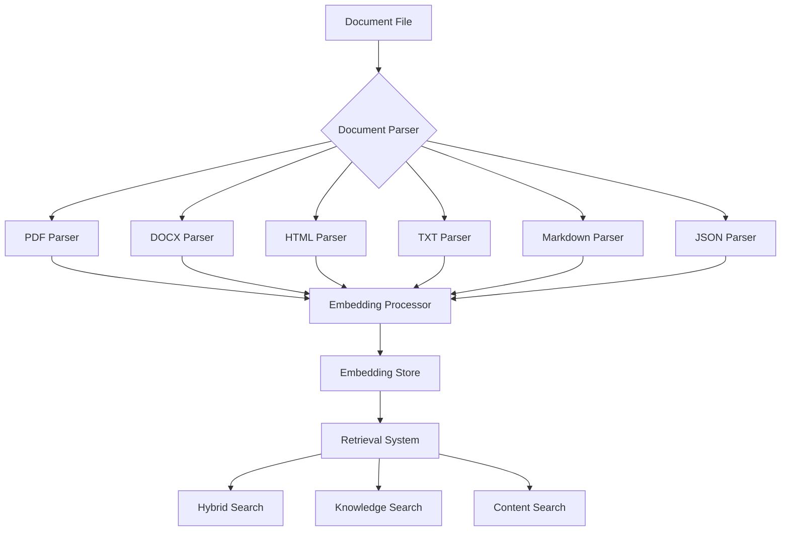
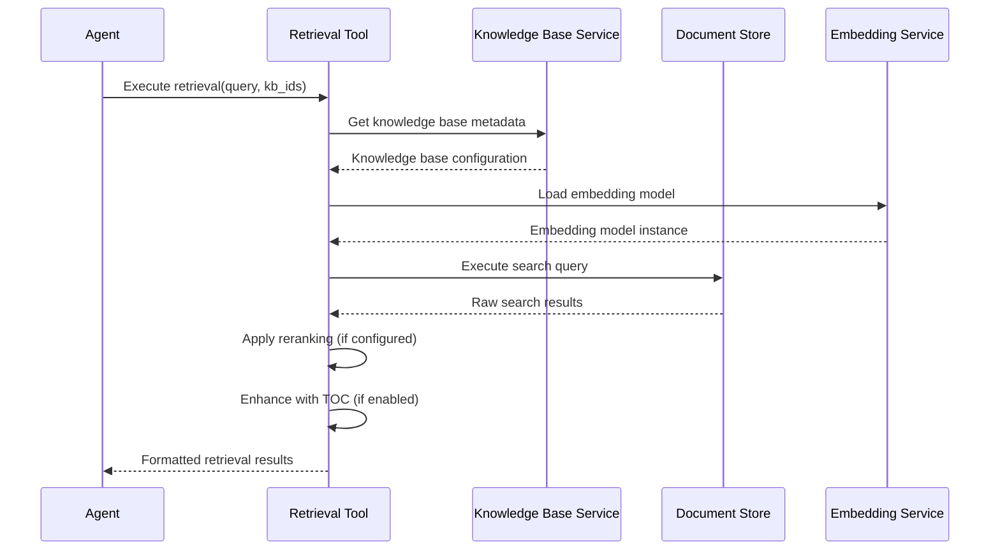
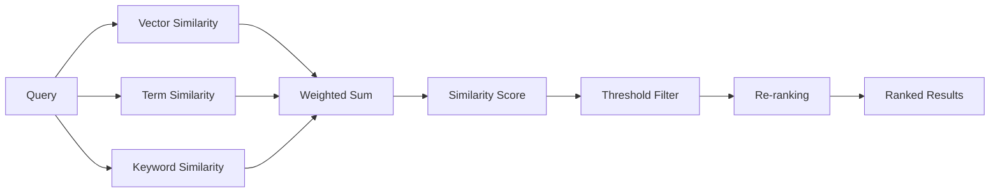
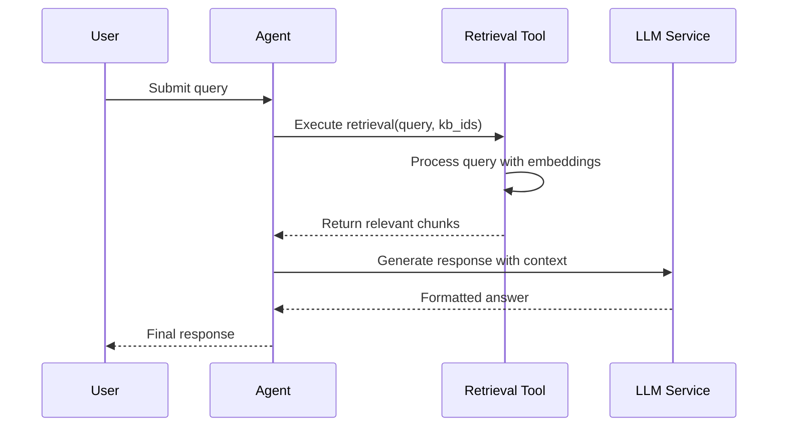

# Data Retrieval Tools

<cite>
**Referenced Files in This Document**
- [agent/tools/retrieval.py](file://agent/tools/retrieval.py)
- [agent/tools/base.py](file://agent/tools/base.py)
- [rag/nlp/search.py](file://rag/nlp/search.py)
- [rag/app/one.py](file://rag/app/one.py)
- [rag/app/laws.py](file://rag/app/laws.py)
- [rag/app/paper.py](file://rag/app/paper.py)
- [rag/app/naive.py](file://rag/app/naive.py)
- [deepdoc/parser/__init__.py](file://deepdoc/parser/__init__.py)
- [graphrag/search.py](file://graphrag/search.py)
- [api/db/services/dialog_service.py](file://api/db/services/dialog_service.py)
- [agent/test/dsl_examples/retrieval_and_generate.json](file://agent/test/dsl_examples/retrieval_and_generate.json)
- [agent/templates/deep_research.json](file://agent/templates/deep_research.json)
</cite>

## Table of Contents
1. [Introduction](#introduction)
2. [System Architecture](#system-architecture)
3. [Core Retrieval Components](#core-retrieval-components)
4. [Document Processing Pipeline](#document-processing-pipeline)
5. [Knowledge Base Integration](#knowledge-base-integration)
6. [Advanced Retrieval Features](#advanced-retrieval-features)
7. [Configuration and Parameters](#configuration-and-parameters)
8. [Best Practices](#best-practices)
9. [Integration Examples](#integration-examples)
10. [Troubleshooting Guide](#troubleshooting-guide)

## Introduction

The RAGFlow data retrieval system provides sophisticated capabilities for extracting information from various data sources, knowledge bases, and structured documents. Built around the core `Retrieval` tool, the system offers comprehensive search functionality with support for multiple retrieval strategies, including traditional vector search, knowledge graph integration, and table of contents enhancement.

The retrieval system serves as a critical component in the RAG (Retrieval-Augmented Generation) pipeline, enabling agents to access relevant information from diverse sources while maintaining high precision and recall in information extraction.

## System Architecture

The data retrieval system follows a layered architecture that separates concerns between document processing, indexing, and retrieval operations:

**Diagram sources**
- [agent/tools/retrieval.py](file://agent/tools/retrieval.py#L80-L251)
- [rag/nlp/search.py](file://rag/nlp/search.py#L36-L690)
- [graphrag/search.py](file://graphrag/search.py#L85-L300)

## Core Retrieval Components

### Retrieval Tool Class

The `Retrieval` tool serves as the primary interface for information retrieval operations within the agent system. It inherits from both `ToolBase` and `ABC` (Abstract Base Class) to provide a robust foundation for retrieval operations.

**Diagram sources**
- [agent/tools/retrieval.py](file://agent/tools/retrieval.py#L33-L251)
- [agent/tools/base.py](file://agent/tools/base.py#L114-L176)

### Parameter Configuration

The retrieval tool accepts comprehensive configuration parameters that control search behavior, precision, and recall characteristics:

| Parameter | Type | Default | Description |
|-----------|------|---------|-------------|
| `similarity_threshold` | float | 0.2 | Minimum similarity score for result inclusion |
| `keywords_similarity_weight` | float | 0.5 | Weight for keyword similarity in hybrid search |
| `top_n` | int | 8 | Number of top results to return |
| `top_k` | int | 1024 | Maximum candidates to consider during retrieval |
| `kb_ids` | list | [] | Target knowledge base identifiers |
| `use_kg` | bool | False | Enable knowledge graph integration |
| `toc_enhance` | bool | False | Enable table of contents enhancement |
| `cross_languages` | list | [] | Target languages for cross-language search |
| `rerank_id` | str | "" | Reranking model identifier |

**Section sources**
- [agent/tools/retrieval.py](file://agent/tools/retrieval.py#L54-L65)

## Document Processing Pipeline

The system integrates with multiple document parsers to extract structured information from various file formats:

**Diagram sources**
- [deepdoc/parser/__init__.py](file://deepdoc/parser/__init__.py#L17-L40)
- [rag/app/one.py](file://rag/app/one.py#L134-L166)

### Supported Document Formats

The system supports a comprehensive range of document formats through specialized parsers:

- **PDF Documents**: Advanced layout recognition with OCR capabilities
- **Microsoft Office**: DOCX, XLSX, PPTX with content extraction
- **Web Content**: HTML parsing with structured data extraction
- **Text Files**: Plain text and markdown with formatting preservation
- **Structured Data**: JSON and CSV with schema-aware parsing

**Section sources**
- [rag/app/one.py](file://rag/app/one.py#L134-L166)
- [rag/app/laws.py](file://rag/app/laws.py#L144-L183)
- [rag/app/paper.py](file://rag/app/paper.py#L160-L195)

## Knowledge Base Integration

The retrieval system seamlessly integrates with knowledge bases to provide contextually relevant information:

**Diagram sources**
- [agent/tools/retrieval.py](file://agent/tools/retrieval.py#L83-L244)
- [api/db/services/dialog_service.py](file://api/db/services/dialog_service.py#L483-L507)

### Knowledge Base Features

- **Multi-tenant Support**: Isolated knowledge bases per tenant
- **Embedding Model Management**: Dynamic embedding model selection
- **Metadata Filtering**: Advanced filtering based on document metadata
- **Cross-language Search**: Multi-language query processing
- **Reranking Integration**: Model-based result ranking

**Section sources**
- [agent/tools/retrieval.py](file://agent/tools/retrieval.py#L92-L120)
- [api/db/services/dialog_service.py](file://api/db/services/dialog_service.py#L828-L860)

## Advanced Retrieval Features

### Hybrid Search Strategy

The system employs a sophisticated hybrid search approach combining multiple similarity measures:

**Diagram sources**
- [rag/nlp/search.py](file://rag/nlp/search.py#L359-L424)

### Knowledge Graph Integration

The retrieval system can leverage knowledge graphs for enhanced semantic understanding:

- **Entity Recognition**: Automatic entity extraction and linking
- **Relationship Discovery**: Semantic relationship identification
- **Community Detection**: Topic-based content clustering
- **Graph-based Ranking**: Enhanced result ordering using graph metrics

**Section sources**
- [graphrag/search.py](file://graphrag/search.py#L142-L300)
- [agent/tools/retrieval.py](file://agent/tools/retrieval.py#L202-L222)

### Table of Contents Enhancement

The system can enhance retrieval results using document structure information:

- **Structure Analysis**: Automatic TOC detection and analysis
- **Contextual Relevance**: Structure-aware result scoring
- **Hierarchical Ranking**: Nested content prioritization
- **Navigation Assistance**: Structured result presentation

**Section sources**
- [rag/nlp/search.py](file://rag/nlp/search.py#L584-L642)
- [agent/tools/retrieval.py](file://agent/tools/retrieval.py#L194-L201)

## Configuration and Parameters

### Retrieval Configuration Options

The retrieval system provides extensive configuration options for fine-tuning search behavior:

| Configuration Category | Parameters | Purpose |
|------------------------|------------|---------|
| **Precision Control** | `similarity_threshold`, `keywords_similarity_weight` | Balance between precision and recall |
| **Volume Control** | `top_n`, `top_k` | Limit result count and candidate pool |
| **Source Selection** | `kb_ids`, `meta_data_filter` | Target specific knowledge bases |
| **Enhancement Options** | `use_kg`, `toc_enhance`, `cross_languages` | Enable advanced features |
| **Quality Control** | `rerank_id`, `empty_response` | Post-processing and fallback handling |

### Environment Variables

Key environment variables affecting retrieval behavior:

- `COMPONENT_EXEC_TIMEOUT`: Tool execution timeout (default: 12 seconds)
- `MAX_CONTENT_LENGTH`: Maximum document size for processing
- `DOC_ENGINE_INFINITY`: Enable Infinity document engine

**Section sources**
- [agent/tools/retrieval.py](file://agent/tools/retrieval.py#L83-L84)
- [common/settings.py](file://common/settings.py#L337-L339)

## Best Practices

### Retrieval Strategy Guidelines

1. **Query Optimization**: Use specific, targeted keywords for better results
2. **Threshold Tuning**: Adjust similarity thresholds based on use case requirements
3. **Knowledge Base Selection**: Target specific knowledge bases for focused results
4. **Feature Combination**: Enable relevant features based on content type
5. **Performance Monitoring**: Monitor retrieval latency and result quality

### Configuration Recommendations

- **For Fact-Based Queries**: Increase `similarity_threshold`, reduce `keywords_similarity_weight`
- **For Exploratory Searches**: Lower `similarity_threshold`, increase `top_k`
- **For Structured Content**: Enable `toc_enhance` and `use_kg`
- **For Multilingual Content**: Configure `cross_languages` appropriately

### Integration Patterns

Common integration patterns for retrieval tools:

- **Sequential Processing**: Chain retrieval with content generation
- **Parallel Processing**: Multiple retrieval strategies for comparison
- **Feedback Loops**: Use retrieval results to refine subsequent queries
- **Fallback Strategies**: Implement alternative retrieval methods

**Section sources**
- [agent/test/dsl_examples/retrieval_and_generate.json](file://agent/test/dsl_examples/retrieval_and_generate.json#L1-L61)
- [agent/templates/deep_research.json](file://agent/templates/deep_research.json#L1-L200)

## Integration Examples

### Basic Retrieval Workflow

**Diagram sources**
- [agent/test/dsl_examples/retrieval_and_generate.json](file://agent/test/dsl_examples/retrieval_and_generate.json#L13-L40)

### Advanced Multi-Agent Research

The system supports complex multi-agent workflows for comprehensive research:

- **Web Search Specialist**: URL discovery and source evaluation
- **Content Deep Reader**: Structured content extraction
- **Research Synthesizer**: Multi-source integration and analysis

**Section sources**
- [agent/templates/deep_research.json](file://agent/templates/deep_research.json#L1-L200)

### Knowledge Graph Retrieval

Advanced knowledge graph integration enables sophisticated semantic search:

- **Entity-based Retrieval**: Search by entity names and types
- **Relationship Discovery**: Find related concepts and connections
- **Community Analysis**: Topic-based content clustering
- **Graph-based Ranking**: Enhanced result ordering using graph metrics

**Section sources**
- [graphrag/search.py](file://graphrag/search.py#L142-L300)

## Troubleshooting Guide

### Common Issues and Solutions

| Issue | Symptoms | Solution |
|-------|----------|----------|
| **Poor Retrieval Quality** | Irrelevant results, low precision | Adjust similarity thresholds, refine query terms |
| **Slow Performance** | Long response times | Reduce `top_k`, enable caching, optimize embedding models |
| **Memory Issues** | Out of memory errors | Decrease batch sizes, optimize document processing |
| **Knowledge Graph Problems** | Missing graph results | Verify graph construction, check embedding models |

### Debugging Techniques

1. **Enable Logging**: Increase log levels for detailed retrieval information
2. **Monitor Metrics**: Track similarity scores and result counts
3. **Test Queries**: Use controlled test queries to isolate issues
4. **Validate Configurations**: Verify parameter settings and dependencies
5. **Check Dependencies**: Ensure all required services are operational

### Performance Optimization

- **Index Optimization**: Regular maintenance of search indices
- **Model Caching**: Cache frequently used embedding models
- **Batch Processing**: Process multiple queries efficiently
- **Resource Monitoring**: Monitor CPU, memory, and network usage

**Section sources**
- [rag/nlp/search.py](file://rag/nlp/search.py#L36-L690)
- [agent/tools/retrieval.py](file://agent/tools/retrieval.py#L83-L244)