# Database Tools

<cite>
**Referenced Files in This Document**
- [agent/tools/exesql.py](file://agent/tools/exesql.py)
- [common/connection_utils.py](file://common/connection_utils.py)
- [rag/utils/infinity_conn.py](file://rag/utils/infinity_conn.py)
- [rag/utils/ob_conn.py](file://rag/utils/ob_conn.py)
- [api/db/db_utils.py](file://api/db/db_utils.py)
- [api/db/db_models.py](file://api/db/db_models.py)
- [agent/templates/sql_assistant.json](file://agent/templates/sql_assistant.json)
- [conf/mapping.json](file://conf/mapping.json)
- [conf/os_mapping.json](file://conf/os_mapping.json)
- [api/apps/canvas_app.py](file://api/apps/canvas_app.py)
</cite>

## Table of Contents
1. [Introduction](#introduction)
2. [System Architecture](#system-architecture)
3. [Supported Database Types](#supported-database-types)
4. [ExeSQL Tool Implementation](#exesql-tool-implementation)
5. [Connection Configuration](#connection-configuration)
6. [Security Considerations](#security-considerations)
7. [Performance Optimization](#performance-optimization)
8. [Vector Database Integration](#vector-database-integration)
9. [Best Practices](#best-practices)
10. [Troubleshooting](#troubleshooting)

## Introduction

The RAGFlow system provides comprehensive database interaction capabilities through its agent framework, enabling seamless integration with various database backends including traditional relational databases, modern vector databases, and specialized systems like OceanBase. The primary interface for database operations is the ExeSQL tool, which serves as a powerful bridge between natural language queries and structured database interactions.

This documentation covers the complete database tool ecosystem, focusing on the ExeSQL component that enables SQL query execution across multiple database types, security mechanisms for safe database access, and performance optimization strategies for efficient agent workflows.

## System Architecture

The database interaction system follows a modular architecture designed for extensibility and reliability:

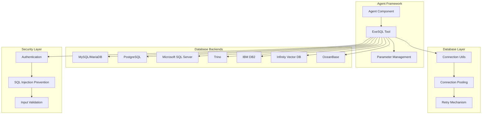

**Diagram sources**
- [agent/tools/exesql.py](file://agent/tools/exesql.py#L28-L120)
- [common/connection_utils.py](file://common/connection_utils.py#L31-L103)

## Supported Database Types

The system supports a comprehensive range of database backends, each with specific configuration requirements and capabilities:

### Relational Databases

| Database Type | Driver/Library | Connection Method | Authentication |
|---------------|----------------|-------------------|----------------|
| MySQL | pymysql | Standard connection | Username/password |
| MariaDB | pymysql | Standard connection | Username/password |
| PostgreSQL | psycopg2 | Standard connection | Username/password |
| Microsoft SQL Server | pyodbc | ODBC connection string | Username/password |
| IBM DB2 | ibm_db | Connection string | Username/password |

### Specialized Databases

| Database Type | Purpose | Configuration |
|---------------|---------|---------------|
| Trino | Distributed SQL Query Engine | Catalog/schema separation, TLS support |
| Infinity | Vector Database | Connection pooling, index management |
| OceanBase | High-performance OLTP | Vector embeddings, hybrid search |

### Vector Database Support

The system includes specialized support for vector databases with advanced indexing and similarity search capabilities:

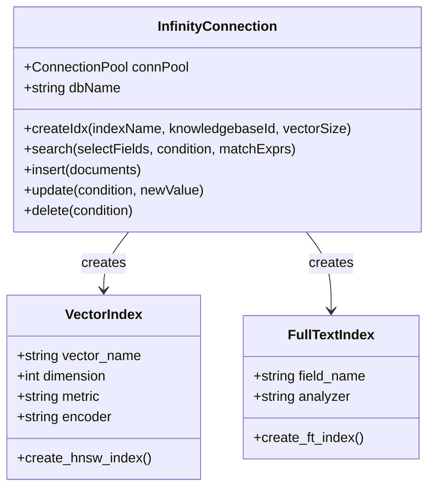

**Diagram sources**
- [rag/utils/infinity_conn.py](file://rag/utils/infinity_conn.py#L174-L308)

**Section sources**
- [agent/tools/exesql.py](file://agent/tools/exesql.py#L120-L188)
- [rag/utils/infinity_conn.py](file://rag/utils/infinity_conn.py#L174-L308)

## ExeSQL Tool Implementation

The ExeSQL tool serves as the primary interface for executing SQL queries across different database backends. It implements a sophisticated parameter management system and result handling mechanism.

### Core Architecture

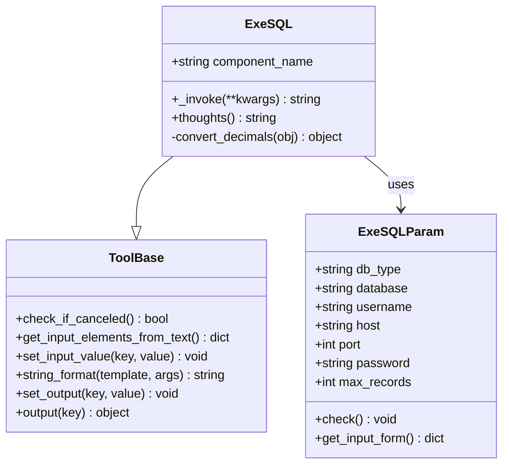

**Diagram sources**
- [agent/tools/exesql.py](file://agent/tools/exesql.py#L28-L77)
- [agent/tools/exesql.py](file://agent/tools/exesql.py#L79-L276)

### Parameter Management

The ExeSQL tool implements comprehensive parameter validation and management:

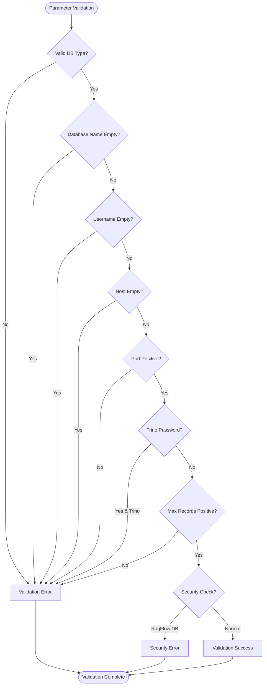

**Diagram sources**
- [agent/tools/exesql.py](file://agent/tools/exesql.py#L55-L69)

### Query Execution Pipeline

The query execution process follows a structured pipeline:

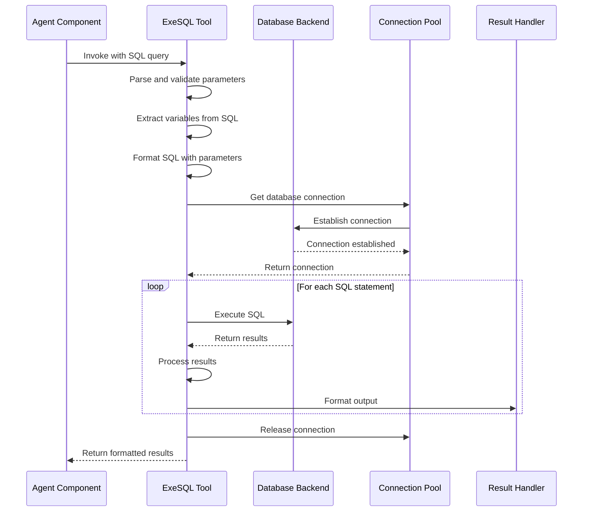

**Diagram sources**
- [agent/tools/exesql.py](file://agent/tools/exesql.py#L82-L272)

**Section sources**
- [agent/tools/exesql.py](file://agent/tools/exesql.py#L28-L276)

## Connection Configuration

Database connections are configured through a flexible parameter system that supports various authentication methods and connection options.

### Basic Configuration Parameters

| Parameter | Type | Description | Default Value |
|-----------|------|-------------|---------------|
| db_type | string | Database backend type | mysql |
| database | string | Target database name | Required |
| username | string | Database username | Required |
| host | string | Database hostname/IP | Required |
| port | integer | Database port number | 3306 (MySQL) |
| password | string | Database password | Required (except Trino) |
| max_records | integer | Maximum records to return | 1024 |

### Advanced Configuration Options

The system supports several advanced configuration options for optimal performance and security:

#### Connection Pooling

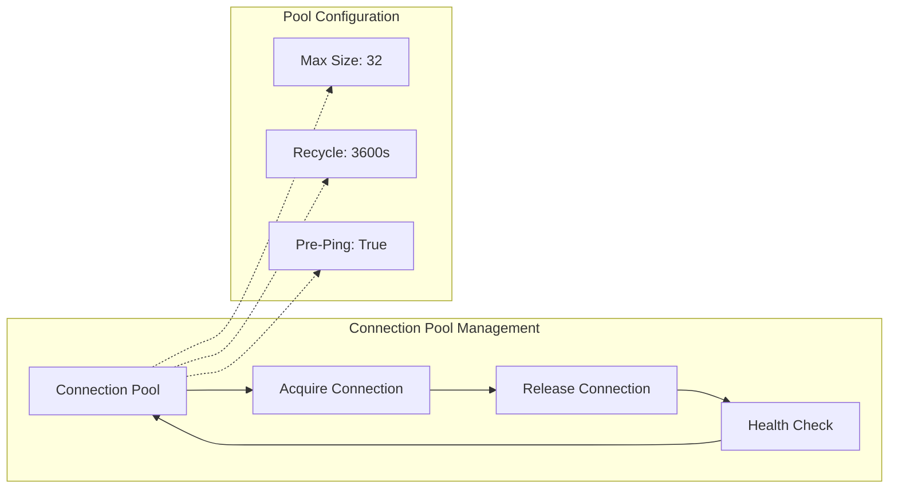

**Diagram sources**
- [rag/utils/infinity_conn.py](file://rag/utils/infinity_conn.py#L180-L195)

#### Timeout and Retry Configuration

The connection utilities implement sophisticated timeout and retry mechanisms:

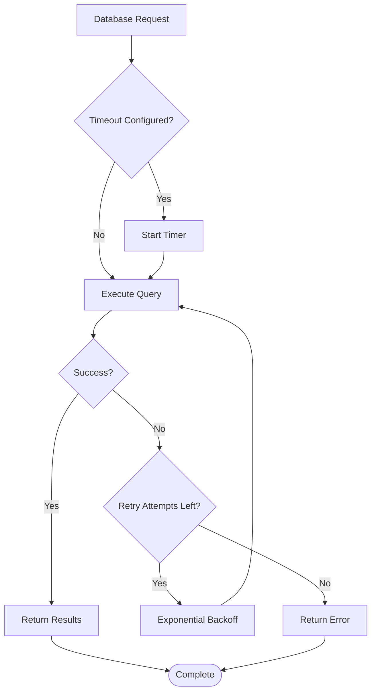

**Diagram sources**
- [common/connection_utils.py](file://common/connection_utils.py#L31-L103)

**Section sources**
- [agent/tools/exesql.py](file://agent/tools/exesql.py#L47-L54)
- [common/connection_utils.py](file://common/connection_utils.py#L31-L103)

## Security Considerations

The database tools implement multiple layers of security to protect against common vulnerabilities and ensure safe database access.

### SQL Injection Prevention

The system employs several strategies to prevent SQL injection attacks:

#### Parameterized Queries

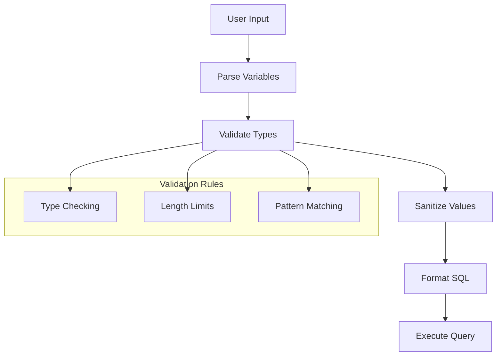

**Diagram sources**
- [agent/tools/exesql.py](file://agent/tools/exesql.py#L104-L114)

#### Credential Management

The system implements secure credential handling:

| Security Feature | Implementation | Purpose |
|------------------|----------------|---------|
| Environment Variables | Support for TRINO_USE_TLS, COMPONENT_EXEC_TIMEOUT | Secure credential storage |
| Connection Validation | Pre-execution connection testing | Prevent unauthorized access |
| Database Restrictions | Block rag_flow database access | Security isolation |
| Password Validation | Minimum length requirements | Strong authentication |

### Access Control

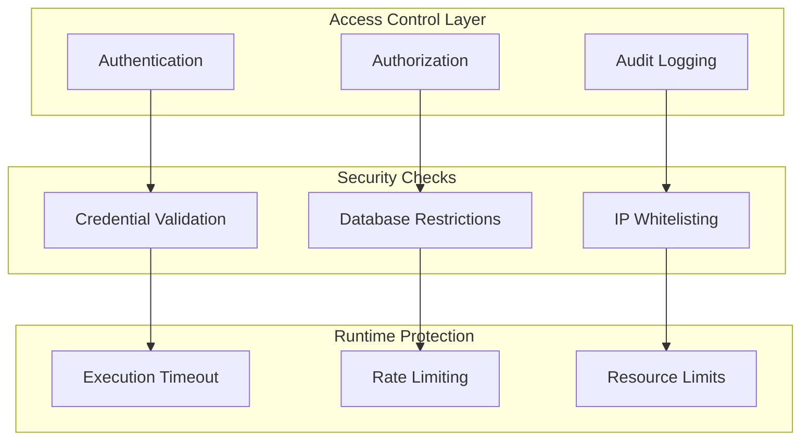

**Diagram sources**
- [agent/tools/exesql.py](file://agent/tools/exesql.py#L65-L69)

**Section sources**
- [agent/tools/exesql.py](file://agent/tools/exesql.py#L55-L69)
- [common/connection_utils.py](file://common/connection_utils.py#L31-L103)

## Performance Optimization

The database tools implement comprehensive performance optimization strategies to ensure efficient operation in agent workflows.

### Query Optimization Strategies

#### Connection Management

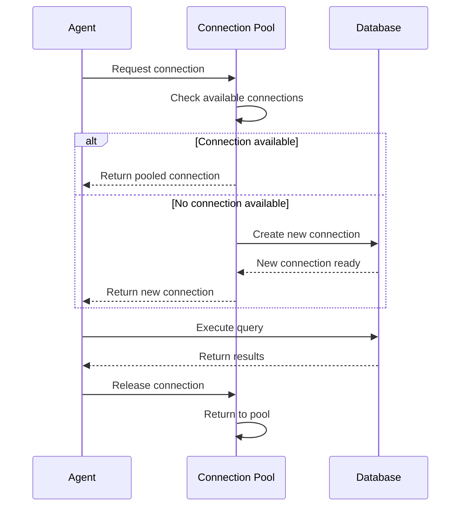

**Diagram sources**
- [rag/utils/infinity_conn.py](file://rag/utils/infinity_conn.py#L180-L195)

#### Result Pagination

The system implements intelligent result pagination to handle large datasets efficiently:

| Parameter | Purpose | Default | Range |
|-----------|---------|---------|-------|
| max_records | Maximum rows to return | 1024 | 1-1000000 |
| page_size | Records per page | 100 | 1-1000 |
| offset | Starting position | 0 | 0+ |

#### Batch Processing

For bulk operations, the system supports efficient batch processing:

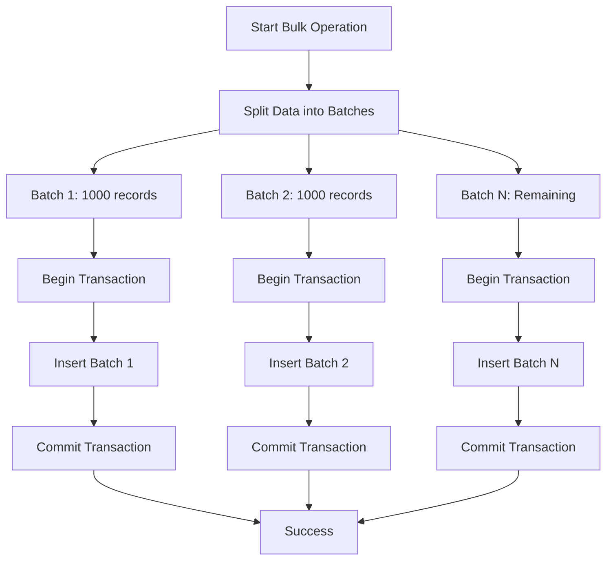

**Diagram sources**
- [api/db/db_utils.py](file://api/db/db_utils.py#L26-L51)

### Performance Monitoring

The system includes built-in performance monitoring and metrics collection:

#### Connection Health Monitoring

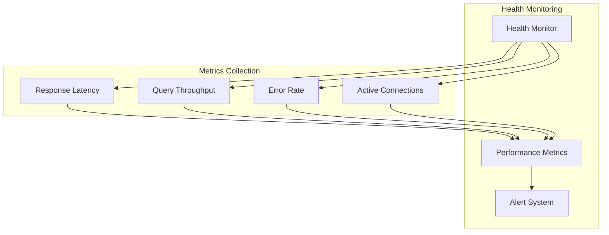

**Diagram sources**
- [rag/utils/infinity_conn.py](file://rag/utils/infinity_conn.py#L246-L257)

**Section sources**
- [api/db/db_utils.py](file://api/db/db_utils.py#L26-L51)
- [rag/utils/infinity_conn.py](file://rag/utils/infinity_conn.py#L174-L257)

## Vector Database Integration

The system provides comprehensive support for vector databases, particularly focusing on the Infinity vector database for advanced similarity search and embedding operations.

### Infinity Vector Database Features

#### Index Management

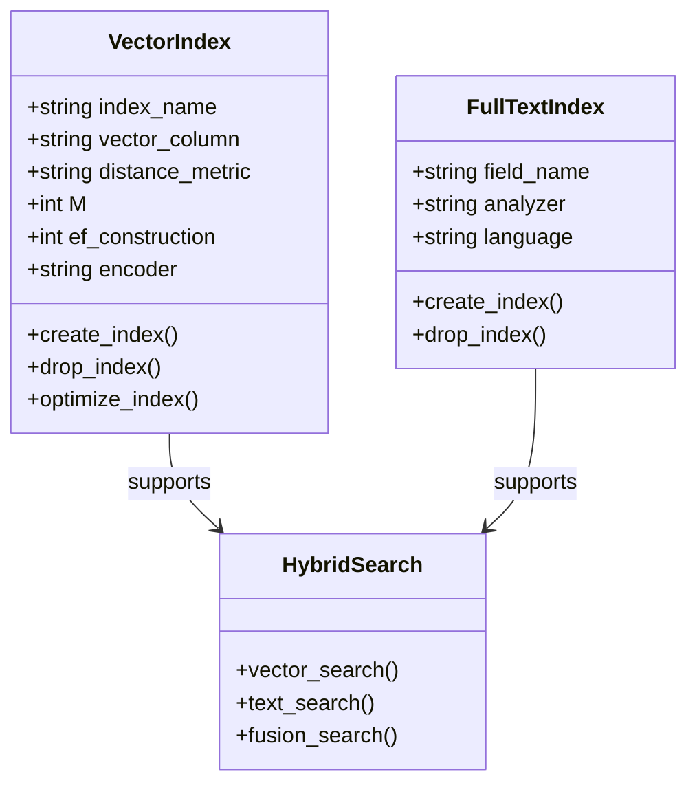

**Diagram sources**
- [rag/utils/infinity_conn.py](file://rag/utils/infinity_conn.py#L280-L306)

#### Embedding Operations

The system supports various embedding sizes and operations:

| Vector Dimension | Use Case | Performance | Memory Usage |
|------------------|----------|-------------|--------------|
| 512 | General purpose | Fast | Low |
| 768 | Enhanced accuracy | Medium | Medium |
| 1024 | High precision | Slow | High |
| 1536 | Large models | Very slow | Very high |

#### Search Capabilities

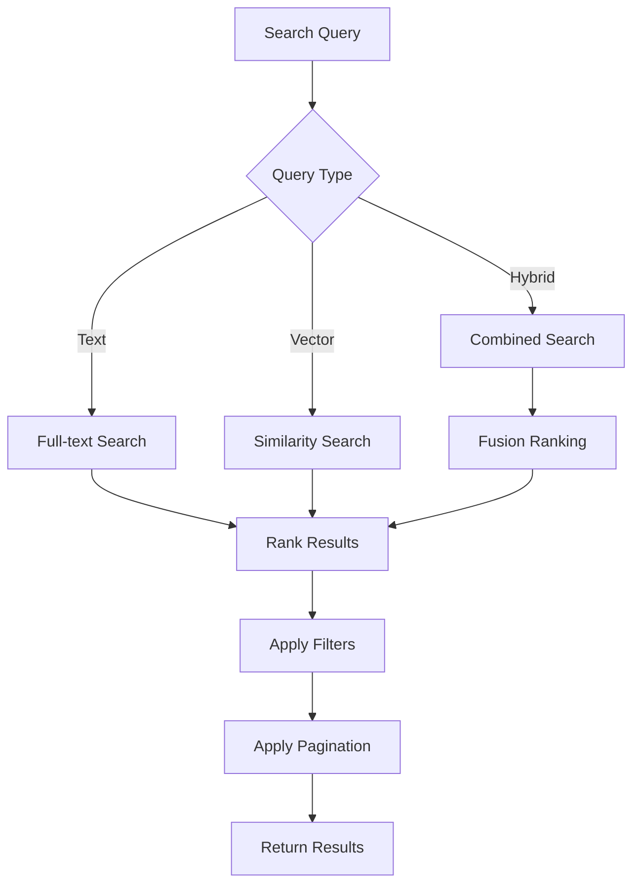

**Diagram sources**
- [rag/utils/infinity_conn.py](file://rag/utils/infinity_conn.py#L333-L506)

**Section sources**
- [rag/utils/infinity_conn.py](file://rag/utils/infinity_conn.py#L174-L506)
- [conf/mapping.json](file://conf/mapping.json#L159-L200)

## Best Practices

### Database Configuration

1. **Connection Pooling**: Always use connection pooling for production environments
2. **Timeout Configuration**: Set appropriate timeouts based on query complexity
3. **Resource Limits**: Configure maximum record limits to prevent memory issues
4. **Monitoring**: Implement comprehensive monitoring for connection health

### Security Best Practices

1. **Credential Management**: Store credentials securely using environment variables
2. **Network Security**: Use encrypted connections (TLS/SSL) for sensitive data
3. **Access Control**: Implement proper authentication and authorization
4. **Audit Logging**: Enable comprehensive audit logging for security monitoring

### Performance Best Practices

1. **Query Optimization**: Use parameterized queries and avoid dynamic SQL construction
2. **Result Limiting**: Always set reasonable limits on returned records
3. **Batch Processing**: Use batch operations for bulk data manipulation
4. **Indexing**: Properly index frequently queried columns

### Agent Workflow Integration

1. **Error Handling**: Implement robust error handling for database failures
2. **Retry Logic**: Use exponential backoff for transient failures
3. **Timeout Management**: Set appropriate timeouts for agent execution
4. **Resource Cleanup**: Ensure proper cleanup of database connections

## Troubleshooting

### Common Issues and Solutions

#### Connection Problems

| Issue | Symptoms | Solution |
|-------|----------|----------|
| Connection Timeout | Queries hang indefinitely | Increase timeout values, check network connectivity |
| Authentication Failure | Access denied errors | Verify credentials, check user permissions |
| SSL/TLS Issues | Certificate errors | Configure proper SSL settings, update certificates |
| Pool Exhaustion | Connection refused errors | Increase pool size, optimize connection usage |

#### Performance Issues

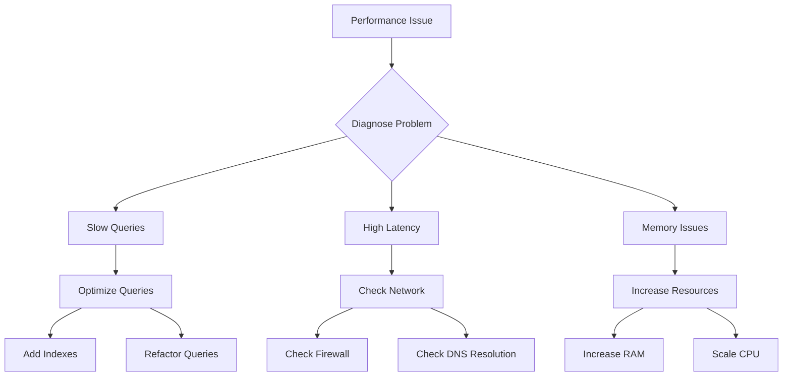

#### Debugging Tools

1. **Connection Testing**: Use built-in connection testing utilities
2. **Query Logging**: Enable detailed query logging for debugging
3. **Performance Profiling**: Monitor query execution times
4. **Resource Monitoring**: Track memory and CPU usage

### Error Codes and Messages

| Error Code | Description | Resolution |
|------------|-------------|------------|
| 2013 | Lost connection | Check network, increase timeout |
| 2006 | MySQL server gone | Restart MySQL, check resources |
| 57P01 | Admin shutdown | Wait for server restart |
| 57P03 | Cannot connect now | Check server status, verify credentials |

**Section sources**
- [agent/tools/exesql.py](file://agent/tools/exesql.py#L136-L168)
- [api/db/db_models.py](file://api/db/db_models.py#L242-L308)