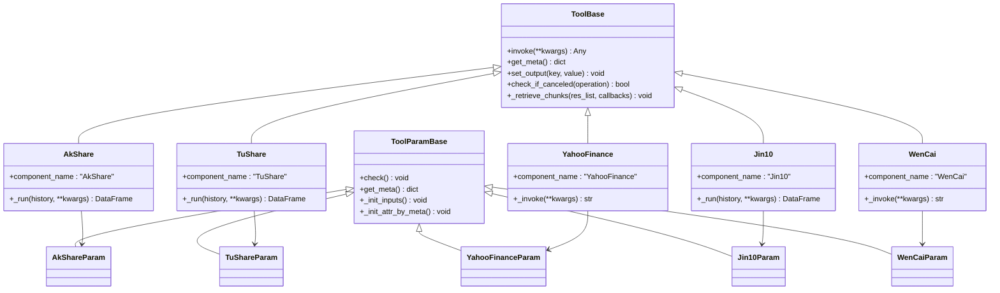
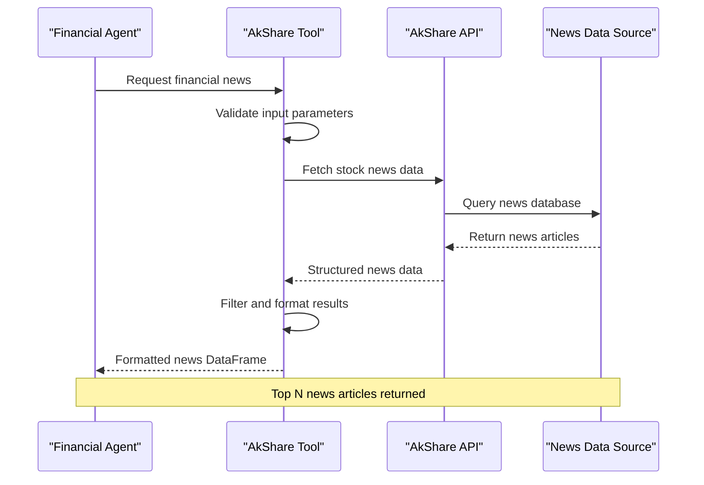
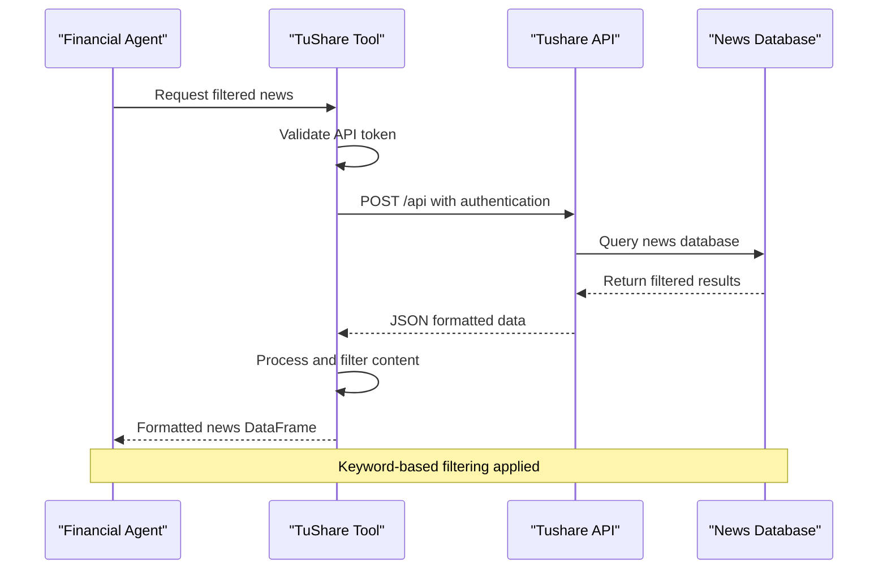
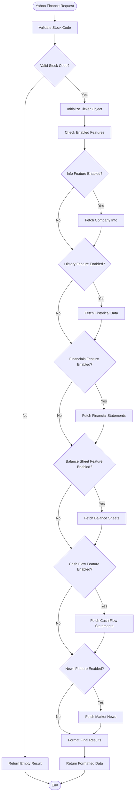
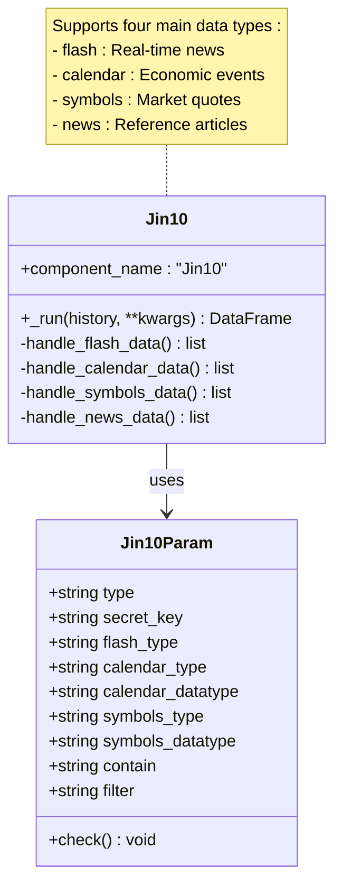
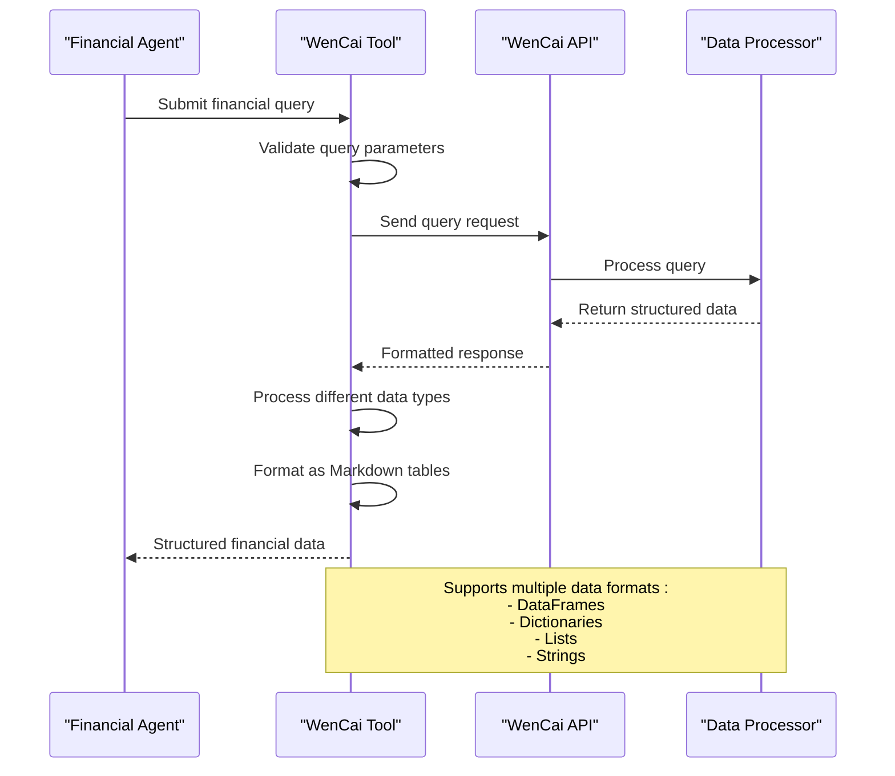
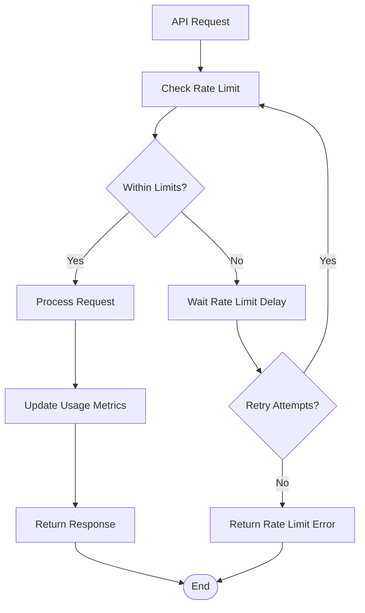
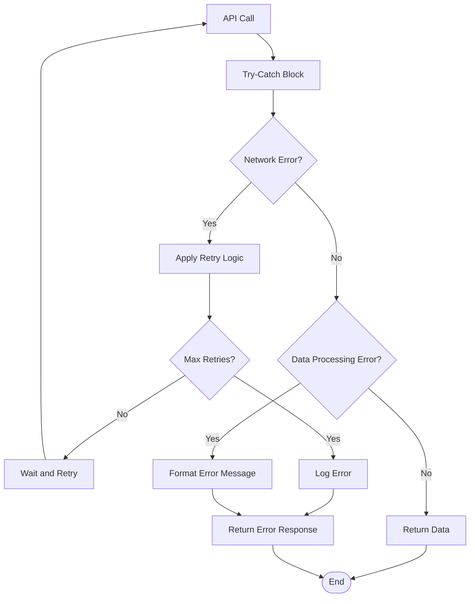
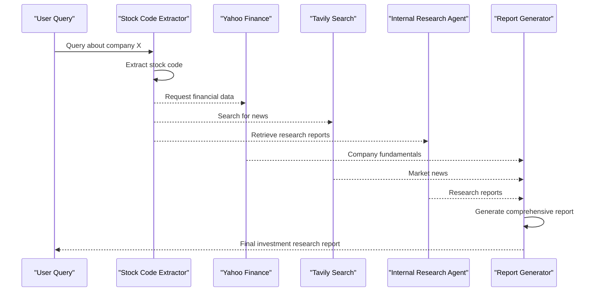

# Financial Data Tools

<cite>
**Referenced Files in This Document**
- [agent/tools/akshare.py](file://agent/tools/akshare.py)
- [agent/tools/tushare.py](file://agent/tools/tushare.py)
- [agent/tools/yahoofinance.py](file://agent/tools/yahoofinance.py)
- [agent/tools/jin10.py](file://agent/tools/jin10.py)
- [agent/tools/wencai.py](file://agent/tools/wencai.py)
- [agent/tools/base.py](file://agent/tools/base.py)
- [agent/templates/stock_research_report.json](file://agent/templates/stock_research_report.json)
- [common/connection_utils.py](file://common/connection_utils.py)
- [common/data_source/utils.py](file://common/data_source/utils.py)
</cite>

## Table of Contents
1. [Introduction](#introduction)
2. [Financial Data Tool Architecture](#financial-data-tool-architecture)
3. [AkShare Integration](#akshare-integration)
4. [Tushare Integration](#tushare-integration)
5. [Yahoo Finance Integration](#yahoo-finance-integration)
6. [Jin10 Integration](#jin10-integration)
7. [WenCai Integration](#wencai-integration)
8. [Authentication and Rate Limits](#authentication-and-rate-limits)
9. [Error Handling and Best Practices](#error-handling-and-best-practices)
10. [Financial Data Workflows](#financial-data-workflows)
11. [Performance Optimization](#performance-optimization)
12. [Troubleshooting Guide](#troubleshooting-guide)

## Introduction

The RAGFlow financial data tools provide comprehensive access to market data from multiple financial data providers, enabling sophisticated financial analysis and reporting within agent workflows. These tools integrate seamlessly with the RAGFlow system to deliver real-time and historical financial information, market trends, and economic indicators for investment research, portfolio analysis, and financial decision-making.

The financial data ecosystem consists of five primary data providers:
- **AkShare**: Chinese financial data provider focusing on domestic market information
- **Tushare**: Professional financial data platform with extensive market coverage
- **Yahoo Finance**: Global financial data with comprehensive market information
- **Jin10**: Chinese financial news and market data platform
- **WenCai**: Intelligent financial search and analysis platform

## Financial Data Tool Architecture

The financial data tools follow a standardized architecture pattern built on the RAGFlow component framework, ensuring consistency, reliability, and extensibility across all financial data integrations.

**Diagram sources**
- [agent/tools/base.py](file://agent/tools/base.py#L114-L176)
- [agent/tools/akshare.py](file://agent/tools/akshare.py#L34-L57)
- [agent/tools/tushare.py](file://agent/tools/tushare.py#L42-L85)
- [agent/tools/yahoofinance.py](file://agent/tools/yahoofinance.py#L72-L127)
- [agent/tools/jin10.py](file://agent/tools/jin10.py#L49-L151)
- [agent/tools/wencai.py](file://agent/tools/wencai.py#L68-L130)

**Section sources**
- [agent/tools/base.py](file://agent/tools/base.py#L114-L176)

## AkShare Integration

AkShare provides comprehensive financial data access specifically focused on Chinese domestic markets, offering real-time and historical financial information for securities, economic indicators, and market news.

### Key Features

- **Real-time Market News**: Access to latest financial news and market updates
- **Stock Information**: Comprehensive stock data including price quotes and trading volumes
- **Chinese Market Focus**: Specialized coverage of Chinese A-share markets
- **News Aggregation**: Multi-source news aggregation with filtering capabilities

### Implementation Details

The AkShare tool implements a streamlined interface for accessing financial news data with configurable parameters for controlling output volume and content filtering.

**Diagram sources**
- [agent/tools/akshare.py](file://agent/tools/akshare.py#L37-L56)

### Configuration Parameters

| Parameter | Type | Description | Default |
|-----------|------|-------------|---------|
| `top_n` | Integer | Number of news articles to return | 10 |

### Authentication Requirements

AkShare operates without authentication requirements, making it immediately accessible for development and testing scenarios.

### Usage Examples

The AkShare tool is particularly effective for:
- Real-time market news monitoring
- Company-specific news tracking
- Economic indicator analysis
- Market sentiment assessment

**Section sources**
- [agent/tools/akshare.py](file://agent/tools/akshare.py#L1-L57)

## Tushare Integration

Tushare provides professional-grade financial data services with extensive market coverage, supporting multiple data sources and comprehensive financial analysis capabilities.

### Key Features

- **Multi-Source News**: Access to news from various financial media outlets
- **Professional Data**: High-quality financial data with professional-grade accuracy
- **Extensive Coverage**: Comprehensive market data across multiple regions
- **Keyword Filtering**: Advanced filtering capabilities for targeted news retrieval

### Implementation Details

Tushare implements a robust API communication system with comprehensive error handling and retry mechanisms.

**Diagram sources**
- [agent/tools/tushare.py](file://agent/tools/tushare.py#L54-L84)

### Configuration Parameters

| Parameter | Type | Description | Default | Options |
|-----------|------|-------------|---------|---------|
| `token` | String | Tushare API token | "xxx" | Valid API token |
| `src` | String | News source platform | "eastmoney" | sina, wallstreetcn, 10jqka, eastmoney, yuncaijing, fenghuang, jinrongjie |
| `start_date` | String | Start date for news retrieval | "2024-01-01 09:00:00" | Date string format |
| `end_date` | String | End date for news retrieval | Current timestamp | Date string format |
| `keyword` | String | Keyword filter for news content | "" | Any string |

### Authentication Requirements

Tushare requires API token authentication for accessing premium data services. The token must be obtained from the Tushare platform and configured appropriately for production use.

### Rate Limiting

Tushare implements rate limiting to ensure fair usage of their API resources. The system handles rate limit errors gracefully with automatic retry mechanisms.

**Section sources**
- [agent/tools/tushare.py](file://agent/tools/tushare.py#L1-L85)

## Yahoo Finance Integration

Yahoo Finance provides comprehensive global financial data access with real-time market information, historical data, and detailed company information for investment analysis and research.

### Key Features

- **Global Market Coverage**: Access to international stock markets and indices
- **Real-time Data**: Live price quotes and market updates
- **Historical Analysis**: Extensive historical data for trend analysis
- **Company Fundamentals**: Detailed financial statements and company profiles
- **News Integration**: Market news and company-specific announcements

### Implementation Details

Yahoo Finance implements sophisticated error handling with retry mechanisms and timeout controls for reliable data retrieval.

**Diagram sources**
- [agent/tools/yahoofinance.py](file://agent/tools/yahoofinance.py#L85-L109)

### Configuration Parameters

| Parameter | Type | Description | Default |
|-----------|------|-------------|---------|
| `info` | Boolean | Enable company information retrieval | True |
| `history` | Boolean | Enable historical market data | False |
| `financials` | Boolean | Enable financial statements | False |
| `balance_sheet` | Boolean | Enable balance sheet data | False |
| `cash_flow_statement` | Boolean | Enable cash flow statements | False |
| `news` | Boolean | Enable market news | True |

### Authentication Requirements

Yahoo Finance operates without authentication requirements, providing free access to basic financial data. Premium features may require subscription.

### Error Handling

The Yahoo Finance integration implements comprehensive error handling with:
- Automatic retry mechanisms for transient failures
- Timeout controls to prevent hanging operations
- Graceful degradation when specific data points are unavailable
- Detailed logging for debugging and monitoring

**Section sources**
- [agent/tools/yahoofinance.py](file://agent/tools/yahoofinance.py#L1-L127)

## Jin10 Integration

Jin10 provides specialized Chinese financial data services with focus on real-time market updates, economic calendars, and comprehensive market analysis tools.

### Key Features

- **Real-time Flash News**: Immediate market news delivery
- **Economic Calendars**: Comprehensive economic event scheduling
- **Market Symbols**: Trading symbols and quote data
- **Multi-Asset Coverage**: Stocks, commodities, forex, and cryptocurrencies
- **Chinese Market Focus**: Specialized coverage of Chinese financial markets

### Implementation Details

Jin10 supports multiple data types with flexible configuration options for different market segments.

**Diagram sources**
- [agent/tools/jin10.py](file://agent/tools/jin10.py#L23-L48)

### Configuration Parameters

| Parameter | Type | Description | Options |
|-----------|------|-------------|---------|
| `type` | String | Data type to retrieve | flash, calendar, symbols, news |
| `secret_key` | String | Jin10 API secret key | Valid API key |
| `flash_type` | String | Flash news category | 1, 2, 3, 4, 5 |
| `calendar_type` | String | Calendar data source | cj, qh, hk, us |
| `calendar_datatype` | String | Calendar data shape | data, event, holiday |
| `symbols_type` | String | Symbol asset type | GOODS, FOREX, FUTURE, CRYPTO |
| `symbols_datatype` | String | Symbol data type | symbols, quotes |

### Supported Data Types

#### Flash News (Type: flash)
- **Category 1**: Market news
- **Category 2**: Futures news  
- **Category 3**: US-Hong Kong news
- **Category 4**: A-share news
- **Category 5**: Commodities and forex news

#### Calendar Events (Type: calendar)
- **cj**: Macroeconomic data calendar
- **qh**: Futures calendar
- **hk**: Hong Kong stock market calendar
- **us**: US stock market calendar

#### Market Symbols (Type: symbols)
- **GOODS**: Commodity symbols
- **FOREX**: Currency pairs
- **FUTURE**: Futures contracts
- **CRYPTO**: Cryptocurrency pairs

### Authentication Requirements

Jin10 requires API secret key authentication for accessing premium financial data services.

### Rate Limiting

Jin10 implements rate limiting to ensure service stability and fair usage across all clients.

**Section sources**
- [agent/tools/jin10.py](file://agent/tools/jin10.py#L1-L151)

## WenCai Integration

WenCai provides intelligent financial search capabilities with AI-powered stock selection and comprehensive market analysis tools for investment research.

### Key Features

- **Intelligent Search**: AI-powered financial query processing
- **Stock Selection**: Advanced stock screening and selection
- **Multi-Asset Analysis**: Coverage of stocks, funds, bonds, and derivatives
- **Quantitative Analysis**: Technical and fundamental analysis tools
- **Chinese Market Focus**: Specialized coverage of Chinese financial markets

### Implementation Details

WenCai implements sophisticated data processing with flexible output formatting for various data types.

**Diagram sources**
- [agent/tools/wencai.py](file://agent/tools/wencai.py#L71-L129)

### Configuration Parameters

| Parameter | Type | Description | Default | Options |
|-----------|------|-------------|---------|---------|
| `top_n` | Integer | Maximum results to return | 10 | Positive integer |
| `query_type` | String | Asset type for query | "stock" | stock, zhishu, fund, hkstock, usstock, threeboard, conbond, insurance, futures, lccp, foreign_exchange |

### Supported Query Types

- **stock**: Individual stocks
- **zhishu**: Stock indices
- **fund**: Mutual funds
- **hkstock**: Hong Kong stocks
- **usstock**: US stocks
- **threeboard**: China's third board market
- **conbond**: Corporate bonds
- **insurance**: Insurance products
- **futures**: Futures contracts
- **lccp**: Large-cap corporate papers
- **foreign_exchange**: Foreign exchange

### Data Processing Capabilities

WenCai automatically processes different data types and formats them consistently:
- **DataFrames**: Converted to Markdown tables
- **Dictionaries**: Processed with special handling for metadata
- **Lists**: Converted to structured tables
- **Strings**: Direct inclusion with context

**Section sources**
- [agent/tools/wencai.py](file://agent/tools/wencai.py#L1-L130)

## Authentication and Rate Limits

### Authentication Strategies

Each financial data provider implements different authentication approaches:

#### AkShare and Yahoo Finance
- **No Authentication**: Free access for basic data retrieval
- **Rate Limiting**: Built-in throttling mechanisms
- **Usage Guidelines**: Respectful usage policies

#### Tushare and Jin10
- **API Token Authentication**: Required for premium data access
- **Token Management**: Secure storage and rotation
- **Quota Tracking**: Monitor usage against API limits

#### WenCai
- **API Key Authentication**: Required for advanced features
- **Subscription Model**: Tiered access based on usage
- **Usage Monitoring**: Track consumption patterns

### Rate Limiting Implementation

The system implements comprehensive rate limiting across all financial data tools:

**Diagram sources**
- [common/data_source/utils.py](file://common/data_source/utils.py#L211-L250)

### Best Practices for Rate Limit Management

1. **Implement Exponential Backoff**: Gradually increase wait times for repeated failures
2. **Monitor Usage Patterns**: Track API consumption to optimize request timing
3. **Cache Frequently Accessed Data**: Reduce redundant API calls
4. **Use Batch Operations**: Combine multiple requests when possible
5. **Implement Circuit Breakers**: Stop requests when thresholds are exceeded

**Section sources**
- [common/data_source/utils.py](file://common/data_source/utils.py#L211-L250)

## Error Handling and Best Practices

### Comprehensive Error Handling

The financial data tools implement multi-layered error handling strategies:

**Diagram sources**
- [agent/tools/yahoofinance.py](file://agent/tools/yahoofinance.py#L111-L121)
- [agent/tools/wencai.py](file://agent/tools/wencai.py#L114-L124)

### Error Categories and Handling

#### Network Errors
- **Connection Timeouts**: Implement exponential backoff
- **DNS Resolution Failures**: Retry with fallback endpoints
- **SSL/TLS Issues**: Verify certificate validity

#### API Errors
- **Authentication Failures**: Refresh tokens and retry
- **Rate Limit Exceeded**: Implement delay mechanisms
- **Invalid Parameters**: Validate inputs before API calls

#### Data Processing Errors
- **Parsing Failures**: Graceful degradation with partial data
- **Format Mismatches**: Flexible data type handling
- **Missing Fields**: Provide default values or skip

### Best Practices for Financial Data Integration

#### Data Validation
1. **Input Sanitization**: Validate all user inputs before API calls
2. **Schema Validation**: Ensure data conforms to expected formats
3. **Range Checking**: Verify numerical values fall within reasonable bounds

#### Data Quality Assurance
1. **Null Value Handling**: Implement appropriate null value strategies
2. **Data Consistency Checks**: Verify data integrity across related fields
3. **Outlier Detection**: Identify and handle anomalous data points

#### Performance Optimization
1. **Connection Pooling**: Reuse HTTP connections for efficiency
2. **Compression**: Enable gzip compression for large datasets
3. **Streaming**: Process large datasets in chunks

**Section sources**
- [agent/tools/yahoofinance.py](file://agent/tools/yahoofinance.py#L111-L121)
- [agent/tools/wencai.py](file://agent/tools/wencai.py#L114-L124)

## Financial Data Workflows

### Stock Research Report Workflow

The stock research report workflow demonstrates comprehensive financial data integration within RAGFlow agent templates.

**Diagram sources**
- [agent/templates/stock_research_report.json](file://agent/templates/stock_research_report.json#L15-L300)

### Multi-Provider Data Fusion

Financial data workflows often combine multiple providers for comprehensive analysis:

#### Data Collection Phase
1. **Yahoo Finance**: Company fundamentals and historical data
2. **AkShare**: Chinese market news and domestic indicators
3. **Tushare**: Professional-grade market data and analytics
4. **Jin10**: Real-time market updates and economic calendars
5. **WenCai**: Intelligent stock selection and quantitative analysis

#### Data Processing Phase
1. **Normalization**: Standardize data formats across providers
2. **Integration**: Combine complementary data sources
3. **Validation**: Cross-validate information for accuracy
4. **Enrichment**: Add contextual information and analysis

#### Output Generation Phase
1. **Structured Reporting**: Format data for analysis and presentation
2. **Visualization**: Create charts and graphs for data interpretation
3. **Insights Generation**: Apply analytical techniques to derive insights
4. **Citation Management**: Track data sources for transparency

### Use Cases and Applications

#### Investment Research
- **Portfolio Analysis**: Comprehensive evaluation of investment holdings
- **Sector Analysis**: Comparative analysis across industry sectors
- **Risk Assessment**: Multi-factor risk evaluation and mitigation

#### Market Analysis
- **Trend Analysis**: Identification of market trends and patterns
- **Sentiment Analysis**: Quantification of market sentiment
- **Event Impact Analysis**: Assessment of market reactions to events

#### Regulatory Compliance
- **Reporting Automation**: Automated generation of regulatory reports
- **Audit Trails**: Comprehensive logging of data sources and transformations
- **Compliance Monitoring**: Real-time monitoring of compliance metrics

**Section sources**
- [agent/templates/stock_research_report.json](file://agent/templates/stock_research_report.json#L1-L800)

## Performance Optimization

### Caching Strategies

Implementing effective caching reduces API calls and improves response times:

#### Memory-Based Caching
- **In-Memory Storage**: Fast access for frequently requested data
- **LRU Eviction**: Automatic cleanup of least recently used items
- **Size Limits**: Configurable cache sizes to prevent memory exhaustion

#### Persistent Caching
- **Disk Storage**: Long-term retention of cached data
- **Compression**: Efficient storage of large datasets
- **Expiration Policies**: Automatic cleanup of stale data

#### Distributed Caching
- **Redis Integration**: Scalable caching solution
- **Consistency Guarantees**: Ensuring cache coherence across instances
- **Failover Support**: High availability for cached data

### Connection Management

Optimizing network connections improves overall system performance:

#### Connection Pooling
- **HTTP/HTTPS Connections**: Reuse established connections
- **Pool Size Management**: Optimal pool sizing for workload
- **Idle Connection Cleanup**: Prevent resource leaks

#### Timeout Configuration
- **Connection Timeouts**: Prevent hanging connections
- **Read Timeouts**: Control data transfer timeouts
- **Keep-Alive Settings**: Maintain persistent connections

### Data Processing Optimization

Efficient data processing reduces computational overhead:

#### Parallel Processing
- **Concurrent API Calls**: Simultaneous requests to multiple providers
- **Pipeline Processing**: Overlapping data transformation stages
- **Batch Operations**: Grouping related operations for efficiency

#### Memory Management
- **Streaming Processing**: Process large datasets in chunks
- **Garbage Collection**: Proactive memory cleanup
- **Resource Monitoring**: Track memory usage patterns

**Section sources**
- [common/connection_utils.py](file://common/connection_utils.py#L31-L103)

## Troubleshooting Guide

### Common Issues and Solutions

#### Authentication Failures
**Problem**: API authentication errors
**Causes**: Invalid tokens, expired credentials, network connectivity
**Solutions**: 
- Verify API keys and tokens are correctly configured
- Check token expiration and refresh as needed
- Test network connectivity to API endpoints

#### Rate Limit Exceeded
**Problem**: API rate limit errors
**Causes**: Too many requests within time window
**Solutions**:
- Implement exponential backoff strategies
- Distribute requests over time
- Upgrade to higher-tier API plans if necessary

#### Data Quality Issues
**Problem**: Inconsistent or missing data
**Causes**: Provider data issues, network problems, parsing errors
**Solutions**:
- Implement data validation and sanitization
- Use fallback data sources when available
- Log detailed error information for debugging

#### Performance Problems
**Problem**: Slow response times or timeouts
**Causes**: Network latency, API server issues, inefficient code
**Solutions**:
- Optimize API call patterns and reduce unnecessary requests
- Implement caching strategies for frequently accessed data
- Monitor and tune system resources

### Debugging Techniques

#### Logging and Monitoring
1. **Enable Debug Logging**: Increase log verbosity for detailed information
2. **Monitor API Metrics**: Track request/response times and error rates
3. **Resource Monitoring**: Monitor CPU, memory, and network usage
4. **Custom Metrics**: Implement application-specific monitoring

#### Testing and Validation
1. **Unit Testing**: Test individual components in isolation
2. **Integration Testing**: Verify end-to-end workflows
3. **Load Testing**: Simulate high-volume usage scenarios
4. **Error Simulation**: Test error handling and recovery mechanisms

#### Performance Profiling
1. **Timing Analysis**: Measure execution times for different operations
2. **Memory Profiling**: Identify memory leaks and optimization opportunities
3. **Network Analysis**: Analyze network traffic and bottlenecks
4. **Database Optimization**: Optimize data storage and retrieval

### Support Resources

#### Documentation
- **API Documentation**: Official documentation for each financial data provider
- **Implementation Guides**: Step-by-step implementation instructions
- **Best Practices**: Recommended approaches for optimal performance

#### Community Support
- **Issue Tracking**: Report bugs and request features
- **Discussion Forums**: Community-driven support and knowledge sharing
- **Code Examples**: Sample implementations and use cases

#### Professional Services
- **Consulting**: Expert guidance for complex implementations
- **Training**: Educational resources for team development
- **Maintenance**: Ongoing support and system maintenance

**Section sources**
- [common/connection_utils.py](file://common/connection_utils.py#L31-L103)