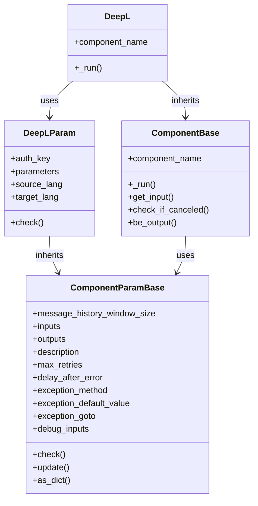
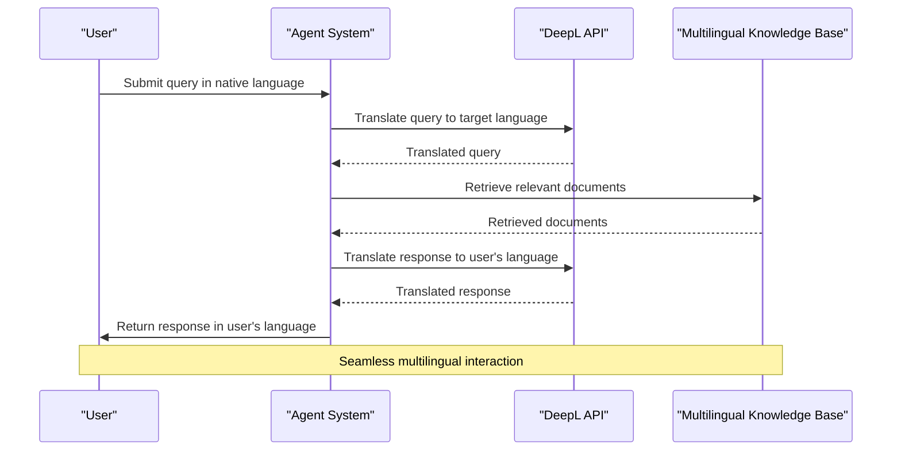
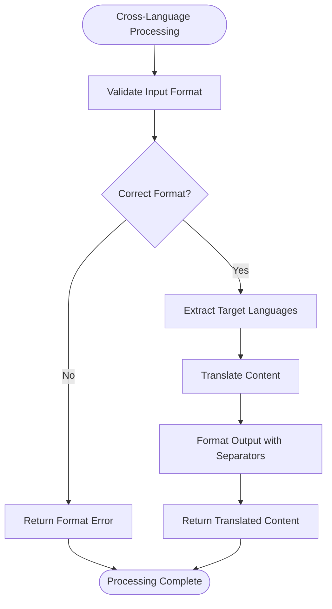

# Translation Tools

<cite>
**Referenced Files in This Document**   
- [deepl.py](file://agent/tools/deepl.py)
- [cross_languages_sys_prompt.md](file://rag/prompts/cross_languages_sys_prompt.md)
- [cross_languages_user_prompt.md](file://rag/prompts/cross_languages_user_prompt.md)
- [options.ts](file://web/src/pages/agent/options.ts)
- [base.py](file://agent/component/base.py)
</cite>

## Table of Contents
1. [Introduction](#introduction)
2. [DeepL Integration Implementation](#deepl-integration-implementation)
3. [API Configuration and Parameters](#api-configuration-and-parameters)
4. [Supported Language Pairs](#supported-language-pairs)
5. [Translation Quality and Context Preservation](#translation-quality-and-context-preservation)
6. [Multilingual Agent Workflows](#multilingual-agent-workflows)
7. [Cross-Language Prompts in RAG System](#cross-language-prompts-in-rag-system)
8. [Rate Limiting and Cost Considerations](#rate-limiting-and-cost-considerations)
9. [Best Practices](#best-practices)

## Introduction
The translation tools in the agent system provide robust multilingual capabilities through DeepL integration, enabling high-quality text translation across multiple languages. This documentation details the implementation of the DeepL component, its configuration options, supported language pairs, and integration with various system components. The translation functionality supports critical use cases such as translating user queries, generating responses in different languages, processing international documents, and enabling cross-language search in the RAG system. The system is designed to maintain context and meaning during translation while addressing rate limiting and cost considerations for translation services.

## DeepL Integration Implementation
The DeepL integration is implemented as a component within the agent system, providing a seamless interface for text translation services. The implementation follows the component-based architecture of the system, inheriting from the base component classes and implementing the necessary interfaces for integration with agent workflows.

**Diagram sources**
- [deepl.py](file://agent/tools/deepl.py#L21-L68)
- [base.py](file://agent/component/base.py#L37-L200)

**Section sources**
- [deepl.py](file://agent/tools/deepl.py#L16-L68)

## API Configuration and Parameters
The DeepL component is configured through a set of parameters that control its behavior and integration with the DeepL API service. These parameters are defined in the DeepLParam class and include essential configuration options for authentication and translation settings.

The primary configuration parameters include:
- **auth_key**: Authentication key for accessing the DeepL API service
- **source_lang**: Source language for translation (default: 'ZH')
- **target_lang**: Target language for translation (default: 'EN-GB')

The component performs validation on these parameters to ensure they contain valid values before initiating translation requests. The configuration system follows the component parameter base class, allowing for consistent parameter management across all agent components.

**Section sources**
- [deepl.py](file://agent/tools/deepl.py#L26-L42)

## Supported Language Pairs
The DeepL integration supports a comprehensive set of language pairs for translation, enabling multilingual communication across various language combinations. The system validates both source and target languages against predefined lists of supported languages.

### Source Languages
The following source languages are supported:
- Arabic (AR)
- Bulgarian (BG)
- Czech (CS)
- Danish (DA)
- German (DE)
- Greek (EL)
- English (EN)
- Spanish (ES)
- Estonian (ET)
- Finnish (FI)
- French (FR)
- Hungarian (HU)
- Indonesian (ID)
- Italian (IT)
- Japanese (JA)
- Korean (KO)
- Lithuanian (LT)
- Latvian (LV)
- Norwegian Bokmål (NB)
- Dutch (NL)
- Polish (PL)
- Portuguese (PT)
- Romanian (RO)
- Russian (RU)
- Slovak (SK)
- Slovenian (SL)
- Swedish (SV)
- Turkish (TR)
- Ukrainian (UK)
- Chinese (ZH)

### Target Languages
The following target languages are supported, including regional variants:
- Arabic (AR)
- Bulgarian (BG)
- Czech (CS)
- Danish (DA)
- German (DE)
- Greek (EL)
- English (British) (EN-GB)
- English (American) (EN-US)
- Spanish (ES)
- Estonian (ET)
- Finnish (FI)
- French (FR)
- Hungarian (HU)
- Indonesian (ID)
- Italian (IT)
- Japanese (JA)
- Korean (KO)
- Lithuanian (LT)
- Latvian (LV)
- Norwegian Bokmål (NB)
- Dutch (NL)
- Polish (PL)
- Portuguese (Brazilian) (PT-BR)
- Portuguese (all varieties excluding Brazilian) (PT-PT)
- Romanian (RO)
- Russian (RU)
- Slovak (SK)
- Slovenian (SL)
- Swedish (SV)
- Turkish (TR)
- Ukrainian (UK)
- Chinese (simplified) (ZH)

**Section sources**
- [deepl.py](file://agent/tools/deepl.py#L35-L42)
- [options.ts](file://web/src/pages/agent/options.ts#L1972-L2040)

## Translation Quality and Context Preservation
The translation system is designed to maintain high quality and preserve context and meaning during translation. The implementation focuses on several key aspects of translation quality:

1. **Formatting Preservation**: The system maintains original formatting, including tables, lists, and spacing, to ensure the translated content retains its structural integrity.

2. **Technical Accuracy**: Technical terminology is preserved accurately during translation, ensuring domain-specific terms are correctly translated.

3. **Cultural Appropriateness**: Translations are adapted to be culturally appropriate for the target language, considering regional variations and cultural context.

4. **Context Awareness**: The system considers the broader context of the text being translated to ensure meaning is preserved across language boundaries.

The DeepL API is known for its high-quality translations, particularly for European languages, and the integration leverages this capability to provide reliable multilingual support within the agent system.

## Multilingual Agent Workflows
The translation tools enable various multilingual workflows within the agent system, supporting diverse use cases for international communication and document processing.

### User Query Translation
The system can translate user queries from one language to another, enabling users to interact with the system in their preferred language while maintaining the ability to retrieve information from multilingual knowledge bases.

### Response Generation in Different Languages
Agents can generate responses in different languages based on user preferences or requirements, allowing for multilingual customer support and international communication.

### International Document Processing
The system can process documents written in various languages, extracting and translating content as needed for analysis and information retrieval.

### Image-Based Translation
The system supports translation of text extracted from images, enabling users to translate signage, documents, and other visual content from photographs.

**Diagram sources**
- [deepl.py](file://agent/tools/deepl.py#L48-L68)
- [image_lingo.json](file://agent/templates/image_lingo.json#L45-L183)

**Section sources**
- [deepl.py](file://agent/tools/deepl.py#L48-L68)
- [image_lingo.json](file://agent/templates/image_lingo.json#L45-L183)

## Cross-Language Prompts in RAG System
The RAG system incorporates cross-language prompts to enable multilingual information retrieval and processing. This functionality is implemented through specific prompt templates that guide the translation process.

### Cross-Language System Prompt
The cross-language system prompt defines the behavior rules for multilingual translation, including:
- Accepting batch translation requests in a specific format
- Maintaining original formatting, technical terminology, and cultural context
- Outputting translations in a standardized format with language separators

**Diagram sources**
- [cross_languages_sys_prompt.md](file://rag/prompts/cross_languages_sys_prompt.md#L1-L36)
- [cross_languages_user_prompt.md](file://rag/prompts/cross_languages_user_prompt.md#L1-L8)

**Section sources**
- [cross_languages_sys_prompt.md](file://rag/prompts/cross_languages_sys_prompt.md#L1-L36)
- [cross_languages_user_prompt.md](file://rag/prompts/cross_languages_user_prompt.md#L1-L8)

## Rate Limiting and Cost Considerations
The DeepL integration must consider rate limiting and cost implications when processing translation requests. While the current implementation does not include explicit rate limiting controls, these considerations are important for production deployment.

### Rate Limiting
DeepL API has rate limits based on the subscription plan. The system should implement appropriate error handling and retry mechanisms to handle rate limit exceeded responses from the API.

### Cost Management
Translation costs are typically based on the number of characters translated. The system should provide mechanisms to:
- Monitor translation usage and costs
- Implement caching of frequently translated content
- Optimize translation requests to minimize unnecessary translations
- Provide cost estimates for translation operations

The error handling in the DeepL component includes exception handling for API errors, which can be extended to specifically handle rate limiting scenarios.

**Section sources**
- [deepl.py](file://agent/tools/deepl.py#L59-L68)

## Best Practices
To ensure effective use of the translation tools in the agent system, follow these best practices:

1. **Secure API Keys**: Store DeepL API keys securely and avoid hardcoding them in configuration files.

2. **Handle Errors Gracefully**: Implement proper error handling for translation failures, including network issues and API errors.

3. **Cache Translations**: Implement caching mechanisms to avoid re-translating identical content, reducing costs and improving performance.

4. **Validate Language Codes**: Ensure language codes are validated against the supported list before making translation requests.

5. **Monitor Usage**: Track translation usage to understand costs and identify optimization opportunities.

6. **Test with Real Content**: Test the translation functionality with real-world content to ensure quality and accuracy.

7. **Consider Context**: When translating, consider the broader context of the content to ensure meaning is preserved.

8. **Handle Special Characters**: Ensure proper handling of special characters and formatting in translated content.

By following these best practices, users can maximize the effectiveness of the translation tools while minimizing costs and ensuring high-quality multilingual support.