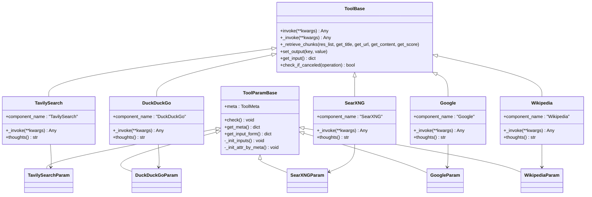
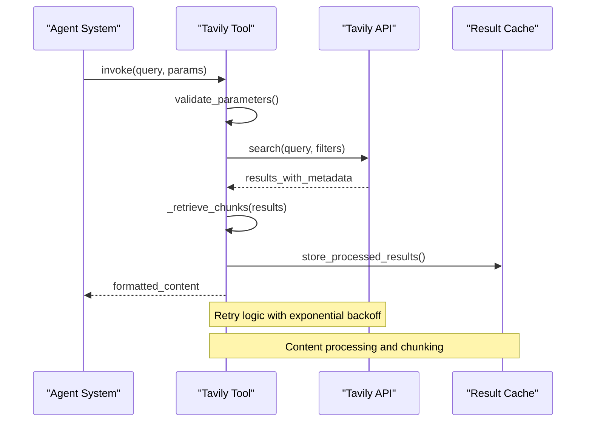
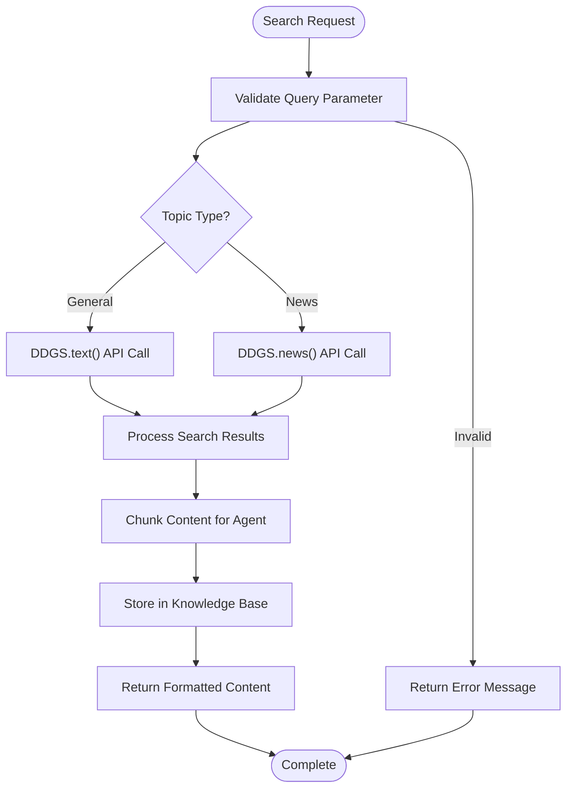
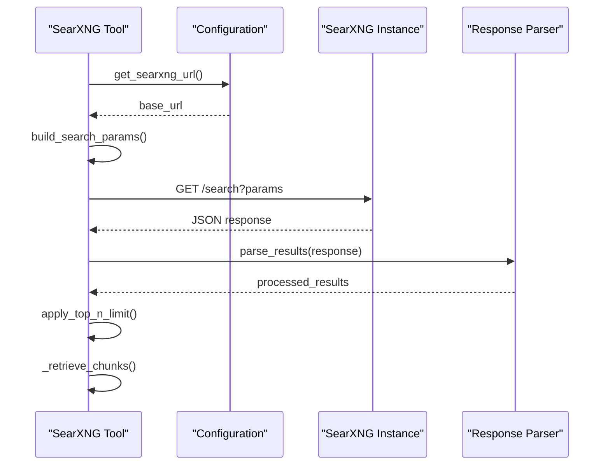
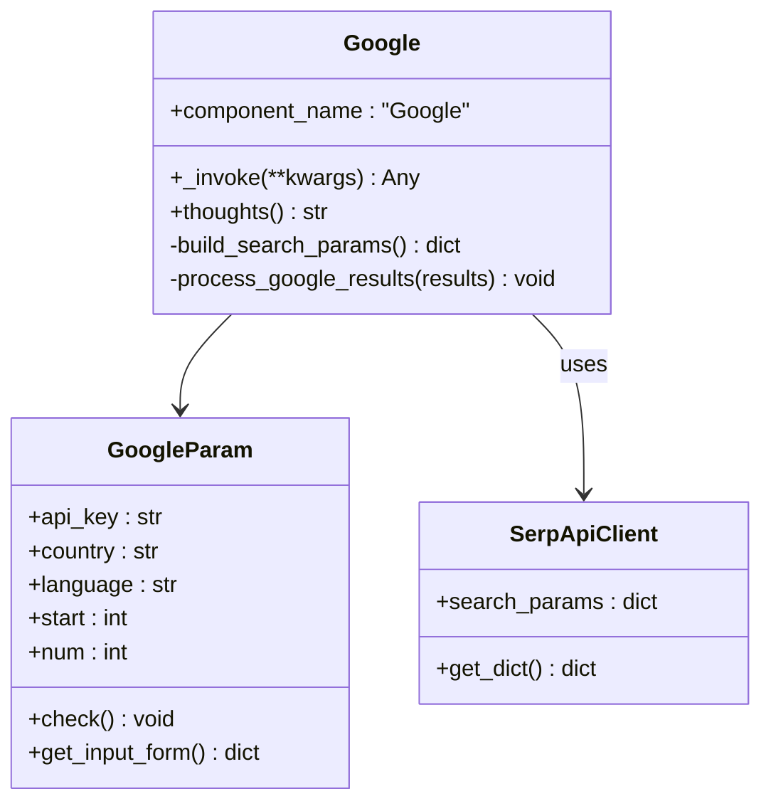
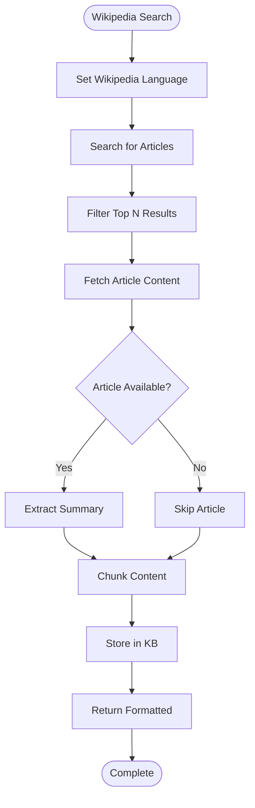
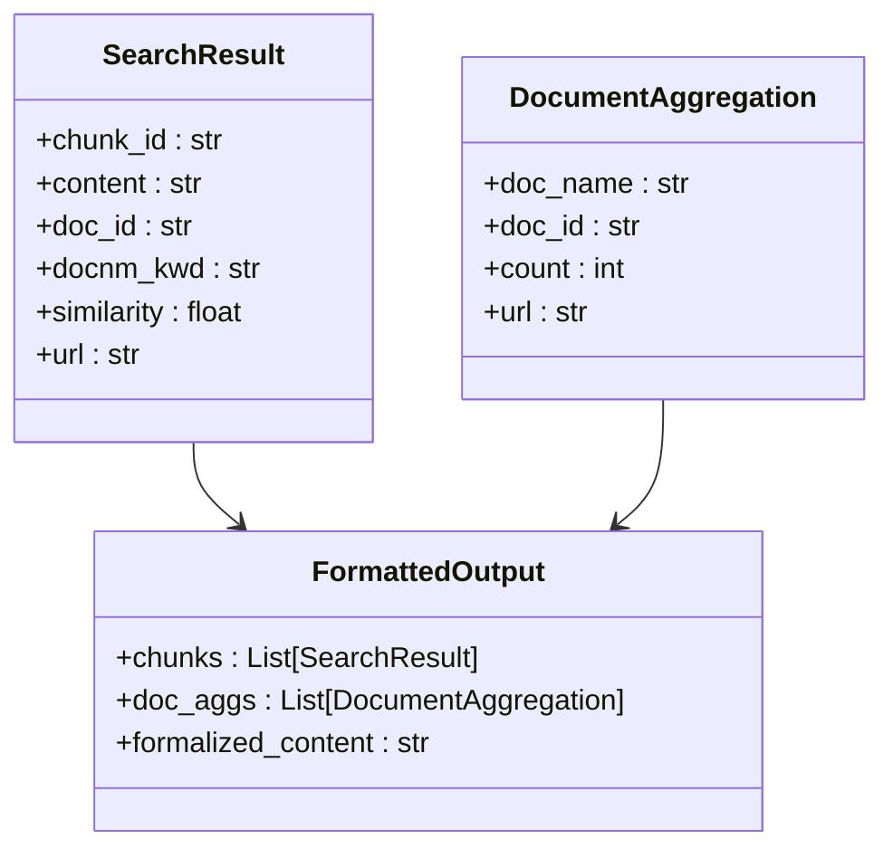
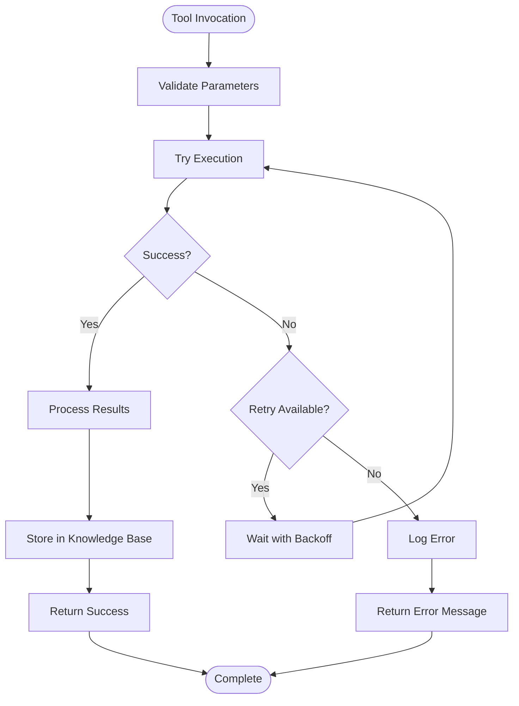

# Web Search Tools

<cite>
**Referenced Files in This Document**
- [tavily.py](file://agent/tools/tavily.py)
- [duckduckgo.py](file://agent/tools/duckduckgo.py)
- [searxng.py](file://agent/tools/searxng.py)
- [google.py](file://agent/tools/google.py)
- [wikipedia.py](file://agent/tools/wikipedia.py)
- [base.py](file://agent/tools/base.py)
- [connection_utils.py](file://common/connection_utils.py)
- [categorize_and_agent_with_tavily.json](file://agent/test/dsl_examples/categorize_and_agent_with_tavily.json)
- [tavily_and_generate.json](file://agent/test/dsl_examples/tavily_and_generate.json)
- [settings.py](file://agent/settings.py)
</cite>

## Table of Contents
1. [Introduction](#introduction)
2. [System Architecture](#system-architecture)
3. [Search Tool Implementation](#search-tool-implementation)
4. [API Integration Details](#api-integration-details)
5. [Configuration and Setup](#configuration-and-setup)
6. [Error Handling and Rate Limiting](#error-handling-and-rate-limiting)
7. [Privacy and Security Considerations](#privacy-and-security-considerations)
8. [Performance Optimization](#performance-optimization)
9. [Usage Examples](#usage-examples)
10. [Best Practices](#best-practices)

## Introduction

The RAGFlow agent system provides a comprehensive suite of web search tools designed to enable agents to retrieve information from various external search sources. These tools integrate seamlessly with the agent framework, providing standardized interfaces for different search engines while maintaining consistent error handling, rate limiting, and privacy considerations.

The system currently supports five primary search tools:
- **Tavily**: Comprehensive web search with AI-optimized results
- **DuckDuckGo**: Privacy-focused search with emphasis on user protection
- **SearXNG**: Open-source metasearch engine aggregating multiple sources
- **Google**: Official Google Search API integration
- **Wikipedia**: Specialized encyclopedia search for factual information

Each tool is implemented as a separate component within the agent system, following a consistent architectural pattern that ensures reliability, scalability, and ease of maintenance.

## System Architecture

The search tools architecture follows a modular design pattern with clear separation of concerns:



**Diagram sources**
- [base.py](file://agent/tools/base.py#L114-L176)
- [tavily.py](file://agent/tools/tavily.py#L101-L252)
- [duckduckgo.py](file://agent/tools/duckduckgo.py#L73-L144)
- [searxng.py](file://agent/tools/searxng.py#L77-L170)
- [google.py](file://agent/tools/google.py#L116-L173)
- [wikipedia.py](file://agent/tools/wikipedia.py#L64-L117)

**Section sources**
- [base.py](file://agent/tools/base.py#L114-L176)

## Search Tool Implementation

### Tavily Search Engine

Tavily is designed specifically for LLM applications, offering optimized search results with AI-friendly formatting.

#### Key Features:
- **AI-Optimized Results**: Designed for efficient processing by language models
- **Multiple Content Types**: Supports news and general searches
- **Domain Filtering**: Include/exclude specific domains
- **Advanced Extraction**: Separate search and extraction capabilities
- **Rich Metadata**: Provides scores, raw content, and structured data

#### API Integration Pattern:
The Tavily implementation uses the official Tavily Python client with robust error handling and retry mechanisms.



**Diagram sources**
- [tavily.py](file://agent/tools/tavily.py#L104-L145)

#### Configuration Parameters:
- **api_key**: Required Tavily API key
- **search_depth**: "basic" or "advanced" for result quality vs. cost
- **max_results**: Maximum number of results (1-20)
- **topic**: "general" or "news" for content type
- **include_domains**: Array of allowed domains
- **exclude_domains**: Array of blocked domains

**Section sources**
- [tavily.py](file://agent/tools/tavily.py#L25-L86)

### DuckDuckGo Search

DuckDuckGo focuses on privacy and provides anonymous search capabilities.

#### Key Features:
- **Privacy Protection**: No tracking or personal data collection
- **Multi-Category Search**: General web search and news
- **Simple API**: Easy integration with minimal configuration
- **Real-time Results**: Access to current news and trending topics

#### Implementation Details:
The DuckDuckGo tool uses the duckduckgo_search Python library with built-in retry logic and timeout handling.



**Diagram sources**
- [duckduckgo.py](file://agent/tools/duckduckgo.py#L76-L137)

#### Configuration Parameters:
- **top_n**: Number of results to return (default: 10)
- **channel**: "text" for general search, "news" for current events

**Section sources**
- [duckduckgo.py](file://agent/tools/duckduckgo.py#L25-L71)

### SearXNG Metasearch

SearXNG is a privacy-respecting metasearch engine that aggregates results from multiple search providers.

#### Key Features:
- **Privacy-Focused**: No user tracking or data collection
- **Multi-Source Aggregation**: Combines results from various search engines
- **Self-Hosted Option**: Can run on private infrastructure
- **Flexible Configuration**: Configurable search parameters

#### API Integration:
SearXNG uses direct HTTP requests to the SearXNG API with JSON response parsing.



**Diagram sources**
- [searxng.py](file://agent/tools/searxng.py#L80-L163)

#### Configuration Parameters:
- **searxng_url**: Base URL of SearXNG instance (required)
- **top_n**: Maximum results to return (default: 10)

**Section sources**
- [searxng.py](file://agent/tools/searxng.py#L25-L75)

### Google Search API

Official Google Search integration using SerpApi for reliable access to Google's search results.

#### Key Features:
- **Official Google API**: Reliable access to Google's search index
- **Global Coverage**: Support for multiple countries and languages
- **Rich Results**: Includes organic results, images, and specialized content
- **Geographic Targeting**: Country and language-specific search

#### Implementation Architecture:
The Google tool integrates with SerpApi, providing a standardized interface to Google's search capabilities.



**Diagram sources**
- [google.py](file://agent/tools/google.py#L25-L116)

#### Configuration Parameters:
- **api_key**: SerpApi API key (required)
- **country**: Geographic targeting (default: "cn")
- **language**: Language preference (default: "en")
- **start**: Pagination offset (default: 0)
- **num**: Results per page (default: 6)

**Section sources**
- [google.py](file://agent/tools/google.py#L25-L97)

### Wikipedia Search

Specialized tool for accessing Wikipedia content with structured article retrieval.

#### Key Features:
- **Encyclopedic Content**: Focused on factual, well-sourced information
- **Language Support**: Multi-language Wikipedia access
- **Article Summaries**: Automatic summary extraction
- **Structured Output**: Clean, formatted content for agents

#### Implementation Details:
The Wikipedia tool uses the wikipedia Python library with comprehensive error handling for article retrieval.



**Diagram sources**
- [wikipedia.py](file://agent/tools/wikipedia.py#L67-L110)

#### Configuration Parameters:
- **top_n**: Maximum articles to return (default: 10)
- **language**: Wikipedia language code (default: "en")

**Section sources**
- [wikipedia.py](file://agent/tools/wikipedia.py#L25-L56)

## API Integration Details

### Authentication Methods

Each search tool uses different authentication approaches:

| Tool | Authentication Method | Configuration |
|------|----------------------|---------------|
| Tavily | API Key (Header) | `api_key` parameter |
| DuckDuckGo | None | No authentication required |
| SearXNG | None | URL configuration only |
| Google | SerpApi Key | `api_key` parameter |
| Wikipedia | None | Built-in library |

### Response Format Standardization

All search tools follow a consistent response format through the `_retrieve_chunks` method:



**Diagram sources**
- [base.py](file://agent/tools/base.py#L142-L172)

### Rate Limiting and Throttling

The system implements multiple layers of rate limiting:

1. **Per-Tool Limits**: Each tool has configurable rate limits
2. **Global Rate Limiting**: System-wide throttling controls
3. **Exponential Backoff**: Automatic retry with increasing delays
4. **Timeout Management**: Configurable timeouts for each operation

**Section sources**
- [connection_utils.py](file://common/connection_utils.py#L31-L101)

## Configuration and Setup

### Environment Variables

Key environment variables for search tool configuration:

| Variable | Purpose | Default Value |
|----------|---------|---------------|
| `COMPONENT_EXEC_TIMEOUT` | Operation timeout | 12 seconds |
| `ENABLE_TIMEOUT_ASSERTION` | Enable timeout checking | False |
| `MAX_RETRIES` | Maximum retry attempts | 2 |
| `DELAY_AFTER_ERROR` | Delay between retries | Tool-specific |

### API Key Configuration

Each tool requires specific API keys configured in the agent workflow:

```json
{
  "component_name": "TavilySearch",
  "params": {
    "api_key": "tvly-your-api-key-here"
  }
}
```

### Tool-Specific Configuration Examples

#### Tavily Configuration
```json
{
  "component_name": "TavilySearch",
  "params": {
    "api_key": "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",
    "search_depth": "advanced",
    "max_results": 10,
    "topic": "general",
    "include_domains": ["example.com"],
    "exclude_domains": ["spam.com"]
  }
}
```

#### Google Configuration
```json
{
  "component_name": "Google",
  "params": {
    "api_key": "serpapi-your-key-here",
    "country": "us",
    "language": "en",
    "num": 8
  }
}
```

**Section sources**
- [categorize_and_agent_with_tavily.json](file://agent/test/dsl_examples/categorize_and_agent_with_tavily.json#L53-L58)
- [tavily_and_generate.json](file://agent/test/dsl_examples/tavily_and_generate.json#L16-L18)

## Error Handling and Rate Limiting

### Error Handling Patterns

The search tools implement comprehensive error handling with the following patterns:



**Diagram sources**
- [tavily.py](file://agent/tools/tavily.py#L118-L145)
- [duckduckgo.py](file://agent/tools/duckduckgo.py#L86-L135)

### Retry Mechanisms

Each tool implements exponential backoff retry logic:

1. **Initial Attempt**: Execute the search request
2. **Failure Detection**: Catch exceptions and errors
3. **Backoff Calculation**: Calculate delay using exponential growth
4. **Retry Count**: Track attempt number against maximum retries
5. **Final Failure**: Return error message after all retries exhausted

### Rate Limiting Strategies

The system handles rate limiting through multiple mechanisms:

- **HTTP Status Codes**: 429 (Too Many Requests) detection
- **Retry-After Headers**: Respect server-provided retry timing
- **Exponential Backoff**: Progressive delay increases
- **Circuit Breaker**: Temporarily disable failing services

**Section sources**
- [connection_utils.py](file://common/connection_utils.py#L31-L101)

## Privacy and Security Considerations

### Privacy Protections

Different tools offer varying levels of privacy protection:

#### DuckDuckGo and SearXNG
- **No Tracking**: Complete anonymity with no user identification
- **Local Processing**: Some processing occurs locally
- **No Data Collection**: No personal information storage

#### Tavily and Google
- **API Keys**: Require authentication but don't track individual searches
- **Limited Logging**: Provider-controlled logging policies
- **Data Retention**: Varies by provider policy

### Security Best Practices

1. **API Key Management**: Store keys securely using environment variables
2. **Network Security**: Use HTTPS for all API communications
3. **Input Validation**: Sanitize search queries to prevent injection
4. **Rate Limiting**: Implement client-side rate limiting
5. **Monitoring**: Log and monitor API usage patterns

### Data Handling Guidelines

- **Minimal Data Transfer**: Only transfer necessary search parameters
- **Secure Storage**: Encrypt sensitive configuration data
- **Audit Trails**: Maintain logs of search tool usage
- **Compliance**: Ensure compliance with relevant data protection regulations

## Performance Optimization

### Caching Strategies

The system implements several caching mechanisms:

1. **Result Caching**: Store processed search results
2. **Metadata Caching**: Cache search metadata and statistics
3. **Configuration Caching**: Cache tool configurations
4. **Connection Pooling**: Reuse HTTP connections where possible

### Performance Tuning

Key performance optimization techniques:

- **Parallel Processing**: Execute multiple search requests concurrently
- **Result Limiting**: Limit the number of returned results
- **Content Truncation**: Limit content length for faster processing
- **Timeout Optimization**: Configure appropriate timeouts for each tool

### Scalability Considerations

- **Horizontal Scaling**: Deploy multiple instances for load distribution
- **Load Balancing**: Distribute requests across multiple API endpoints
- **Resource Monitoring**: Monitor CPU, memory, and network usage
- **Auto-scaling**: Adjust resources based on demand

## Usage Examples

### Basic Search Workflow

```json
{
  "components": {
    "search": {
      "obj": {
        "component_name": "TavilySearch",
        "params": {
          "api_key": "your-tavily-key",
          "query": "{sys.query}"
        }
      },
      "downstream": ["process"],
      "upstream": []
    },
    "process": {
      "obj": {
        "component_name": "LLM",
        "params": {
          "llm_id": "gpt-4",
          "sys_prompt": "Using the search results, provide a comprehensive answer."
        }
      },
      "downstream": ["output"],
      "upstream": ["search"]
    }
  }
}
```

### Multi-Tool Search Strategy

```json
{
  "components": {
    "primary_search": {
      "obj": {
        "component_name": "TavilySearch",
        "params": {
          "api_key": "your-key",
          "topic": "general",
          "max_results": 5
        }
      }
    },
    "secondary_search": {
      "obj": {
        "component_name": "Wikipedia",
        "params": {
          "language": "en",
          "top_n": 3
        }
      }
    },
    "merge_results": {
      "obj": {
        "component_name": "MergeSearchResults"
      }
    }
  }
}
```

**Section sources**
- [tavily_and_generate.json](file://agent/test/dsl_examples/tavily_and_generate.json#L13-L43)

### Advanced Configuration Example

```json
{
  "component_name": "Agent",
  "params": {
    "llm_id": "gpt-4",
    "llm_enabled_tools": [
      {
        "component_name": "TavilySearch",
        "params": {
          "api_key": "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",
          "search_depth": "advanced",
          "max_results": 15,
          "topic": "news",
          "include_domains": ["bbc.com", "reuters.com"],
          "exclude_domains": ["example.com"]
        }
      },
      {
        "component_name": "Wikipedia",
        "params": {
          "language": "en",
          "top_n": 5
        }
      }
    ]
  }
}
```

**Section sources**
- [categorize_and_agent_with_tavily.json](file://agent/test/dsl_examples/categorize_and_agent_with_tavily.json#L46-L62)

## Best Practices

### Tool Selection Guidelines

Choose the appropriate search tool based on your requirements:

- **Tavily**: Best for AI applications requiring high-quality, structured results
- **DuckDuckGo**: Ideal for privacy-sensitive applications
- **SearXNG**: Suitable for organizations wanting control over search infrastructure
- **Google**: Preferred for comprehensive, authoritative results
- **Wikipedia**: Optimal for factual, encyclopedic information

### Query Optimization

1. **Specific Queries**: Use targeted keywords rather than broad phrases
2. **Synonym Usage**: Include relevant synonyms in search terms
3. **Domain Filtering**: Use include/exclude domains for focused results
4. **Content Type Selection**: Choose appropriate content types (news vs. general)

### Resource Management

- **Rate Limit Awareness**: Respect API rate limits and implement proper backoff
- **Result Limiting**: Set reasonable limits to control resource usage
- **Timeout Configuration**: Configure appropriate timeouts for each tool
- **Error Monitoring**: Implement comprehensive error tracking and alerting

### Testing and Validation

- **Unit Testing**: Test each tool independently
- **Integration Testing**: Verify tool interactions within agent workflows
- **Performance Testing**: Measure response times and resource usage
- **Error Scenario Testing**: Test failure modes and recovery mechanisms

### Maintenance and Updates

- **API Versioning**: Stay current with API changes
- **Security Updates**: Regularly update dependencies and libraries
- **Configuration Management**: Version control tool configurations
- **Documentation**: Maintain up-to-date usage documentation