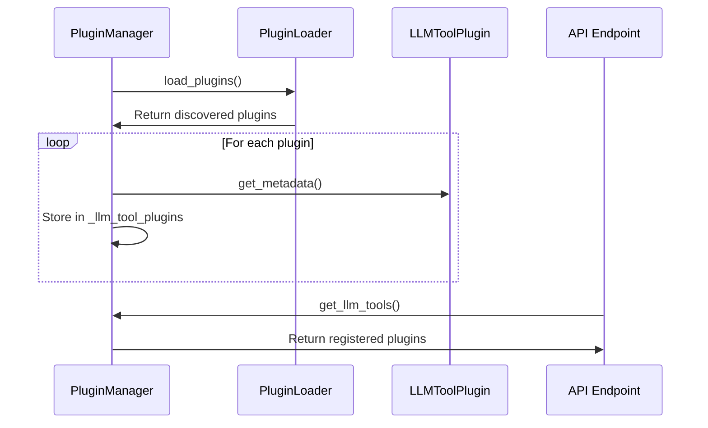
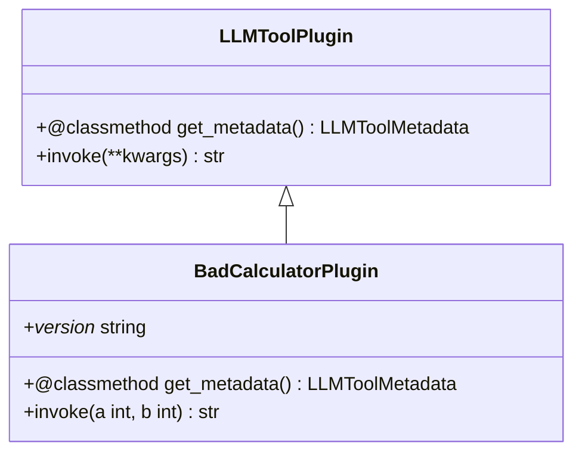

# LLM Tool Plugins

<cite>
**Referenced Files in This Document**   
- [llm_tool_plugin.py](file://plugin/llm_tool_plugin.py)
- [plugin_manager.py](file://plugin/plugin_manager.py)
- [bad_calculator.py](file://plugin/embedded_plugins/llm_tools/bad_calculator.py)
- [common.py](file://plugin/common.py)
- [plugin_app.py](file://api/apps/plugin_app.py)
- [__init__.py](file://plugin/__init__.py)
- [agent_with_tools.py](file://agent/component/agent_with_tools.py)
</cite>

## Table of Contents
1. [Introduction](#introduction)
2. [Plugin Architecture Overview](#plugin-architecture-overview)
3. [Core Components](#core-components)
4. [Plugin Lifecycle and Management](#plugin-lifecycle-and-management)
5. [Creating Custom Plugins](#creating-custom-plugins)
6. [Agent System Integration](#agent-system-integration)
7. [Development and Testing](#development-and-testing)
8. [Security and Performance](#security-and-performance)
9. [Conclusion](#conclusion)

## Introduction

The LLM Tool Plugins architecture in RAGFlow enables extensible integration of external tools that can be invoked by Large Language Models (LLMs) to perform specific tasks. This plugin system allows developers to extend the capabilities of LLMs by providing them with access to specialized functions beyond their native knowledge and reasoning abilities. The architecture is designed to be modular, secure, and easy to extend, with a clear interface for plugin development and integration.

The plugin system follows a well-defined pattern where plugins are discovered, loaded, and made available to agents through a centralized plugin manager. This document provides a comprehensive analysis of the implementation details, focusing on the core files that define the plugin interface, management system, and integration points with the agent system.

**Section sources**
- [llm_tool_plugin.py](file://plugin/llm_tool_plugin.py#L1-L51)
- [plugin_manager.py](file://plugin/plugin_manager.py#L1-L45)

## Plugin Architecture Overview

The LLM tool plugin architecture consists of several key components that work together to provide a robust plugin system. At its core, the system uses a plugin manager to discover, load, and manage plugins, which are then exposed to the agent system through API endpoints.

The architecture follows a layered approach:
1. **Plugin Interface Layer**: Defines the contract that all plugins must implement
2. **Plugin Management Layer**: Handles plugin discovery, loading, and registration
3. **API Exposure Layer**: Makes available plugins accessible to external systems
4. **Agent Integration Layer**: Connects plugins with the agent system for execution

The system uses the `pluginlib` library to handle plugin discovery and loading, allowing for dynamic plugin loading from specified directories. Plugins are organized under the `embedded_plugins` directory, with LLM tools specifically located in the `llm_tools` subdirectory.

```mermaid
graph TD
A[Plugin Interface] --> B[LLMToolPlugin]
C[Plugin Manager] --> D[PluginLoader]
E[API Endpoint] --> F[/llm_tools]
G[Agent System] --> H[Tool Execution]
B --> D
D --> F
F --> H
```

**Diagram sources **
- [llm_tool_plugin.py](file://plugin/llm_tool_plugin.py#L22-L31)
- [plugin_manager.py](file://plugin/plugin_manager.py#L17-L29)
- [plugin_app.py](file://api/apps/plugin_app.py#L24-L30)

**Section sources**
- [llm_tool_plugin.py](file://plugin/llm_tool_plugin.py#L1-L51)
- [plugin_manager.py](file://plugin/plugin_manager.py#L1-L45)
- [plugin_app.py](file://api/apps/plugin_app.py#L1-L30)

## Core Components

The core components of the LLM tool plugin system are defined in the `llm_tool_plugin.py` and `plugin_manager.py` files. These components establish the foundation for plugin development and management.

The `LLMToolPlugin` class serves as the base class for all LLM tool plugins, defining the required interface through abstract methods. It uses the `pluginlib.Parent` decorator to mark it as a parent class for plugins of type `llm_tools`. The class requires two key methods to be implemented by concrete plugins:

1. `get_metadata()`: Returns metadata about the plugin including its name, description, and parameter specifications
2. `invoke()`: Contains the actual execution logic for the plugin

The `LLMToolMetadata` and `LLMToolParameter` TypedDict classes define the structure of the metadata returned by plugins, ensuring consistency across all plugins. This metadata is used by the LLM to understand how to use the tool and what parameters to provide.

The `llm_tool_metadata_to_openai_tool` function converts the internal metadata format to the OpenAI tool format, enabling compatibility with LLMs that support the OpenAI function calling interface.

**Section sources**
- [llm_tool_plugin.py](file://plugin/llm_tool_plugin.py#L7-L51)
- [common.py](file://plugin/common.py#L1)

## Plugin Lifecycle and Management

The plugin lifecycle is managed by the `PluginManager` class, which handles the entire process from plugin discovery to registration. The manager maintains an internal dictionary `_llm_tool_plugins` that maps plugin names to their instances, providing efficient access to loaded plugins.

The plugin loading process begins with the `load_plugins()` method, which uses `pluginlib.PluginLoader` to recursively scan the `embedded_plugins` directory. For each discovered plugin, the manager checks if it belongs to the `llm_tools` type and, if so, registers it by calling its `get_metadata()` method and storing it in the internal registry.

The manager provides several methods for accessing plugins:
- `get_llm_tools()`: Returns all available LLM tools
- `get_llm_tool_by_name(name)`: Returns a specific tool by name
- `get_llm_tools_by_names(tool_names)`: Returns a list of tools by their names

The `GlobalPluginManager` singleton instance in `plugin/__init__.py` ensures that there is a single point of access to the plugin system throughout the application, making it easy to retrieve plugins from any part of the codebase.



**Diagram sources **
- [plugin_manager.py](file://plugin/plugin_manager.py#L17-L45)
- [plugin_app.py](file://api/apps/plugin_app.py#L27-L28)
- [__init__.py](file://plugin/__init__.py#L3)

**Section sources**
- [plugin_manager.py](file://plugin/plugin_manager.py#L11-L45)
- [__init__.py](file://plugin/__init__.py#L1-L3)

## Creating Custom Plugins

Creating custom LLM tool plugins follows a straightforward pattern demonstrated by the `bad_calculator.py` example. Developers need to create a new Python file in the `embedded_plugins/llm_tools` directory and define a class that inherits from `LLMToolPlugin`.

The plugin class must implement two key components:

1. **Metadata Definition**: The `get_metadata()` class method returns a dictionary containing:
   - `name`: The internal name used by the LLM
   - `displayName`: The display name shown in the UI
   - `description`: Description provided to the LLM
   - `displayDescription`: Description shown in the UI
   - `parameters`: Dictionary defining input parameters with their types, descriptions, and required status

2. **Execution Logic**: The `invoke()` method contains the actual functionality of the plugin. It accepts parameters as keyword arguments and returns a string result.

The `BadCalculatorPlugin` example demonstrates this pattern by implementing a simple calculator that adds two numbers plus 100. The plugin defines two required number parameters (`a` and `b`) and returns their sum plus 100 as a string.

Plugins should include a `_version_` attribute to track their version, which is logged during the loading process. The metadata supports internationalization through the `$t:` prefix in display fields, allowing for translation in the frontend.



**Diagram sources **
- [bad_calculator.py](file://plugin/embedded_plugins/llm_tools/bad_calculator.py#L5-L37)
- [llm_tool_plugin.py](file://plugin/llm_tool_plugin.py#L22-L31)

**Section sources**
- [bad_calculator.py](file://plugin/embedded_plugins/llm_tools/bad_calculator.py#L1-L38)

## Agent System Integration

LLM tool plugins are integrated with the agent system through the `Agent` component in `agent_with_tools.py`. The agent system uses the global plugin manager to access available tools and makes them available to LLMs during execution.

When an agent is initialized, it retrieves the list of available tools from the plugin manager and converts their metadata to the format expected by the LLM using the `llm_tool_metadata_to_openai_tool` function. This allows the LLM to understand the available tools and their parameters.

The agent creates a `LLMToolPluginCallSession` that handles the execution of tool calls. When the LLM decides to use a tool, it generates a tool call with the appropriate parameters, which is then executed by the corresponding plugin's `invoke()` method. The result is returned to the LLM as a string, which can then be used in subsequent reasoning steps.

The integration is seamless from the agent's perspective, as the plugin system abstracts away the details of tool discovery and execution. Agents can use both built-in tools and plugin tools interchangeably, as they are all exposed through the same interface.

**Section sources**
- [agent_with_tools.py](file://agent/component/agent_with_tools.py#L81-L108)
- [llm_tool_plugin.py](file://plugin/llm_tool_plugin.py#L33-L51)

## Development and Testing

The plugin system supports a straightforward development workflow. Developers can create new plugins by following the pattern established in the `bad_calculator.py` example. The development process involves:

1. Creating a new Python file in the `embedded_plugins/llm_tools` directory
2. Defining a class that inherits from `LLMToolPlugin`
3. Implementing the `get_metadata()` and `invoke()` methods
4. Testing the plugin through the API endpoint

Plugins can be tested by starting the RAGFlow application and checking the logs for the plugin loading message. The `/llm_tools` API endpoint can be used to verify that the plugin is properly registered and its metadata is correctly exposed.

The system provides immediate feedback through logging, with each loaded plugin generating an INFO message that includes its name and version. This makes it easy to verify that plugins are being discovered and loaded correctly.

For more comprehensive testing, developers can create integration tests that exercise the plugin through the agent system, verifying that the LLM can correctly use the tool and that the results are properly processed.

**Section sources**
- [plugin_manager.py](file://plugin/plugin_manager.py#L24)
- [plugin_app.py](file://api/apps/plugin_app.py#L27-L28)

## Security and Performance

The plugin system incorporates several security and performance considerations. The use of a dedicated plugin manager with a well-defined interface helps isolate plugin code from the core application, reducing the risk of security vulnerabilities.

The system limits plugin execution to the `invoke()` method, which should be designed to handle untrusted input safely. Plugins should validate their inputs and handle errors gracefully to prevent crashes or security issues.

Performance considerations include:
- Efficient plugin discovery through the use of the `pluginlib` library
- Caching of loaded plugins in the manager's internal dictionary
- Asynchronous execution capabilities through the agent system
- Memory and execution time limits enforced by the underlying infrastructure

The sandboxing mechanism, as indicated by the presence of the `sandbox` directory, likely provides additional security by executing plugin code in isolated environments, preventing access to sensitive system resources.

**Section sources**
- [plugin_manager.py](file://plugin/plugin_manager.py#L12)
- [llm_tool_plugin.py](file://plugin/llm_tool_plugin.py#L29-L31)

## Conclusion

The LLM tool plugin architecture in RAGFlow provides a robust and extensible framework for enhancing LLM capabilities through external tools. By following a clear interface and management pattern, the system enables developers to create custom tools that can be seamlessly integrated with the agent system.

The architecture balances flexibility with security, allowing for easy plugin development while maintaining control over execution and access. The integration with the agent system ensures that plugins can be used naturally as part of the LLM's reasoning process, expanding the range of tasks that can be accomplished.

For developers, the system provides a straightforward path to creating new tools, with clear examples and a well-documented interface. The combination of the plugin manager, standardized metadata format, and agent integration creates a cohesive ecosystem for extending LLM functionality.