# MCP Server

<cite>
**Referenced Files in This Document**
- [mcp/server/server.py](file://mcp/server/server.py)
- [mcp/client/client.py](file://mcp/client/client.py)
- [api/apps/mcp_server_app.py](file://api/apps/mcp_server_app.py)
- [api/db/services/mcp_server_service.py](file://api/db/services/mcp_server_service.py)
- [api/db/db_models.py](file://api/db/db_models.py)
- [common/mcp_tool_call_conn.py](file://common/mcp_tool_call_conn.py)
- [common/constants.py](file://common/constants.py)
- [agent/component/agent_with_tools.py](file://agent/component/agent_with_tools.py)
- [web/src/interfaces/database/mcp.ts](file://web/src/interfaces/database/mcp.ts)
- [web/src/interfaces/database/mcp-server.ts](file://web/src/interfaces/database/mcp-server.ts)
- [web/src/services/mcp-server-service.ts](file://web/src/services/mcp-server-service.ts)
</cite>

## Table of Contents
1. [Introduction](#introduction)
2. [Architecture Overview](#architecture-overview)
3. [Core Components](#core-components)
4. [Server Implementation](#server-implementation)
5. [Client Integration](#client-integration)
6. [Agent System Integration](#agent-system-integration)
7. [Configuration and Deployment](#configuration-and-deployment)
8. [Security Considerations](#security-considerations)
9. [Performance and Best Practices](#performance-and-best-practices)
10. [Troubleshooting](#troubleshooting)
11. [Conclusion](#conclusion)

## Introduction

The Model Context Protocol (MCP) server implementation in RAGFlow provides a standardized way to expose tools and services through a protocol that enables function calling with Large Language Models (LLMs). This system allows LLMs to discover, invoke, and interact with external tools and services seamlessly, enhancing their capabilities through external integrations.

The MCP server acts as a bridge between the RAGFlow knowledge base system and LLMs, enabling sophisticated agent workflows where tools can be dynamically discovered, configured, and invoked based on user requests and context.

## Architecture Overview

The MCP system follows a layered architecture that separates concerns between tool discovery, invocation, and management:

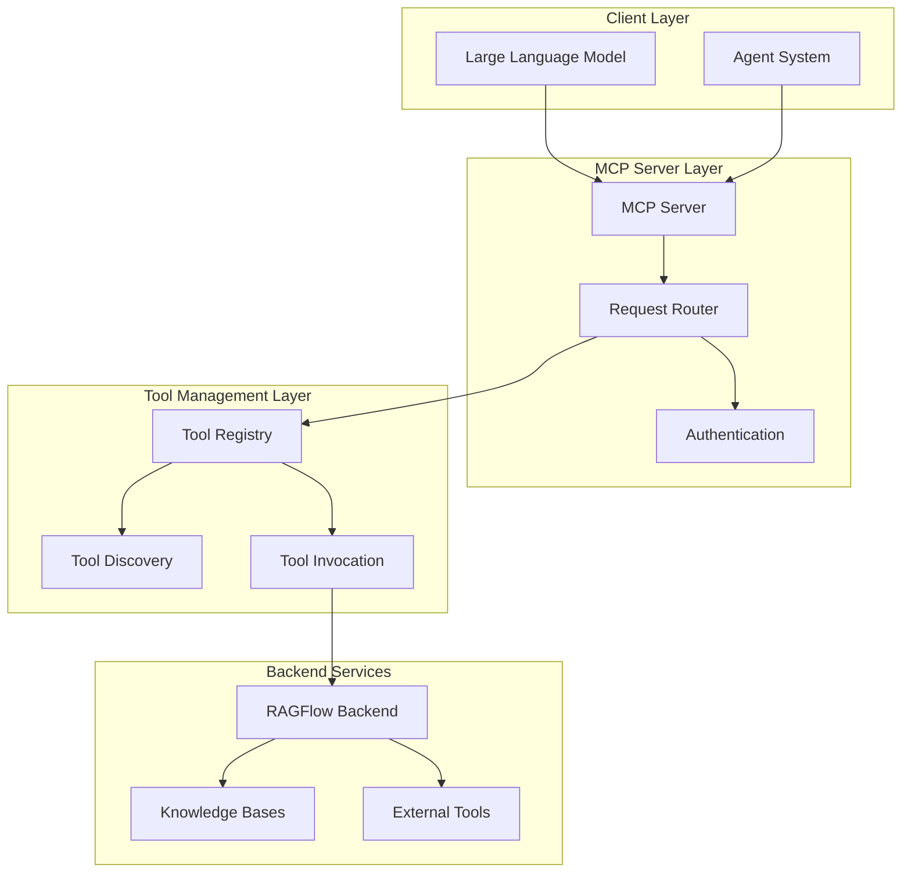

**Diagram sources**
- [mcp/server/server.py](file://mcp/server/server.py#L326-L327)
- [agent/component/agent_with_tools.py](file://agent/component/agent_with_tools.py#L99-L104)

## Core Components

### MCP Server Core

The MCP server implementation consists of several key components that work together to provide tool discovery and invocation capabilities:

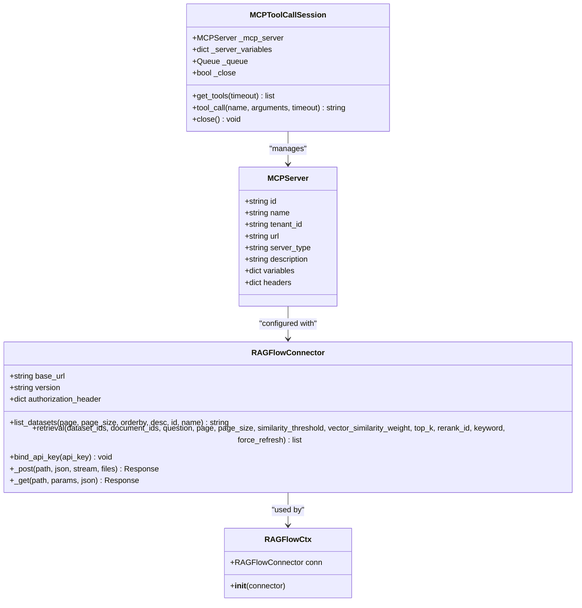

**Diagram sources**
- [mcp/server/server.py](file://mcp/server/server.py#L58-L307)
- [common/mcp_tool_call_conn.py](file://common/mcp_tool_call_conn.py#L42-L325)
- [api/db/db_models.py](file://api/db/db_models.py#L959-L968)

**Section sources**
- [mcp/server/server.py](file://mcp/server/server.py#L58-L307)
- [common/mcp_tool_call_conn.py](file://common/mcp_tool_call_conn.py#L42-L325)

### Tool Registration and Discovery

The MCP server implements a sophisticated tool registration and discovery mechanism that allows LLMs to understand available tools and their capabilities:

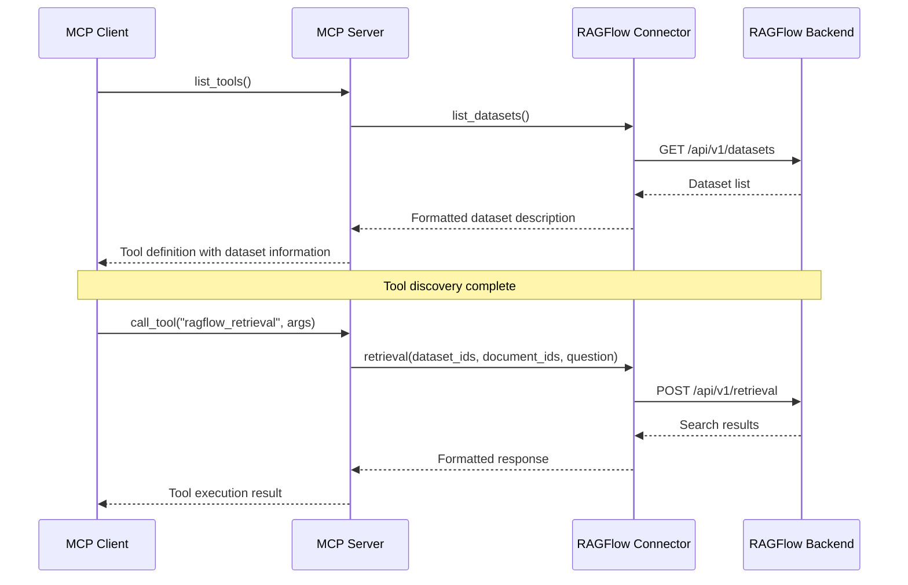

**Diagram sources**
- [mcp/server/server.py](file://mcp/server/server.py#L365-L494)
- [common/mcp_tool_call_conn.py](file://common/mcp_tool_call_conn.py#L183-L220)

**Section sources**
- [mcp/server/server.py](file://mcp/server/server.py#L365-L494)

## Server Implementation

### Launch Modes and Configuration

The MCP server supports two primary launch modes to accommodate different deployment scenarios:

#### Self-Host Mode
Self-host mode runs the MCP server for a single tenant with a predefined API key, suitable for isolated deployments where security isolation is paramount.

#### Host Mode  
Host mode operates as a multi-tenant server where clients must provide authentication credentials, enabling shared infrastructure with tenant isolation.

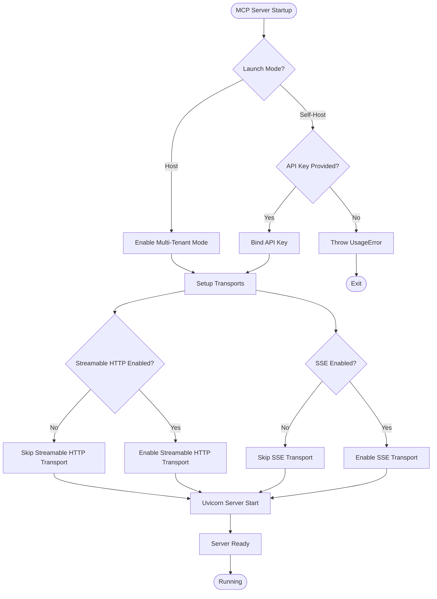

**Diagram sources**
- [mcp/server/server.py](file://mcp/server/server.py#L626-L686)

**Section sources**
- [mcp/server/server.py](file://mcp/server/server.py#L38-L46)
- [mcp/server/server.py](file://mcp/server/server.py#L626-L686)

### Transport Protocols

The MCP server supports multiple transport protocols to ensure compatibility with different client implementations:

#### Server-Sent Events (SSE)
Legacy SSE transport provides real-time communication through persistent HTTP connections, ideal for browser-based clients and environments where WebSocket support is limited.

#### Streamable HTTP
Modern Streamable HTTP transport offers improved performance and reliability through HTTP/2 multiplexing and efficient streaming capabilities.

**Section sources**
- [mcp/server/server.py](file://mcp/server/server.py#L48-L56)
- [mcp/server/server.py](file://mcp/server/server.py#L496-L581)

### Request Routing and Authentication

The server implements comprehensive request routing and authentication mechanisms:

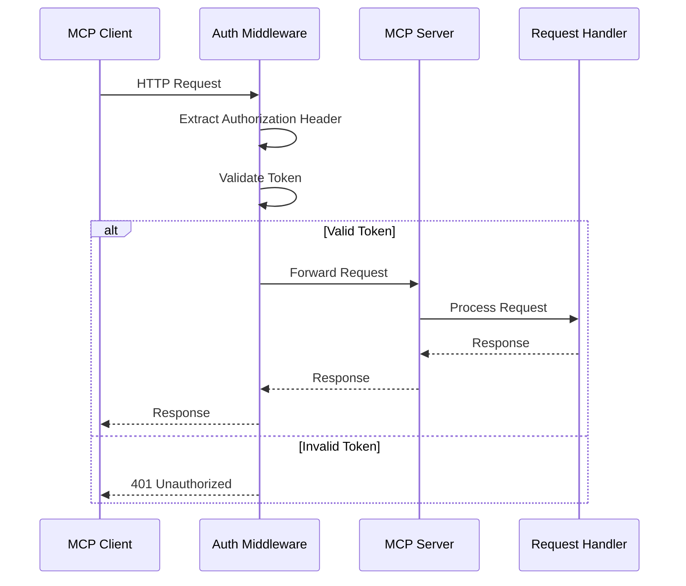

**Diagram sources**
- [mcp/server/server.py](file://mcp/server/server.py#L496-L581)

**Section sources**
- [mcp/server/server.py](file://mcp/server/server.py#L496-L581)

## Client Integration

### Client Implementation

The MCP client provides a streamlined interface for connecting to MCP servers and invoking tools:

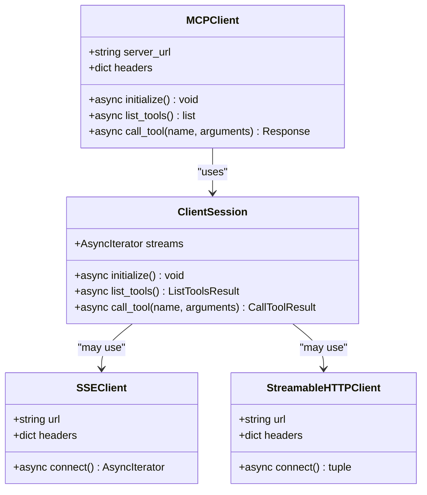

**Diagram sources**
- [mcp/client/client.py](file://mcp/client/client.py#L22-L47)

**Section sources**
- [mcp/client/client.py](file://mcp/client/client.py#L22-L47)

### Tool Invocation Workflow

The client follows a standardized workflow for tool discovery and invocation:

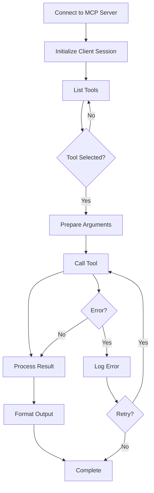

**Diagram sources**
- [mcp/client/client.py](file://mcp/client/client.py#L22-L47)

**Section sources**
- [mcp/client/client.py](file://mcp/client/client.py#L22-L47)

## Agent System Integration

### Agent-MCP Integration

The RAGFlow agent system seamlessly integrates with MCP servers to provide enhanced tool capabilities:

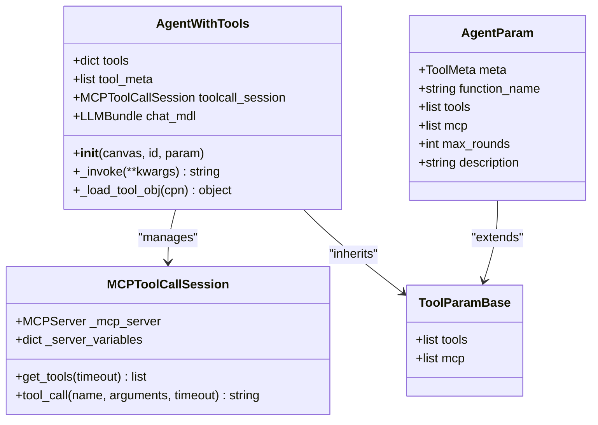

**Diagram sources**
- [agent/component/agent_with_tools.py](file://agent/component/agent_with_tools.py#L38-L106)

**Section sources**
- [agent/component/agent_with_tools.py](file://agent/component/agent_with_tools.py#L38-L106)

### Tool Discovery in Agents

Agents dynamically discover and integrate MCP tools during initialization:

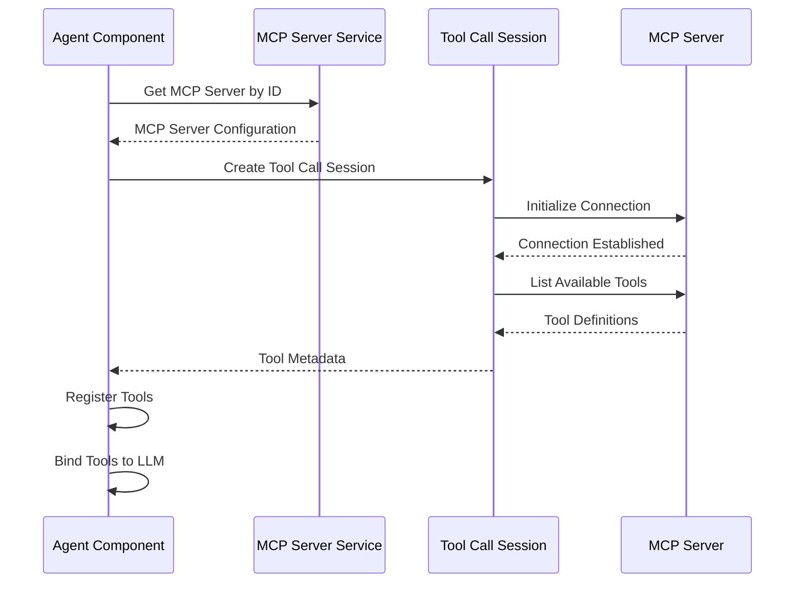

**Diagram sources**
- [agent/component/agent_with_tools.py](file://agent/component/agent_with_tools.py#L99-L104)

**Section sources**
- [agent/component/agent_with_tools.py](file://agent/component/agent_with_tools.py#L99-L104)

## Configuration and Deployment

### Environment Variables

The MCP server supports extensive configuration through environment variables:

| Variable | Description | Default | Options |
|----------|-------------|---------|---------|
| `RAGFLOW_MCP_BASE_URL` | RAGFlow backend API URL | `http://127.0.0.1:9380` | Any valid URL |
| `RAGFLOW_MCP_HOST` | Server host address | `127.0.0.1` | IP address or hostname |
| `RAGFLOW_MCP_PORT` | Server port | `9382` | Port number (1-65535) |
| `RAGFLOW_MCP_LAUNCH_MODE` | Launch mode | `self-host` | `self-host`, `host` |
| `RAGFLOW_MCP_HOST_API_KEY` | API key for self-host mode | `""` | Any string |
| `RAGFLOW_MCP_TRANSPORT_SSE_ENABLED` | Enable SSE transport | `True` | `True`, `False` |
| `RAGFLOW_MCP_TRANSPORT_STREAMABLE_ENABLED` | Enable Streamable HTTP | `True` | `True`, `False` |
| `RAGFLOW_MCP_JSON_RESPONSE` | Enable JSON responses | `True` | `True`, `False` |

**Section sources**
- [mcp/server/server.py](file://mcp/server/server.py#L48-L56)
- [mcp/server/server.py](file://mcp/server/server.py#L626-L630)

### Production Deployment

For production deployments, consider the following configuration:

```bash
# Production configuration example
export RAGFLOW_MCP_BASE_URL="https://api.ragflow.com"
export RAGFLOW_MCP_HOST="0.0.0.0"
export RAGFLOW_MCP_PORT="9382"
export RAGFLOW_MCP_LAUNCH_MODE="host"
export RAGFLOW_MCP_HOST_API_KEY=""
export RAGFLOW_MCP_TRANSPORT_SSE_ENABLED="false"
export RAGFLOW_MCP_TRANSPORT_STREAMABLE_ENABLED="true"
export RAGFLOW_MCP_JSON_RESPONSE="true"
```

**Section sources**
- [mcp/server/server.py](file://mcp/server/server.py#L685-L716)

## Security Considerations

### Authentication and Authorization

The MCP server implements multiple security layers:

#### API Key Authentication
For self-host mode, API keys provide basic authentication for server access.

#### Bearer Token Support
Host mode supports OAuth 2.1 compliant Bearer tokens for enhanced security.

#### Request Validation
All requests undergo validation for proper authentication and authorization.

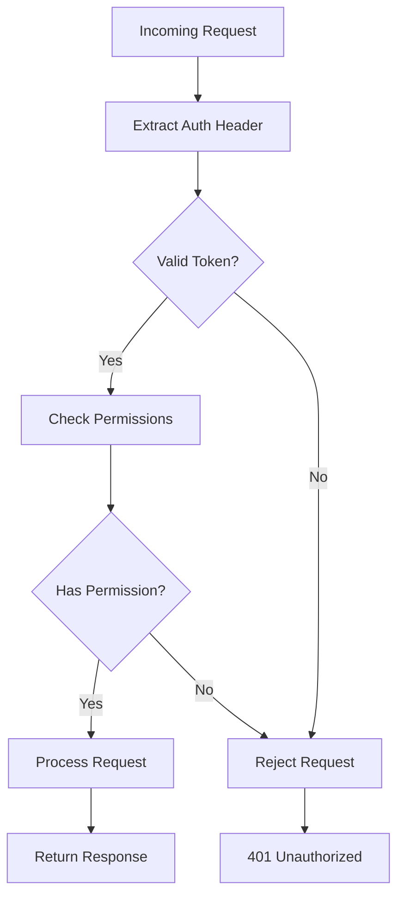

**Diagram sources**
- [mcp/server/server.py](file://mcp/server/server.py#L329-L362)

**Section sources**
- [mcp/server/server.py](file://mcp/server/server.py#L329-L362)

### Rate Limiting and Throttling

The system implements several mechanisms to prevent abuse:

- **Timeout Controls**: Configurable timeouts for tool calls and server connections
- **Connection Pooling**: Efficient connection management for multiple concurrent requests
- **Resource Limits**: Built-in limits on memory and processing resources

**Section sources**
- [common/mcp_tool_call_conn.py](file://common/mcp_tool_call_conn.py#L153-L167)

## Performance and Best Practices

### Caching Strategies

The MCP server implements intelligent caching to improve performance:

#### Dataset Metadata Caching
Dataset information is cached with TTL (Time-To-Live) to reduce redundant API calls.

#### Document Metadata Caching
Document-level metadata is cached separately with individual TTL management.

#### Connection Pooling
Persistent connections are maintained for efficient tool invocation.

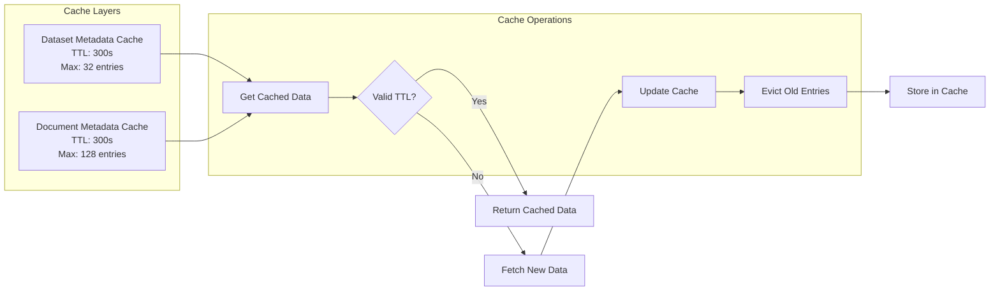

**Diagram sources**
- [mcp/server/server.py](file://mcp/server/server.py#L58-L121)

**Section sources**
- [mcp/server/server.py](file://mcp/server/server.py#L58-L121)

### Error Handling and Resilience

The system implements comprehensive error handling:

#### Connection Failures
Automatic retry mechanisms with exponential backoff for transient failures.

#### Timeout Management
Configurable timeouts prevent hanging connections and resource exhaustion.

#### Graceful Degradation
Fallback mechanisms ensure system stability during partial failures.

**Section sources**
- [common/mcp_tool_call_conn.py](file://common/mcp_tool_call_conn.py#L70-L114)

### Best Practices for Deployment

1. **Environment Separation**: Use separate environments for development, staging, and production
2. **Monitoring**: Implement comprehensive logging and monitoring for operational visibility
3. **Scaling**: Consider horizontal scaling for high-traffic scenarios
4. **Backup**: Regular backups of MCP server configurations and tool definitions
5. **Testing**: Comprehensive testing of tool integrations before production deployment

## Troubleshooting

### Common Issues and Solutions

#### Connection Refused
**Symptoms**: Client cannot connect to MCP server
**Causes**: Server not running, incorrect host/port configuration
**Solutions**: Verify server status, check firewall settings, validate configuration

#### Authentication Failures
**Symptoms**: 401 Unauthorized responses
**Causes**: Invalid API key, missing authorization header
**Solutions**: Verify credentials, check header format, validate token expiration

#### Tool Discovery Failures
**Symptoms**: Tools not appearing in LLM responses
**Causes**: Network connectivity, server configuration issues
**Solutions**: Check network connectivity, verify server logs, validate tool definitions

#### Timeout Errors
**Symptoms**: Requests timing out
**Causes**: Network latency, server overload, inefficient tool implementations
**Solutions**: Increase timeout values, optimize tool performance, check server resources

### Debugging Tools

#### Logging Configuration
Enable detailed logging for troubleshooting:

```python
import logging
logging.basicConfig(level=logging.DEBUG)
```

#### Health Checks
Monitor server health through built-in endpoints and metrics.

#### Performance Monitoring
Track response times, error rates, and resource utilization.

**Section sources**
- [common/mcp_tool_call_conn.py](file://common/mcp_tool_call_conn.py#L70-L114)

## Conclusion

The RAGFlow MCP server implementation provides a robust, scalable solution for integrating external tools with LLMs through a standardized protocol. The system's architecture supports multiple deployment scenarios, from isolated self-hosted installations to multi-tenant production environments.

Key strengths of the implementation include:

- **Flexibility**: Support for multiple transport protocols and deployment modes
- **Scalability**: Efficient caching and connection management for high-performance operation
- **Security**: Comprehensive authentication and authorization mechanisms
- **Integration**: Seamless integration with the RAGFlow agent system and broader ecosystem
- **Reliability**: Robust error handling and resilience mechanisms

The MCP server serves as a critical component in enabling sophisticated AI agent workflows, allowing LLMs to leverage external knowledge bases, tools, and services through a standardized, secure, and performant interface.

Future enhancements could include expanded transport protocol support, enhanced monitoring capabilities, and additional security features to further strengthen the platform's capabilities and reliability.