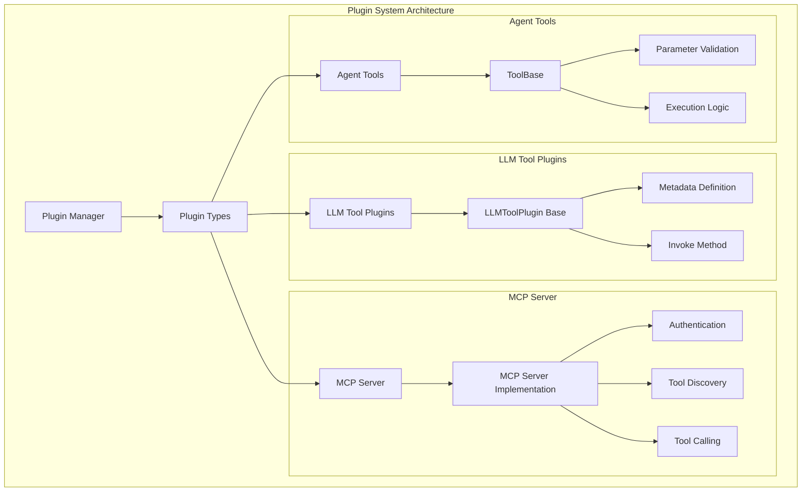
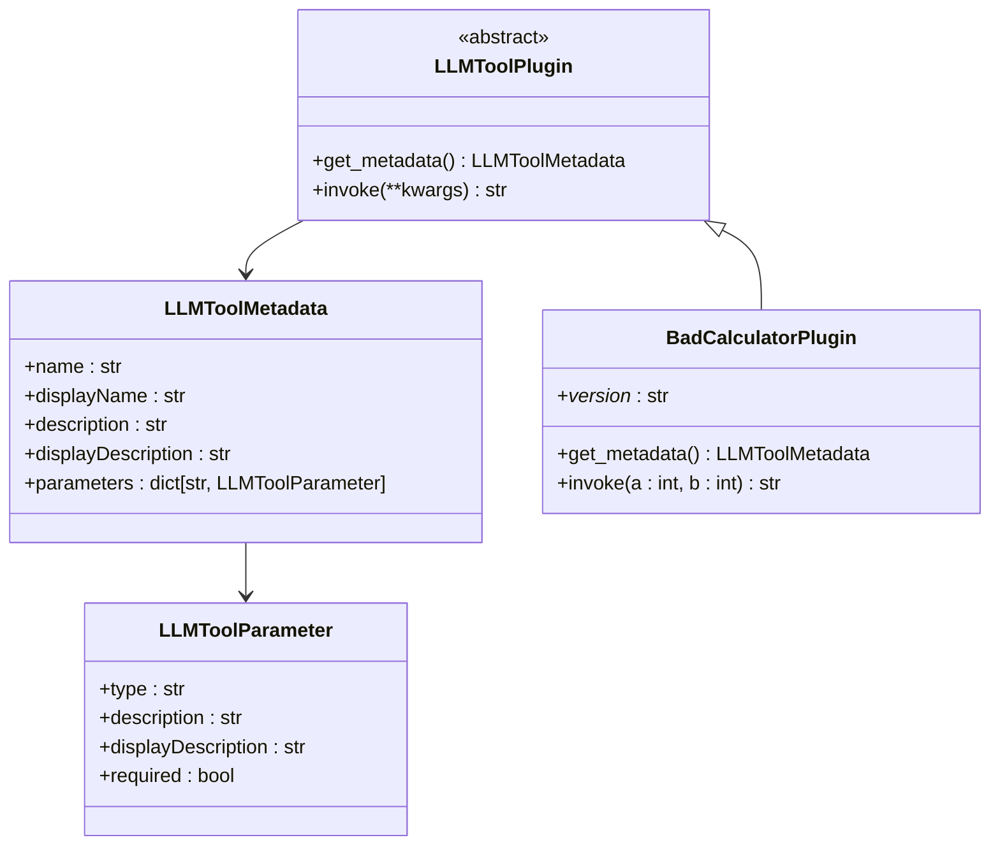
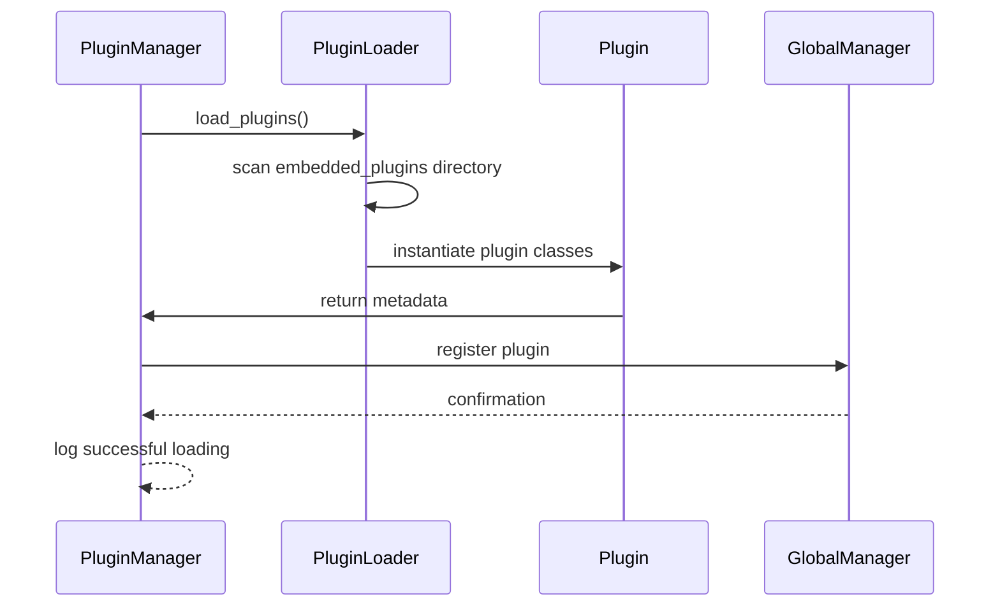
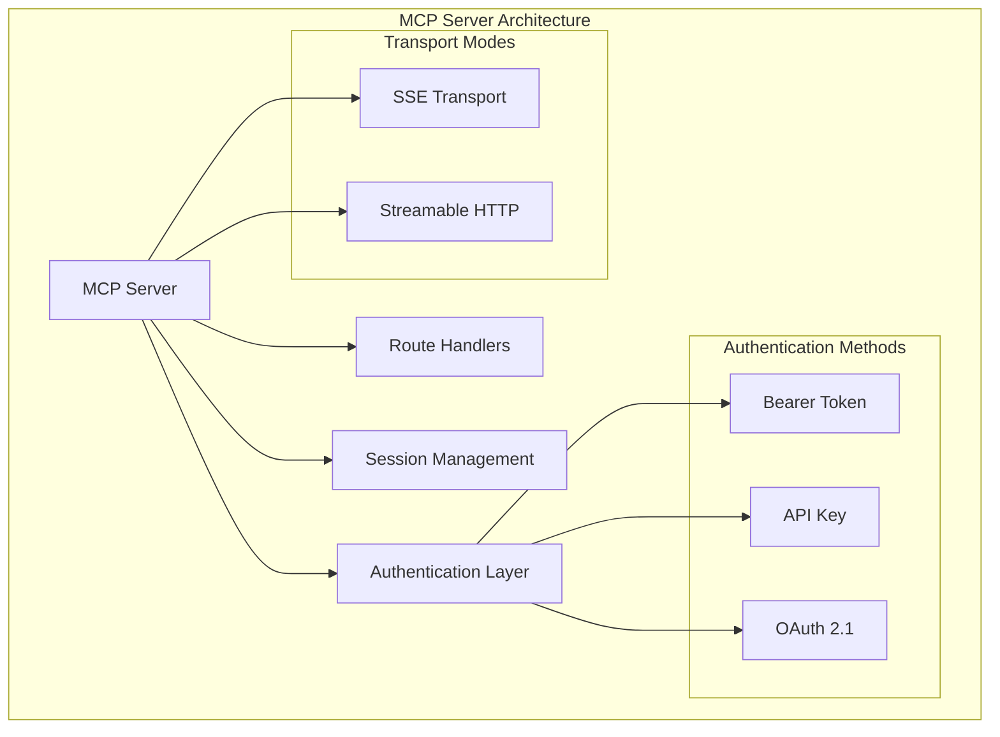
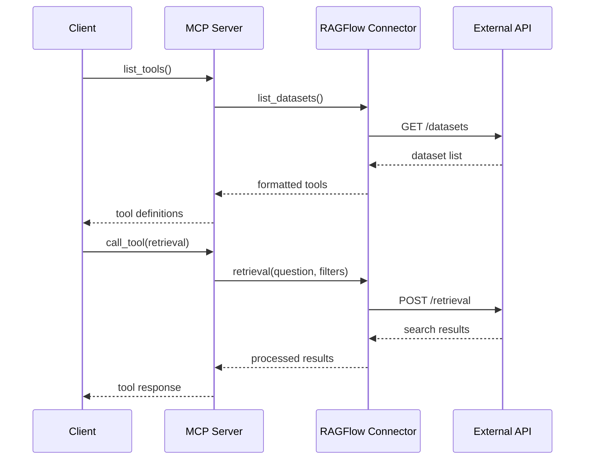
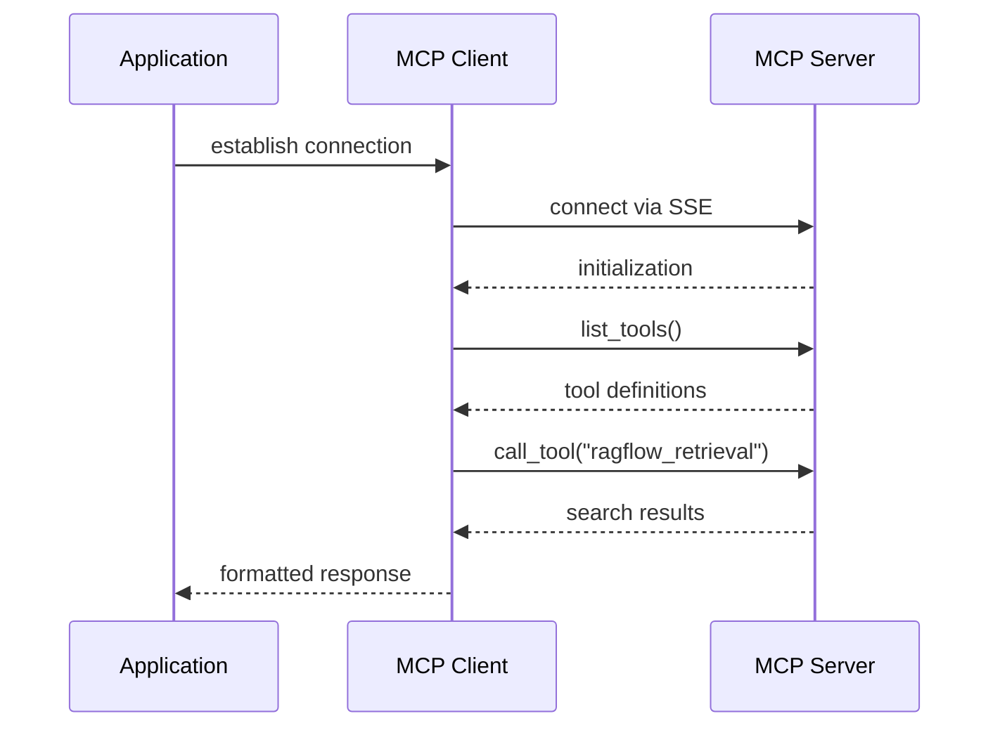
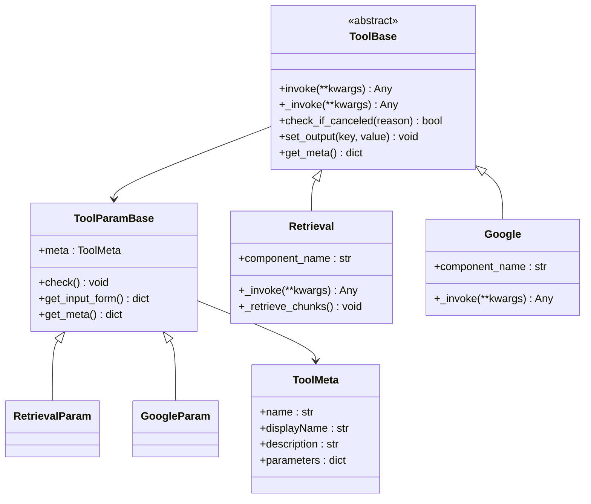
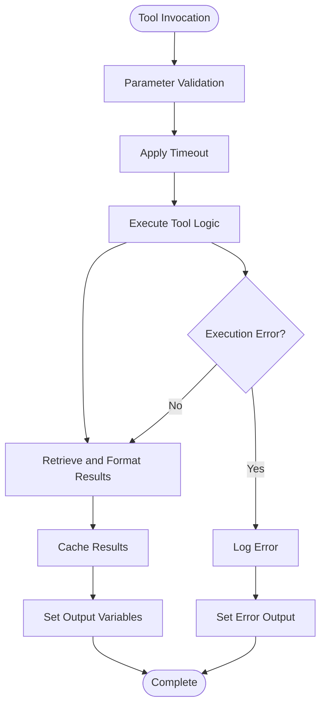
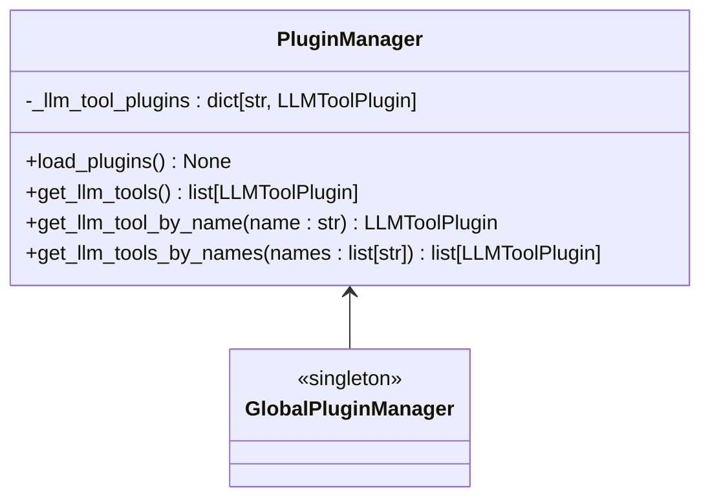

# Plugin System

<cite>
**Referenced Files in This Document**
- [plugin/__init__.py](file://plugin/__init__.py)
- [plugin/plugin_manager.py](file://plugin/plugin_manager.py)
- [plugin/llm_tool_plugin.py](file://plugin/llm_tool_plugin.py)
- [plugin/common.py](file://plugin/common.py)
- [plugin/embedded_plugins/llm_tools/bad_calculator.py](file://plugin/embedded_plugins/llm_tools/bad_calculator.py)
- [plugin/README.md](file://plugin/README.md)
- [mcp/server/server.py](file://mcp/server/server.py)
- [mcp/client/client.py](file://mcp/client/client.py)
- [agent/tools/base.py](file://agent/tools/base.py)
- [agent/tools/retrieval.py](file://agent/tools/retrieval.py)
- [agent/tools/google.py](file://agent/tools/google.py)
- [agent/tools/tavily.py](file://agent/tools/tavily.py)
- [api/apps/mcp_server_app.py](file://api/apps/mcp_server_app.py)
- [api/apps/plugin_app.py](file://api/apps/plugin_app.py)
- [common/mcp_tool_call_conn.py](file://common/mcp_tool_call_conn.py)
</cite>

## Table of Contents
1. [Introduction](#introduction)
2. [Plugin Architecture Overview](#plugin-architecture-overview)
3. [LLM Tool Plugins](#llm-tool-plugins)
4. [MCP (Model Context Protocol) Server](#mcp-model-context-protocol-server)
5. [Agent Tools](#agent-tools)
6. [Plugin Management](#plugin-management)
7. [Security Considerations](#security-considerations)
8. [Best Practices](#best-practices)
9. [Configuration Options](#configuration-options)
10. [Practical Examples](#practical-examples)
11. [Troubleshooting](#troubleshooting)

## Introduction

RAGFlow's plugin system provides a flexible and extensible architecture for integrating external tools and services with the platform's AI capabilities. The system supports three primary plugin mechanisms:

- **LLM Tool Plugins**: Custom tools that LLMs can call directly
- **MCP (Model Context Protocol) Server**: Full-featured protocol for tool communication
- **Agent Tools**: Specialized tools integrated into the agent workflow

This comprehensive system allows developers to extend RAGFlow's functionality with custom tools, search engines, calculators, and other services while maintaining security and performance standards.

## Plugin Architecture Overview

The plugin system is built around a modular architecture that separates concerns between different types of plugins and their execution environments.



**Diagram sources**
- [plugin/plugin_manager.py](file://plugin/plugin_manager.py#L11-L46)
- [plugin/llm_tool_plugin.py](file://plugin/llm_tool_plugin.py#L22-L52)
- [agent/tools/base.py](file://agent/tools/base.py#L114-L176)

**Section sources**
- [plugin/__init__.py](file://plugin/__init__.py#L1-L4)
- [plugin/plugin_manager.py](file://plugin/plugin_manager.py#L11-L46)

## LLM Tool Plugins

LLM Tool Plugins represent the simplest form of plugin integration, allowing LLMs to call custom functions directly. These plugins are loaded automatically from the `embedded_plugins/llm_tools` directory.

### Plugin Structure

Each LLM Tool Plugin follows a standardized structure:



**Diagram sources**
- [plugin/llm_tool_plugin.py](file://plugin/llm_tool_plugin.py#L7-L52)
- [plugin/embedded_plugins/llm_tools/bad_calculator.py](file://plugin/embedded_plugins/llm_tools/bad_calculator.py#L5-L38)

### Implementation Details

#### Metadata Definition
The `get_metadata()` method provides essential information about the plugin:

- **Name**: Unique identifier for the tool
- **Display Name**: Human-readable name for the UI
- **Description**: Purpose and usage instructions for LLM
- **Parameters**: Type definitions for input parameters
- **Display Description**: Additional UI information

#### Invocation Logic
The `invoke()` method contains the core execution logic with automatic parameter type checking and return value formatting.

**Section sources**
- [plugin/llm_tool_plugin.py](file://plugin/llm_tool_plugin.py#L22-L52)
- [plugin/embedded_plugins/llm_tools/bad_calculator.py](file://plugin/embedded_plugins/llm_tools/bad_calculator.py#L1-L38)

### Plugin Loading Mechanism

The plugin manager uses the `pluginlib` library to discover and load plugins automatically:



**Diagram sources**
- [plugin/plugin_manager.py](file://plugin/plugin_manager.py#L17-L28)

**Section sources**
- [plugin/plugin_manager.py](file://plugin/plugin_manager.py#L17-L28)

## MCP (Model Context Protocol) Server

The MCP Server provides a comprehensive protocol for tool communication, enabling sophisticated interactions between RAGFlow and external services.

### Server Architecture

The MCP server implements the Model Context Protocol specification with support for multiple transport mechanisms:



**Diagram sources**
- [mcp/server/server.py](file://mcp/server/server.py#L496-L581)

### Authentication and Security

The MCP server supports multiple authentication modes:

#### Self-Host Mode
- Single tenant with pre-configured API key
- Requires `--api-key` parameter during startup
- Suitable for isolated deployments

#### Host Mode
- Multi-tenant architecture
- Clients must provide Authorization headers
- Supports OAuth 2.1 compliant authentication

### Tool Discovery and Execution

The MCP server provides comprehensive tool discovery and execution capabilities:



**Diagram sources**
- [mcp/server/server.py](file://mcp/server/server.py#L365-L494)
- [common/mcp_tool_call_conn.py](file://common/mcp_tool_call_conn.py#L42-L325)

**Section sources**
- [mcp/server/server.py](file://mcp/server/server.py#L365-L494)
- [common/mcp_tool_call_conn.py](file://common/mcp_tool_call_conn.py#L42-L325)

### Client Implementation

The MCP client demonstrates how to connect to and interact with the MCP server:



**Diagram sources**
- [mcp/client/client.py](file://mcp/client/client.py#L22-L47)

**Section sources**
- [mcp/client/client.py](file://mcp/client/client.py#L22-L47)

## Agent Tools

Agent Tools integrate seamlessly with RAGFlow's agent workflow system, providing specialized functionality for different use cases.

### Tool Architecture

Agent tools inherit from the `ToolBase` class and follow a standardized pattern:



**Diagram sources**
- [agent/tools/base.py](file://agent/tools/base.py#L114-L176)
- [agent/tools/retrieval.py](file://agent/tools/retrieval.py#L33-L82)
- [agent/tools/google.py](file://agent/tools/google.py#L25-L116)

### Available Agent Tools

The system includes numerous pre-built agent tools:

| Tool Category | Examples | Purpose |
|---------------|----------|---------|
| **Search Engines** | Google, Tavily, DuckDuckGo | Web search functionality |
| **Financial Data** | Yahoo Finance, Tushare, AkShare | Stock and financial information |
| **Academic** | PubMed, Google Scholar | Research and academic papers |
| **News & Weather** | QWeather, Jin10 | Current events and weather |
| **Development** | GitHub, Code Execution | Programming and development |
| **Communication** | Email, Discord | Messaging and notifications |

### Tool Execution Flow

Agent tools follow a standardized execution pattern:



**Diagram sources**
- [agent/tools/base.py](file://agent/tools/base.py#L126-L176)

**Section sources**
- [agent/tools/base.py](file://agent/tools/base.py#L114-L176)
- [agent/tools/retrieval.py](file://agent/tools/retrieval.py#L80-L200)
- [agent/tools/google.py](file://agent/tools/google.py#L116-L173)

## Plugin Management

RAGFlow provides comprehensive management APIs for plugin lifecycle operations.

### Plugin Manager Operations

The Plugin Manager handles all plugin-related operations:



**Diagram sources**
- [plugin/plugin_manager.py](file://plugin/plugin_manager.py#L11-L46)

### API Endpoints

The plugin system exposes several REST endpoints for management:

| Endpoint | Method | Purpose |
|----------|--------|---------|
| `/api/v1/llm_tools` | GET | List all available LLM tools |
| `/api/v1/mcp/list` | POST | List MCP servers |
| `/api/v1/mcp/create` | POST | Create new MCP server |
| `/api/v1/mcp/update` | POST | Update MCP server |
| `/api/v1/mcp/rm` | POST | Delete MCP server |
| `/api/v1/mcp/test_tool` | POST | Test MCP tool execution |

**Section sources**
- [api/apps/plugin_app.py](file://api/apps/plugin_app.py#L24-L31)
- [api/apps/mcp_server_app.py](file://api/apps/mcp_server_app.py#L30-L443)

## Security Considerations

Security is paramount in plugin systems, especially when dealing with external services and user-provided code.

### Authentication and Authorization

#### MCP Server Security
- **API Key Validation**: All requests must include valid credentials
- **Header-Based Authentication**: Supports Bearer tokens and custom headers
- **Tenant Isolation**: Multi-tenant mode ensures data separation
- **Rate Limiting**: Built-in protection against abuse

#### Plugin Security
- **Sandboxed Execution**: Plugins execute in controlled environments
- **Resource Limits**: CPU and memory constraints prevent resource exhaustion
- **Network Restrictions**: Controlled network access prevents unauthorized connections
- **Input Validation**: Automatic parameter validation prevents injection attacks

### Best Practices for Secure Plugin Development

1. **Input Sanitization**: Always validate and sanitize user inputs
2. **Error Handling**: Implement comprehensive error handling without exposing sensitive information
3. **Resource Management**: Monitor and limit resource consumption
4. **Logging**: Implement secure logging without exposing sensitive data
5. **Dependency Management**: Keep dependencies up to date and audit for vulnerabilities

## Best Practices

### Plugin Development Guidelines

#### LLM Tool Plugins
- **Clear Metadata**: Provide comprehensive descriptions for LLM understanding
- **Type Safety**: Use appropriate parameter types and validation
- **Error Handling**: Implement graceful error handling with meaningful messages
- **Documentation**: Include usage examples and parameter descriptions

#### MCP Server Plugins
- **State Management**: Handle session state appropriately
- **Async Operations**: Use asynchronous patterns for I/O operations
- **Connection Pooling**: Reuse connections where possible
- **Timeout Handling**: Implement appropriate timeouts for external calls

#### Agent Tools
- **Parameter Validation**: Validate all inputs before processing
- **Result Formatting**: Return results in expected formats
- **Caching**: Implement caching for expensive operations
- **Fallback Mechanisms**: Provide fallback options for external service failures

### Performance Optimization

#### Plugin Performance
- **Lazy Loading**: Load resources only when needed
- **Connection Reuse**: Maintain persistent connections where beneficial
- **Batch Processing**: Process multiple items efficiently
- **Caching Strategies**: Implement appropriate caching for repeated operations

#### Memory Management
- **Resource Cleanup**: Properly dispose of resources
- **Memory Monitoring**: Track memory usage in long-running operations
- **Garbage Collection**: Trigger garbage collection when appropriate

## Configuration Options

### Environment Variables

Key environment variables for plugin configuration:

| Variable | Default | Description |
|----------|---------|-------------|
| `COMPONENT_EXEC_TIMEOUT` | 12 seconds | Timeout for component execution |
| `RAGFLOW_MCP_BASE_URL` | http://127.0.0.1:9380 | RAGFlow backend API URL |
| `RAGFLOW_MCP_HOST` | 127.0.0.1 | MCP server bind address |
| `RAGFLOW_MCP_PORT` | 9382 | MCP server port |
| `RAGFLOW_MCP_LAUNCH_MODE` | self-host | Launch mode (self-host/host) |
| `RAGFLOW_MCP_TRANSPORT_SSE_ENABLED` | true | Enable SSE transport |
| `RAGFLOW_MCP_TRANSPORT_STREAMABLE_HTTP_ENABLED` | true | Enable Streamable HTTP transport |

### Plugin-Specific Configuration

#### LLM Tool Plugins
- **Version Management**: Each plugin must define a version string
- **Parameter Definitions**: Specify parameter types, descriptions, and requirements
- **Default Values**: Provide sensible defaults for optional parameters

#### MCP Server Configuration
- **Authentication Headers**: Configure custom header mappings
- **Timeout Settings**: Adjust timeout values for different operations
- **Transport Selection**: Choose appropriate transport mechanisms

**Section sources**
- [mcp/server/server.py](file://mcp/server/server.py#L48-L63)

## Practical Examples

### Creating a Custom LLM Tool Plugin

Here's how to create a custom calculator plugin:

```python
# File: plugin/embedded_plugins/llm_tools/calculator.py
from plugin.llm_tool_plugin import LLMToolMetadata, LLMToolPlugin

class CalculatorPlugin(LLMToolPlugin):
    """
    A simple calculator tool for mathematical operations.
    """
    _version_ = "1.0.0"
    
    @classmethod
    def get_metadata(cls) -> LLMToolMetadata:
        return {
            "name": "calculator",
            "displayName": "Math Calculator",
            "description": "Perform basic arithmetic calculations",
            "displayDescription": "Simple calculator for addition, subtraction, multiplication, and division",
            "parameters": {
                "operation": {
                    "type": "string",
                    "description": "The mathematical operation to perform",
                    "displayDescription": "Operation type (add, subtract, multiply, divide)",
                    "required": True,
                    "enum": ["add", "subtract", "multiply", "divide"]
                },
                "a": {
                    "type": "number",
                    "description": "The first number",
                    "displayDescription": "First operand",
                    "required": True
                },
                "b": {
                    "type": "number",
                    "description": "The second number",
                    "displayDescription": "Second operand",
                    "required": True
                }
            }
        }
    
    def invoke(self, operation: str, a: float, b: float) -> str:
        try:
            if operation == "add":
                result = a + b
            elif operation == "subtract":
                result = a - b
            elif operation == "multiply":
                result = a * b
            elif operation == "divide":
                if b == 0:
                    return "Error: Division by zero"
                result = a / b
            else:
                return f"Error: Unknown operation '{operation}'"
            
            return f"The result of {a} {operation} {b} is {result}"
        except Exception as e:
            return f"Error performing calculation: {str(e)}"
```

### Setting Up an MCP Server

Example MCP server configuration for a custom search service:

```python
# File: mcp/server/custom_search_server.py
from mcp.server.server import Server
from mcp.server.lowlevel import RequestParams
import asyncio
import json

app = Server("custom-search-server")

@app.list_tools()
async def list_tools() -> list[Tool]:
    return [
        Tool(
            name="custom_search",
            description="Search the custom search index",
            inputSchema={
                "type": "object",
                "properties": {
                    "query": {
                        "type": "string",
                        "description": "Search query string"
                    },
                    "limit": {
                        "type": "integer",
                        "description": "Maximum number of results",
                        "default": 10
                    }
                },
                "required": ["query"]
            }
        )
    ]

@app.call_tool()
async def call_tool(name: str, arguments: dict) -> list[TextContent]:
    if name == "custom_search":
        query = arguments.get("query", "")
        limit = arguments.get("limit", 10)
        
        # Implement custom search logic here
        results = await perform_custom_search(query, limit)
        
        return [TextContent(
            type="text",
            text=json.dumps(results, ensure_ascii=False)
        )]
    
    raise ValueError(f"Tool not found: {name}")

async def perform_custom_search(query: str, limit: int) -> list:
    # Implement your search logic
    pass
```

### Using Agent Tools

Example of creating a custom agent tool for weather information:

```python
# File: agent/tools/weather.py
from agent.tools.base import ToolParamBase, ToolBase, ToolMeta
from abc import ABC
import requests
import logging

class WeatherParam(ToolParamBase):
    def __init__(self):
        self.meta: ToolMeta = {
            "name": "weather_lookup",
            "description": "Get current weather information for a location",
            "parameters": {
                "city": {
                    "type": "string",
                    "description": "City name for weather lookup",
                    "required": True
                },
                "country": {
                    "type": "string",
                    "description": "Country code (ISO 3166)",
                    "required": True
                }
            }
        }
        super().__init__()
        self.api_key = ""
        self.units = "metric"  # metric or imperial

class WeatherTool(ToolBase, ABC):
    component_name = "WeatherLookup"
    
    def _invoke(self, **kwargs):
        if not kwargs.get("city") or not kwargs.get("country"):
            self.set_output("formalized_content", "Please provide both city and country")
            return ""
        
        try:
            url = f"https://api.openweathermap.org/data/2.5/weather"
            params = {
                "q": f"{kwargs['city']},{kwargs['country']}",
                "appid": self._param.api_key,
                "units": self._param.units
            }
            
            response = requests.get(url, params=params)
            data = response.json()
            
            if response.status_code != 200:
                self.set_output("formalized_content", f"Weather API error: {data.get('message', 'Unknown error')}")
                return ""
            
            weather = data["weather"][0]["description"]
            temp = data["main"]["temp"]
            humidity = data["main"]["humidity"]
            
            result = f"Weather in {kwargs['city']}: {weather}, Temperature: {temp}°C, Humidity: {humidity}%"
            self.set_output("formalized_content", result)
            return result
            
        except Exception as e:
            logging.exception(f"Weather tool error: {e}")
            self.set_output("formalized_content", f"Error fetching weather data: {str(e)}")
            return ""
```

## Troubleshooting

### Common Issues and Solutions

#### Plugin Loading Problems

**Issue**: Plugin not loading despite being in the correct directory
**Solution**: 
1. Check plugin file syntax and import statements
2. Verify the plugin inherits from the correct base class
3. Ensure the plugin has a valid `_version_` attribute
4. Check server logs for specific error messages

**Issue**: Metadata definition errors
**Solution**:
1. Verify all required metadata fields are present
2. Check parameter type definitions match actual usage
3. Ensure parameter names are consistent between metadata and invoke method

#### MCP Server Connection Issues

**Issue**: Cannot connect to MCP server
**Solution**:
1. Verify server is running and listening on correct port
2. Check authentication credentials and headers
3. Validate network connectivity and firewall settings
4. Review server logs for connection errors

**Issue**: Tool discovery fails
**Solution**:
1. Verify tool implementation follows MCP protocol
2. Check tool metadata format and completeness
3. Ensure required dependencies are installed
4. Test tool endpoints independently

#### Performance Issues

**Issue**: Slow plugin execution
**Solution**:
1. Optimize external API calls with caching
2. Implement connection pooling for database operations
3. Add timeout mechanisms to prevent hanging
4. Profile code to identify bottlenecks

**Issue**: Memory leaks in long-running plugins
**Solution**:
1. Properly dispose of resources in finally blocks
2. Implement periodic garbage collection
3. Monitor memory usage and set appropriate limits
4. Use weak references for large objects

### Debugging Tools

#### Logging Configuration
Enable detailed logging for plugin debugging:

```python
import logging
logging.basicConfig(level=logging.DEBUG)
logger = logging.getLogger(__name__)
```

#### Health Checks
Implement health check endpoints for monitoring:

```python
@app.health()
async def health_check() -> HealthStatus:
    return HealthStatus(
        healthy=True,
        message="Plugin system operational"
    )
```

#### Metrics Collection
Track plugin performance metrics:

```python
import time
from functools import wraps

def track_performance(func):
    @wraps(func)
    async def wrapper(*args, **kwargs):
        start_time = time.time()
        try:
            result = await func(*args, **kwargs)
            duration = time.time() - start_time
            logger.info(f"Tool {func.__name__} executed in {duration:.2f}s")
            return result
        except Exception as e:
            duration = time.time() - start_time
            logger.error(f"Tool {func.__name__} failed after {duration:.2f}s: {e}")
            raise
    return wrapper
```

**Section sources**
- [plugin/plugin_manager.py](file://plugin/plugin_manager.py#L17-L28)
- [mcp/server/server.py](file://mcp/server/server.py#L365-L494)