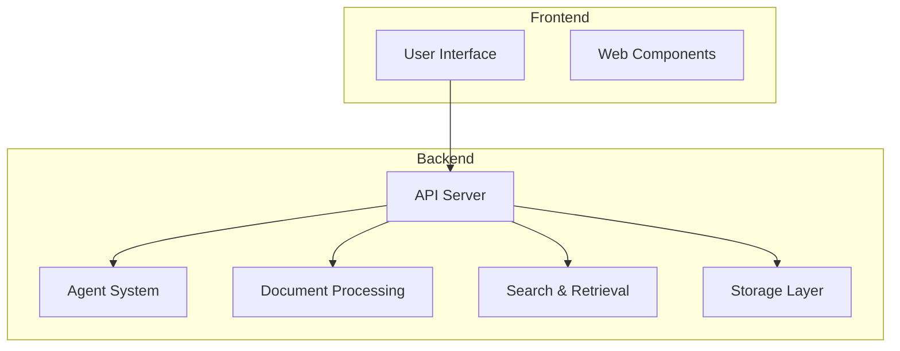
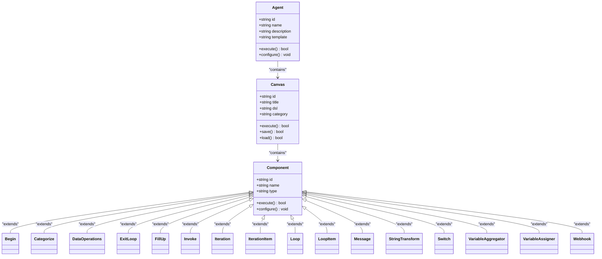
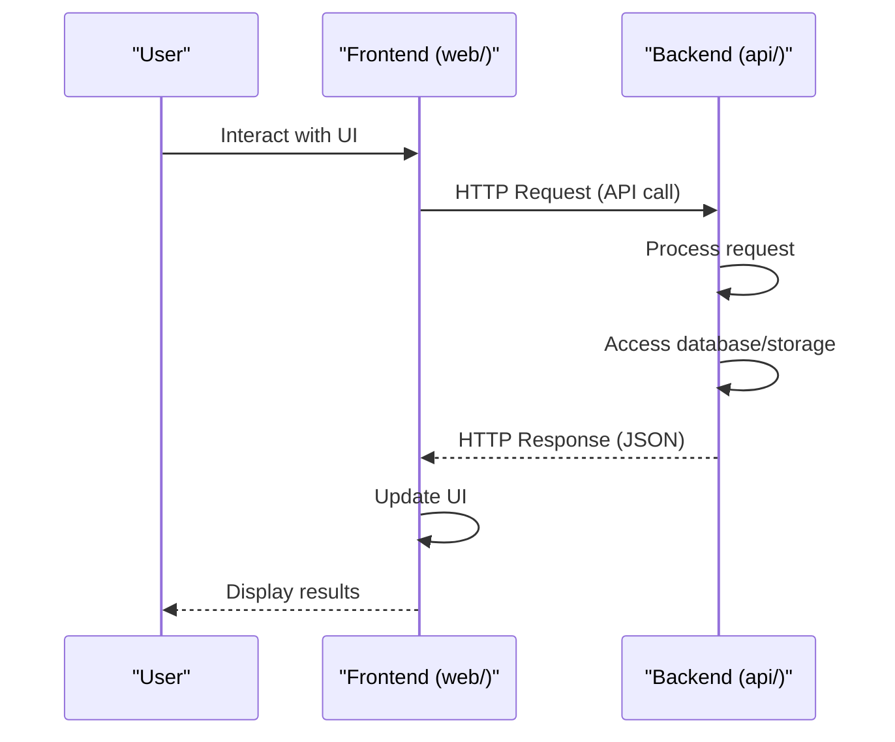

# Project Overview

<cite>
**Referenced Files in This Document**   
- [README.md](file://README.md)
- [api/ragflow_server.py](file://api/ragflow_server.py)
- [api/apps/canvas_app.py](file://api/apps/canvas_app.py)
- [api/apps/kb_app.py](file://api/apps/kb_app.py)
- [api/db/services/document_service.py](file://api/db/services/document_service.py)
- [agent/canvas.py](file://agent/canvas.py)
- [rag/flow/pipeline.py](file://rag/flow/pipeline.py)
- [deepdoc/parser/pdf_parser.py](file://deepdoc/parser/pdf_parser.py)
- [web/src/app.tsx](file://web/src/app.tsx)
- [common/settings.py](file://common/settings.py)
</cite>

## Table of Contents
1. [Introduction](#introduction)
2. [Core Components](#core-components)
3. [Architecture Overview](#architecture-overview)
4. [Document Processing](#document-processing)
5. [Agent System](#agent-system)
6. [Search and Retrieval](#search-and-retrieval)
7. [User Interface](#user-interface)
8. [Frontend-Backend Relationship](#frontend-backend-relationship)
9. [Use Cases](#use-cases)
10. [Implementation Details](#implementation-details)

## Introduction
RAGFlow is an open-source Retrieval-Augmented Generation (RAG) engine that combines advanced RAG capabilities with Agent functionality to create a superior context layer for Large Language Models (LLMs). It transforms complex data into high-fidelity, production-ready AI systems through a streamlined workflow adaptable to enterprises of any scale. The system offers deep document understanding, intelligent chunking, grounded citations with reduced hallucinations, and compatibility with heterogeneous data sources. RAGFlow supports a wide range of file types including Word, slides, Excel, text, images, scanned copies, structured data, web pages, and more, making it a versatile solution for AI-powered applications.

**Section sources**
- [README.md](file://README.md#L73-L134)

## Core Components
RAGFlow consists of several core components that work together to provide a comprehensive AI system. These include document processing, agent system, search and retrieval, and user interface components. The document processing component handles various file types and extracts meaningful information through advanced parsing techniques. The agent system enables complex workflows and decision-making processes through configurable agent templates. The search and retrieval component provides powerful querying capabilities with multiple recall methods and fused re-ranking. The user interface offers an intuitive way to interact with the system and configure various settings.

**Section sources**
- [README.md](file://README.md#L108-L134)

## Architecture Overview
RAGFlow follows a modular architecture with clear separation between frontend and backend components. The backend provides RESTful APIs for various operations including document management, knowledge base operations, agent execution, and system configuration. The frontend consumes these APIs to provide a rich user interface for interacting with the system. The architecture supports various document storage engines including Elasticsearch, Infinity, OpenSearch, and OceanBase, allowing flexibility in deployment options. The system also supports different storage implementations such as MinIO, Azure Blob Storage, AWS S3, and Alibaba Cloud OSS.

**Diagram sources **
- [README.md](file://README.md#L138-L140)
- [common/settings.py](file://common/settings.py#L76-L251)

## Document Processing
The document processing component in RAGFlow handles the ingestion and parsing of various document types. It supports advanced parsing methods including MinerU and Docling for document parsing. The system performs deep document understanding to extract knowledge from unstructured data with complicated formats. Document processing includes intelligent and explainable template-based chunking with plenty of template options to choose from. The system can handle Word, slides, Excel, text, images, scanned copies, structured data, web pages, and more. Document processing also includes support for multi-modal models to make sense of images within PDF or DOCX files.

**Section sources**
- [README.md](file://README.md#L111-L112)
- [deepdoc/parser/pdf_parser.py](file://deepdoc/parser/pdf_parser.py#L52-L80)
- [api/db/services/document_service.py](file://api/db/services/document_service.py#L291-L340)

## Agent System
The agent system in RAGFlow enables complex workflows and decision-making processes through configurable agent templates. Agents can perform various tasks including data operations, list operations, string transformations, variable assignments, and invoking external tools. The system supports agentic workflows and MCP (Multi-agent Collaboration Protocol). Agents can be configured with various components including begin, categorize, data operations, exit loop, fill up, invoke, iteration, iteration item, loop, loop item, message, string transform, switch, variable aggregator, variable assigner, and webhooks. The agent system also supports code execution through a sandbox environment.

**Diagram sources **
- [agent/canvas.py](file://agent/canvas.py#L40-L80)
- [agent/component/__init__.py](file://agent/component/__init__.py)

## Search and Retrieval
The search and retrieval component in RAGFlow provides powerful querying capabilities with multiple recall methods and fused re-ranking. The system supports various document storage engines including Elasticsearch, Infinity, OpenSearch, and OceanBase. The retrieval system enables finding "needle in a data haystack" of literally unlimited tokens. The system provides visualization of text chunking to allow human intervention and quick view of key references with traceable citations to support grounded answers. The search system also supports cross-language queries and automated RAG workflow with configurable LLMs and embedding models.

**Section sources**
- [README.md](file://README.md#L113-L114)
- [common/settings.py](file://common/settings.py#L234-L251)
- [api/apps/kb_app.py](file://api/apps/kb_app.py#L38-L40)

## User Interface
The user interface in RAGFlow provides an intuitive way to interact with the system and configure various settings. The frontend is built using modern web technologies including React, Ant Design, and Tailwind CSS. The interface supports multiple languages including English, Chinese (Simplified and Traditional), Russian, Vietnamese, Portuguese (Brazil), and German. The UI includes components for document management, knowledge base configuration, agent creation and execution, chat interfaces, and system administration. The interface also provides visualization of text chunking, key references, and citation tracing to support grounded answers.

**Section sources**
- [web/src/app.tsx](file://web/src/app.tsx#L1-L119)
- [README.md](file://README.md#L120-L123)

## Frontend-Backend Relationship
The frontend and backend components in RAGFlow communicate through a well-defined API interface. The frontend, located in the web/ directory, consumes RESTful APIs provided by the backend in the api/ directory. The backend provides endpoints for document management, knowledge base operations, agent execution, user authentication, and system configuration. The frontend uses these APIs to provide a rich user interface for interacting with the system. The relationship between frontend and backend follows a client-server architecture with clear separation of concerns. The frontend handles user interface rendering and user interactions, while the backend handles business logic, data processing, and storage operations.

**Diagram sources **
- [web/src/app.tsx](file://web/src/app.tsx)
- [api/ragflow_server.py](file://api/ragflow_server.py)
- [api/apps/canvas_app.py](file://api/apps/canvas_app.py)
- [api/apps/kb_app.py](file://api/apps/kb_app.py)

## Use Cases
RAGFlow supports various use cases including document processing, knowledge extraction, AI-powered search, and automated data analysis. For document processing, the system can handle various file types and extract meaningful information through advanced parsing techniques. For knowledge extraction, the system performs deep document understanding to extract knowledge from unstructured data with complicated formats. For AI-powered search, the system provides powerful querying capabilities with multiple recall methods and fused re-ranking. For automated data analysis, the system supports agentic workflows and MCP (Multi-agent Collaboration Protocol) to perform complex data processing tasks.

**Section sources**
- [README.md](file://README.md#L108-L134)

## Implementation Details
RAGFlow is implemented as a Python-based web application with a modular architecture. The backend is built using Flask/Quart for the web framework, Peewee for ORM, and various Python libraries for specific functionality. The system uses Redis for distributed locking and task coordination, and supports various database backends including MySQL, PostgreSQL, and OceanBase. The document processing component uses pdfplumber for PDF parsing, PIL for image processing, and various NLP libraries for text analysis. The agent system is implemented as a graph-based workflow engine with components connected in a directed acyclic graph. The system supports various LLM providers including OpenAI, Anthropic, and local models through configurable LLM factories.

**Section sources**
- [api/ragflow_server.py](file://api/ragflow_server.py)
- [common/settings.py](file://common/settings.py)
- [agent/canvas.py](file://agent/canvas.py)
- [rag/flow/pipeline.py](file://rag/flow/pipeline.py)