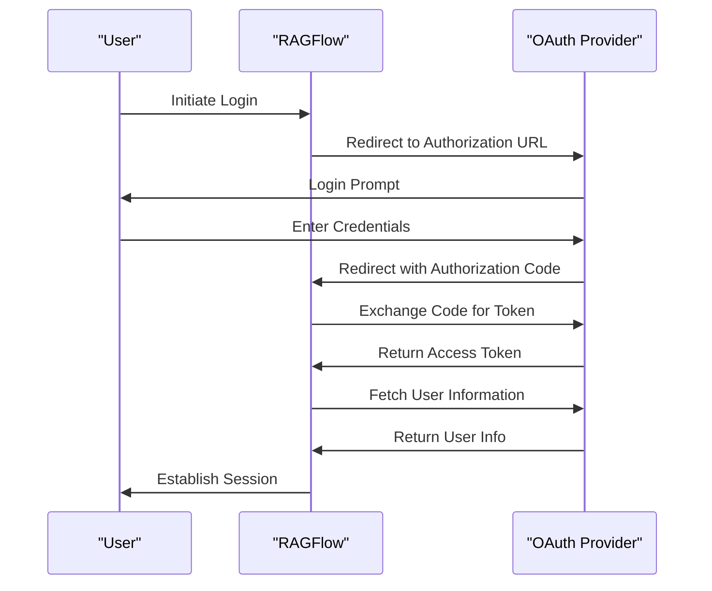
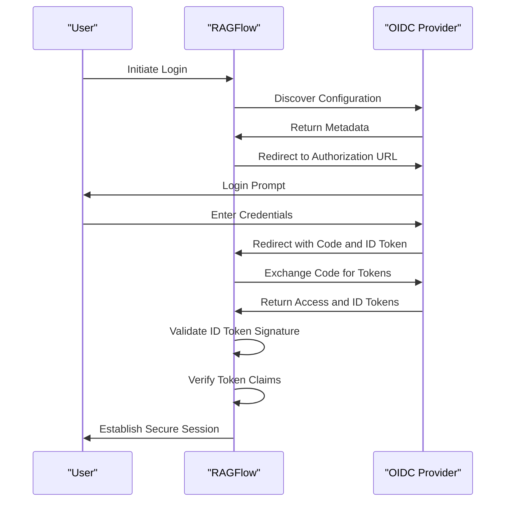
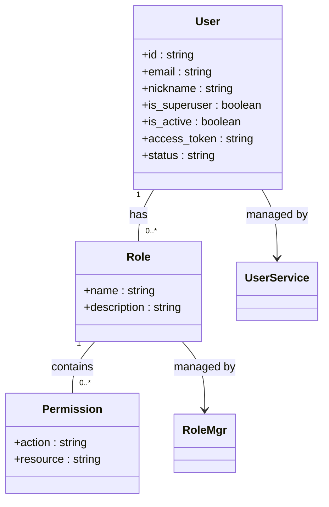
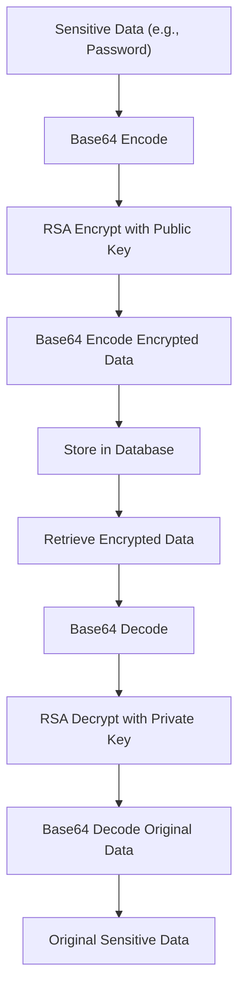
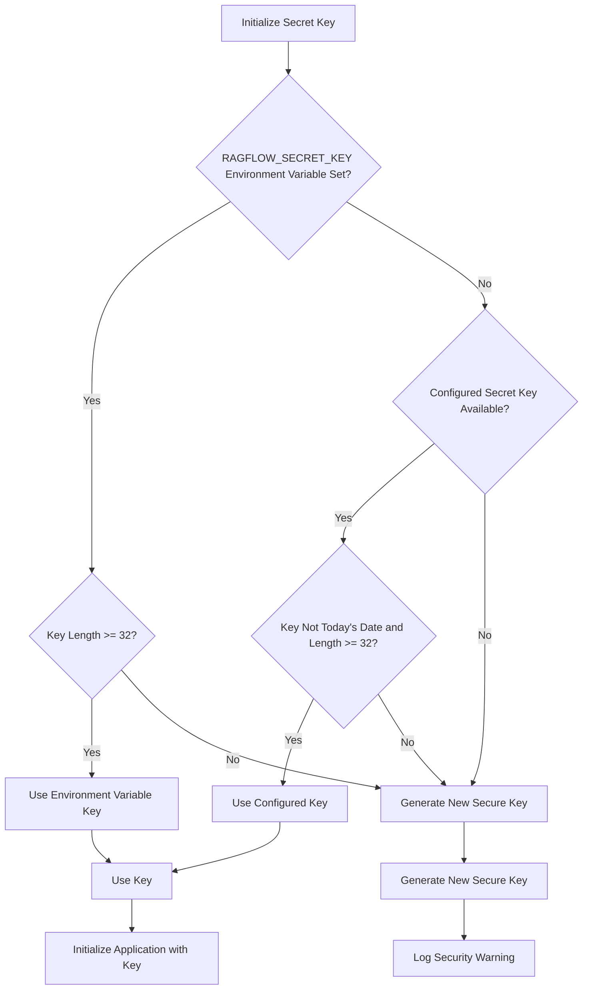
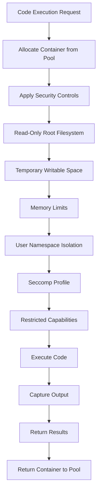
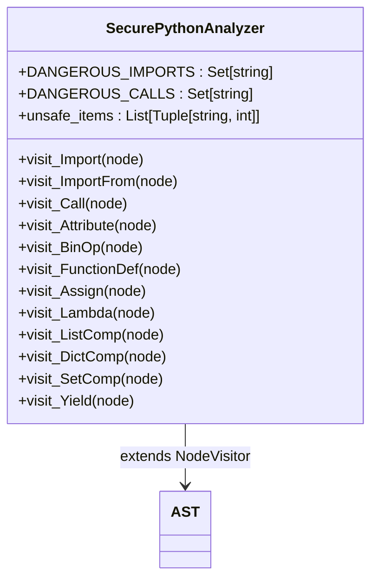

# Security Considerations

<cite>
**Referenced Files in This Document**   
- [SECURITY.md](file://SECURITY.md)
- [admin/server/auth.py](file://admin/server/auth.py)
- [admin/server/roles.py](file://admin/server/roles.py)
- [api/apps/auth/oauth.py](file://api/apps/auth/oauth.py)
- [api/apps/auth/oidc.py](file://api/apps/auth/oidc.py)
- [api/utils/crypt.py](file://api/utils/crypt.py)
- [common/settings.py](file://common/settings.py)
- [conf/private.pem](file://conf/private.pem)
- [conf/public.pem](file://conf/public.pem)
- [sandbox/executor_manager/services/security.py](file://sandbox/executor_manager/services/security.py)
- [sandbox/executor_manager/core/container.py](file://sandbox/executor_manager/core/container.py)
- [plugin/plugin_manager.py](file://plugin/plugin_manager.py)
- [docker/docker-compose.yml](file://docker/docker-compose.yml)
</cite>

## Table of Contents
1. [Introduction](#introduction)
2. [Security Architecture and Design Principles](#security-architecture-and-design-principles)
3. [Authentication and Authorization Mechanisms](#authentication-and-authorization-mechanisms)
4. [Data Protection Measures](#data-protection-measures)
5. [Agent System and Plugin Execution Security](#agent-system-and-plugin-execution-security)
6. [Secure Deployment and Hardening Techniques](#secure-deployment-and-hardening-techniques)
7. [Vulnerability Management and Incident Response](#vulnerability-management-and-incident-response)
8. [Security Testing and Compliance](#security-testing-and-compliance)
9. [Third-Party Integrations and Dependencies](#third-party-integrations-and-dependencies)
10. [Conclusion](#conclusion)

## Introduction

RAGFlow is a sophisticated retrieval-augmented generation (RAG) framework designed to provide secure, scalable, and reliable AI-powered applications. This document outlines the comprehensive security posture of RAGFlow, detailing its security architecture, authentication mechanisms, data protection strategies, and operational security practices. The system implements multiple layers of security controls to protect against various threats while maintaining usability and performance.

The security model is built on the principle of defense in depth, incorporating authentication, authorization, encryption, sandboxing, and continuous monitoring. RAGFlow addresses security concerns across all components, from user authentication to agent execution and data storage. This document provides guidance for administrators, developers, and security professionals to understand and implement secure configurations for RAGFlow deployments.

**Section sources**
- [SECURITY.md](file://SECURITY.md)

## Security Architecture and Design Principles

RAGFlow's security architecture follows a layered approach with multiple security controls at different levels of the system. The design emphasizes separation of concerns, least privilege, and defense in depth to minimize attack surface and mitigate potential vulnerabilities.

The system implements a microservices architecture with clear boundaries between components, each with its own security context. Security controls are enforced at multiple levels: network, application, data, and execution. The architecture incorporates secure defaults, with security features enabled by default and requiring explicit configuration to disable.

Key design principles include:
- **Principle of Least Privilege**: Components and users operate with the minimum privileges necessary to perform their functions
- **Defense in Depth**: Multiple overlapping security controls provide redundancy in case one control fails
- **Secure by Default**: Security features are enabled by default, requiring explicit action to disable
- **Fail Securely**: The system fails in a secure state, denying access rather than granting it when security decisions cannot be made
- **Separation of Duties**: Critical operations require multiple roles or approvals to prevent single points of compromise

The architecture also incorporates security monitoring and logging at all levels, enabling detection of suspicious activities and facilitating incident response.

**Section sources**
- [common/settings.py](file://common/settings.py)
- [admin/server/auth.py](file://admin/server/auth.py)

## Authentication and Authorization Mechanisms

### OAuth and OIDC Implementation

RAGFlow implements robust authentication mechanisms using OAuth 2.0 and OpenID Connect (OIDC) protocols. The system provides dedicated modules for handling these authentication flows, ensuring secure user identity verification and token management.

The OAuth implementation in `api/apps/auth/oauth.py` provides a comprehensive client class that handles the complete OAuth flow, including authorization URL generation, token exchange, and user information retrieval. The implementation supports both synchronous and asynchronous operations, allowing for flexible integration with different client types.

**Diagram sources**
- [api/apps/auth/oauth.py](file://api/apps/auth/oauth.py#L32-L152)

The OIDC implementation extends the OAuth functionality with additional security features specific to identity verification. The `OIDCClient` class in `api/apps/auth/oidc.py` inherits from the OAuth client and adds OIDC-specific functionality, including automatic discovery of provider metadata from the well-known configuration endpoint and JWT token validation.

OIDC implementation includes:
- Automatic discovery of provider configuration via `/.well-known/openid-configuration`
- JWT signature verification using the provider's JWK set
- Token validation with audience, issuer, and algorithm verification
- Support for RS256 signing algorithm commonly used in OIDC implementations

**Diagram sources**
- [api/apps/auth/oidc.py](file://api/apps/auth/oidc.py#L22-L108)

### Role-Based Access Control

RAGFlow implements role-based access control (RBAC) through its admin interface, providing granular control over user permissions and system access. The RBAC system is designed to support enterprise-level security requirements with support for role creation, permission assignment, and user-role mapping.

The role management system is implemented in `admin/server/roles.py`, which defines a `RoleMgr` class with methods for creating, updating, and deleting roles, as well as managing role permissions and user assignments. However, the current implementation indicates that these features are not yet implemented, with placeholder methods that raise exceptions when called.

Despite the current implementation status, the design suggests a comprehensive RBAC system that will support:
- Role creation with descriptive names and documentation
- Permission assignment to roles for specific actions on resources
- User-role assignment to grant users the permissions associated with their roles
- Role hierarchy and inheritance for complex permission structures
- Audit logging of role and permission changes

The system also includes administrative authentication in `admin/server/auth.py`, which implements Flask-Login integration for session management and provides decorators for enforcing admin privileges on protected endpoints.

**Diagram sources**
- [admin/server/roles.py](file://admin/server/roles.py#L23-L77)
- [admin/server/auth.py](file://admin/server/auth.py#L18-L189)

**Section sources**
- [api/apps/auth/oauth.py](file://api/apps/auth/oauth.py)
- [api/apps/auth/oidc.py](file://api/apps/auth/oidc.py)
- [admin/server/roles.py](file://admin/server/roles.py)
- [admin/server/auth.py](file://admin/server/auth.py)

## Data Protection Measures

### Encryption at Rest and in Transit

RAGFlow implements comprehensive encryption measures to protect data both at rest and in transit. The system uses industry-standard cryptographic algorithms and protocols to ensure confidentiality and integrity of sensitive information.

For encryption in transit, RAGFlow relies on TLS/SSL for all external communications. The Docker deployment configuration in `docker/docker-compose.yml` exposes standard HTTPS ports (443) alongside HTTP ports (80), indicating support for encrypted communications. The Nginx reverse proxy configuration (referenced in the docker-compose file) typically handles SSL termination and enforces secure connections.

For encryption at rest, RAGFlow uses RSA public-key cryptography to protect sensitive data such as passwords. The implementation in `api/utils/crypt.py` utilizes the Cryptodome library to perform RSA encryption and decryption operations. The system stores a public/private key pair in the `conf/` directory, with `public.pem` used for encryption and `private.pem` used for decryption.

**Diagram sources**
- [api/utils/crypt.py](file://api/utils/crypt.py#L25-L64)
- [conf/public.pem](file://conf/public.pem)
- [conf/private.pem](file://conf/private.pem)

The encryption process follows a specific pattern:
1. The plaintext data is first Base64 encoded
2. The Base64-encoded data is encrypted using RSA with the public key
3. The encrypted binary data is Base64 encoded for storage
4. For decryption, the process is reversed using the private key

This approach ensures that sensitive data is protected even if the database is compromised, as the private key required for decryption is stored separately from the encrypted data.

### Secure Configuration Management

RAGFlow implements secure configuration management practices to protect sensitive configuration data and ensure consistent, auditable configuration across deployments. The system uses environment variables and configuration files with appropriate access controls to manage settings.

The `common/settings.py` file serves as the central configuration hub, loading settings from multiple sources including environment variables, configuration files, and default values. This approach allows for flexible configuration while maintaining security through separation of sensitive and non-sensitive settings.

Key security aspects of the configuration management system include:
- Sensitive credentials are loaded from environment variables or encrypted configuration files
- Default values are provided for non-sensitive settings
- Configuration validation is performed during initialization
- Secure random generation for secret keys when not explicitly configured

The system also implements a secret key management mechanism that prioritizes security:

**Diagram sources**
- [common/settings.py](file://common/settings.py#L130-L145)

This mechanism ensures that a cryptographically strong secret key is always available while providing multiple options for key management and alerting administrators when auto-generated keys are used.

### Sensitive Data Handling

RAGFlow implements specific controls for handling sensitive data throughout the application lifecycle. The system follows secure coding practices to minimize the risk of sensitive data exposure through logs, error messages, or insecure storage.

The authentication system in `admin/server/auth.py` includes specific protections for sensitive operations:
- Input validation for authentication attempts
- Logging of authentication failures without revealing sensitive information
- Protection against timing attacks through consistent response times
- Secure session management with randomly generated access tokens

The system also implements secure password handling through the `crypt` and `decrypt` functions in `api/utils/crypt.py`, ensuring that plaintext passwords are never stored or transmitted.

**Section sources**
- [api/utils/crypt.py](file://api/utils/crypt.py)
- [common/settings.py](file://common/settings.py)
- [conf/private.pem](file://conf/private.pem)
- [conf/public.pem](file://conf/public.pem)

## Agent System and Plugin Execution Security

### Sandbox Security Architecture

RAGFlow's agent system implements a comprehensive sandboxing mechanism to securely execute untrusted code in isolated environments. The sandbox architecture is designed to prevent code execution from affecting the host system or accessing unauthorized resources.

The sandbox implementation in `sandbox/executor_manager/core/container.py` uses Docker containers as the isolation mechanism, with multiple security controls applied to each container:

**Diagram sources**
- [sandbox/executor_manager/core/container.py](file://sandbox/executor_manager/core/container.py#L82-L141)

Key security controls implemented in the container configuration include:
- **Read-only root filesystem**: The container's root filesystem is mounted as read-only, preventing modification of system files
- **Temporary writable space**: Limited writable space is provided in `/tmp` and `/workspace` with size constraints (50MB and 100MB respectively)
- **Memory limits**: Containers are limited to 256MB of memory by default, configurable via the `SANDBOX_MAX_MEMORY` environment variable
- **User namespace isolation**: Containers run as the `nobody` user, minimizing privileges within the container
- **Seccomp profile**: Optional seccomp filtering can be enabled via the `SANDBOX_ENABLE_SECCOMP` environment variable to restrict system calls
- **gVisor runtime**: Containers use the `runsc` runtime (gVisor), providing an additional layer of kernel isolation

The system maintains a pool of pre-created containers for both Python and Node.js execution environments, reducing startup latency while maintaining security isolation between executions.

### Code Analysis and Security Scanning

RAGFlow implements static code analysis to detect potentially dangerous patterns in code before execution. The security analyzer in `sandbox/executor_manager/services/security.py` uses Python's Abstract Syntax Tree (AST) parsing to inspect code for security risks without executing it.

The `SecurePythonAnalyzer` class implements a comprehensive set of checks for dangerous code patterns:

**Diagram sources**
- [sandbox/executor_manager/services/security.py](file://sandbox/executor_manager/services/security.py#L23-L174)

The analyzer checks for:
- Dangerous imports (os, subprocess, sys, socket, ctypes, pickle, etc.)
- Dangerous function calls (eval, exec, open, system, popen, etc.)
- Dangerous attribute access on sensitive modules
- Suspicious string concatenation that could lead to code injection
- Function definitions with dangerous names
- Assignments to variables with dangerous names
- Lambda functions with dangerous operations
- Comprehensions containing dangerous function calls
- Yield statements with dangerous function calls

The analysis is performed before code execution, and any detected unsafe patterns prevent the code from running. This provides a critical layer of defense against code injection and other security vulnerabilities.

### Plugin Security

RAGFlow's plugin system implements secure loading and management of third-party extensions. The plugin manager in `plugin/plugin_manager.py` controls the loading and execution of plugins, ensuring that only authorized plugins are loaded and that they operate within defined security boundaries.

The plugin architecture follows these security principles:
- Plugins are loaded from a designated directory (`embedded_plugins`)
- Plugin loading is explicit and controlled by the plugin manager
- Plugin metadata is inspected before loading
- Plugin types are validated against known types
- Plugin execution context is isolated from the core system

The system currently supports LLM tool plugins, with a clear interface for plugin registration and discovery. This design allows for extensibility while maintaining control over what code is executed within the system.

**Section sources**
- [sandbox/executor_manager/core/container.py](file://sandbox/executor_manager/core/container.py)
- [sandbox/executor_manager/services/security.py](file://sandbox/executor_manager/services/security.py)
- [plugin/plugin_manager.py](file://plugin/plugin_manager.py)

## Secure Deployment and Hardening Techniques

### Container Security Configuration

RAGFlow's deployment architecture is designed with security in mind, leveraging Docker containers and orchestration to provide isolation and consistent environments. The `docker/docker-compose.yml` file defines the service configuration with several security considerations.

Key aspects of the secure deployment configuration include:
- Network isolation through Docker networks
- Environment variable management for sensitive configuration
- Volume mounting for configuration files and logs
- Health checks for dependent services
- Restart policies for service resilience
- GPU resource allocation with proper isolation

The deployment configuration also includes provisions for secure communication:
- HTTPS port exposure (443) for encrypted communications
- Internal service communication on dedicated ports
- Environment variables for controlling service behavior
- External host access through Docker's host gateway

### Security Hardening Recommendations

To further harden RAGFlow deployments, administrators should implement the following security measures:

1. **Network Security**:
   - Implement firewall rules to restrict access to management interfaces
   - Use network segmentation to isolate RAGFlow services from other systems
   - Configure TLS certificates for all external communications
   - Implement WAF (Web Application Firewall) rules to protect against common web attacks

2. **Configuration Hardening**:
   - Set strong, unique values for all secret keys and passwords
   - Disable unnecessary features and services
   - Configure appropriate resource limits for containers
   - Enable audit logging and monitoring
   - Regularly update dependencies and apply security patches

3. **Access Control**:
   - Implement multi-factor authentication for administrative access
   - Use role-based access control to limit user privileges
   - Regularly review and audit user accounts and permissions
   - Implement session timeouts and idle disconnection

4. **Monitoring and Alerting**:
   - Implement centralized logging and log analysis
   - Set up alerts for suspicious activities and security events
   - Monitor system performance and resource usage
   - Regularly review security logs and audit trails

**Section sources**
- [docker/docker-compose.yml](file://docker/docker-compose.yml)

## Vulnerability Management and Incident Response

### Known Vulnerabilities and Mitigations

RAGFlow's `SECURITY.md` file documents known security issues and provides guidance for reporting vulnerabilities. The file identifies a specific vulnerability in the `restricted_loads` function that could lead to remote code execution through pickle deserialization.

The vulnerability arises from the fact that the `restricted_loads` function allows importing modules from the `numpy` package, which contains functions that can execute system commands. This creates a potential attack vector where an attacker could craft a malicious pickle payload to execute arbitrary commands.

The recommended mitigation is to implement stricter filtering of module and function imports before calling `getattr`. This would prevent access to dangerous functions even within otherwise allowed modules.

### Incident Response Procedures

RAGFlow should implement comprehensive incident response procedures to address security incidents effectively. These procedures should include:

1. **Detection and Analysis**:
   - Monitor system logs for suspicious activities
   - Implement intrusion detection systems
   - Regularly scan for vulnerabilities
   - Analyze security events to determine scope and impact

2. **Containment, Eradication, and Recovery**:
   - Isolate affected systems to prevent further spread
   - Remove malicious code or configurations
   - Restore systems from clean backups
   - Validate system integrity before returning to service

3. **Post-Incident Activity**:
   - Conduct a post-mortem analysis to understand root causes
   - Update security controls to prevent recurrence
   - Communicate findings to stakeholders
   - Update incident response procedures based on lessons learned

The system should also establish clear communication channels for reporting security issues, with defined processes for triage, investigation, and resolution.

**Section sources**
- [SECURITY.md](file://SECURITY.md)

## Security Testing and Compliance

### Security Testing Practices

RAGFlow implements security testing practices to identify and address vulnerabilities before they can be exploited. The system includes security test cases in `sandbox/tests/sandbox_security_tests_full.py`, which validate the effectiveness of the sandboxing mechanisms.

The security testing framework should include:
- Static code analysis to identify potential security issues
- Dynamic analysis of running systems
- Penetration testing to simulate real-world attacks
- Fuzz testing to identify input validation issues
- Dependency scanning to identify vulnerable third-party components

The test suite should cover both positive and negative test cases, verifying that legitimate operations succeed while malicious attempts are properly blocked.

### Compliance Requirements

RAGFlow should comply with relevant security standards and regulations, including:
- **Data Protection Regulations**: GDPR, CCPA, and other applicable data privacy laws
- **Industry Standards**: ISO 27001, NIST Cybersecurity Framework
- **Secure Development Practices**: OWASP Top Ten, CWE/SANS Top 25
- **Cryptography Standards**: FIPS 140-2, NIST SP 800 series

The system should maintain documentation of its security controls and compliance status, with regular audits to verify adherence to these requirements.

**Section sources**
- [sandbox/tests/sandbox_security_tests_full.py](file://sandbox/tests/sandbox_security_tests_full.py)

## Third-Party Integrations and Dependencies

### Dependency Security

RAGFlow's security posture is influenced by its third-party dependencies, which should be carefully managed to minimize risk. The system uses several critical dependencies with security implications:

- **Cryptodome**: Provides cryptographic functions for data protection
- **Flask and Flask-Login**: Handle web application security and session management
- **Docker SDK**: Enables container management and sandboxing
- **Requests/HTTPX**: Handle external API communications
- **PyJWT**: Implements JWT token parsing and validation

These dependencies should be regularly updated to address known vulnerabilities, with dependency scanning integrated into the development and deployment pipeline.

### Integration Security

Third-party integrations, such as OAuth providers and external services, introduce additional security considerations. RAGFlow should implement the following controls for integrations:

- Validate and sanitize all data received from external services
- Implement proper error handling for integration failures
- Use secure authentication methods for API access
- Limit the scope of permissions granted to external services
- Monitor integration usage for suspicious activities
- Implement circuit breakers to prevent cascading failures

The system should also maintain an inventory of all third-party integrations and their security requirements, with regular reviews of integration security posture.

**Section sources**
- [sandbox/executor_manager/services/security.py](file://sandbox/executor_manager/services/security.py)
- [api/apps/auth/oauth.py](file://api/apps/auth/oauth.py)

## Conclusion

RAGFlow implements a comprehensive security architecture designed to protect against a wide range of threats while enabling secure AI-powered applications. The system incorporates multiple layers of security controls, including authentication, authorization, encryption, sandboxing, and continuous monitoring.

Key security strengths include:
- Robust authentication mechanisms using OAuth and OIDC
- Comprehensive sandboxing with Docker containers and AST-based code analysis
- Strong encryption for data at rest and in transit
- Secure configuration management with secret key protection
- Defense in depth through multiple overlapping security controls

However, the system also has areas for improvement, particularly in the implementation of role-based access control and the mitigation of known vulnerabilities in pickle deserialization. Administrators should follow the recommended hardening techniques and maintain vigilance in monitoring and updating the system.

By following the security guidance outlined in this document, organizations can deploy RAGFlow with confidence in its security posture while continuing to monitor for emerging threats and security best practices.