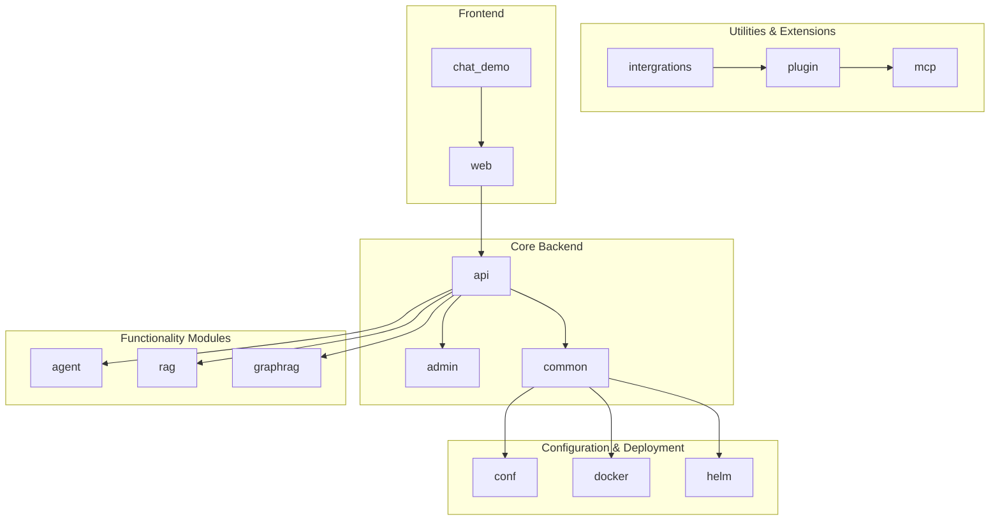
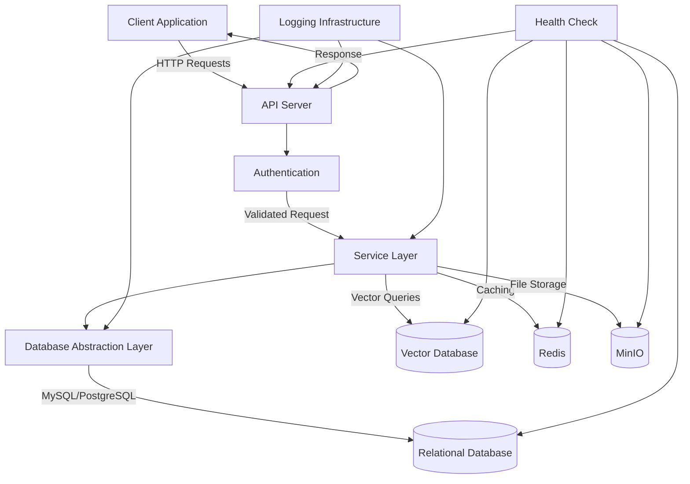
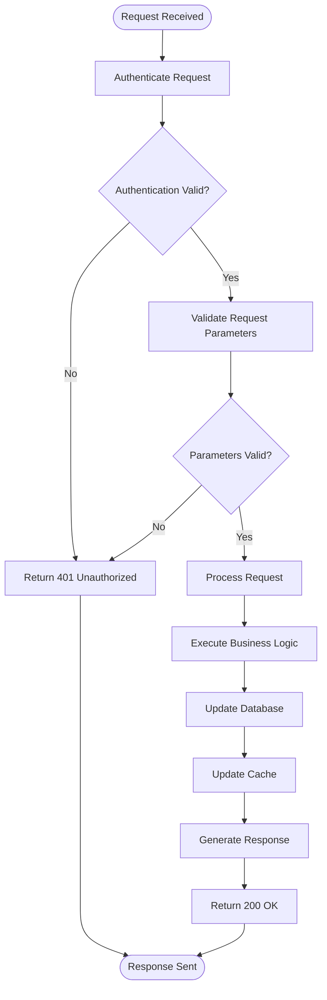
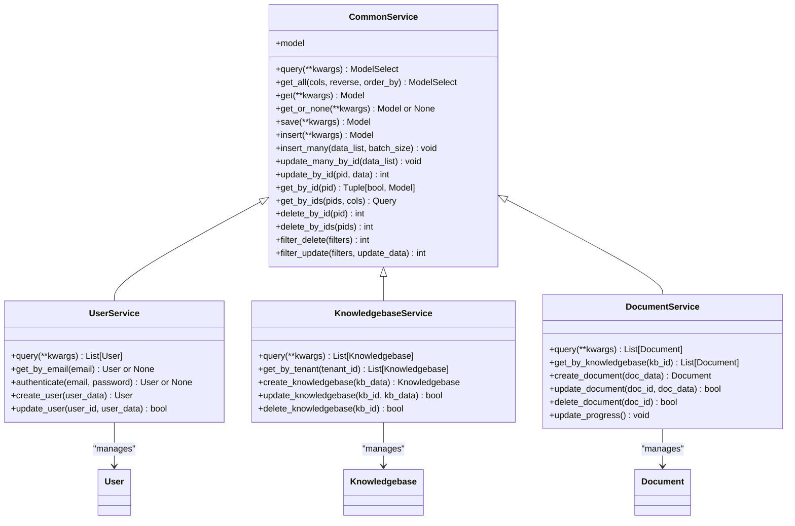
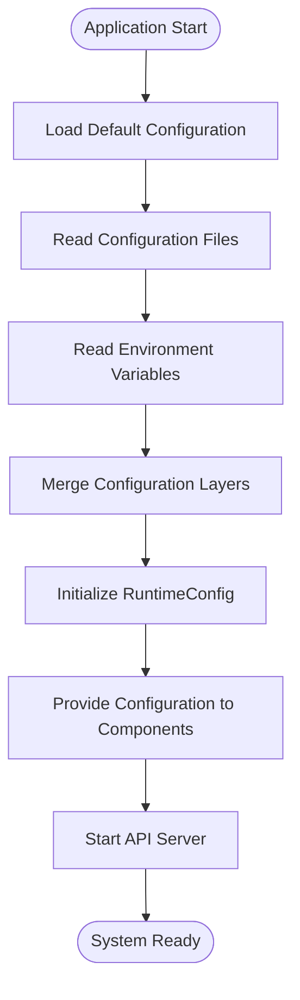
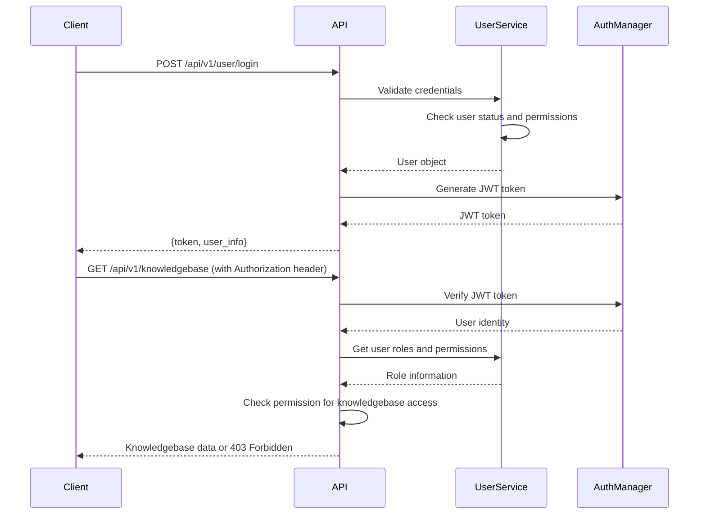
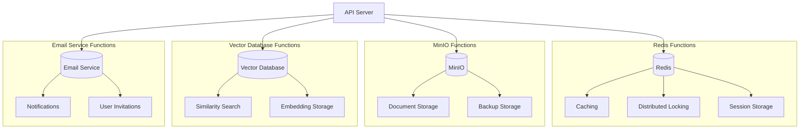
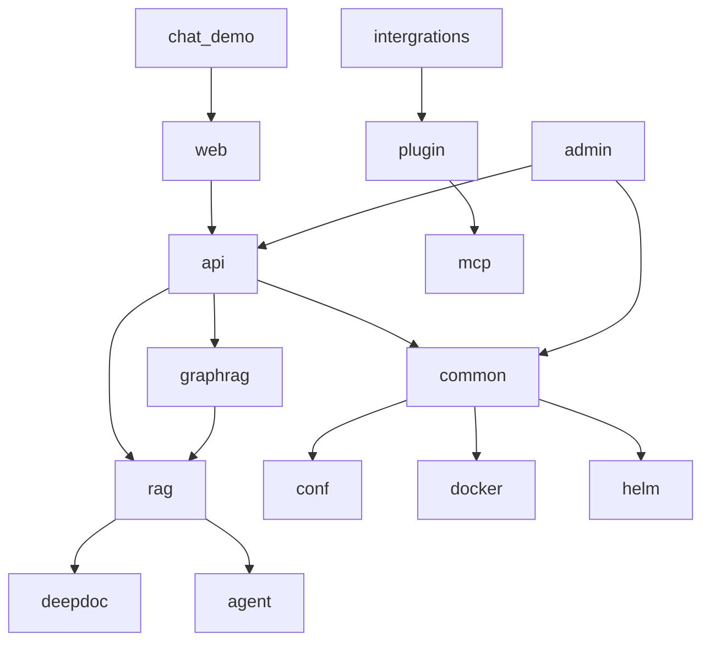

# Backend Architecture

<cite>
**Referenced Files in This Document**   
- [ragflow_server.py](file://api/ragflow_server.py)
- [db_models.py](file://api/db/db_models.py)
- [runtime_config.py](file://api/db/runtime_config.py)
- [settings.py](file://common/settings.py)
- [common_service.py](file://api/db/services/common_service.py)
- [__init__.py](file://api/apps/__init__.py)
- [admin_server.py](file://admin/server/admin_server.py)
- [auth.py](file://admin/server/auth.py)
- [health_utils.py](file://api/utils/health_utils.py)
- [web_utils.py](file://api/utils/web_utils.py)
</cite>

## Table of Contents
1. [Introduction](#introduction)
2. [Project Structure](#project-structure)
3. [Core Components](#core-components)
4. [Architecture Overview](#architecture-overview)
5. [Detailed Component Analysis](#detailed-component-analysis)
6. [Dependency Analysis](#dependency-analysis)
7. [Performance Considerations](#performance-considerations)
8. [Troubleshooting Guide](#troubleshooting-guide)
9. [Conclusion](#conclusion)

## Introduction
RAGFlow is a comprehensive backend system designed for retrieval-augmented generation (RAG) workflows. The architecture is built around a Flask-based API server with a modular application structure that supports extensibility and maintainability. The system implements a service pattern for database operations, dependency injection for configuration management, and singleton pattern for database connections to ensure efficient resource utilization. The request handling pipeline is designed to process various types of requests including document processing, knowledge base management, and agent execution. Authentication is implemented through token-based mechanisms with role-based access control, while error handling follows a consistent strategy across the application. The database abstraction layer provides a unified interface for data operations with support for transaction management and connection pooling. The system integrates with external services such as Redis for caching, MinIO for object storage, and various vector databases for efficient similarity search. The logging infrastructure provides comprehensive monitoring capabilities, and health check mechanisms ensure system reliability. The code organization follows a clear separation of concerns with well-defined extension points for custom functionality.

**Section sources**
- [ragflow_server.py](file://api/ragflow_server.py#L1-L167)

## Project Structure
The RAGFlow project follows a well-organized directory structure that separates concerns and facilitates maintainability. The core backend components are located in the `api` directory, which contains the Flask application, database models, services, and utilities. The `admin` directory houses the administrative interface and server components. The `agent` directory contains components for agent-based workflows, while the `common` directory includes shared utilities and constants used across the application. The `conf` directory stores configuration files, and the `docker` directory contains Docker-related configuration. The `rag` directory includes components specific to retrieval-augmented generation functionality. This modular structure allows for clear separation of concerns and makes the codebase easier to navigate and maintain.

**Diagram sources **
- [ragflow_server.py](file://api/ragflow_server.py#L1-L167)
- [admin_server.py](file://admin/server/admin_server.py#L1-L83)

**Section sources**
- [ragflow_server.py](file://api/ragflow_server.py#L1-L167)
- [admin_server.py](file://admin/server/admin_server.py#L1-L83)

## Core Components
The RAGFlow backend architecture is built around several core components that work together to provide a robust and scalable system. The Flask-based API server serves as the entry point for all requests, handling routing and request processing. The database abstraction layer, built on Peewee ORM, provides a consistent interface for data operations with support for multiple database backends. The service pattern implementation encapsulates business logic and database operations, promoting code reuse and maintainability. Configuration management is handled through dependency injection, allowing for flexible configuration of system parameters. The singleton pattern is used for database connections to ensure efficient resource utilization and prevent connection leaks. External service integrations, including Redis, MinIO, and vector databases, are managed through dedicated connection utilities that provide health checking and failover capabilities. The logging infrastructure captures detailed information about system operations, while monitoring endpoints and health check mechanisms ensure system reliability. The code organization follows a modular approach with well-defined extension points for custom functionality.

**Section sources**
- [ragflow_server.py](file://api/ragflow_server.py#L1-L167)
- [db_models.py](file://api/db/db_models.py#L1-L1297)
- [settings.py](file://common/settings.py#L1-L340)

## Architecture Overview
The RAGFlow backend architecture is designed as a modular, scalable system with clear separation of concerns. At the core is the Flask-based API server that handles incoming requests and routes them to appropriate handlers. The request handling pipeline processes requests through authentication, validation, and business logic layers before returning responses. The service pattern implementation encapsulates database operations and business logic, promoting code reuse and maintainability. Database connections are managed using the singleton pattern to ensure efficient resource utilization and prevent connection leaks. Configuration management is implemented through dependency injection, allowing for flexible configuration of system parameters. The system integrates with external services such as Redis for caching, MinIO for object storage, and various vector databases for efficient similarity search. The logging infrastructure provides comprehensive monitoring capabilities, and health check mechanisms ensure system reliability. The code organization follows a clear separation of concerns with well-defined extension points for custom functionality.

**Diagram sources **
- [ragflow_server.py](file://api/ragflow_server.py#L1-L167)
- [db_models.py](file://api/db/db_models.py#L1-L1297)
- [settings.py](file://common/settings.py#L1-L340)

## Detailed Component Analysis

### API Server and Request Handling
The API server is implemented using Flask and serves as the entry point for all requests. It follows a modular structure with blueprints for different functionality areas. The request handling pipeline processes incoming requests through several stages: routing, authentication, validation, business logic execution, and response generation. The server is configured to handle large payloads and long-running requests, which is essential for document processing and retrieval-augmented generation workflows. The use of Quart, an async-compatible version of Flask, allows for efficient handling of concurrent requests. The server implements comprehensive error handling to ensure robust operation under various conditions.

#### Request Handling Pipeline

**Diagram sources **
- [ragflow_server.py](file://api/ragflow_server.py#L1-L167)
- [__init__.py](file://api/apps/__init__.py#L1-L284)

**Section sources**
- [ragflow_server.py](file://api/ragflow_server.py#L1-L167)
- [__init__.py](file://api/apps/__init__.py#L1-L284)

### Database Abstraction and Service Pattern
The database abstraction layer is built on Peewee ORM and provides a consistent interface for data operations across different database backends. The service pattern implementation encapsulates business logic and database operations, promoting code reuse and maintainability. Each service class inherits from a common base service that provides standard CRUD operations. The database connection is managed using the singleton pattern to ensure efficient resource utilization and prevent connection leaks. The system supports both MySQL and PostgreSQL databases with automatic retry mechanisms for handling transient connection issues. Transaction management is implemented to ensure data consistency during complex operations.

#### Database Service Pattern

**Diagram sources **
- [common_service.py](file://api/db/services/common_service.py#L1-L347)
- [db_models.py](file://api/db/db_models.py#L1-L1297)

**Section sources**
- [common_service.py](file://api/db/services/common_service.py#L1-L347)
- [db_models.py](file://api/db/db_models.py#L1-L1297)

### Configuration Management and Dependency Injection
Configuration management in RAGFlow is implemented through a combination of environment variables, configuration files, and dependency injection. The system uses a hierarchical configuration approach where default values are defined in code, overridden by configuration files, and finally superseded by environment variables for deployment-specific settings. The dependency injection pattern is used to provide configuration values to components that need them, promoting loose coupling and testability. The RuntimeConfig class serves as a central configuration manager that initializes and provides access to configuration values throughout the application.

#### Configuration Management Flow

**Diagram sources **
- [settings.py](file://common/settings.py#L1-L340)
- [runtime_config.py](file://api/db/runtime_config.py#L1-L55)

**Section sources**
- [settings.py](file://common/settings.py#L1-L340)
- [runtime_config.py](file://api/db/runtime_config.py#L1-L55)

### Authentication and Authorization
The authentication system in RAGFlow implements token-based authentication with role-based access control. Users authenticate with their credentials and receive a JWT token that is used for subsequent requests. The system supports multiple authentication methods including username/password, API tokens, and OAuth integrations. Role-based access control ensures that users can only access resources they are authorized to use. The admin interface has a separate authentication mechanism with additional security measures for administrative operations.

#### Authentication Flow

**Diagram sources **
- [__init__.py](file://api/apps/__init__.py#L1-L284)
- [auth.py](file://admin/server/auth.py#L1-L189)

**Section sources**
- [__init__.py](file://api/apps/__init__.py#L1-L284)
- [auth.py](file://admin/server/auth.py#L1-L189)

### External Service Integration
RAGFlow integrates with several external services to provide enhanced functionality. Redis is used for caching and distributed locking, MinIO for object storage, and various vector databases for efficient similarity search. The system also integrates with email services for notifications and user management. Each external service has a dedicated connection utility that handles connection management, health checking, and failover.

#### External Service Integration Diagram

**Diagram sources **
- [settings.py](file://common/settings.py#L1-L340)
- [web_utils.py](file://api/utils/web_utils.py#L1-L234)
- [health_utils.py](file://api/utils/health_utils.py#L1-L223)

**Section sources**
- [settings.py](file://common/settings.py#L1-L340)
- [web_utils.py](file://api/utils/web_utils.py#L1-L234)
- [health_utils.py](file://api/utils/health_utils.py#L1-L223)

## Dependency Analysis
The RAGFlow backend has a well-defined dependency structure that promotes modularity and maintainability. The core dependencies include Flask/Quart for the web framework, Peewee for database operations, and various external service clients for Redis, MinIO, and vector databases. The system uses a layered architecture where higher-level components depend on lower-level utilities, but not vice versa. The service pattern implementation ensures that business logic is encapsulated and can be tested independently of the web framework. Configuration management is centralized, reducing the risk of configuration-related bugs. The use of dependency injection for configuration values promotes loose coupling and makes the system more testable.

**Diagram sources **
- [ragflow_server.py](file://api/ragflow_server.py#L1-L167)
- [settings.py](file://common/settings.py#L1-L340)

**Section sources**
- [ragflow_server.py](file://api/ragflow_server.py#L1-L167)
- [settings.py](file://common/settings.py#L1-L340)

## Performance Considerations
The RAGFlow backend is designed with performance in mind, particularly for handling large documents and complex retrieval operations. The system implements connection pooling for database connections to reduce the overhead of establishing new connections. Caching is used extensively to reduce the load on external services and improve response times. The service pattern implementation allows for efficient reuse of database queries and business logic. The system is configured to handle large payloads and long-running requests, which is essential for document processing workflows. The use of asynchronous processing for certain operations improves overall system throughput. The health check mechanisms ensure that performance issues are detected and addressed promptly.

**Section sources**
- [db_models.py](file://api/db/db_models.py#L1-L1297)
- [settings.py](file://common/settings.py#L1-L340)
- [health_utils.py](file://api/utils/health_utils.py#L1-L223)

## Troubleshooting Guide
When troubleshooting issues with the RAGFlow backend, start by checking the health endpoints to verify the status of all external services. The system provides comprehensive health check mechanisms that can identify issues with the database, Redis, MinIO, and vector databases. Review the logs for error messages and stack traces that can provide insight into the root cause of issues. For database-related problems, verify that the connection parameters are correct and that the database server is accessible. For authentication issues, check that the JWT secret key is correctly configured and that user accounts are active. When dealing with performance issues, examine the connection pool settings and caching configuration. The system's modular architecture makes it easier to isolate and resolve issues in specific components.

**Section sources**
- [health_utils.py](file://api/utils/health_utils.py#L1-L223)
- [ragflow_server.py](file://api/ragflow_server.py#L1-L167)
- [admin_server.py](file://admin/server/admin_server.py#L1-L83)

## Conclusion
The RAGFlow backend architecture is a well-designed, modular system that provides a robust foundation for retrieval-augmented generation workflows. The Flask-based API server with its modular structure allows for easy extension and maintenance. The service pattern implementation for database operations promotes code reuse and maintainability. Configuration management through dependency injection provides flexibility in deployment scenarios. The singleton pattern for database connections ensures efficient resource utilization. The request handling pipeline is designed to process various types of requests securely and efficiently. Authentication is implemented through token-based mechanisms with role-based access control. The error handling strategy provides consistent responses across the application. The database abstraction layer offers a unified interface for data operations with support for transaction management and connection pooling. Integration with external services such as Redis, MinIO, and vector databases enhances the system's capabilities. The logging infrastructure and monitoring endpoints provide comprehensive visibility into system operations. The code organization follows best practices with well-defined extension points for custom functionality. Overall, the architecture is scalable, maintainable, and well-suited for complex RAG workflows.