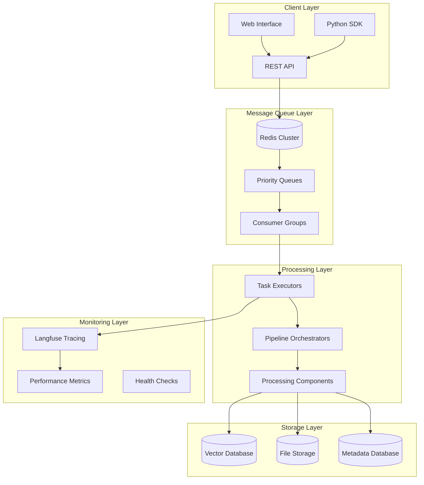
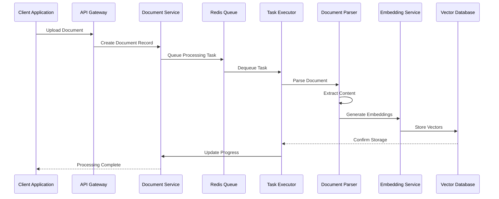
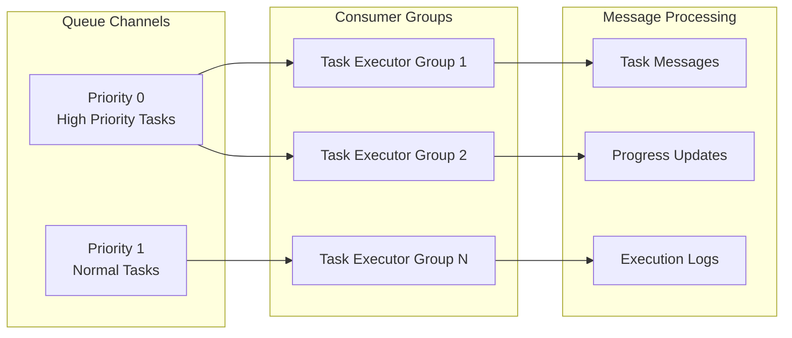
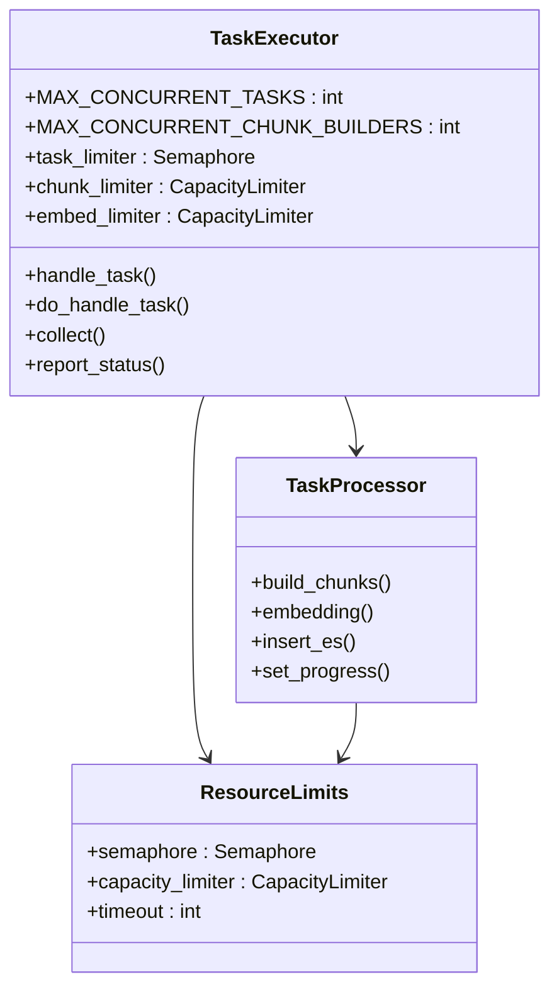
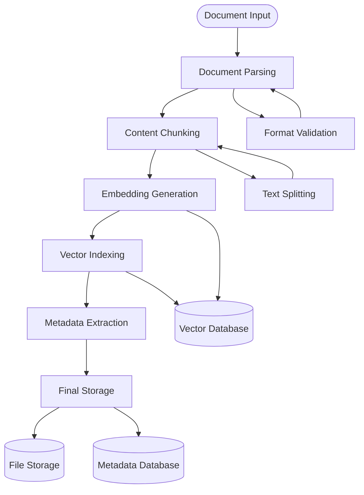
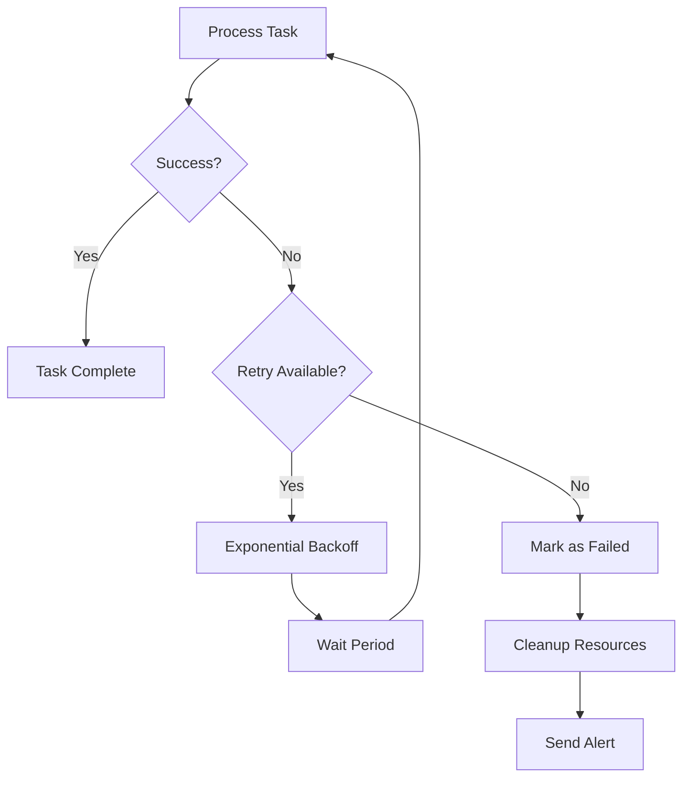
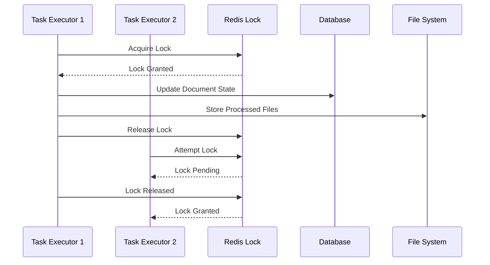
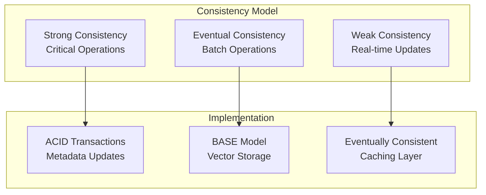
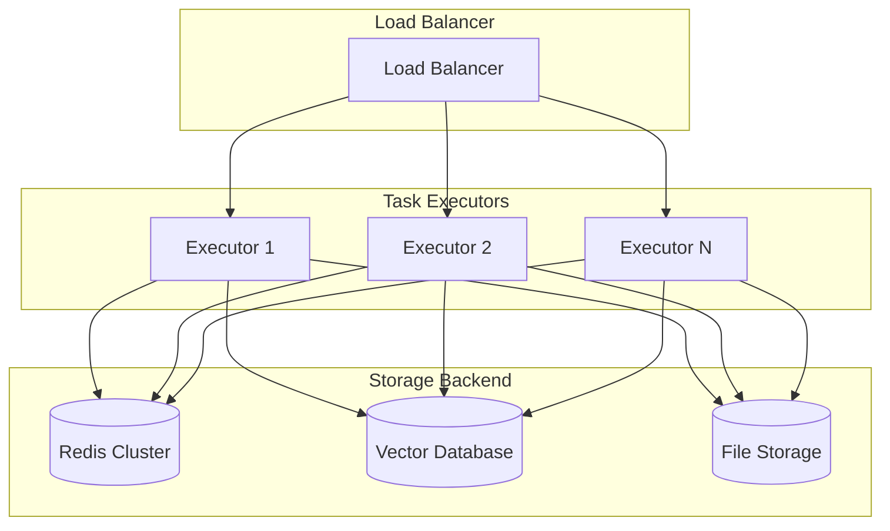
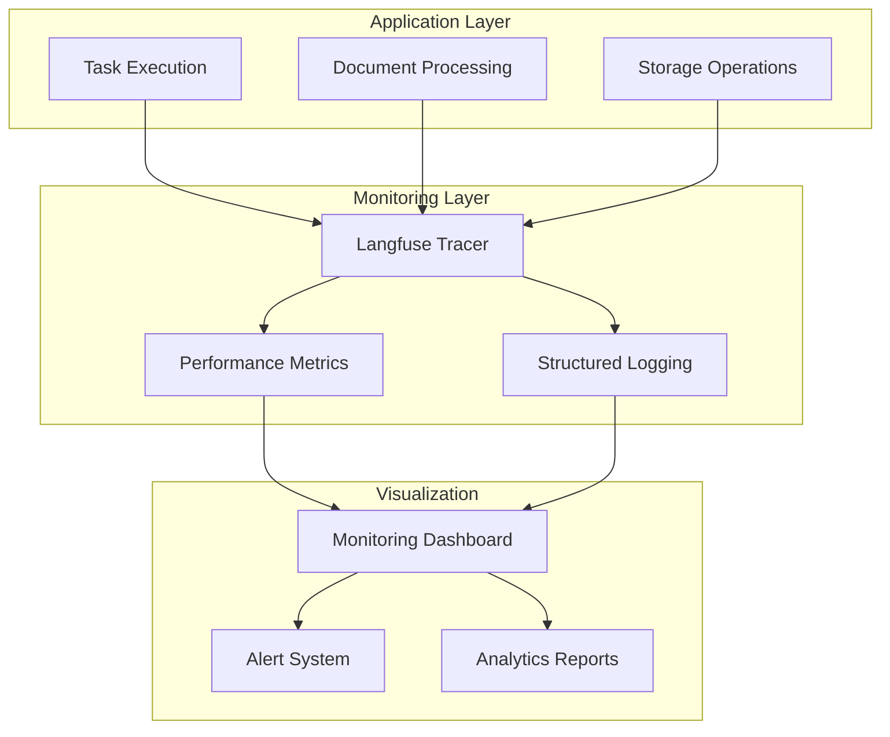

# Data Flow Architecture

<cite>
**Referenced Files in This Document**
- [task_executor.py](file://rag/svr/task_executor.py)
- [redis_conn.py](file://rag/utils/redis_conn.py)
- [pipeline.py](file://rag/flow/pipeline.py)
- [document_service.py](file://api/db/services/document_service.py)
- [settings.py](file://common/settings.py)
- [naive.py](file://rag/app/naive.py)
- [infinity_conn.py](file://rag/utils/infinity_conn.py)
- [db_models.py](file://api/db/db_models.py)
- [common_service.py](file://api/db/services/common_service.py)
- [connection_utils.py](file://common/connection_utils.py)
- [utils.py](file://common/data_source/utils.py)
- [base.py](file://agent/component/base.py)
- [canvas.py](file://agent/canvas.py)
- [tracing.mdx](file://docs/guides/tracing.mdx)
</cite>

## Table of Contents
1. [Introduction](#introduction)
2. [System Architecture Overview](#system-architecture-overview)
3. [Event-Driven Workflow](#event-driven-workflow)
4. [Redis-Based Message Queue System](#redis-based-message-queue-system)
5. [Task Executor Pattern](#task-executor-pattern)
6. [Data Transformation Pipeline](#data-transformation-pipeline)
7. [Retry Mechanisms and Error Handling](#retry-mechanisms-and-error-handling)
8. [State Management and Coordination](#state-management-and-coordination)
9. [Data Consistency Model](#data-consistency-model)
10. [Performance Characteristics](#performance-characteristics)
11. [Scalability Considerations](#scalability-considerations)
12. [Monitoring and Observability](#monitoring-and-observability)

## Introduction

RAGFlow implements a sophisticated data flow architecture designed for large-scale document processing and knowledge retrieval. The system employs an event-driven, asynchronous processing model with Redis-based message queuing, distributed task execution, and robust error handling mechanisms. This architecture enables efficient processing of diverse document types while maintaining data consistency and providing comprehensive monitoring capabilities.

The core architecture centers around a pipeline-based processing system where documents flow through multiple transformation stages, each handled by specialized components. The system supports both traditional Elasticsearch and modern Infinity vector databases as document engines, providing flexibility in deployment scenarios.

## System Architecture Overview

RAGFlow's architecture follows a microservices pattern with clear separation of concerns across multiple layers:

**Diagram sources**
- [task_executor.py](file://rag/svr/task_executor.py#L1-L100)
- [redis_conn.py](file://rag/utils/redis_conn.py#L1-L100)
- [pipeline.py](file://rag/flow/pipeline.py#L1-L50)

**Section sources**
- [task_executor.py](file://rag/svr/task_executor.py#L1-L200)
- [redis_conn.py](file://rag/utils/redis_conn.py#L1-L200)
- [pipeline.py](file://rag/flow/pipeline.py#L1-L100)

## Event-Driven Workflow

The event-driven workflow orchestrates document processing through a series of discrete, asynchronous stages:

**Diagram sources**
- [document_service.py](file://api/db/services/document_service.py#L505-L523)
- [task_executor.py](file://rag/svr/task_executor.py#L982-L1013)

The workflow begins when a document is uploaded through the API layer. The system creates a document record and queues a processing task in Redis. Task executors consume these tasks asynchronously, executing the complete processing pipeline from parsing to vector storage.

**Section sources**
- [document_service.py](file://api/db/services/document_service.py#L828-L889)
- [task_executor.py](file://rag/svr/task_executor.py#L932-L958)

## Redis-Based Message Queue System

RAGFlow utilizes Redis as its primary message queue system, leveraging Redis Streams for reliable message delivery and consumer group management:

### Queue Architecture

The system implements a priority-based queue system with multiple queue channels:

**Diagram sources**
- [redis_conn.py](file://rag/utils/redis_conn.py#L258-L303)
- [settings.py](file://common/settings.py#L122-L128)

### Message Queue Implementation

The Redis connection class provides comprehensive queue management capabilities:

| Feature | Implementation | Purpose |
|---------|---------------|---------|
| **Priority Queues** | Multiple queue channels | Handle urgent vs normal processing tasks |
| **Consumer Groups** | Redis Stream consumer groups | Enable horizontal scaling of task processing |
| **Message Acknowledgment** | XACK operations | Ensure reliable message processing |
| **Pending Message Tracking** | XPENDING commands | Monitor stuck or failed tasks |
| **Dead Letter Handling** | Automatic redelivery | Handle transient failures gracefully |

**Section sources**
- [redis_conn.py](file://rag/utils/redis_conn.py#L245-L303)
- [settings.py](file://common/settings.py#L122-L128)

## Task Executor Pattern

The task executor implements a sophisticated pattern for asynchronous, distributed processing with comprehensive resource management:

### Executor Architecture

**Diagram sources**
- [task_executor.py](file://rag/svr/task_executor.py#L113-L120)
- [task_executor.py](file://rag/svr/task_executor.py#L777-L800)

### Resource Management

The executor implements fine-grained resource limiting to prevent system overload:

| Resource Type | Limit Configuration | Purpose |
|---------------|-------------------|---------|
| **Concurrent Tasks** | `MAX_CONCURRENT_TASKS` | Control overall processing capacity |
| **Chunk Builders** | `MAX_CONCURRENT_CHUNK_BUILDERS` | Manage memory-intensive parsing operations |
| **Embedding Workers** | `MAX_CONCURRENT_EMBEDDING` | Coordinate AI model inference |
| **Storage Operations** | `MAX_CONCURRENT_MINIO` | Handle file storage efficiently |
| **Knowledge Graph** | `MAX_CONCURRENT_KG` | Manage graph processing tasks |

**Section sources**
- [task_executor.py](file://rag/svr/task_executor.py#L113-L120)
- [task_executor.py](file://rag/svr/task_executor.py#L777-L800)

## Data Transformation Pipeline

The data transformation pipeline processes documents through multiple specialized stages, each handling specific aspects of document understanding and indexing:

### Pipeline Stages

**Diagram sources**
- [task_executor.py](file://rag/svr/task_executor.py#L932-L958)
- [naive.py](file://rag/app/naive.py#L1-L100)

### Processing Components

The pipeline integrates multiple specialized processors:

| Component | Responsibility | Output Format |
|-----------|---------------|---------------|
| **Document Parser** | Extract content from various formats | Structured text chunks |
| **Content Splitter** | Divide text into manageable segments | Token-optimized chunks |
| **Embedding Generator** | Convert text to vector representations | High-dimensional vectors |
| **Metadata Extractor** | Extract contextual information | Rich metadata fields |
| **Vector Indexer** | Store and optimize vector storage | Indexed vector collections |

**Section sources**
- [task_executor.py](file://rag/svr/task_executor.py#L932-L958)
- [naive.py](file://rag/app/naive.py#L43-L100)

## Retry Mechanisms and Error Handling

RAGFlow implements comprehensive retry mechanisms and error handling strategies to ensure robust processing:

### Retry Strategy

**Diagram sources**
- [connection_utils.py](file://common/connection_utils.py#L35-L99)
- [utils.py](file://common/data_source/utils.py#L113-L149)

### Error Handling Layers

The system implements multiple layers of error handling:

| Layer | Implementation | Recovery Strategy |
|-------|---------------|------------------|
| **Network Level** | Connection timeouts, retry with backoff | Exponential backoff strategy |
| **Database Level** | Transaction retries, connection pooling | Automatic reconnection |
| **Processing Level** | Component-specific error handling | Graceful degradation |
| **System Level** | Process supervision, health checks | Automatic restart |

**Section sources**
- [connection_utils.py](file://common/connection_utils.py#L35-L99)
- [utils.py](file://common/data_source/utils.py#L113-L149)
- [db_models.py](file://api/db/db_models.py#L259-L499)

## State Management and Coordination

RAGFlow maintains state consistency across distributed components through coordinated mechanisms:

### Distributed Coordination

**Diagram sources**
- [db_models.py](file://api/db/db_models.py#L447-L499)
- [redis_conn.py](file://rag/utils/redis_conn.py#L389-L412)

### State Synchronization

The system ensures consistency through several mechanisms:

| Mechanism | Purpose | Implementation |
|-----------|---------|---------------|
| **Distributed Locks** | Prevent concurrent modifications | Redis-based advisory locks |
| **Transaction Boundaries** | Ensure atomic operations | Database transaction management |
| **Progress Tracking** | Monitor processing state | Real-time progress updates |
| **Heartbeat Monitoring** | Detect system health | Periodic status reporting |

**Section sources**
- [db_models.py](file://api/db/db_models.py#L447-L499)
- [redis_conn.py](file://rag/utils/redis_conn.py#L389-L412)

## Data Consistency Model

RAGFlow implements a relaxed consistency model optimized for high-throughput document processing:

### Consistency Patterns

**Diagram sources**
- [db_models.py](file://api/db/db_models.py#L259-L499)
- [infinity_conn.py](file://rag/utils/infinity_conn.py#L168-L552)

### Transaction Boundaries

The system defines clear transaction boundaries for different operations:

| Operation Type | Transaction Scope | Consistency Level |
|---------------|------------------|------------------|
| **Document Creation** | Single database transaction | Strong consistency |
| **Content Processing** | Atomic pipeline stage | Eventual consistency |
| **Vector Updates** | Batch operations | Eventual consistency |
| **Metadata Changes** | Database transactions | Strong consistency |

**Section sources**
- [db_models.py](file://api/db/db_models.py#L259-L499)
- [infinity_conn.py](file://rag/utils/infinity_conn.py#L168-L552)

## Performance Characteristics

RAGFlow is designed for high-performance document processing with several optimization strategies:

### Performance Metrics

| Metric | Target | Implementation |
|--------|--------|---------------|
| **Throughput** | 100+ documents/minute | Parallel processing, batching |
| **Latency** | < 30 seconds/document | Asynchronous processing |
| **Memory Usage** | < 2GB per executor | Streaming processing |
| **CPU Utilization** | 70-90% peak | Efficient resource allocation |

### Optimization Strategies

The system employs multiple optimization techniques:

- **Streaming Processing**: Documents are processed in streams to minimize memory usage
- **Parallel Execution**: Multiple processing stages run concurrently
- **Batch Operations**: Vector operations are batched for efficiency
- **Caching**: Frequently accessed data is cached in memory
- **Connection Pooling**: Database connections are pooled for reuse

**Section sources**
- [task_executor.py](file://rag/svr/task_executor.py#L113-L120)
- [infinity_conn.py](file://rag/utils/infinity_conn.py#L168-L552)

## Scalability Considerations

RAGFlow's architecture is designed for horizontal and vertical scalability:

### Horizontal Scaling

**Diagram sources**
- [task_executor.py](file://rag/svr/task_executor.py#L1030-L1040)
- [redis_conn.py](file://rag/utils/redis_conn.py#L258-L303)

### Scaling Strategies

| Scale Type | Strategy | Benefits |
|------------|----------|----------|
| **Vertical** | Increase executor resources | Higher throughput per executor |
| **Horizontal** | Add more executors | Better fault tolerance |
| **Database** | Sharded vector storage | Improved query performance |
| **Storage** | Distributed file systems | Enhanced reliability |

**Section sources**
- [task_executor.py](file://rag/svr/task_executor.py#L1030-L1040)
- [redis_conn.py](file://rag/utils/redis_conn.py#L258-L303)

## Monitoring and Observability

RAGFlow provides comprehensive monitoring and observability through integrated tracing and metrics collection:

### Monitoring Architecture

**Diagram sources**
- [tracing.mdx](file://docs/guides/tracing.mdx#L1-L72)
- [canvas.py](file://agent/canvas.py#L426-L454)

### Observability Features

The system provides extensive observability capabilities:

| Feature | Implementation | Purpose |
|---------|---------------|---------|
| **Distributed Tracing** | Langfuse integration | Track request flows |
| **Performance Metrics** | Built-in counters | Monitor system health |
| **Error Tracking** | Comprehensive logging | Debug processing issues |
| **Resource Monitoring** | Health checks | Track system utilization |
| **Progress Reporting** | Real-time updates | User feedback |

**Section sources**
- [tracing.mdx](file://docs/guides/tracing.mdx#L1-L72)
- [canvas.py](file://agent/canvas.py#L426-L454)