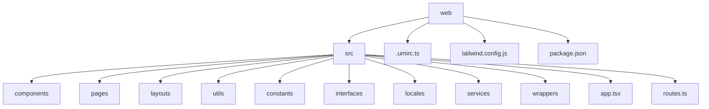
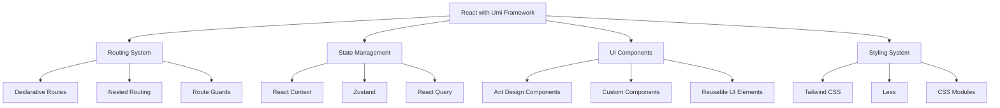
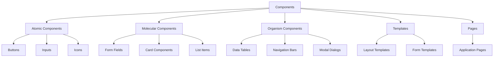
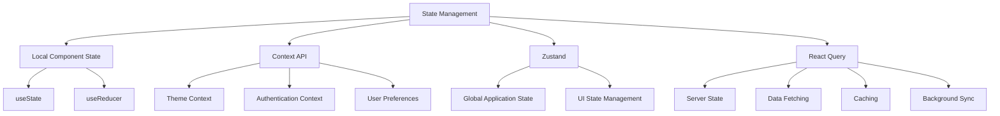
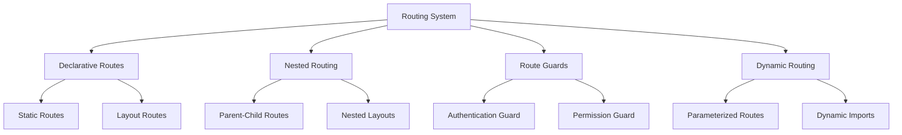
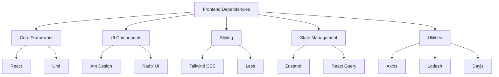
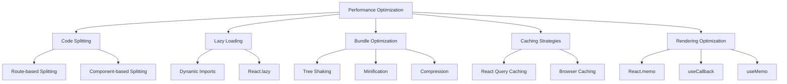
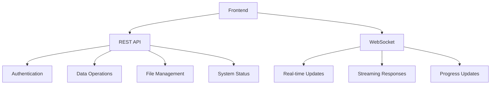

# Frontend Architecture

<cite>
**Referenced Files in This Document**   
- [package.json](file://web/package.json)
- [.umirc.ts](file://web/.umirc.ts)
- [app.tsx](file://web/src/app.tsx)
- [routes.ts](file://web/src/routes.ts)
- [tailwind.config.js](file://web/tailwind.config.js)
- [api.ts](file://web/src/utils/api.ts)
- [authorization-util.ts](file://web/src/utils/authorization-util.ts)
- [auth.tsx](file://web/src/wrappers/auth.tsx)
</cite>

## Table of Contents
1. [Introduction](#introduction)
2. [Project Structure](#project-structure)
3. [Core Components](#core-components)
4. [Architecture Overview](#architecture-overview)
5. [Detailed Component Analysis](#detailed-component-analysis)
6. [Dependency Analysis](#dependency-analysis)
7. [Performance Considerations](#performance-considerations)
8. [Troubleshooting Guide](#troubleshooting-guide)
9. [Conclusion](#conclusion)

## Introduction
RAGFlow's frontend architecture is built on React with the Umi framework, leveraging Ant Design components and Tailwind CSS for styling. The architecture follows a component-based design with comprehensive state management, routing, and internationalization support. This document provides a detailed analysis of the frontend architecture, including its integration with backend services through REST APIs and WebSocket connections.

**Section sources**
- [package.json](file://web/package.json)
- [.umirc.ts](file://web/.umirc.ts)

## Project Structure

The frontend project is organized in the `web` directory with a well-structured hierarchy that follows modern React application patterns. The architecture is component-driven with clear separation of concerns between UI components, pages, layouts, and utilities.

**Diagram sources**
- [package.json](file://web/package.json)
- [.umirc.ts](file://web/.umirc.ts)

**Section sources**
- [package.json](file://web/package.json)
- [.umirc.ts](file://web/.umirc.ts)

## Core Components

The core components of RAGFlow's frontend architecture include the Umi framework configuration, routing system, state management, and UI component library. The application uses React with TypeScript, Umi as the framework, Ant Design for UI components, and Tailwind CSS for styling.

The architecture implements a robust component-based design with reusable UI elements organized in the components directory. The application leverages modern React patterns including hooks, context, and component composition to create a maintainable and scalable codebase.

**Section sources**
- [app.tsx](file://web/src/app.tsx)
- [routes.ts](file://web/src/routes.ts)
- [tailwind.config.js](file://web/tailwind.config.js)

## Architecture Overview

The frontend architecture follows a modern React application pattern with Umi as the framework. The application is configured through `.umirc.ts` which defines routes, plugins, and build configurations. The architecture implements a component-based design with clear separation between UI components, pages, and layouts.

**Diagram sources**
- [.umirc.ts](file://web/.umirc.ts)
- [app.tsx](file://web/src/app.tsx)
- [routes.ts](file://web/src/routes.ts)

**Section sources**
- [.umirc.ts](file://web/.umirc.ts)
- [app.tsx](file://web/src/app.tsx)
- [routes.ts](file://web/src/routes.ts)

## Detailed Component Analysis

### Component Architecture
The component architecture follows a modular design with components organized by functionality and reusability. The application implements a hierarchical component structure with atomic design principles.

#### Component Organization

**Diagram sources**
- [components](file://web/src/components)
- [pages](file://web/src/pages)

### State Management Patterns
The application implements a comprehensive state management strategy using multiple approaches for different use cases.

#### State Management Architecture

**Diagram sources**
- [app.tsx](file://web/src/app.tsx)
- [authorization-util.ts](file://web/src/utils/authorization-util.ts)

### Routing System
The routing system is configured through Umi's routing capabilities with a declarative approach to route definition.

#### Routing Architecture

**Diagram sources**
- [routes.ts](file://web/src/routes.ts)
- [auth.tsx](file://web/src/wrappers/auth.tsx)

**Section sources**
- [routes.ts](file://web/src/routes.ts)
- [auth.tsx](file://web/src/wrappers/auth.tsx)

## Dependency Analysis

The frontend architecture has a well-defined dependency structure with clear separation between core dependencies, UI libraries, and utility packages.

**Diagram sources**
- [package.json](file://web/package.json)

**Section sources**
- [package.json](file://web/package.json)

## Performance Considerations

The frontend architecture implements several performance optimization techniques to ensure a responsive user experience.

### Performance Optimization Strategies

**Diagram sources**
- [.umirc.ts](file://web/.umirc.ts)
- [app.tsx](file://web/src/app.tsx)

**Section sources**
- [.umirc.ts](file://web/.umirc.ts)
- [app.tsx](file://web/src/app.tsx)

## Troubleshooting Guide

The frontend architecture includes several mechanisms for troubleshooting and debugging issues.

### Integration with Backend Services
The application integrates with backend services through REST APIs and WebSocket connections. The API endpoints are defined in the `api.ts` utility file, which provides a centralized location for all API endpoints.

**Diagram sources**
- [api.ts](file://web/src/utils/api.ts)
- [authorization-util.ts](file://web/src/utils/authorization-util.ts)

**Section sources**
- [api.ts](file://web/src/utils/api.ts)
- [authorization-util.ts](file://web/src/utils/authorization-util.ts)

## Conclusion

RAGFlow's frontend architecture demonstrates a well-structured, modern React application built with the Umi framework. The architecture effectively combines React's component model with Umi's routing and build capabilities, Ant Design's comprehensive UI components, and Tailwind CSS's utility-first styling approach. The component-based design promotes reusability and maintainability, while the state management patterns provide efficient data handling across the application. The routing system enables complex navigation patterns with proper authentication and authorization controls. The integration with backend services through REST APIs and WebSocket connections ensures seamless data exchange and real-time functionality. Overall, the architecture represents a robust foundation for a scalable and maintainable frontend application.