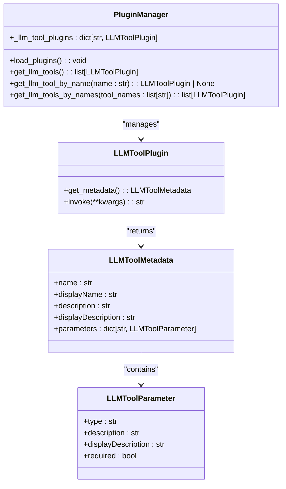
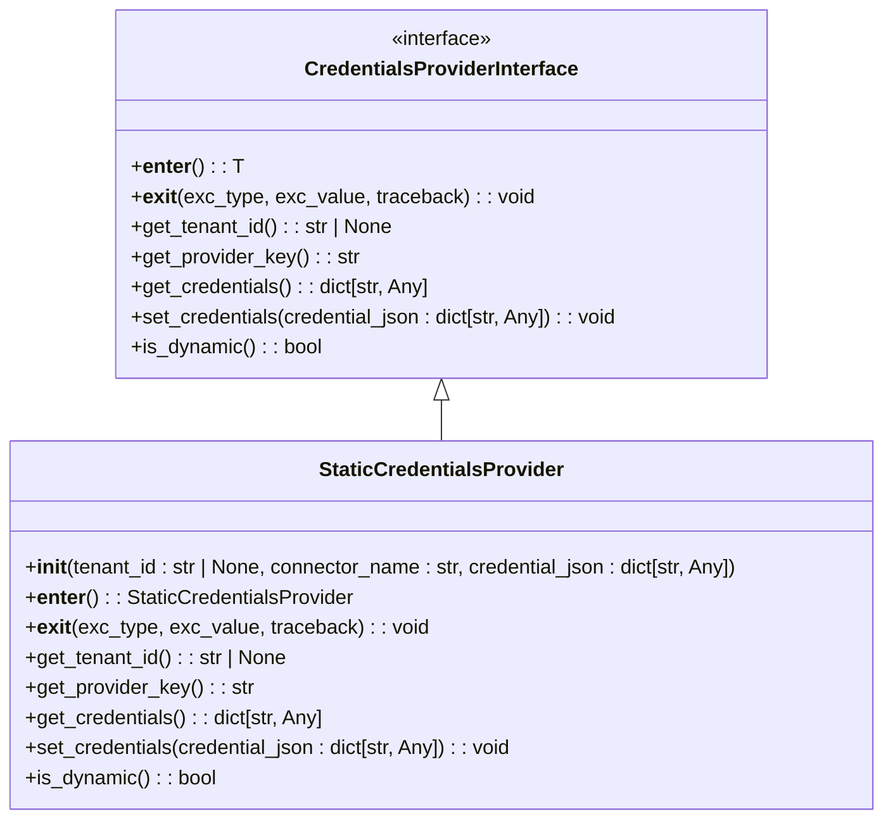
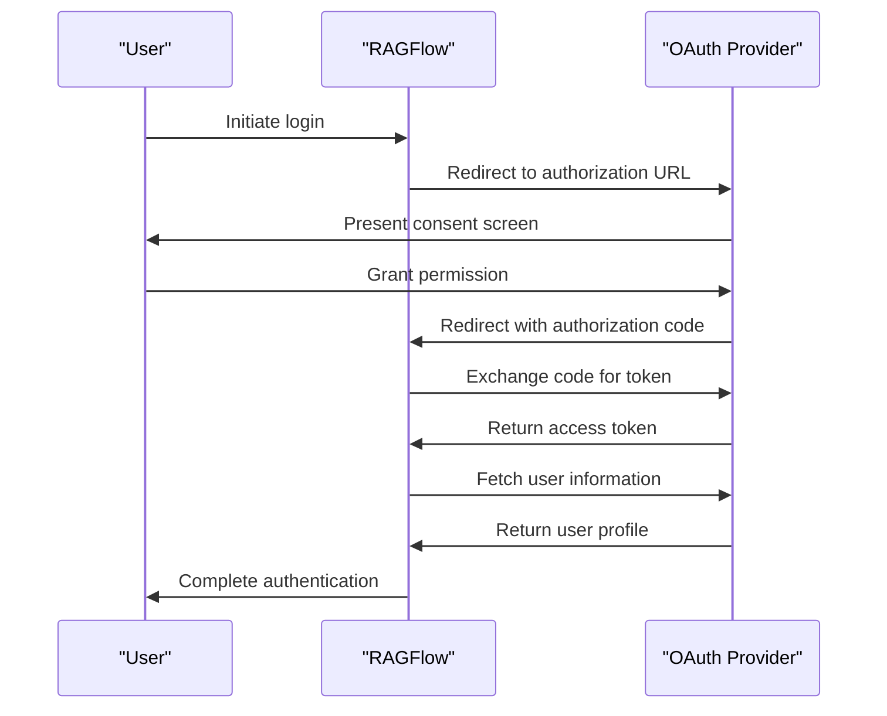
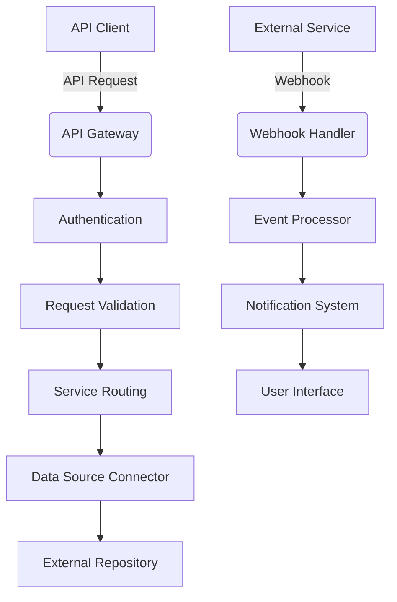
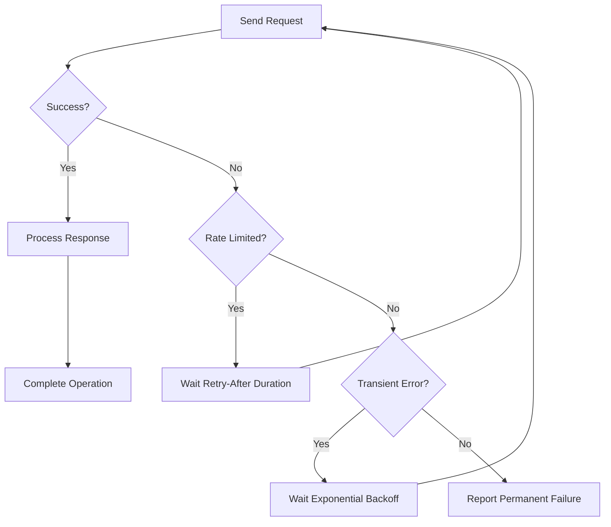
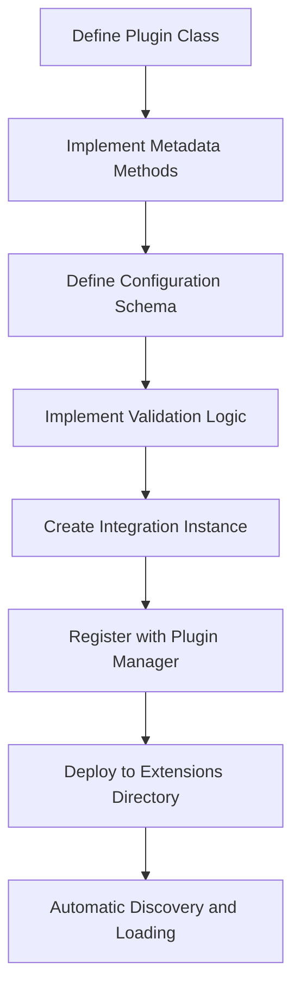

# Integration Patterns

<cite>
**Referenced Files in This Document**   
- [interfaces.py](file://common/data_source/interfaces.py)
- [plugin_manager.py](file://plugin/plugin_manager.py)
- [llm_tool_plugin.py](file://plugin/llm_tool_plugin.py)
- [oauth.py](file://api/apps/auth/oauth.py)
- [oidc.py](file://api/apps/auth/oidc.py)
- [google_util/auth.py](file://common/data_source/google_util/auth.py)
- [http_client.py](file://common/http_client.py)
- [data_source-service.ts](file://web/src/services/data-source-service.ts)
- [user_app.py](file://api/apps/user_app.py)
- [firecrawl/integration.py](file://intergrations/firecrawl/integration.py)
</cite>

## Table of Contents
1. [Introduction](#introduction)
2. [Extensible Plugin Architecture](#extensible-plugin-architecture)
3. [Authentication and Security Model](#authentication-and-security-model)
4. [OAuth/OIDC Implementation](#oauthoidc-implementation)
5. [API Gateway and Webhook Handling](#api-gateway-and-webhook-handling)
6. [Error Handling and Rate Limiting](#error-handling-and-rate-limiting)
7. [Monitoring and Health Checks](#monitoring-and-health-checks)
8. [Testing Strategy](#testing-strategy)
9. [Extension Development Workflow](#extension-development-workflow)
10. [Conclusion](#conclusion)

## Introduction
RAGFlow implements a comprehensive integration architecture designed to connect with various data sources, authentication providers, and third-party services. The system follows extensible patterns that allow for seamless integration while maintaining security, reliability, and performance. This document details the architectural patterns, interface contracts, and operational mechanisms that enable RAGFlow's integration capabilities.

## Extensible Plugin Architecture

RAGFlow's plugin architecture provides a flexible framework for extending functionality through data source connectors, authentication providers, and third-party service integrations. The architecture is built around well-defined interfaces and contracts that ensure consistency across different integration types.

The core of the plugin system is implemented in the `plugin_manager.py` module, which manages the lifecycle of plugins and provides discovery mechanisms for available extensions. Plugins are loaded from designated directories and registered with the system at startup, enabling dynamic functionality without requiring application restarts.

**Diagram sources**
- [plugin_manager.py](file://plugin/plugin_manager.py#L11-L46)
- [llm_tool_plugin.py](file://plugin/llm_tool_plugin.py#L22-L52)

The data source connector interface defines a comprehensive contract for integrating with external repositories and services. Connectors implement standardized methods for credential management, document retrieval, and permission synchronization. The architecture supports both polling and checkpoint-based synchronization patterns, allowing connectors to efficiently handle incremental updates.

**Section sources**
- [interfaces.py](file://common/data_source/interfaces.py#L1-L412)

## Authentication and Security Model

RAGFlow implements a robust security model for managing external connections and credential delegation. The system separates credential storage from usage, ensuring that sensitive authentication information is properly protected while enabling secure access to integrated services.

The credential management system uses a provider pattern that abstracts the details of credential storage and retrieval. The `CredentialsProviderInterface` defines methods for acquiring and releasing credentials, with implementations that support both static and dynamic credential types. This abstraction allows the system to handle various authentication mechanisms uniformly.

**Diagram sources**
- [interfaces.py](file://common/data_source/interfaces.py#L107-L197)

For Google services integration, RAGFlow supports both OAuth and service account authentication methods. The system implements token refresh mechanisms to maintain valid credentials during extended operations. When using OAuth, the system securely stores token information while removing sensitive client credentials from persisted data.

**Section sources**
- [auth.py](file://common/data_source/google_util/auth.py#L1-L158)

## OAuth/OIDC Implementation

RAGFlow provides comprehensive support for OAuth2 and OpenID Connect (OIDC) authentication, enabling secure integration with third-party identity providers. The implementation follows industry best practices for authorization code flow and token management.

The OAuth client implementation provides methods for generating authorization URLs, exchanging authorization codes for access tokens, and retrieving user information. The system supports both synchronous and asynchronous operations, allowing integration with various application patterns.

**Diagram sources**
- [oauth.py](file://api/apps/auth/oauth.py#L32-L152)
- [user_app.py](file://api/apps/user_app.py#L161-L197)

The OIDC implementation extends the OAuth client with support for OpenID Connect discovery and ID token validation. The system automatically retrieves provider metadata from the well-known configuration endpoint and uses it to configure the authentication flow. ID tokens are validated using the provider's JSON Web Key Set (JWKS) to ensure authenticity.

**Section sources**
- [oidc.py](file://api/apps/auth/oidc.py#L22-L72)

## API Gateway and Webhook Handling

RAGFlow implements an API gateway pattern to manage external integrations and provide a consistent interface for third-party services. The gateway handles request routing, authentication, and response transformation, abstracting the internal system architecture from external consumers.

The system supports webhook integration for event-driven communication with external services. Webhooks can be configured to receive notifications about document changes, user actions, or system events. The webhook handler validates incoming requests and processes payloads according to predefined rules.

The data source configuration interface provides a standardized way to manage external connections. Each data source type defines its specific configuration parameters, which are validated before use. The system supports dynamic configuration updates, allowing administrators to modify integration settings without service interruption.

**Diagram sources**
- [data_source-service.ts](file://web/src/services/data-source-service.ts#L1-L41)
- [interfaces.py](file://common/data_source/interfaces.py#L1-L412)

**Section sources**
- [data_source-service.ts](file://web/src/services/data-source-service.ts#L1-L41)

## Error Handling and Rate Limiting

RAGFlow implements comprehensive error handling and rate limiting mechanisms to ensure reliable operation when integrating with external services. The system is designed to gracefully handle transient failures and prevent overwhelming external APIs with requests.

The error handling strategy includes retry mechanisms with exponential backoff for transient errors. When a request fails due to rate limiting, the system respects the Retry-After header if provided, or applies a calculated delay based on the failure pattern. This approach minimizes the impact on external services while maximizing successful operations.

**Diagram sources**
- [http_client.py](file://common/http_client.py#L47-L96)
- [utils.py](file://common/data_source/utils.py#L112-L158)

The rate limiting implementation monitors request patterns and adjusts behavior based on external service responses. For services that provide rate limit information in headers, the system uses this data to optimize request timing. For services without explicit rate limiting, the system applies conservative defaults that can be configured per integration.

**Section sources**
- [http_client.py](file://common/http_client.py#L1-L158)
- [utils.py](file://common/data_source/utils.py#L106-L158)

## Monitoring and Health Checks

RAGFlow provides comprehensive monitoring capabilities for external integrations, allowing administrators to track the health and performance of connected services. The system exposes health check endpoints that report the status of core dependencies and integration points.

The monitoring system collects metrics on integration performance, including request latency, error rates, and throughput. These metrics are available through both API endpoints and a dedicated monitoring interface. The system also provides detailed logging for troubleshooting integration issues.

Health checks are implemented as configurable probes that verify connectivity to external services. Each integration can define its specific health check logic, which is executed periodically to ensure continued operation. The results are aggregated and made available for both automated monitoring and manual inspection.

**Section sources**
- [health_utils.py](file://api/utils/health_utils.py#L75-L124)
- [services.py](file://admin/server/services.py#L207-L219)

## Testing Strategy

RAGFlow implements a comprehensive testing strategy for integration points, ensuring reliability and compatibility across different environments and configurations. The testing framework includes both automated and manual testing capabilities.

The system provides a testing interface that allows administrators to validate integration configurations before deployment. This includes connection tests that verify authentication and basic functionality, as well as more comprehensive tests that exercise specific integration features.

Automated tests are implemented using a combination of unit tests, integration tests, and end-to-end tests. The test suite covers various scenarios, including normal operation, error conditions, and edge cases. Tests are designed to be run in isolated environments to prevent interference with production systems.

The sandbox testing framework provides a secure environment for executing integration code with restricted permissions. This allows for safe testing of potentially risky operations while maintaining system security. The framework includes monitoring and logging capabilities to capture test results and diagnose issues.

**Section sources**
- [sandbox_security_tests_full.py](file://sandbox/tests/sandbox_security_tests_full.py#L85-L415)
- [run_retrieval_test.md](file://docs/guides/dataset/run_retrieval_test.md#L1-L5)

## Extension Development Workflow

RAGFlow provides a well-defined workflow for developing and deploying integration extensions. The process is designed to be straightforward while ensuring compatibility and security.

Developers start by implementing the appropriate interface for their integration type, whether it's a data source connector, authentication provider, or other extension point. The system provides base classes and abstract methods that guide the implementation process.

The Firecrawl integration serves as an example of the extension development pattern. It implements a plugin class that provides metadata, configuration schema, and validation rules. The integration follows a modular design, separating configuration, UI, and business logic components.

**Diagram sources**
- [integration.py](file://intergrations/firecrawl/integration.py#L18-L150)

The deployment process involves packaging the extension and placing it in the designated extensions directory. The system automatically discovers and loads extensions at startup, making them available for configuration and use. Version compatibility is managed through metadata that specifies the required RAGFlow version and any dependencies.

**Section sources**
- [integration.py](file://intergrations/firecrawl/integration.py#L1-L150)
- [plugin_manager.py](file://plugin/plugin_manager.py#L1-L46)

## Conclusion

RAGFlow's integration architecture provides a robust and extensible framework for connecting with external data sources, authentication providers, and third-party services. The system's modular design, comprehensive security model, and well-defined interfaces enable reliable and scalable integrations.

The architecture balances flexibility with consistency, allowing for diverse integration types while maintaining a uniform experience for administrators and developers. Key strengths include the plugin system, OAuth/OIDC support, comprehensive error handling, and thorough testing capabilities.

By following the documented patterns and best practices, organizations can extend RAGFlow's functionality to meet their specific requirements while ensuring security, reliability, and maintainability.