# System Architecture

<cite>
**Referenced Files in This Document**   
- [README.md](file://README.md)
- [api/ragflow_server.py](file://api/ragflow_server.py)
- [api/settings.py](file://api/settings.py)
- [admin/server/admin_server.py](file://admin/server/admin_server.py)
- [web/src/app.tsx](file://web/src/app.tsx)
- [api/db/runtime_config.py](file://api/db/runtime_config.py)
- [api/db/services/document_service.py](file://api/db/services/document_service.py)
- [common/settings.py](file://common/settings.py)
- [rag/utils/storage_factory.py](file://rag/utils/storage_factory.py)
- [rag/utils/redis_conn.py](file://rag/utils/redis_conn.py)
- [docker/docker-compose.yml](file://docker/docker-compose.yml)
- [docker/service_conf.yaml.template](file://docker/service_conf.yaml.template)
- [api/apps/api_app.py](file://api/apps/api_app.py)
- [api/db/db_models.py](file://api/db/db_models.py)
- [docker/launch_backend_service.sh](file://docker/launch_backend_service.sh)
- [rag/svr/task_executor.py](file://rag/svr/task_executor.py)
- [rag/flow/pipeline.py](file://rag/flow/pipeline.py)
- [agent/canvas.py](file://agent/canvas.py)
</cite>

## Table of Contents
1. [Introduction](#introduction)
2. [Project Structure](#project-structure)
3. [Core Components](#core-components)
4. [Architecture Overview](#architecture-overview)
5. [Detailed Component Analysis](#detailed-component-analysis)
6. [Dependency Analysis](#dependency-analysis)
7. [Performance Considerations](#performance-considerations)
8. [Troubleshooting Guide](#troubleshooting-guide)
9. [Conclusion](#conclusion)

## Introduction
RAGFlow is an open-source Retrieval-Augmented Generation (RAG) engine that combines advanced RAG capabilities with Agent functionalities to create a superior context layer for Large Language Models (LLMs). The system offers a streamlined RAG workflow adaptable to enterprises of various scales, featuring a converged context engine and pre-built agent templates that enable developers to transform complex data into high-fidelity, production-ready AI systems with exceptional efficiency and precision.

The architecture follows a clean separation of concerns with distinct frontend, backend, and supporting services. The system leverages modern architectural patterns including Service Pattern for database operations, Dependency Injection for configuration management, Event-Driven Architecture using Redis message queues, Factory Pattern for storage implementations, and Singleton Pattern for database connections. This documentation provides a comprehensive overview of the system's architecture, component interactions, data flows, and integration patterns.

## Project Structure
RAGFlow's project structure follows a modular organization with clear separation between frontend, backend, and supporting components. The system is organized into several key directories:

- **admin/**: Administration server components for system management
- **agent/**: Agent framework with components, templates, and tools
- **api/**: Backend API services, database models, and utilities
- **chat_demo/**: Chat demonstration interfaces
- **common/**: Shared utilities, constants, and configuration helpers
- **conf/**: Configuration files and service configurations
- **deepdoc/**: Document parsing and understanding components
- **docker/**: Docker configurations and deployment scripts
- **docs/**: Documentation and guides
- **graphrag/**: Graph-based RAG components
- **helm/**: Helm charts for Kubernetes deployment
- **intergrations/**: Third-party integrations
- **mcp/**: Model Control Protocol components
- **plugin/**: Plugin system and management
- **rag/**: Core RAG functionality including flow, LLM, and utilities
- **sandbox/**: Code execution sandbox environment
- **sdk/python/**: Python SDK for RAGFlow integration
- **web/**: Frontend web application

**Diagram sources**
- [README.md](file://README.md)
- [docker/docker-compose.yml](file://docker/docker-compose.yml)

**Section sources**
- [README.md](file://README.md)

## Core Components
RAGFlow's architecture is built around three main subsystems: frontend, backend, and supporting services. The frontend consists of a web application and admin interface, while the backend comprises the API server, task executor, and pipeline engine. Supporting services include Redis for message queuing, MySQL for relational data storage, MinIO for object storage, and Elasticsearch for document indexing.

The system implements several key architectural patterns:
- **Service Pattern**: Database operations are encapsulated in service classes that provide a clean interface for data access
- **Dependency Injection**: Configuration management is handled through dependency injection, allowing for flexible configuration of services
- **Event-Driven Architecture**: Redis message queues enable asynchronous processing of tasks through an event-driven model
- **Factory Pattern**: Storage implementations are created through a factory pattern, allowing for multiple storage backends
- **Singleton Pattern**: Database connections are managed as singletons to ensure consistent access across the application

**Section sources**
- [README.md](file://README.md)
- [api/ragflow_server.py](file://api/ragflow_server.py)
- [admin/server/admin_server.py](file://admin/server/admin_server.py)
- [web/src/app.tsx](file://web/src/app.tsx)

## Architecture Overview
RAGFlow follows a microservices-inspired architecture with clear separation between components. The system is designed to handle document processing, retrieval-augmented generation, and agent-based workflows through a distributed, event-driven model.

The backend API server handles HTTP requests and coordinates between various components. When a document processing request is received, the API server creates a task and publishes it to a Redis message queue. The task executor service consumes these tasks and processes them through the pipeline engine, which orchestrates the document parsing, chunking, embedding, and indexing operations.

**Diagram sources**
- [api/ragflow_server.py](file://api/ragflow_server.py)
- [rag/svr/task_executor.py](file://rag/svr/task_executor.py)
- [rag/flow/pipeline.py](file://rag/flow/pipeline.py)

## Detailed Component Analysis

### Backend Services Analysis
The backend services in RAGFlow are designed with a clear separation of concerns and follow established architectural patterns. The API server is implemented using Flask and handles all HTTP requests, while the task executor processes asynchronous tasks from the Redis message queue.

The system uses a Service Pattern for database operations, with service classes encapsulating data access logic. For example, the DocumentService class provides methods for creating, reading, updating, and deleting document records, along with business logic for document processing. This pattern ensures that database operations are centralized and consistent across the application.

**Diagram sources**
- [api/db/services/document_service.py](file://api/db/services/document_service.py)
- [api/db/db_models.py](file://api/db/db_models.py)

### Configuration and Dependency Management
RAGFlow implements a sophisticated configuration and dependency management system that follows the Dependency Injection pattern. Configuration settings are centralized and injected into components as needed, allowing for flexible configuration of services and easy testing.

The system uses a hierarchical configuration approach with multiple layers:
1. Environment variables for runtime configuration
2. Configuration files (YAML/JSON) for default settings
3. Database-stored configuration for dynamic settings

```mermaid
flowchart TD
Start([Configuration Initialization]) --> LoadEnv["Load Environment Variables"]
LoadEnv --> LoadConfig["Load service_conf.yaml.template"]
LoadConfig --> ProcessConfig["Process Configuration Settings"]
ProcessConfig --> InitDB["Initialize Database Connection"]
InitDB --> InitStorage["Initialize Storage Implementation"]
InitStorage --> InitDocStore["Initialize Document Store Connection"]
InitDocStore --> InitRetriever["Initialize Retriever"]
InitRetriever --> InitLLM["Initialize LLM Configuration"]
InitLLM --> StartHTTP["Start HTTP Server"]
StartHTTP --> End([System Ready])
LoadConfig --> |Override with| LoadEnv
ProcessConfig --> |Validate and| ProcessConfig
InitStorage --> |Factory Pattern| StorageFactory
InitDocStore --> |Conditional| DocEngineSelection
DocEngineSelection --> |elasticsearch| ESConnection
DocEngineSelection --> |infinity| InfinityConnection
DocEngineSelection --> |opensearch| OSConnection
DocEngineSelection --> |oceanbase| OBConnection
```

**Diagram sources**
- [common/settings.py](file://common/settings.py)
- [api/settings.py](file://api/settings.py)
- [rag/utils/storage_factory.py](file://rag/utils/storage_factory.py)
- [rag/utils/redis_conn.py](file://rag/utils/redis_conn.py)

### Event-Driven Processing Pipeline
RAGFlow's processing pipeline follows an event-driven architecture using Redis as a message broker. This design enables asynchronous processing of document ingestion and retrieval tasks, improving system responsiveness and scalability.

The pipeline consists of several components that communicate through Redis streams:
1. API server publishes tasks to Redis streams
2. Task executor consumers process tasks from the streams
3. Progress updates are published back to Redis for monitoring
4. Completion events trigger downstream processing

**Diagram sources**
- [rag/svr/task_executor.py](file://rag/svr/task_executor.py)
- [rag/flow/pipeline.py](file://rag/flow/pipeline.py)
- [agent/canvas.py](file://agent/canvas.py)
- [rag/utils/redis_conn.py](file://rag/utils/redis_conn.py)

## Dependency Analysis
RAGFlow's architecture relies on several key dependencies and integration points that enable its functionality. The system uses a combination of open-source technologies and custom implementations to provide a comprehensive RAG solution.

The main dependencies include:
- **Database**: MySQL for relational data storage, with support for PostgreSQL
- **Message Queue**: Redis for task queuing and event distribution
- **Object Storage**: MinIO (default), with support for S3, Azure Blob, and OSS
- **Document Indexing**: Elasticsearch (default), with support for Infinity, OpenSearch, and OceanBase
- **LLM Integration**: Support for multiple LLM providers through a factory pattern

**Diagram sources**
- [docker/docker-compose.yml](file://docker/docker-compose.yml)
- [docker/service_conf.yaml.template](file://docker/service_conf.yaml.template)
- [common/settings.py](file://common/settings.py)

## Performance Considerations
RAGFlow's architecture includes several performance optimizations and scalability considerations:

1. **Connection Pooling**: Database connections use connection pooling with retry mechanisms to handle transient failures and improve performance.

2. **Asynchronous Processing**: The event-driven architecture with Redis message queues enables asynchronous processing of resource-intensive tasks, preventing blocking of the main API server.

3. **Caching**: Strategic caching is implemented at multiple levels, including Redis for distributed caching and in-memory caching for frequently accessed data.

4. **Parallel Processing**: The task executor supports concurrent task processing with configurable limits on concurrent tasks, chunk builders, and storage operations.

5. **Resource Management**: The system includes resource management features such as rate limiting, connection timeouts, and memory usage monitoring.

6. **Scalability**: The architecture supports horizontal scaling of task executors and can be deployed in containerized environments using Docker or Kubernetes.

The system also includes monitoring capabilities through the task executor's status reporting, which tracks pending tasks, processing lag, and worker heartbeats, enabling proactive performance management.

## Troubleshooting Guide
When troubleshooting RAGFlow, consider the following common issues and their solutions:

1. **Document Processing Stuck**: Check Redis queue status and task executor logs. Ensure the task executor service is running and can connect to Redis.

2. **Database Connection Issues**: Verify database credentials in the configuration and check database server status. The system includes retry mechanisms for transient database connection issues.

3. **Storage Access Problems**: Confirm storage configuration (MinIO/S3/Azure) and credentials. Check network connectivity between RAGFlow and the storage service.

4. **LLM Integration Failures**: Verify API keys and endpoints for LLM services. Check the LLM configuration in the service configuration file.

5. **Performance Bottlenecks**: Monitor system resources (CPU, memory, disk I/O) and adjust configuration parameters such as MAX_CONCURRENT_TASKS and MAX_CONCURRENT_CHUNK_BUILDERS.

6. **Configuration Issues**: Ensure environment variables are properly set and configuration files are correctly formatted. Use the system's configuration validation features.

**Section sources**
- [api/ragflow_server.py](file://api/ragflow_server.py)
- [rag/svr/task_executor.py](file://rag/svr/task_executor.py)
- [common/settings.py](file://common/settings.py)
- [docker/service_conf.yaml.template](file://docker/service_conf.yaml.template)

## Conclusion
RAGFlow presents a sophisticated architecture for Retrieval-Augmented Generation that combines clean separation of concerns with modern architectural patterns. The system's design emphasizes scalability, maintainability, and flexibility through its use of service-oriented components, event-driven processing, and dependency injection.

Key architectural strengths include:
- Clear separation between frontend, backend, and supporting services
- Implementation of established design patterns (Service, Factory, Singleton)
- Event-driven architecture for asynchronous processing
- Flexible configuration system with support for multiple storage and search backends
- Comprehensive error handling and retry mechanisms
- Monitoring and status reporting capabilities

The architecture supports both vertical and horizontal scaling, making it suitable for deployment in various environments from development workstations to production clusters. The use of containerization and orchestration tools like Docker and Kubernetes further enhances its deployment flexibility.

RAGFlow's design enables developers to build sophisticated RAG applications while providing administrators with the tools needed to monitor and maintain system performance and reliability.