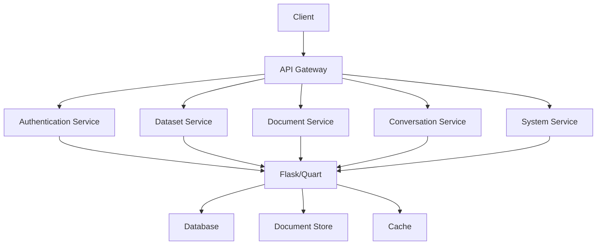
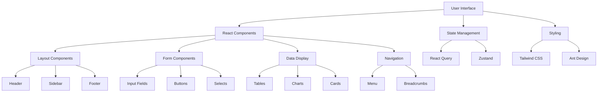
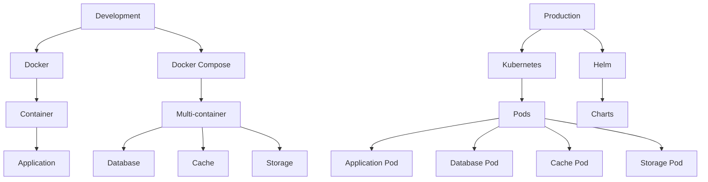
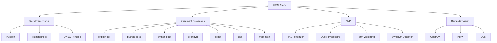
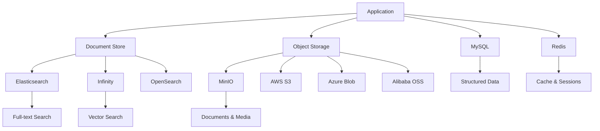
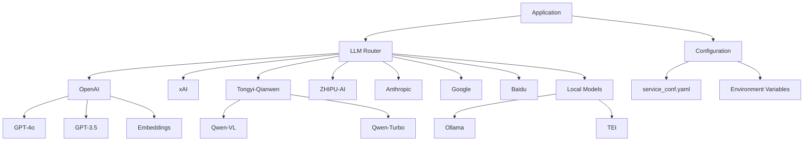
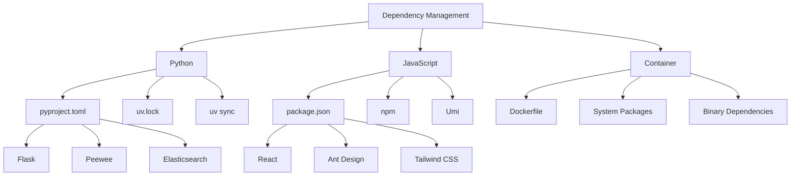

# Technology Stack & Dependencies

<cite>
**Referenced Files in This Document**   
- [pyproject.toml](file://pyproject.toml)
- [package.json](file://web/package.json)
- [Dockerfile](file://Dockerfile)
- [docker-compose.yml](file://docker/docker-compose.yml)
- [values.yaml](file://helm/values.yaml)
- [llm_factories.json](file://conf/llm_factories.json)
- [ragflow_server.py](file://api/ragflow_server.py)
- [app.tsx](file://web/src/app.tsx)
- [settings.py](file://common/settings.py)
- [tailwind.config.js](file://web/tailwind.config.js)
- [api.py](file://rag/llm/chat_model.py)
</cite>

## Table of Contents
1. [Introduction](#introduction)
2. [Programming Languages](#programming-languages)
3. [Backend Frameworks](#backend-frameworks)
4. [Frontend Frameworks](#frontend-frameworks)
5. [Infrastructure Components](#infrastructure-components)
6. [AI/ML Stack](#aiml-stack)
7. [Database Ecosystem](#database-ecosystem)
8. [LLM Integration](#llm-integration)
9. [Dependency Management](#dependency-management)
10. [Practical Integration Examples](#practical-integration-examples)
11. [Conclusion](#conclusion)

## Introduction
RAGFlow is an open-source Retrieval-Augmented Generation (RAG) engine that combines deep document understanding with Agent capabilities to create a superior context layer for Large Language Models (LLMs). The system is designed to transform complex data into high-fidelity, production-ready AI systems with exceptional efficiency and precision. This document provides a comprehensive overview of RAGFlow's technical foundation, detailing its programming languages, frameworks, infrastructure components, AI/ML stack, database ecosystem, and integration with various LLM providers.

**Section sources**
- [README.md](file://README.md)

## Programming Languages
RAGFlow employs a polyglot architecture with Python as the primary language for backend development and TypeScript/JavaScript for frontend implementation. This strategic choice leverages Python's extensive ecosystem for AI/ML applications while utilizing TypeScript's type safety and modern features for building robust user interfaces.

Python 3.10-3.12 is used for the backend services, providing a stable foundation for the AI/ML components and API services. The choice of Python aligns with the extensive scientific computing and machine learning libraries available in the ecosystem, making it ideal for implementing complex document processing and natural language understanding capabilities.

For the frontend, TypeScript is used with React, providing type safety and enhanced developer experience. The use of TypeScript helps catch errors at compile time, improving code quality and maintainability. JavaScript is also used in certain components, particularly for integration with third-party libraries and browser-specific functionality.

The system also incorporates other languages for specific purposes:
- Rust is used for performance-critical components, as evidenced by the Rust toolchain installation in the Dockerfile
- SQL for database interactions and migrations
- YAML for configuration files and Helm charts
- HTML/CSS for web interface markup and styling

This multi-language approach allows RAGFlow to leverage the strengths of each language for specific use cases while maintaining a cohesive architecture through well-defined interfaces and APIs.

**Section sources**
- [pyproject.toml](file://pyproject.toml)
- [package.json](file://web/package.json)
- [Dockerfile](file://Dockerfile)

## Backend Frameworks
RAGFlow's backend is built on Flask, a lightweight and flexible Python web framework that provides the foundation for the API services. Flask is chosen for its simplicity, extensibility, and excellent support for building RESTful APIs, which are essential for RAGFlow's microservices architecture.

The system uses Quart, an async-compatible version of Flask, to handle API requests, enabling better performance and scalability for I/O-bound operations. This is particularly important for handling LLM requests, which can be latency-sensitive. The integration of Quart with Flask extensions like Flask-CORS and Flask-Session ensures seamless cross-origin resource sharing and session management.

Key backend components include:

- **Flask/Quart**: Core web framework for handling HTTP requests and responses
- **Flask-CORS**: Enables cross-origin resource sharing for API endpoints
- **Flask-Login**: Handles user authentication and session management
- **Flask-Session**: Manages server-side sessions
- **Flask-Mail**: Provides email functionality for notifications and user communication
- **Flasgger**: Generates Swagger documentation for API endpoints

The backend architecture follows a modular design with separate applications for different functionalities:
- Authentication services
- Dataset management
- Document processing
- Conversation management
- System administration

This modular approach allows for independent development and deployment of components while maintaining a cohesive API surface. The use of Quart's async capabilities enables efficient handling of concurrent requests, particularly important for LLM interactions which can be time-consuming.

**Diagram sources**
- [api/apps/__init__.py](file://api/apps/__init__.py)
- [api/ragflow_server.py](file://api/ragflow_server.py)

## Frontend Frameworks
The RAGFlow frontend is built using React with the Umi framework, providing a modern, component-based architecture for the user interface. Umi serves as a pluggable enterprise-level frontend application framework that enhances React with additional features and conventions.

Key frontend technologies include:

- **React**: Component-based UI library for building interactive user interfaces
- **Umi**: Framework that extends React with routing, state management, and build optimization
- **Ant Design**: UI component library that provides a comprehensive set of accessible and customizable components
- **Tailwind CSS**: Utility-first CSS framework for styling the interface
- **TypeScript**: Typed superset of JavaScript for improved code quality and developer experience

The frontend architecture leverages several advanced libraries and tools:

- **@ant-design/pro-components**: Enterprise-level UI components for complex data displays and interactions
- **@antv/g2 and @antv/g6**: Data visualization libraries for charts and graphs
- **@monaco-editor/react**: Code editor component for JSON and other structured data editing
- **@radix-ui/react-* components**: Accessible UI primitives for building custom components
- **@tanstack/react-query**: Data fetching and state management library
- **@xyflow/react**: Flow diagram library for visualizing agent workflows

The UI is organized into a modular structure with components categorized by functionality:
- API services
- Canvas and workflow visualization
- Document preview and management
- Form inputs and controls
- Layout and navigation
- Theme and styling utilities

The system implements a dark/light theme toggle using Next Themes, providing users with flexibility in their visual preferences. The use of CSS variables and Tailwind's configuration allows for easy customization of the color scheme and visual design.

**Diagram sources**
- [web/package.json](file://web/package.json)
- [web/src/app.tsx](file://web/src/app.tsx)
- [web/tailwind.config.js](file://web/tailwind.config.js)

## Infrastructure Components
RAGFlow utilizes a comprehensive infrastructure stack based on containerization and orchestration technologies to ensure portability, scalability, and ease of deployment. The system is designed to run in various environments, from local development to production clusters.

### Docker
Docker is the primary containerization technology used in RAGFlow, providing isolated environments for each component of the system. The Dockerfile defines a multi-stage build process that optimizes the final image size while ensuring all dependencies are properly installed.

Key aspects of the Docker implementation:
- Multi-stage builds to separate build and runtime environments
- Ubuntu 22.04 base image for stability and compatibility
- Installation of system dependencies including jemalloc for memory optimization
- Node.js 20.x for frontend build tools
- Rust toolchain for compiling performance-critical components
- Microsoft ODBC drivers for database connectivity
- Chrome and ChromeDriver for headless browser automation

The Docker image includes both the backend Python application and the compiled frontend assets, creating a self-contained deployment unit.

### Docker Compose
Docker Compose is used to define and orchestrate multi-container applications, making it easy to run RAGFlow with all its dependencies. The docker-compose.yml file defines services for:
- RAGFlow application (CPU and GPU variants)
- MySQL database
- Redis cache
- MinIO object storage
- Elasticsearch/Infinity document store
- NGINX reverse proxy

The compose configuration supports different deployment profiles (CPU/GPU) and includes health checks to ensure services are properly initialized before starting dependent services.

### Helm
For Kubernetes deployments, RAGFlow provides Helm charts that enable deployment to container orchestration platforms. The Helm chart in the helm/ directory defines templates for:
- RAGFlow application deployment and service
- Database components (MySQL, Redis, MinIO)
- Document storage (Elasticsearch, Infinity, or OpenSearch)
- Ingress configuration for external access

The Helm values.yaml file allows customization of resource allocation, storage capacity, and service configurations, making it suitable for both development and production environments.

**Diagram sources**
- [Dockerfile](file://Dockerfile)
- [docker/docker-compose.yml](file://docker/docker-compose.yml)
- [helm/values.yaml](file://helm/values.yaml)

## AI/ML Stack
RAGFlow's AI/ML stack is comprehensive and designed to handle various aspects of document processing, natural language understanding, and multimodal interactions. The system integrates multiple libraries and frameworks to provide robust AI capabilities.

### Core AI Libraries
The foundation of RAGFlow's AI capabilities is built on several key Python libraries:

- **PyTorch**: Primary deep learning framework used for neural network models
- **Transformers**: Hugging Face library for pre-trained language models
- **ONNX Runtime**: For running models in the ONNX format, with GPU acceleration support
- **Sentence-Transformers**: For sentence and text embeddings
- **Umap-learn**: For dimensionality reduction and visualization

### Document Processing
RAGFlow includes extensive document processing capabilities through various parsing libraries:

- **pdfplumber**: For extracting text and tables from PDF documents
- **python-docx**: For processing Microsoft Word documents
- **python-pptx**: For processing PowerPoint presentations
- **openpyxl**: For reading and writing Excel files
- **pypdf**: For PDF manipulation and text extraction
- **tika**: Apache Tika integration for document type detection and content extraction
- **mammoth**: For converting Word documents to HTML
- **Crawl4AI**: For web content extraction and processing

The system also includes specialized document understanding capabilities through the deepdoc module, which uses advanced techniques for layout recognition, table structure recognition, and OCR.

### Natural Language Processing
The NLP capabilities are implemented in the rag/nlp module and include:

- **RAG tokenizer**: Custom tokenizer for processing text for retrieval
- **Query processing**: For analyzing and transforming user queries
- **Term weighting**: For calculating the importance of terms in documents
- **Synonym detection**: For expanding queries with related terms
- **Named entity recognition**: For identifying entities in text

### Computer Vision
For multimodal processing, RAGFlow integrates several computer vision libraries:

- **OpenCV**: For image processing and computer vision tasks
- **Pillow**: Python Imaging Library for image manipulation
- **OCR libraries**: For text extraction from images and scanned documents

The vision module includes components for layout recognition, table structure recognition, and OCR, enabling the system to understand the visual structure of documents.

**Diagram sources**
- [pyproject.toml](file://pyproject.toml)
- [deepdoc/parser](file://deepdoc/parser)
- [rag/nlp](file://rag/nlp)

## Database Ecosystem
RAGFlow employs a multi-faceted database ecosystem designed to handle different types of data and access patterns efficiently. The system integrates several database technologies to provide optimal performance for various use cases.

### Relational Database
MySQL serves as the primary relational database for storing structured data, user information, and application metadata. The system uses Peewee as the ORM (Object-Relational Mapper) to interact with MySQL, providing a simple and expressive interface for database operations.

Key data stored in MySQL:
- User accounts and authentication information
- Tenant and organization data
- API tokens and permissions
- Document metadata and indexing information
- Conversation history and chat sessions
- System configuration and settings

### Cache Layer
Redis (implemented as Valkey) is used as the caching layer to improve performance and reduce database load. The cache stores frequently accessed data and session information, enabling faster response times for common operations.

Cache use cases:
- Session storage for user authentication
- Temporary storage for processing pipelines
- Caching of frequently accessed document chunks
- Rate limiting and request throttling
- Distributed locking for concurrent operations

### Document Storage
RAGFlow supports multiple document storage engines for full-text search and vector similarity search:

- **Elasticsearch**: Default document store for full-text search and vector storage
- **Infinity**: Alternative document store developed by InfiniFlow, optimized for RAG workloads
- **OpenSearch**: Open-source alternative to Elasticsearch

The choice of document engine can be configured via environment variables, allowing users to select the most appropriate option for their deployment scenario. Infinity is specifically designed for RAG applications and offers optimized performance for vector similarity search.

### Object Storage
For storing large binary files such as documents, images, and other media, RAGFlow uses MinIO as the default object storage solution. MinIO provides an S3-compatible API, making it easy to integrate with various storage backends.

Supported storage backends:
- **MinIO**: Default object storage with S3-compatible API
- **AWS S3**: Amazon Web Services Simple Storage Service
- **Azure Blob Storage**: Microsoft Azure cloud storage
- **Alibaba Cloud OSS**: Object Storage Service
- **OpenDAL**: Unified data access layer for multiple storage systems

The storage abstraction layer allows RAGFlow to work with different object storage providers through a consistent interface, making it portable across different cloud environments.

**Diagram sources**
- [pyproject.toml](file://pyproject.toml)
- [common/settings.py](file://common/settings.py)
- [rag/utils](file://rag/utils)

## LLM Integration
RAGFlow provides extensive integration with various Large Language Model (LLM) providers, enabling users to leverage different models for different tasks. The system is designed to be provider-agnostic, allowing easy configuration and switching between different LLM services.

### Supported LLM Providers
The llm_factories.json configuration file defines the supported LLM providers and their capabilities:

- **OpenAI**: Comprehensive support for GPT models including:
  - GPT-5 series (gpt-5.1, gpt-5, gpt-5-mini)
  - GPT-4 series (gpt-4o, gpt-4-turbo, gpt-4)
  - GPT-3.5 series (gpt-3.5-turbo)
  - Specialized models (whisper-1 for speech-to-text, text-embedding models)

- **xAI**: Support for Grok models including:
  - Grok-4, Grok-3, and variants
  - Grok-2-vision for multimodal processing

- **Tongyi-Qianwen**: Alibaba's Qwen models including:
  - Qwen series (qwen-plus, qwen-max, qwen-turbo)
  - Qwen-VL for vision-language tasks
  - Qwen-Coder for code generation

- **ZHIPU-AI**: Support for GLM models:
  - GLM-4 series (glm-4.5, glm-4-plus)
  - GLM-4v for vision capabilities

- **TokenPony**: Support for various open-source models:
  - DeepSeek series
  - Kimi-K2
  - Hunyuan
  - Qwen variants

- **Anthropic**: Integration with Claude models
- **Google**: Support for Gemini models
- **Baidu**: Integration with ERNIE Bot
- **VolcEngine**: Support for Doubao and other models
- **Ollama**: Local model serving
- **Litellm**: Unified interface for multiple providers

### Model Capabilities
Each LLM provider supports different model types and capabilities:

- **Chat models**: For conversational AI and text generation
- **Embedding models**: For creating vector representations of text
- **Rerank models**: For improving retrieval results
- **Speech-to-text models**: For audio transcription
- **Text-to-speech models**: For voice synthesis
- **Image-to-text models**: For multimodal understanding
- **Moderation models**: For content safety

The system allows configuration of default models for each capability, enabling users to optimize their setup based on cost, performance, and feature requirements.

### Configuration and Management
LLM configuration is managed through the service_conf.yaml template and environment variables. Users can specify:
- Default LLM factory and models
- API keys for authentication
- Base URLs for self-hosted instances
- Allowed LLM factories for security
- Model-specific parameters and settings

The system also supports local model serving through TEI (Text Embedding Inference) and Ollama, enabling offline operation and reduced latency for certain use cases.

**Diagram sources**
- [conf/llm_factories.json](file://conf/llm_factories.json)
- [common/settings.py](file://common/settings.py)

## Dependency Management
RAGFlow employs a comprehensive dependency management strategy to ensure reproducible builds, security, and maintainability across its complex technology stack.

### Python Dependencies
The project uses uv (a fast Python package installer and resolver) for dependency management, as evidenced by the use of pyproject.toml and uv.lock files. This modern approach offers several advantages over traditional pip-based workflows:

- **pyproject.toml**: Defines project metadata and dependencies in a standardized format
- **uv.lock**: Lock file that pins exact dependency versions for reproducible builds
- **uv sync**: Fast dependency installation with parallel downloads and caching

The pyproject.toml file specifies dependencies with version constraints to balance stability and flexibility:
- Exact versions for critical dependencies
- Version ranges for less critical packages
- Platform-specific dependencies (e.g., different ONNX Runtime packages for CPU/GPU)

Key Python dependencies include:
- **Flask/Quart**: Web framework
- **Peewee**: ORM for database access
- **Elasticsearch**: Client library for document storage
- **MinIO**: Client for object storage
- **Hugging Face libraries**: For model loading and inference
- **Various AI/ML libraries**: For document processing and NLP

### Frontend Dependencies
The frontend uses npm as the package manager, with dependencies defined in package.json. The project leverages modern JavaScript tooling:

- **npm**: Package manager for JavaScript dependencies
- **Umi**: Framework that manages build tools and dependencies
- **TypeScript**: For type safety and enhanced development experience

Frontend dependencies are organized into:
- **Dependencies**: Production dependencies
- **DevDependencies**: Development tools and libraries
- **Overrides**: Specific version constraints for nested dependencies

### Container Dependencies
The Docker-based deployment approach encapsulates dependencies at the system level:
- System packages installed via apt
- Python packages installed via pip/uv
- Node.js packages installed via npm
- Binary dependencies (Chrome, ChromeDriver, etc.)

This approach ensures consistency across development, testing, and production environments.

### Version Compatibility
RAGFlow maintains compatibility across its components through:
- **Python version**: 3.10-3.12 (specified in pyproject.toml)
- **Node.js version**: 18+ (specified in package.json engines)
- **Database versions**: Specific versions in Helm chart (MySQL 8.0.39, Redis 8, etc.)
- **Library compatibility**: Careful version pinning to avoid breaking changes

The system also includes mechanisms for handling dependency conflicts and ensuring security:
- Regular dependency updates
- Vulnerability scanning (implied by security practices)
- Isolation of components to minimize dependency conflicts

**Diagram sources**
- [pyproject.toml](file://pyproject.toml)
- [web/package.json](file://web/package.json)
- [Dockerfile](file://Dockerfile)

## Practical Integration Examples
RAGFlow's technology stack enables various practical integration scenarios that demonstrate how the components work together to deliver advanced RAG capabilities.

### Document Processing Pipeline
When a user uploads a document, the following sequence of technologies work together:

1. **Frontend**: React component handles file upload via drag-and-drop or file picker
2. **API**: Flask/Quart endpoint receives the file and metadata
3. **Object Storage**: File is stored in MinIO/S3 for persistent storage
4. **Document Parsing**: Appropriate parser (pdfplumber, python-docx, etc.) extracts text and structure
5. **Deep Document Understanding**: deepdoc module analyzes layout, tables, and structure
6. **Text Chunking**: Document is split into chunks using configured strategies
7. **Embedding Generation**: Text chunks are converted to vectors using configured embedding model
8. **Vector Storage**: Vectors are stored in Elasticsearch/Infinity for similarity search
9. **Metadata Indexing**: Document metadata and chunk information are stored in MySQL

This pipeline leverages the full stack, from frontend UI components to AI/ML processing and database storage.

### Query Processing Workflow
When a user submits a query, the following components collaborate:

1. **Frontend**: React application sends query via API
2. **API Gateway**: Flask/Quart routes request to appropriate handler
3. **Query Processing**: NLP components analyze and transform the query
4. **Retrieval**: System searches document store using configured recall methods
5. **Reranking**: Retrieved results are reranked using configured rerank model
6. **LLM Processing**: Selected context is sent to LLM for generation
7. **Response Generation**: LLM produces answer with citations
8. **Frontend Display**: React components render answer with source references

### Agent Workflow Execution
For agent-based workflows, the system orchestrates multiple components:

1. **Workflow Definition**: JSON-based DSL defines agent steps and logic
2. **Execution Engine**: Agent components execute steps in sequence
3. **Tool Integration**: Various tools (web search, code execution, etc.) are invoked
4. **State Management**: Redis stores intermediate state and results
5. **LLM Orchestration**: Multiple LLM calls coordinate agent behavior
6. **Result Aggregation**: Final output is compiled and returned

### Multimodal Processing
For documents with images or scanned content:

1. **Image Extraction**: OpenCV/Pillow extract images from document
2. **OCR Processing**: Tesseract or other OCR engines extract text from images
3. **Layout Analysis**: deepdoc vision components understand document structure
4. **Image-to-Text**: Multimodal LLMs describe image content
5. **Integrated Processing**: Text from OCR and image descriptions are combined with document text

These examples demonstrate how RAGFlow's technology stack components work together seamlessly to deliver sophisticated RAG capabilities, from simple document Q&A to complex agent workflows with multimodal understanding.

**Section sources**
- [agent/component](file://agent/component)
- [rag/flow](file://rag/flow)
- [deepdoc/vision](file://deepdoc/vision)

## Conclusion
RAGFlow's technology stack represents a comprehensive and well-integrated solution for building advanced RAG applications. The system combines modern web technologies, powerful AI/ML frameworks, and robust infrastructure components to deliver a production-ready platform for document understanding and question answering.

The architecture demonstrates careful consideration of various technical requirements:
- **Scalability**: Through containerization and microservices design
- **Flexibility**: Via support for multiple LLM providers and storage backends
- **Performance**: With optimized document processing and caching
- **Security**: Through proper authentication and dependency management
- **Maintainability**: With modular design and comprehensive tooling

The choice of technologies reflects current best practices in software development and AI engineering, leveraging established frameworks while incorporating cutting-edge AI capabilities. The system's design allows for both local deployment via Docker and scalable production deployment via Kubernetes, making it suitable for a wide range of use cases from individual developers to enterprise organizations.

RAGFlow's comprehensive technology stack enables developers to transform complex data into high-fidelity, production-ready AI systems with exceptional efficiency and precision, fulfilling its mission as a leading open-source RAG engine.