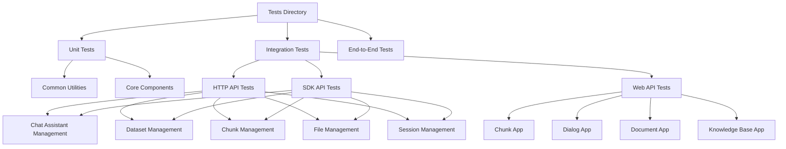
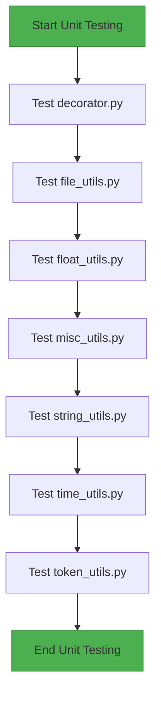
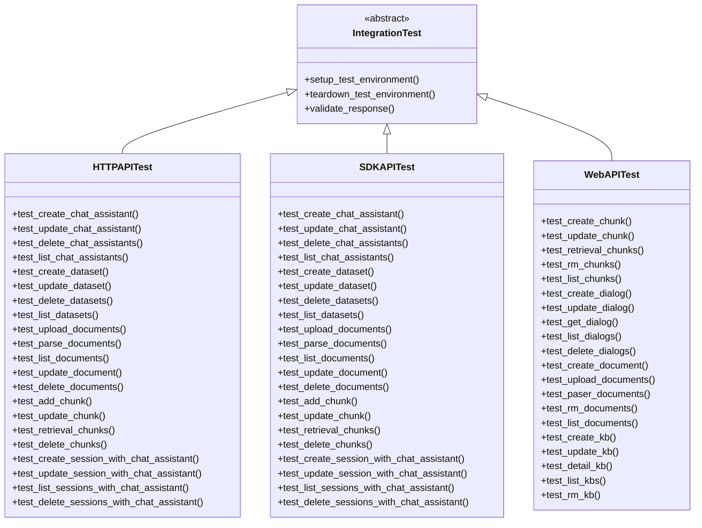
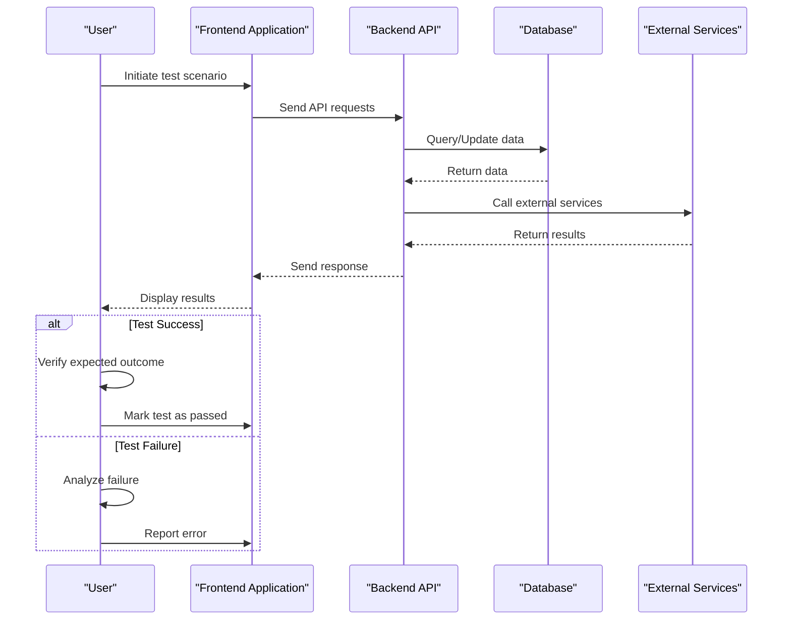
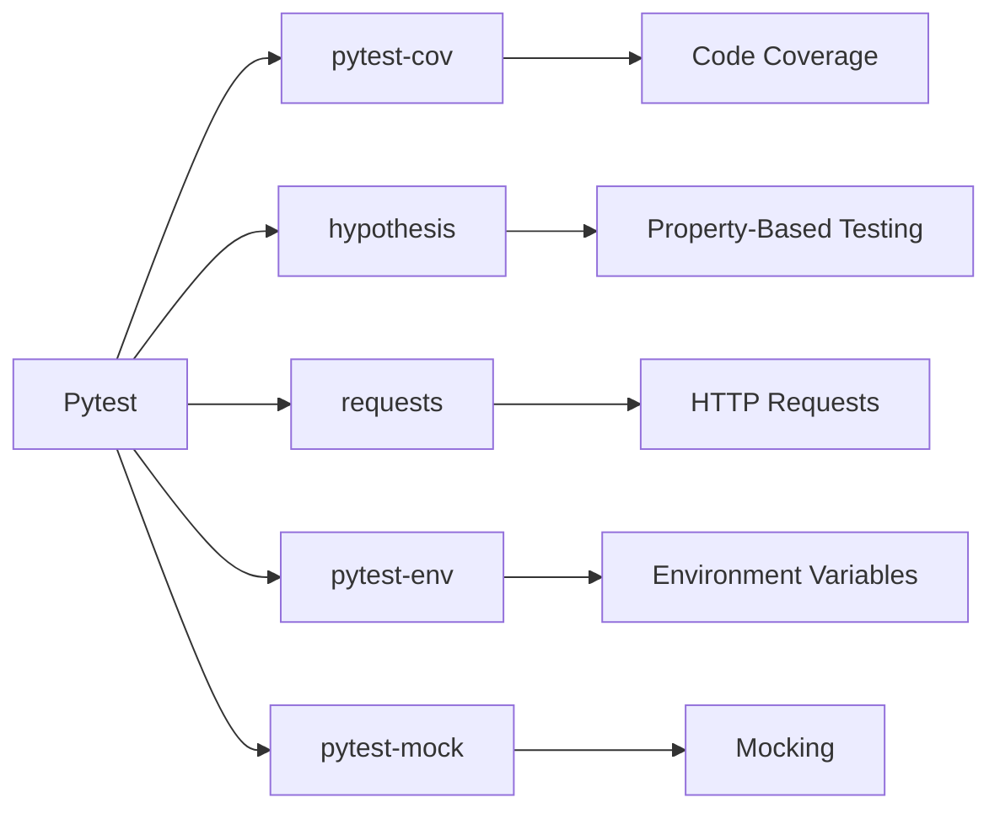
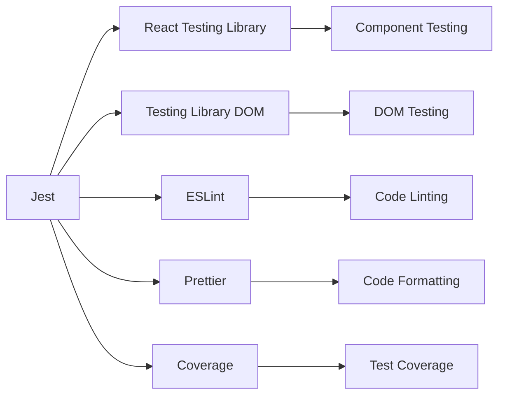
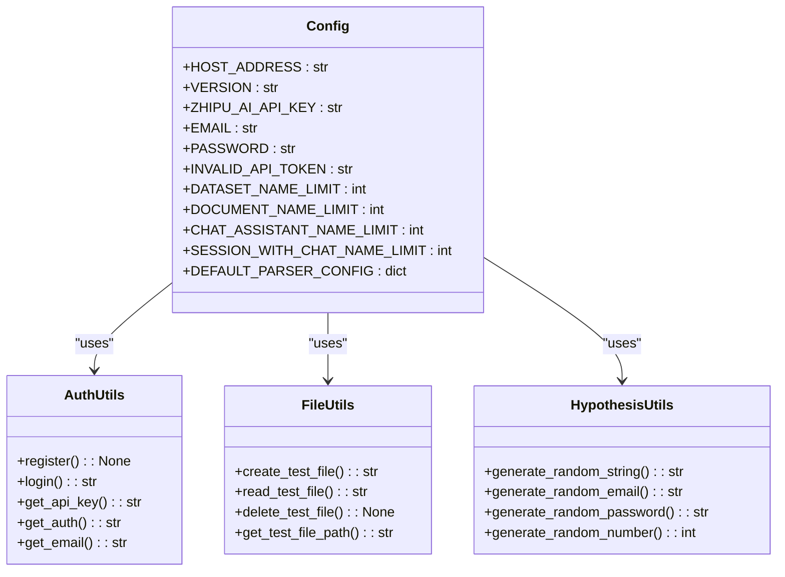
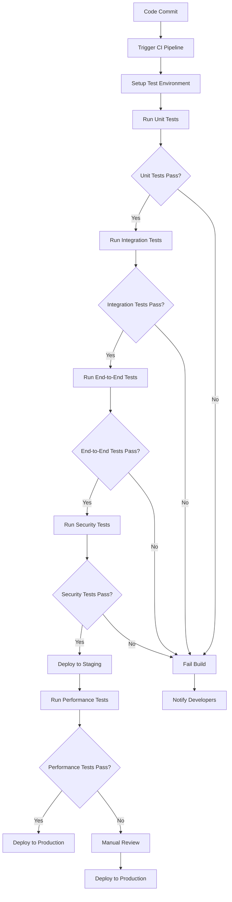
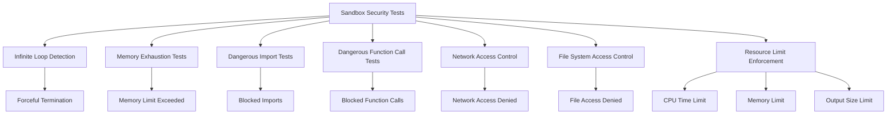

# Testing Strategy

<cite>
**Referenced Files in This Document**   
- [test/unit_test/common/test_decorator.py](file://test/unit_test/common/test_decorator.py)
- [test/unit_test/common/test_file_utils.py](file://test/unit_test/common/test_file_utils.py)
- [test/unit_test/common/test_float_utils.py](file://test/unit_test/common/test_float_utils.py)
- [test/unit_test/common/test_misc_utils.py](file://test/unit_test/common/test_misc_utils.py)
- [test/unit_test/common/test_string_utils.py](file://test/unit_test/common/test_string_utils.py)
- [test/unit_test/common/test_time_utils.py](file://test/unit_test/common/test_time_utils.py)
- [test/unit_test/common/test_token_utils.py](file://test/unit_test/common/test_token_utils.py)
- [test/testcases/conftest.py](file://test/testcases/conftest.py)
- [test/testcases/configs.py](file://test/testcases/configs.py)
- [test/testcases/libs/auth.py](file://test/testcases/libs/auth.py)
- [test/testcases/utils/file_utils.py](file://test/testcases/utils/file_utils.py)
- [test/testcases/utils/hypothesis_utils.py](file://test/testcases/utils/hypothesis_utils.py)
- [test/testcases/test_http_api/conftest.py](file://test/testcases/test_http_api/conftest.py)
- [test/testcases/test_http_api/test_chat_assistant_management/test_create_chat_assistant.py](file://test/testcases/test_http_api/test_chat_assistant_management/test_create_chat_assistant.py)
- [test/testcases/test_http_api/test_chunk_management_within_dataset/test_add_chunk.py](file://test/testcases/test_chunk_management_within_dataset/test_add_chunk.py)
- [test/testcases/test_http_api/test_dataset_mangement/test_create_dataset.py](file://test/testcases/test_dataset_mangement/test_create_dataset.py)
- [test/testcases/test_http_api/test_file_management_within_dataset/test_upload_documents.py](file://test/testcases/test_file_management_within_dataset/test_upload_documents.py)
- [test/testcases/test_sdk_api/conftest.py](file://test/testcases/test_sdk_api/conftest.py)
- [test/testcases/test_sdk_api/test_chat_assistant_management/test_create_chat_assistant.py](file://test/testcases/test_sdk_api/test_chat_assistant_management/test_create_chat_assistant.py)
- [test/testcases/test_web_api/conftest.py](file://test/testcases/test_web_api/conftest.py)
- [test/testcases/test_web_api/test_chunk_app/test_create_chunk.py](file://test/testcases/test_web_api/test_chunk_app/test_create_chunk.py)
- [sdk/python/test/conftest.py](file://sdk/python/test/conftest.py)
- [sdk/python/test/test_http_api/conftest.py](file://sdk/python/test/test_http_api/conftest.py)
- [sdk/python/test/test_http_api/test_create_chat_assistant.py](file://sdk/python/test/test_http_api/test_create_chat_assistant.py)
- [web/jest.config.ts](file://web/jest.config.ts)
- [web/package.json](file://web/package.json)
- [sandbox/tests/sandbox_security_tests_full.py](file://sandbox/tests/sandbox_security_tests_full.py)
- [pyproject.toml](file://pyproject.toml)
</cite>

## Table of Contents
1. [Introduction](#introduction)
2. [Test Organization and Structure](#test-organization-and-structure)
3. [Unit Testing Strategy](#unit-testing-strategy)
4. [Integration Testing Strategy](#integration-testing-strategy)
5. [End-to-End Testing Strategy](#end-to-end-testing-strategy)
6. [Testing Frameworks and Tools](#testing-frameworks-and-tools)
7. [Test Data Management and Utilities](#test-data-management-and-utilities)
8. [Continuous Integration and Automated Testing](#continuous-integration-and-automated-testing)
9. [Performance and Security Testing](#performance-and-security-testing)
10. [Best Practices for Test Design](#best-practices-for-test-design)
11. [Running Tests](#running-tests)

## Introduction
RAGFlow implements a comprehensive quality assurance strategy with a multi-layered testing approach that includes unit tests, integration tests, and end-to-end tests. The testing infrastructure is designed to ensure the reliability, security, and performance of both backend and frontend components. The test suite covers core functionality including chat assistant management, dataset operations, document processing, and API interactions. This document provides a detailed overview of RAGFlow's testing strategy, frameworks, organization, and best practices.

## Test Organization and Structure
RAGFlow's test suite is organized into distinct directories based on test type and scope. The primary test directory structure follows a clear separation of concerns, with unit tests focused on isolated components and integration/end-to-end tests validating system-level functionality.

The test organization follows a hierarchical structure with different test types serving specific purposes:



**Diagram sources**
- [test/unit_test/common](file://test/unit_test/common)
- [test/testcases/test_http_api](file://test/testcases/test_http_api)
- [test/testcases/test_sdk_api](file://test/testcases/test_sdk_api)
- [test/testcases/test_web_api](file://test/testcases/test_web_api)

**Section sources**
- [test/unit_test](file://test/unit_test)
- [test/testcases](file://test/testcases)

## Unit Testing Strategy
RAGFlow's unit testing strategy focuses on validating individual functions and classes in isolation, particularly for utility functions and common components. The unit tests are located in the `test/unit_test/` directory and primarily target the common utility modules used throughout the application.

The unit test suite includes comprehensive tests for various utility functions:



The unit tests verify the correctness of fundamental operations such as string manipulation, file handling, time calculations, and token processing. These tests are designed to be fast and deterministic, ensuring that core utility functions behave as expected across different scenarios.

**Section sources**
- [test/unit_test/common/test_decorator.py](file://test/unit_test/common/test_decorator.py)
- [test/unit_test/common/test_file_utils.py](file://test/unit_test/common/test_file_utils.py)
- [test/unit_test/common/test_float_utils.py](file://test/unit_test/common/test_float_utils.py)
- [test/unit_test/common/test_misc_utils.py](file://test/unit_test/common/test_misc_utils.py)
- [test/unit_test/common/test_string_utils.py](file://test/unit_test/common/test_string_utils.py)
- [test/unit_test/common/test_time_utils.py](file://test/unit_test/common/test_time_utils.py)
- [test/unit_test/common/test_token_utils.py](file://test/unit_test/common/test_token_utils.py)

## Integration Testing Strategy
RAGFlow's integration testing strategy focuses on validating the interactions between different components and services. The integration tests are organized in the `test/testcases/` directory and are further categorized by the type of API being tested.

The integration test suite includes three main categories:



**Diagram sources**
- [test/testcases/test_http_api](file://test/testcases/test_http_api)
- [test/testcases/test_sdk_api](file://test/testcases/test_sdk_api)
- [test/testcases/test_web_api](file://test/testcases/test_web_api)

**Section sources**
- [test/testcases/test_http_api](file://test/testcases/test_http_api)
- [test/testcases/test_sdk_api](file://test/testcases/test_sdk_api)
- [test/testcases/test_web_api](file://test/testcases/test_web_api)

## End-to-End Testing Strategy
RAGFlow's end-to-end testing strategy validates complete user workflows and system integrations. The end-to-end tests simulate real-world usage scenarios, ensuring that all components work together as expected from the user's perspective.

The end-to-end testing approach follows a comprehensive workflow that covers the entire application lifecycle:



The end-to-end tests validate complex workflows such as creating a chat assistant, uploading documents to a dataset, processing the documents, creating chunks, and conducting conversations with the chat assistant. These tests ensure that the entire system functions correctly as an integrated whole.

**Section sources**
- [test/testcases/test_http_api](file://test/testcases/test_http_api)
- [test/testcases/test_sdk_api](file://test/testcases/test_sdk_api)
- [test/testcases/test_web_api](file://test/testcases/test_web_api)

## Testing Frameworks and Tools
RAGFlow utilizes a combination of testing frameworks and tools for both backend and frontend components. The testing infrastructure is designed to provide comprehensive coverage across different layers of the application.

### Backend Testing Frameworks
For backend testing, RAGFlow primarily uses pytest as the testing framework, which provides a rich set of features for writing and organizing tests. The pytest framework is configured with custom markers for test prioritization and is integrated with various plugins for enhanced functionality.



**Diagram sources**
- [pyproject.toml](file://pyproject.toml)
- [test/testcases/conftest.py](file://test/testcases/conftest.py)
- [sdk/python/test/conftest.py](file://sdk/python/test/conftest.py)

### Frontend Testing Frameworks
For frontend testing, RAGFlow uses Jest as the primary testing framework, complemented by React Testing Library for component testing. The frontend testing setup is configured to support modern JavaScript features and provides comprehensive test coverage.



**Diagram sources**
- [web/jest.config.ts](file://web/jest.config.ts)
- [web/package.json](file://web/package.json)

**Section sources**
- [pyproject.toml](file://pyproject.toml)
- [test/testcases/conftest.py](file://test/testcases/conftest.py)
- [sdk/python/test/conftest.py](file://sdk/python/test/conftest.py)
- [web/jest.config.ts](file://web/jest.config.ts)
- [web/package.json](file://web/package.json)

## Test Data Management and Utilities
RAGFlow implements a comprehensive test data management strategy with reusable utilities and configuration files. The test suite includes various helper modules and configuration files to streamline test development and maintenance.

### Test Configuration and Utilities
The test infrastructure includes several utility modules and configuration files that provide shared functionality across different test suites:



**Diagram sources**
- [test/testcases/configs.py](file://test/testcases/configs.py)
- [test/testcases/libs/auth.py](file://test/testcases/libs/auth.py)
- [test/testcases/utils/file_utils.py](file://test/testcases/utils/file_utils.py)
- [test/testcases/utils/hypothesis_utils.py](file://test/testcases/utils/hypothesis_utils.py)

**Section sources**
- [test/testcases/configs.py](file://test/testcases/configs.py)
- [test/testcases/libs/auth.py](file://test/testcases/libs/auth.py)
- [test/testcases/utils/file_utils.py](file://test/testcases/utils/file_utils.py)
- [test/testcases/utils/hypothesis_utils.py](file://test/testcases/utils/hypothesis_utils.py)

## Continuous Integration and Automated Testing
RAGFlow's continuous integration (CI) pipeline is designed to automate the testing process and ensure code quality. The CI infrastructure runs the test suite on every code change, providing rapid feedback to developers.

The CI/CD pipeline follows a comprehensive workflow that includes multiple stages of testing:



**Section sources**
- [pyproject.toml](file://pyproject.toml)
- [test/testcases/conftest.py](file://test/testcases/conftest.py)
- [sdk/python/test/conftest.py](file://sdk/python/test/conftest.py)

## Performance and Security Testing
RAGFlow implements specialized testing approaches for performance and security, ensuring that the application meets high standards for both reliability and protection against threats.

### Security Testing
The security testing strategy includes comprehensive tests for the sandbox environment, which is critical for executing untrusted code safely. The security tests validate various aspects of the sandbox, including resource limits, disallowed system calls, and unauthorized access attempts.



**Diagram sources**
- [sandbox/tests/sandbox_security_tests_full.py](file://sandbox/tests/sandbox_security_tests_full.py)

**Section sources**
- [sandbox/tests/sandbox_security_tests_full.py](file://sandbox/tests/sandbox_security_tests_full.py)

### Performance Testing
While specific performance test files are not visible in the current context, the testing infrastructure includes configuration for performance considerations. The test suite is designed to identify performance bottlenecks and ensure that the application can handle expected workloads efficiently.

## Best Practices for Test Design
RAGFlow follows several best practices for test design to ensure high-quality, maintainable, and effective tests.

### Test Organization and Structure
The test suite follows a clear organizational structure with tests grouped by functionality and test type. This makes it easy to locate and understand tests for specific features.

### Test Isolation and Independence
Each test is designed to be independent and isolated, ensuring that test failures do not cascade and that tests can be run in any order. This is achieved through proper setup and teardown procedures.

### Comprehensive Test Coverage
The test suite aims for comprehensive coverage of both positive and negative test cases, including edge cases and error conditions. This ensures that the application behaves correctly under various scenarios.

### Reusable Test Utilities
The test infrastructure includes reusable utilities and helper functions that reduce code duplication and make tests easier to write and maintain.

### Clear Test Naming and Documentation
Tests are named clearly to indicate their purpose, and documentation is provided where necessary to explain complex test scenarios.

## Running Tests
To run the tests in RAGFlow, developers can use the following commands:

For backend tests:
```bash
# Run all tests
pytest test/

# Run unit tests
pytest test/unit_test/

# Run integration tests
pytest test/testcases/

# Run specific test file
pytest test/testcases/test_http_api/test_create_chat_assistant.py

# Run tests with coverage
pytest test/ --cov=api --cov-report=html
```

For frontend tests:
```bash
# Run all frontend tests
npm test

# Run tests with coverage
npm test -- --coverage

# Run tests in watch mode
npm test -- --watch
```

The test environment requires specific configuration, including setting environment variables such as HOST_ADDRESS and ZHIPU_AI_API_KEY, which are used in the test configuration files.

**Section sources**
- [pyproject.toml](file://pyproject.toml)
- [test/testcases/conftest.py](file://test/testcases/conftest.py)
- [sdk/python/test/conftest.py](file://sdk/python/test/conftest.py)
- [web/package.json](file://web/package.json)