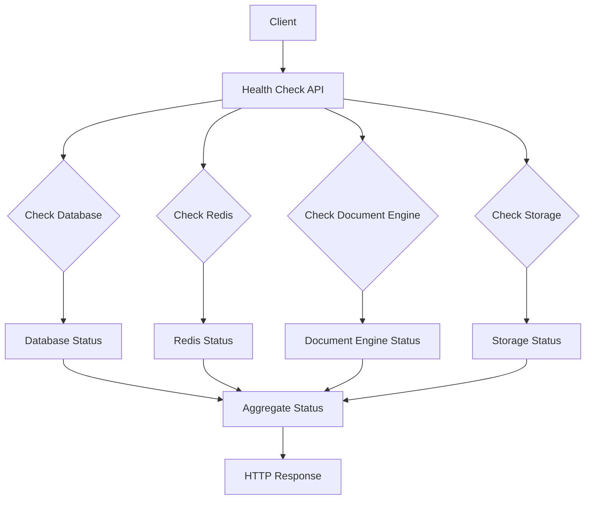
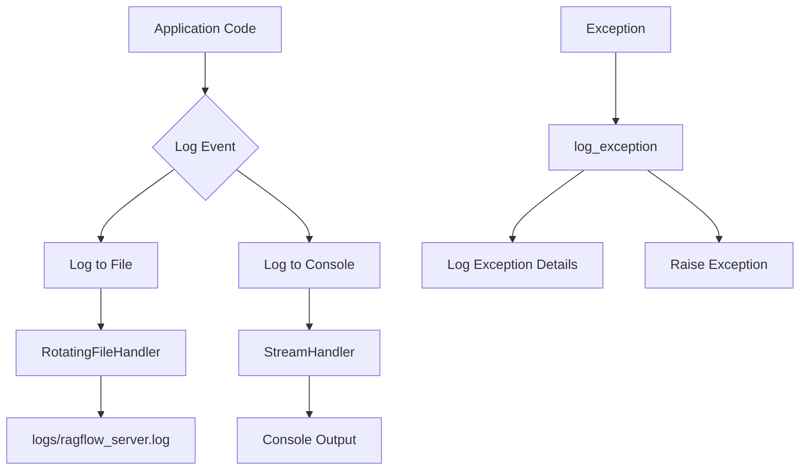

# Troubleshooting

<cite>
**Referenced Files in This Document**   
- [health_utils.py](file://api/utils/health_utils.py)
- [system_app.py](file://api/apps/system_app.py)
- [log_utils.py](file://common/log_utils.py)
- [service_conf.yaml](file://conf/service_conf.yaml)
- [docker-compose.yml](file://docker/docker-compose.yml)
- [ragflow_server.py](file://api/ragflow_server.py)
- [task_executor.py](file://rag/svr/task_executor.py)
- [base.py](file://agent/component/base.py)
- [chat_model.py](file://rag/llm/chat_model.py)
- [admin_server.py](file://admin/server/admin_server.py)
- [monitoring.tsx](file://web/src/pages/admin/monitoring.tsx)
- [pipeline-log-sheet/dataflow-timeline.tsx](file://web/src/pages/agent/pipeline-log-sheet/dataflow-timeline.tsx)
- [workflow-timeline.tsx](file://web/src/pages/agent/log-sheet/workflow-timeline.tsx)
- [handlers.py](file://sandbox/executor_manager/api/handlers.py)
- [container.py](file://sandbox/executor_manager/core/container.py)
</cite>

## Table of Contents
1. [Introduction](#introduction)
2. [Common Installation and Deployment Issues](#common-installation-and-deployment-issues)
3. [Configuration Troubleshooting](#configuration-troubleshooting)
4. [Health Check and Monitoring](#health-check-and-monitoring)
5. [Logging Infrastructure](#logging-infrastructure)
6. [Common Operational Issues](#common-operational-issues)
7. [Performance Issues](#performance-issues)
8. [Connectivity Problems](#connectivity-problems)
9. [Data Processing Errors](#data-processing-errors)
10. [Agent and Workflow Troubleshooting](#agent-and-workflow-troubleshooting)
11. [Sandbox and Code Execution Issues](#sandbox-and-code-execution-issues)
12. [Support Resources and Bug Reporting](#support-resources-and-bug-reporting)

## Introduction

This troubleshooting guide provides comprehensive information for users and administrators of RAGFlow, a retrieval-augmented generation system. The document covers common issues encountered during installation, configuration, and operation of the system, along with diagnostic tools and techniques for identifying and resolving problems.

RAGFlow is a complex system with multiple components including document processing, retrieval, generation, and agent-based workflows. This guide will help you understand the system's health check capabilities, logging infrastructure, and monitoring tools to effectively diagnose and resolve issues. We'll cover practical troubleshooting scenarios such as deployment failures, performance bottlenecks, connectivity problems, and data processing errors, providing step-by-step guidance for resolving the most frequent issues.

The guide is structured to help both new users getting started with RAGFlow and experienced administrators maintaining production deployments. By understanding the system's architecture and diagnostic capabilities, you can quickly identify root causes of problems and implement effective solutions.

**Section sources**
- [health_utils.py](file://api/utils/health_utils.py#L1-L223)
- [system_app.py](file://api/apps/system_app.py#L1-L336)

## Common Installation and Deployment Issues

When installing and deploying RAGFlow, several common issues may arise. The most frequent deployment problems are related to Docker configuration, container conflicts, and volume management.

One common issue occurs when attempting to perform backup or restore operations while containers are still running. The migration script detects this condition and provides a clear error message:

```bash
🛑 SOLUTION: Stop the containers before performing backup/restore operations:
   docker-compose -f docker/<your-docker-compose-file>.yml down

💡 After backup/restore, you can restart with:
   docker-compose -f docker/<your-docker-compose-file>.yml up -d
```

This indicates that all containers must be stopped before backup or restore operations to prevent data corruption or volume conflicts.

Another frequent deployment issue is related to HTTPS configuration. When setting up HTTPS with Let's Encrypt certificates, ensure that:
1. Your domain's DNS A record points to your server's IP address
2. Ports 80 and 443 are open on your server
3. No other services are running on ports 80/443 before obtaining certificates
4. The certificate volumes are correctly mapped in docker-compose.yml
5. The nginx configuration is updated with your actual domain name

For Docker environment variables, ensure that the [.env](file://docker/.env) file is properly configured and that its values match those expected in the [service_conf.yaml.template](file://docker/service_conf.yaml.template) file. Mismatches between environment variables and service configuration can lead to connection failures between components.

When using Docker Compose, note that certain configuration files like **docker-compose-CN-oc9.yml** and **docker-compose-macos.yml** are not actively maintained and should be used at your own risk.

**Section sources**
- [migration.sh](file://docker/migration.sh#L98-L125)
- [docker/README.md](file://docker/README.md#L1-L269)
- [service_conf.yaml.template](file://docker/service_conf.yaml.template#L1-L154)

## Configuration Troubleshooting

Proper configuration is critical for RAGFlow's operation. The system uses a hierarchical configuration system with environment variables, template files, and generated configuration files.

The primary configuration file is [service_conf.yaml](file://conf/service_conf.yaml), which is automatically generated from [service_conf.yaml.template](file://docker/service_conf.yaml.template) during deployment. This file contains settings for all core services:

- **ragflow**: API server host and port
- **mysql**: Database connection parameters
- **minio**: Object storage credentials and host
- **es**: Elasticsearch connection details
- **redis**: Redis server configuration
- **task_executor**: Message queue type
- **user_default_llm**: Default LLM configuration

Common configuration issues include:

1. **Environment variable mismatches**: Ensure that environment variables in the [.env](file://docker/.env) file match the placeholders in service_conf.yaml.template. For example, MYSQL_PASSWORD in .env should correspond to ${MYSQL_PASSWORD} in the template.

2. **Service connectivity issues**: Verify that hostnames and ports in service_conf.yaml match the actual services. For Docker deployments, service names in docker-compose.yml should match the host values in the configuration.

3. **LLM configuration problems**: When configuring default LLMs, ensure that factory names match supported providers (OpenAI, DeepSeek, Moonshot, etc.) and that API keys are properly set.

4. **Storage configuration errors**: If using alternative storage backends (S3, OSS, Azure), uncomment and properly configure the corresponding sections in service_conf.yaml.

5. **OAuth configuration issues**: For OAuth integration, ensure that redirect_uri matches the format `https://your-app.com/v1/user/oauth/callback/<channel>` and that all required fields (client_id, client_secret, etc.) are provided.

To troubleshoot configuration issues, compare the generated service_conf.yaml with the template and verify that all environment variables have been properly substituted. You can also check the container logs for configuration-related error messages.

**Section sources**
- [service_conf.yaml](file://conf/service_conf.yaml#L1-L151)
- [service_conf.yaml.template](file://docker/service_conf.yaml.template#L1-L154)
- [docker/README.md](file://docker/README.md#L120-L197)

## Health Check and Monitoring

RAGFlow provides comprehensive health check and monitoring capabilities to help administrators assess system status and diagnose issues.

### API Health Check Endpoint

The primary health check endpoint is available at `/v1/system/healthz` and can be accessed without authentication:

```bash
http://IP_OF_YOUR_MACHINE/v1/system/healthz
```

This endpoint returns HTTP 200 OK if all dependencies are healthy, or HTTP 500 Internal Server Error if any dependency fails. The response includes the status of core services:

```json
{
  "db": "ok",
  "redis": "ok",
  "doc_engine": "ok",
  "storage": "ok",
  "status": "ok"
}
```

If a service is unhealthy, additional error details are provided in the `_meta` field:

```json
{
  "db": "ok",
  "redis": "nok",
  "doc_engine": "ok",
  "storage": "ok",
  "status": "nok",
  "_meta": {
    "redis": {
      "elapsed": "5.2",
      "error": "Lost connection!"
    }
  }
}
```

### System Status Page

In the web interface, users can access the system status page by clicking their avatar and selecting "System". This page provides a visual representation of the health status of core services, with green indicators for healthy services and yellow/red for problematic ones.

The status page also displays task executor information, showing the cumulative number of completed and failed document parsing tasks from the past 30 minutes. Clicking on specific time intervals reveals details of individual tasks.

### Health Check Implementation

The health check functionality is implemented in [health_utils.py](file://api/utils/health_utils.py) and [system_app.py](file://api/apps/system_app.py). The `run_health_checks()` function performs connectivity tests for:

- Database (MySQL/Postgres)
- Redis
- Document engine (Elasticsearch/Infinity)
- Storage (MinIO)

Each service check includes timeout handling and detailed error reporting. The system also provides specific health check functions for individual components:

- `check_db()`: Tests database connectivity
- `check_redis()`: Verifies Redis availability
- `check_doc_engine()`: Checks document storage engine
- `check_storage()`: Validates object storage connectivity
- `check_task_executor_alive()`: Monitors task executor heartbeats

### Monitoring Dashboard

RAGFlow includes a monitoring dashboard accessible through the admin interface. The dashboard is implemented in [monitoring.tsx](file://web/src/pages/admin/monitoring.tsx) and displays metrics from an external monitoring system (typically accessible at port 9090).



**Diagram sources**
- [health_utils.py](file://api/utils/health_utils.py#L187-L223)
- [system_app.py](file://api/apps/system_app.py#L174-L177)

**Section sources**
- [health_utils.py](file://api/utils/health_utils.py#L1-L223)
- [system_app.py](file://api/apps/system_app.py#L1-L336)
- [docs/guides/run_health_check.md](file://docs/guides/run_health_check.md#L1-L110)
- [monitoring.tsx](file://web/src/pages/admin/monitoring.tsx#L1-L19)

## Logging Infrastructure

RAGFlow employs a comprehensive logging infrastructure to capture system events, errors, and operational details. Understanding the logging system is essential for troubleshooting issues.

### Log Configuration and Initialization

The logging system is initialized in [log_utils.py](file://common/log_utils.py) which sets up both file and console handlers with a rotating file policy (10MB max, 5 backups). The logger captures warnings from the warnings module and supports configurable log levels via the LOG_LEVELS environment variable.

Key features of the logging configuration:
- Logs are stored in the `logs` directory under the project base
- Each service has its own log file (e.g., ragflow_server.log, task_executor.log)
- Support for different log levels per package via environment variables
- Default log level is INFO for root logger and WARNING for third-party packages (peewee, pdfminer)

### Log Exception Handling

The system provides a specialized `log_exception()` function that logs exceptions and associated error messages:

```python
def log_exception(e, *args):
    logging.exception(e)
    for a in args:
        if hasattr(a, "text"):
            logging.error(a.text)
            raise Exception(a.text)
        else:
            logging.error(str(a))
    raise e
```

This function ensures that both the exception traceback and any additional context are logged before re-raising the exception.

### Frontend Error Handling

The web interface includes error handling in components like [useCatchDocumentError](file://web/src/components/pdf-previewer/hooks.ts) which captures document loading errors:

```typescript
export const useCatchDocumentError = (url: string) => {
  const [error, setError] = useState<string>('');
  
  const fetchDocument = useCallback(async () => {
    const { data } = await axios.get(url);
    if (data.code !== 0) {
      setError(data?.message);
    }
  }, [url]);
  
  useEffect(() => {
    fetchDocument();
  }, [fetchDocument]);

  return error;
};
```

### Log Message Format

Log messages follow a standard format:
```
YYYY-MM-DD HH:MM:SS.mmm LEVEL PROCESS_ID MESSAGE
```

Where:
- LEVEL is one of DEBUG, INFO, WARNING, ERROR, CRITICAL
- PROCESS_ID identifies the process that generated the log
- MESSAGE contains the log content

### Accessing Logs

In Docker deployments, logs can be accessed through:
1. The `logs` directory in the container
2. Docker logs command: `docker logs <container_name>`
3. The web interface's pipeline and workflow log viewers

The system logs key events including:
- Service startup and shutdown
- Database connections
- Document processing steps
- API requests and responses
- Error conditions and exceptions
- Task execution status



**Diagram sources**
- [log_utils.py](file://common/log_utils.py#L25-L83)

**Section sources**
- [log_utils.py](file://common/log_utils.py#L1-L84)
- [web/src/components/pdf-previewer/hooks.ts](file://web/src/components/pdf-previewer/hooks.ts#L1-L18)

## Common Operational Issues

Several common operational issues may occur during normal use of RAGFlow. Understanding these issues and their solutions can help maintain system stability.

### Service Startup Failures

When services fail to start, common causes include:
- Port conflicts with other applications
- Insufficient memory allocation
- Missing or incorrect configuration
- Database schema issues

The task executor service includes fault handling with `faulthandler.enable()` to capture crash information, and signal handlers for graceful shutdown:

```python
if __name__ == "__main__":
    faulthandler.enable()
    init_root_logger(CONSUMER_NAME)
    trio.run(main)
```

### Task Processing Issues

The task executor manages document processing tasks and may encounter issues such as:
- Task queue backlogs
- Worker process crashes
- Memory exhaustion during document processing

Monitoring the task executor heartbeats in Redis can help identify processing issues. The system stores heartbeats in Redis sets and sorted sets, allowing administrators to track active task executors.

### API Rate Limiting and Retries

LLM operations include built-in retry logic for transient errors. The chat model implementation defines retryable errors:

```python
@property
def _retryable_errors(self) -> set[str]:
    return {
        LLMErrorCode.ERROR_RATE_LIMIT,
        LLMErrorCode.ERROR_SERVER,
    }
```

When retryable errors occur, the system waits for a calculated delay before retrying, with exponential backoff. The maximum number of retries is configurable in agent templates (typically set to 3).

### Authentication and Authorization Problems

Common authentication issues include:
- Invalid API keys
- Expired OAuth tokens
- Incorrect redirect URIs in OAuth configuration
- Misconfigured authentication providers

The system logs authentication failures and provides error details in API responses.

### File Upload and Processing Issues

Users may encounter problems when uploading and processing documents:
- File size exceeding limits (default 128MB)
- Unsupported file formats
- Parsing errors for complex documents
- Timeout during processing

The MAX_CONTENT_LENGTH environment variable controls the maximum file size, and this should be coordinated with the nginx configuration's client_max_body_size setting.

**Section sources**
- [task_executor.py](file://rag/svr/task_executor.py#L1124-L1127)
- [chat_model.py](file://rag/llm/chat_model.py#L283-L316)
- [agent/templates/*.json](file://agent/templates/)
- [ragflow_server.py](file://api/ragflow_server.py)

## Performance Issues

Performance issues in RAGFlow can manifest in various ways, including slow response times, high resource utilization, and processing bottlenecks. Understanding the system's performance characteristics is essential for optimization.

### Resource Configuration

The system's performance is heavily influenced by resource allocation settings:

- **MEM_LIMIT**: Maximum memory per container (default 8GB)
- **DOC_BULK_SIZE**: Number of document chunks processed in a batch (default 4)
- **EMBEDDING_BATCH_SIZE**: Number of text chunks processed in a single embedding batch (default 16)
- **SANDBOX_MAX_MEMORY**: Memory limit for sandboxed code execution

Insufficient memory allocation can lead to out-of-memory errors, particularly during document processing and embedding generation.

### Database Performance

Database performance issues may arise from:
- Insufficient connection pool size
- Long-running queries
- Missing indexes on frequently queried fields
- High query concurrency

The MySQL configuration includes settings for connection pooling:
```yaml
mysql:
  max_connections: 900
  stale_timeout: 300
```

Monitoring the database process list can help identify performance bottlenecks:

```python
def get_mysql_status():
    try:
        cursor = DB.execute_sql("SHOW PROCESSLIST;")
        res_rows = cursor.fetchall()
        # Returns active connections and their status
    except Exception as e:
        return {"status": "timeout", "message": f"error: {str(e)}"}
```

### Document Processing Bottlenecks

Document processing performance depends on:
- Document complexity and size
- Parser efficiency for different formats
- Text extraction and chunking algorithms
- Embedding model speed

Large or complex documents (e.g., PDFs with images, scanned documents) require more processing time and resources. The system uses different parsers for various document types, and performance can vary significantly between formats.

### Caching Strategy

RAGFlow employs Redis for caching to improve performance:
- API response caching
- Session data storage
- Task coordination and locking
- Result caching for expensive operations

Cache misses can significantly impact performance, especially for frequently accessed data.

### Monitoring Performance Metrics

Key performance metrics to monitor include:
- API response times
- Document processing duration
- Queue lengths for processing tasks
- Memory and CPU utilization
- Database query performance
- Cache hit rates

The system's health check endpoints provide some performance metrics, such as response times for service connectivity checks.

**Section sources**
- [docker/README.md](file://docker/README.md#L47-L48)
- [health_utils.py](file://api/utils/health_utils.py#L103-L117)
- [ragflow_server.py](file://api/ragflow_server.py)
- [task_executor.py](file://rag/svr/task_executor.py)

## Connectivity Problems

Connectivity issues are among the most common problems in distributed systems like RAGFlow. These issues can affect communication between components and external services.

### Internal Service Connectivity

The system relies on several internal services communicating through defined endpoints:

- **Database (MySQL)**: Default port 3306, mapped to 5455 on host
- **Redis**: Default port 6379
- **MinIO**: API port 9000, console port 9001
- **Elasticsearch**: Default port 9200, mapped to 1200 on host
- **RAGFlow API**: Default port 9380

Common connectivity issues include:
- Incorrect hostnames or IP addresses in configuration
- Firewall rules blocking required ports
- Network segmentation preventing service communication
- DNS resolution problems

The health check system tests connectivity to each service and reports specific error details when connections fail.

### External Service Connectivity

RAGFlow connects to various external services:

- **LLM Providers**: OpenAI, DeepSeek, and other API-based models
- **OAuth Providers**: For user authentication
- **Data Sources**: Webhooks, APIs, and external databases
- **Storage Services**: S3, OSS, Azure Blob Storage

Connectivity issues with external services often manifest as:
- Timeout errors
- SSL/TLS handshake failures
- Authentication failures
- Rate limiting
- DNS resolution problems

### Network Configuration Issues

Common network configuration problems include:
- Incorrect proxy settings
- MTU size mismatches
- Network latency affecting real-time operations
- Bandwidth limitations for large file transfers

For HTTPS deployments, ensure that SSL certificates are properly configured and that the nginx reverse proxy is correctly forwarding requests.

### Diagnostic Tools

The system provides several tools for diagnosing connectivity issues:

1. **Health check API**: Tests connectivity to all core services
2. **Service status page**: Visual representation of service connectivity
3. **Log analysis**: Error messages often contain specific connectivity details
4. **Direct service testing**: Using tools like curl or telnet to test individual service endpoints

When troubleshooting connectivity issues, follow this systematic approach:
1. Verify the target service is running
2. Check network connectivity to the service host
3. Verify the correct port is being used
4. Check firewall rules and security groups
5. Validate authentication credentials
6. Examine SSL/TLS configuration if using HTTPS

**Section sources**
- [health_utils.py](file://api/utils/health_utils.py#L120-L163)
- [docker/README.md](file://docker/README.md#L29-L73)
- [service_conf.yaml](file://conf/service_conf.yaml#L1-L151)

## Data Processing Errors

Data processing errors can occur at various stages of the RAGFlow pipeline, from document ingestion to retrieval and generation. Understanding these errors is crucial for maintaining data quality and system reliability.

### Document Ingestion Issues

Common document ingestion problems include:

- **File format compatibility**: Some document formats may not be fully supported or may require specific parsers
- **Corrupted files**: Damaged or incomplete files can cause parsing failures
- **Encoding issues**: Text encoding problems in documents can lead to garbled content
- **Large file processing**: Very large documents may exceed memory limits or timeout during processing

The system uses specialized parsers for different document types (PDF, DOCX, Excel, etc.), and errors in these parsers are logged with specific error messages.

### Text Extraction Problems

Text extraction issues may arise from:
- **Complex document layouts**: Documents with tables, columns, or mixed content can be challenging to parse correctly
- **Scanned documents**: OCR accuracy depends on image quality and the OCR engine's capabilities
- **Multilingual content**: Mixed language documents may require special handling
- **Special characters and formatting**: Preserving formatting while extracting text can be challenging

### Chunking and Embedding Errors

The document chunking and embedding process can encounter issues such as:
- **Tokenization problems**: Incorrect token boundaries can affect chunk quality
- **Embedding model failures**: Issues with the embedding model API or local model
- **Dimension mismatches**: Embedding vectors with unexpected dimensions
- **Memory exhaustion**: Large documents requiring significant memory for embedding

### Data Validation Failures

The system performs data validation at various stages:
- **Schema validation**: Ensuring data conforms to expected structures
- **Content validation**: Checking for empty or invalid content
- **Reference integrity**: Validating relationships between data entities

When validation fails, the system typically logs the specific validation error and may reject the problematic data.

### Error Handling in Data Processing

The system implements robust error handling in data processing workflows:

```python
def exception_handler(self):
    if not self._param.exception_method:
        return None
    return {
        "goto": self._param.exception_goto,
        "default_value": self._param.exception_default_value
    }
```

This allows workflows to define specific error handling strategies, such as:
- Redirecting to alternative processing paths
- Providing default values when errors occur
- Logging error details for debugging
- Continuing processing with degraded functionality

### Monitoring Data Processing

The web interface provides detailed logs of data processing operations in the pipeline log viewer [dataflow-timeline.tsx](file://web/src/pages/agent/pipeline-log-sheet/dataflow-timeline.tsx), which highlights errors in red and shows processing progress:

```typescript
<span
  className={cn({
    'text-state-error': x.message.startsWith('[ERROR]'),
  })}
>
  {x.message}
</span>
```

**Section sources**
- [agent/component/base.py](file://agent/component/base.py#L565-L571)
- [web/src/pages/agent/pipeline-log-sheet/dataflow-timeline.tsx](file://web/src/pages/agent/pipeline-log-sheet/dataflow-timeline.tsx#L76-L104)
- [deepdoc/parser/](file://deepdoc/parser/)
- [rag/flow/](file://rag/flow/)

## Agent and Workflow Troubleshooting

Agent and workflow issues are common in RAGFlow's advanced functionality. These components enable complex automation and require specific troubleshooting approaches.

### Agent Configuration Issues

Common agent configuration problems include:

- **Incorrect LLM selection**: Agents may be configured with unavailable or improperly configured LLMs
- **Invalid workflow definitions**: JSON workflow definitions with syntax errors or invalid references
- **Missing parameters**: Required parameters not provided in agent configuration
- **Incorrect node connections**: Workflow nodes connected in invalid sequences

Agent templates in [agent/templates/](file://agent/templates/) provide examples of valid configurations, including settings for:
- LLM selection (`llm_id`)
- Retry configuration (`max_retries`)
- Token limits (`max_tokens`)
- Message history size (`message_history_window_size`)
- Error handling parameters

### Workflow Execution Errors

Workflow execution issues may manifest as:
- **Node execution failures**: Individual nodes failing to execute due to errors
- **Infinite loops**: Workflows getting stuck in recursive patterns
- **Timeouts**: Workflows exceeding execution time limits
- **Resource exhaustion**: Workflows consuming excessive memory or CPU

The system provides detailed execution logs in the workflow timeline viewer [workflow-timeline.tsx](file://web/src/pages/agent/log-sheet/workflow-timeline.tsx), which shows error states with visual indicators:

```typescript
<span
  className={cn(
    'bg-state--success': isEmpty(x.data.error),
    'bg-state--error': !isEmpty(x.data.error),
  )}
>
```

### Error Handling Configuration

Agents support configurable error handling strategies:
- **Retry with delay**: Configurable delay after errors (`delay_after_error`)
- **Exception methods**: Different approaches to handling exceptions
- **Default values**: Values to use when errors occur
- **Alternative execution paths**: Goto targets for error conditions

These parameters allow workflows to gracefully handle errors and continue execution when possible.

### Debugging Workflows

Effective workflow debugging involves:
1. **Reviewing execution logs**: Examining the step-by-step execution trace
2. **Checking input data**: Validating that input data meets expectations
3. **Testing individual nodes**: Isolating and testing problematic nodes
4. **Monitoring resource usage**: Checking for memory or time limits being exceeded
5. **Validating LLM responses**: Ensuring LLM outputs are in expected formats

The system's pipeline log viewer provides timestamps, execution times, and error messages for each workflow step, enabling detailed analysis of execution problems.

**Section sources**
- [agent/templates/*.json](file://agent/templates/)
- [agent/component/base.py](file://agent/component/base.py#L565-L581)
- [web/src/pages/agent/log-sheet/workflow-timeline.tsx](file://web/src/pages/agent/log-sheet/workflow-timeline.tsx#L284-L312)

## Sandbox and Code Execution Issues

The sandbox system enables secure code execution within RAGFlow, but may encounter specific issues that require troubleshooting.

### Sandbox Initialization Problems

Common sandbox initialization issues include:
- **Container creation failures**: Docker container creation failing due to resource constraints or configuration issues
- **Image pull problems**: Unable to pull sandbox base images
- **Permission errors**: Insufficient permissions to create containers
- **Resource limits**: Memory or CPU limits preventing container startup

The sandbox initialization process is implemented in [container.py](file://sandbox/executor_manager/core/container.py), which creates isolated containers for code execution:

```python
async def create_container(name: str, language: SupportLanguage) -> bool:
    """Asynchronously create a container"""
    create_args = [
        "docker",
        "run",
        "-d",
        "--runtime=runsc",
        "--name",
        name,
        "--read-only",
        "--tmpfs",
        "/workspace:rw,exec,size=100M,uid=65534,gid=65534",
        "--tmpfs",
        "/tmp:rw,exec,size=50M",
        "--user",
        "nobody",
        "--workdir",
        "/workspace",
    ]
```

### Code Execution Security

The system analyzes code for security issues before execution:

```python
is_safe, issues = analyze_code_security(code, language=req.language)
if not is_safe:
    issue_details = "\n".join([f"Line {lineno}: {issue}" for issue, lineno in issues])
    return CodeExecutionResult(status=ResultStatus.PROGRAM_RUNNER_ERROR, stdout="", stderr=issue_details, exit_code=-999, detail="Code is unsafe")
```

Security analysis checks for potentially dangerous operations that could compromise the system.

### Runtime Errors

Code execution may fail due to:
- **Syntax errors**: Invalid code syntax for the target language
- **Runtime exceptions**: Exceptions during code execution
- **Resource limits**: Code exceeding memory or time limits
- **Dependency issues**: Missing required libraries or modules
- **I/O errors**: Problems with file or network operations

The system captures both stdout and stderr output from executed code, providing detailed error information.

### Resource Configuration

Sandbox behavior is influenced by environment variables:
- **SANDBOX_MAX_MEMORY**: Maximum memory for sandboxed code
- **SupportLanguage**: Supported programming languages (Python, Node.js)

Insufficient memory allocation can cause legitimate code to fail, while excessive limits may impact system stability.

### Troubleshooting Steps

When encountering sandbox issues:
1. Check Docker daemon status and resource availability
2. Verify that sandbox base images are available
3. Review security analysis results for blocked code
4. Examine resource limits and adjust if necessary
5. Check container logs for detailed error messages
6. Test with simple code examples to isolate the problem

**Section sources**
- [sandbox/executor_manager/core/container.py](file://sandbox/executor_manager/core/container.py#L35-L103)
- [sandbox/executor_manager/api/handlers.py](file://sandbox/executor_manager/api/handlers.py#L35-L49)

## Support Resources and Bug Reporting

When troubleshooting issues with RAGFlow, several support resources are available to help users and administrators.

### Documentation

The comprehensive documentation is available in the [docs/](file://docs/) directory, including:
- **Guides**: Step-by-step instructions for common tasks
- **References**: API documentation and configuration references
- **FAQ**: Answers to frequently asked questions
- **Release Notes**: Information about new features and bug fixes

Key documentation files include:
- [docs/guides/run_health_check.md](file://docs/guides/run_health_check.md): Health check procedures
- [docs/guides/launch_ragflow_from_source.md](file://docs/develop/launch_ragflow_from_source.md): Source installation guide
- [docs/references/http_api_reference.md](file://docs/references/http_api_reference.md): API reference

### Community and Official Support

Support channels include:
- **GitHub Issues**: For reporting bugs and requesting features
- **Documentation**: Comprehensive guides and references
- **Community Forums**: For general questions and discussions

When reporting bugs, include the following information:
1. RAGFlow version (obtainable via `/v1/system/version` API)
2. Detailed description of the problem
3. Steps to reproduce the issue
4. Expected vs. actual behavior
5. Relevant log excerpts (avoid sharing sensitive information)
6. System configuration and environment details
7. Screenshots or screen recordings when applicable

### Diagnostic Information Collection

When requesting assistance, collect the following diagnostic information:
- Output from the health check endpoint (`/v1/system/healthz`)
- Relevant log files from the `logs` directory
- System configuration (service_conf.yaml, excluding sensitive credentials)
- Browser console logs for web interface issues
- Network traces for connectivity problems

### Bug Reporting Process

To report a bug:
1. Search existing issues to avoid duplicates
2. Create a new issue with a clear, descriptive title
3. Provide detailed information using the template above
4. Include reproduction steps and environment details
5. Attach relevant logs and screenshots
6. Respond promptly to follow-up questions from maintainers

The development team prioritizes bug reports based on severity, impact, and reproducibility. Critical issues affecting system stability or security are addressed promptly.

**Section sources**
- [docs/](file://docs/)
- [api/apps/system_app.py](file://api/apps/system_app.py#L42-L62)
- [health_utils.py](file://api/utils/health_utils.py)